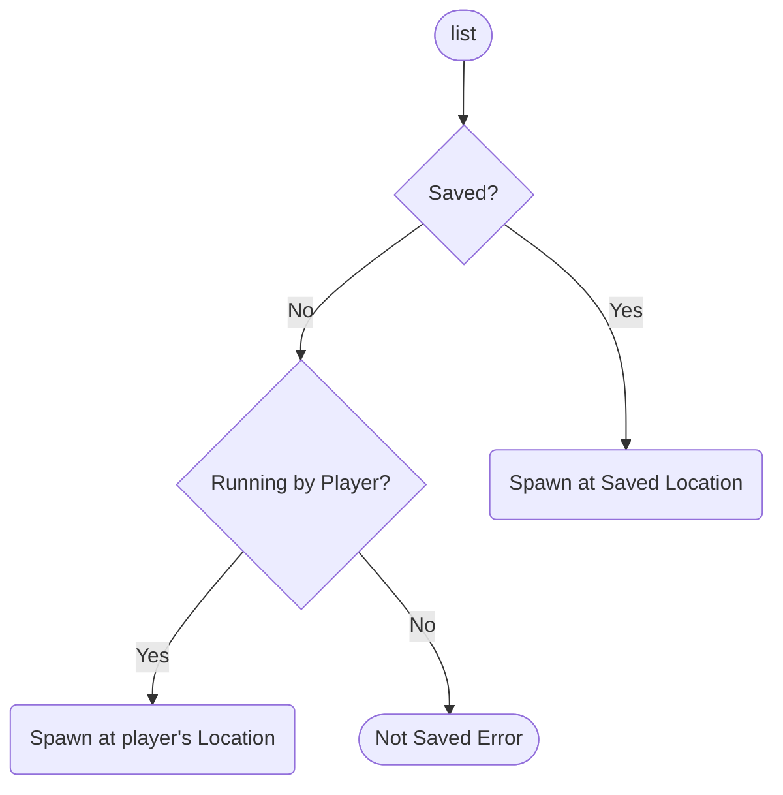
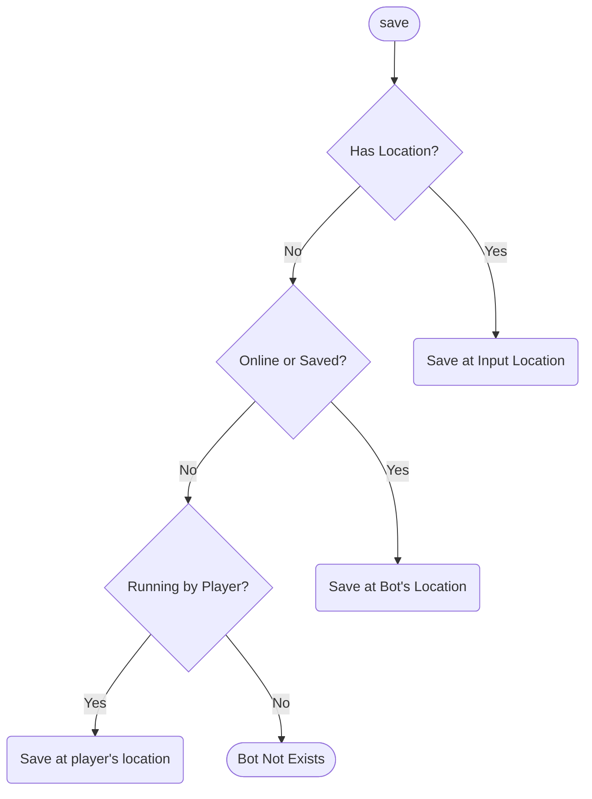
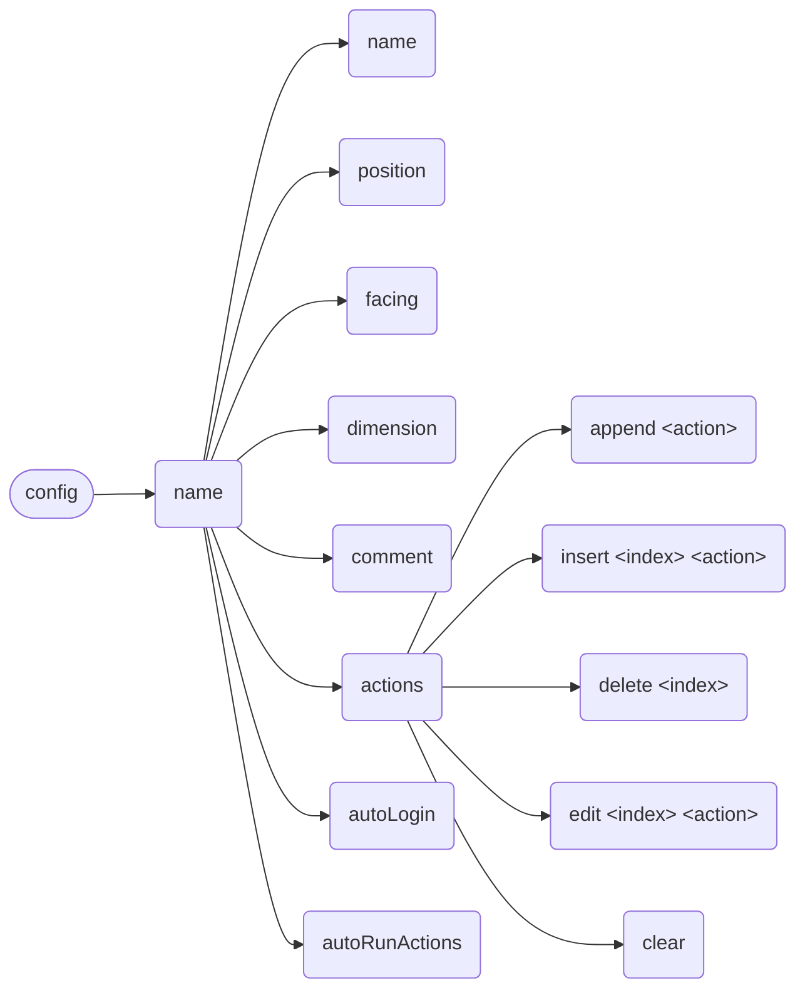
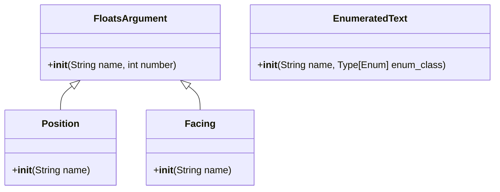

[English](full.md) | **中文**

\>\>\> [回到索引](/readme-zh_cn.md)

# 全插件信息集合

使用 `ctrl-f` 来进行页面中全文搜索，从而找到你感兴趣的东西

## advanced_calculator

### 基本信息

- 插件 ID: `advanced_calculator`
- 插件名: AdvancedCalculator
- 版本: 0.3.1
  - 元数据版本: 0.3.1
  - 发布版本: 0.3.1
- 总下载量: 624
- 作者: [Andy Zhang](https://github.com/AnzhiZhang)
- 仓库: https://github.com/AnzhiZhang/MCDReforgedPlugins
- 仓库插件页: https://github.com/AnzhiZhang/MCDReforgedPlugins/tree/master/advanced_calculator
- 标签: [`工具`](/labels/tool/readme-zh_cn.md)
- 描述: 提供游戏内多种便捷计算

### 插件依赖

| 插件 ID | 依赖需求 |
| --- | --- |

### 包依赖

| Python 包 | 依赖需求 |
| --- | --- |

### 介绍

# AdvancedCalculator

> 提供游戏内多种便捷计算

## 使用

您可以使用 `=<expression>` 直接计算表达式，或使用 `==<count/expression>` 将物品数转换堆叠数。

| 指令 | 用途 | 示例 | 结果 |
| - | - | - | - |
| !!calc \<expression> | 计算表达式 | !!calc 1+1 | 1+1=2 |
| !!calc item \<count/expression> | 物品数转换堆叠数 | !!calc item 1794 | 1794个物品为1盒2组3个 |
| !!calc item \<box> \<stack> \<single> | 堆叠数转换物品数 | !!calc item 1 10 32 | 1盒10组32个为2400个物品 |
| !!calc color \<red> \<green> \<blue> | 10进制RGB转16进制 | !!calc color 255 0 255 | (255, 0, 255) -> #FF00FF |
| !!calc color \<#HEX> | 16十进制RGB转10进制 | !!calc color #00FF00 | #00FF00 -> (0, 255, 0) |

### 下载

> :warning: 注意：使用插件之前，先阅读仓库中的 README。

| 文件 | 版本 | 上传时间 | 大小 | 下载数 | 操作 |
| --- | --- | --- | --- | --- | --- |
| [AdvancedCalculator-v0.3.1.mcdr](https://github.com/AnzhiZhang/MCDReforgedPlugins/releases/tag/advanced_calculator-v0.3.1) | 0.3.1 | 2023/01/19 17:01:07 | 2.46KB | 223 | [下载](https://github.com/AnzhiZhang/MCDReforgedPlugins/releases/download/advanced_calculator-v0.3.1/AdvancedCalculator-v0.3.1.mcdr) |
| [AdvancedCalculator-v0.3.0.mcdr](https://github.com/AnzhiZhang/MCDReforgedPlugins/releases/tag/advanced_calculator-v0.3.0) | 0.3.0 | 2022/10/21 20:03:33 | 2.42KB | 212 | [下载](https://github.com/AnzhiZhang/MCDReforgedPlugins/releases/download/advanced_calculator-v0.3.0/AdvancedCalculator-v0.3.0.mcdr) |
| [AdvancedCalculator-v0.2.1.mcdr](https://github.com/AnzhiZhang/MCDReforgedPlugins/releases/tag/advanced_calculator-v0.2.1) | 0.2.1 | 2022/07/21 13:20:06 | 2.38KB | 157 | [下载](https://github.com/AnzhiZhang/MCDReforgedPlugins/releases/download/advanced_calculator-v0.2.1/AdvancedCalculator-v0.2.1.mcdr) |

## advanced_whitelist_r

### 基本信息

- 插件 ID: `advanced_whitelist_r`
- 插件名: AdvancedWhitelistR
- 版本: 1.0.3
  - 元数据版本: 1.0.3
  - 发布版本: 1.0.3
- 总下载量: 318
- 作者: [noionion](https://github.com/2X-ercha), [GamerNoTitle](https://github.com/GamerNoTitle)
- 仓库: https://github.com/EMUnion/AdvancedWhitelistR
- 仓库插件页: https://github.com/EMUnion/AdvancedWhitelistR/tree/master
- 标签: [`管理`](/labels/management/readme-zh_cn.md)
- 描述: For outline-model Whitelist

### 插件依赖

| 插件 ID | 依赖需求 |
| --- | --- |
| [mcdreforged](https://github.com/Fallen-Breath/MCDReforged) | \>=2.1.0 |

### 包依赖

| Python 包 | 依赖需求 |
| --- | --- |

### 介绍

离线服务器白名单管理

### 下载

> :warning: 注意：使用插件之前，先阅读仓库中的 README。

| 文件 | 版本 | 上传时间 | 大小 | 下载数 | 操作 |
| --- | --- | --- | --- | --- | --- |
| [AdvancedWhitelistR-v1.0.3.mcdr](https://github.com/EMUnion/AdvancedWhitelistR/releases/tag/1.0.3) | 1.0.3 | 2023/01/04 02:59:30 | 3.73KB | 83 | [下载](https://github.com/EMUnion/AdvancedWhitelistR/releases/download/1.0.3/AdvancedWhitelistR-v1.0.3.mcdr) |
| [AdvancedWhitelistR-v1.0.2.mcdr](https://github.com/EMUnion/AdvancedWhitelistR/releases/tag/1.0.2) | 1.0.2 | 2022/01/24 15:38:16 | 3.5KB | 224 | [下载](https://github.com/EMUnion/AdvancedWhitelistR/releases/download/1.0.2/AdvancedWhitelistR-v1.0.2.mcdr) |
| [AdvancedWhitelistR-v1.0.1.mcdr](https://github.com/EMUnion/AdvancedWhitelistR/releases/tag/1.0.1) | 1.0.1 | 2022/01/24 11:46:47 | 3.5KB | 11 | [下载](https://github.com/EMUnion/AdvancedWhitelistR/releases/download/1.0.1/AdvancedWhitelistR-v1.0.1.mcdr) |

## allow_suicide

### 基本信息

- 插件 ID: `allow_suicide`
- 插件名: allow_suicide
- 版本: 1.0.0
  - 元数据版本: 1.0.0
  - 发布版本: 1.0.0
- 总下载量: 130
- 作者: [JAs0n](https://github.com/JAs0n319)
- 仓库: https://github.com/JAs0n319/allow_suicide
- 仓库插件页: https://github.com/JAs0n319/allow_suicide/tree/master
- 标签: [`工具`](/labels/tool/readme-zh_cn.md)
- 描述: 允许玩家在没有op权限时自杀

### 插件依赖

| 插件 ID | 依赖需求 |
| --- | --- |
| [mcdreforged](https://github.com/Fallen-Breath/MCDReforged) | \>=2.1.0 |

### 包依赖

| Python 包 | 依赖需求 |
| --- | --- |

### 介绍

允许没有op权限的玩家自杀
### 下载

> :warning: 注意：使用插件之前，先阅读仓库中的 README。

| 文件 | 版本 | 上传时间 | 大小 | 下载数 | 操作 |
| --- | --- | --- | --- | --- | --- |
| [allow_suicide-v1.0.0.mcdr](https://github.com/JAs0n319/allow_suicide/releases/tag/allow_suicide-v1.0.0) | 1.0.0 | 2023/02/03 18:58:31 | 880B | 130 | [下载](https://github.com/JAs0n319/allow_suicide/releases/download/allow_suicide-v1.0.0/allow_suicide-v1.0.0.mcdr) |

## aluminum

### 基本信息

- 插件 ID: `aluminum`
- 插件名: Aluminum
- 版本: 0.2.0
  - 元数据版本: 0.2.0
  - 发布版本: N/A
- 总下载量: 0
- 作者: [Alex3236](https://github.com/alex3236)
- 仓库: https://github.com/MCDReforged/Aluminum
- 仓库插件页: https://github.com/MCDReforged/Aluminum/tree/master/src
- 标签: [`管理`](/labels/management/readme-zh_cn.md)
- 描述: 一个 MCDR 插件管理器。

### 插件依赖

| 插件 ID | 依赖需求 |
| --- | --- |
| [mcdreforged](https://github.com/Fallen-Breath/MCDReforged) | \>=2.2.0 |

### 包依赖

| Python 包 | 依赖需求 |
| --- | --- |
| [mcdreforged](https://pypi.org/project/mcdreforged) | \>=2.0.1 |
| [requests](https://pypi.org/project/requests) |  |

### 介绍

一个 MCDR 插件管理器。

:warning: **务必在使用前阅读仓库中的 README！**

### 下载

> :warning: 注意：使用插件之前，先阅读仓库中的 README。

| 文件 | 版本 | 上传时间 | 大小 | 下载数 | 操作 |
| --- | --- | --- | --- | --- | --- |

## auto_plugin_reloader

### 基本信息

- 插件 ID: `auto_plugin_reloader`
- 插件名: Auto Plugin Reloader
- 版本: 1.1.3
  - 元数据版本: 1.1.3
  - 发布版本: 1.1.3
- 总下载量: 4826
- 作者: [Fallen_Breath](https://github.com/Fallen-Breath)
- 仓库: https://github.com/TISUnion/AutoPluginReloader
- 仓库插件页: https://github.com/TISUnion/AutoPluginReloader/tree/master
- 标签: [`管理`](/labels/management/readme-zh_cn.md)
- 描述: 在文件变更时自动重载插件

### 插件依赖

| 插件 ID | 依赖需求 |
| --- | --- |
| [mcdreforged](https://github.com/Fallen-Breath/MCDReforged) | \>=2.1.0-beta |

### 包依赖

| Python 包 | 依赖需求 |
| --- | --- |

### 介绍

它是一个可以自动检测 MCDR 插件文件夹中发生的变更并触发插件重载的插件

它是厌倦了插件文件更新后需要手动执行插件重载的懒人的救星！

### 下载

> :warning: 注意：使用插件之前，先阅读仓库中的 README。

| 文件 | 版本 | 上传时间 | 大小 | 下载数 | 操作 |
| --- | --- | --- | --- | --- | --- |
| [AutoPluginReloader-v1.1.3.mcdr](https://github.com/TISUnion/AutoPluginReloader/releases/tag/v1.1.3) | 1.1.3 | 2021/10/01 18:23:47 | 17.58KB | 1158 | [下载](https://github.com/TISUnion/AutoPluginReloader/releases/download/v1.1.3/AutoPluginReloader-v1.1.3.mcdr) |
| [AutoPluginReloader-v1.1.2.mcdr](https://github.com/TISUnion/AutoPluginReloader/releases/tag/v1.1.2) | 1.1.2 | 2021/09/30 10:02:54 | 17.59KB | 103 | [下载](https://github.com/TISUnion/AutoPluginReloader/releases/download/v1.1.2/AutoPluginReloader-v1.1.2.mcdr) |
| [AutoPluginReloader-v1.1.1.mcdr](https://github.com/TISUnion/AutoPluginReloader/releases/tag/v1.1.1) | 1.1.1 | 2021/09/12 10:20:17 | 17.47KB | 887 | [下载](https://github.com/TISUnion/AutoPluginReloader/releases/download/v1.1.1/AutoPluginReloader-v1.1.1.mcdr) |

## beep

### 基本信息

- 插件 ID: `beep`
- 插件名: Beep
- 版本: 1.1.0
  - 元数据版本: 1.1.0
  - 发布版本: 1.1.0
- 总下载量: 4363
- 作者: [Fallen_Breath](https://github.com/Fallen-Breath), [LucunJi](https://github.com/LucunJi)
- 仓库: https://github.com/TISUnion/Beep
- 仓库插件页: https://github.com/TISUnion/Beep/tree/master
- 标签: [`工具`](/labels/tool/readme-zh_cn.md)
- 描述: @某人，@ all可作用于所有玩家。使用两个@@小心被打

### 插件依赖

| 插件 ID | 依赖需求 |
| --- | --- |
| [mcdreforged](https://github.com/Fallen-Breath/MCDReforged) | \>=2.1.0 |

### 包依赖

| Python 包 | 依赖需求 |
| --- | --- |

### 介绍

*无*

### 下载

> :warning: 注意：使用插件之前，先阅读仓库中的 README。

| 文件 | 版本 | 上传时间 | 大小 | 下载数 | 操作 |
| --- | --- | --- | --- | --- | --- |
| [Beep-v1.1.0.mcdr](https://github.com/TISUnion/Beep/releases/tag/v1.1.0) | 1.1.0 | 2021/08/26 14:01:49 | 1.74KB | 3031 | [下载](https://github.com/TISUnion/Beep/releases/download/v1.1.0/Beep-v1.1.0.mcdr) |
| [Beep-v1.0.0.mcdr](https://github.com/TISUnion/Beep/releases/tag/v1.0.0) | 1.0.0 | 2021/08/21 15:35:36 | 1.67KB | 1332 | [下载](https://github.com/TISUnion/Beep/releases/download/v1.0.0/Beep-v1.0.0.mcdr) |

## bingo

### 基本信息

- 插件 ID: `bingo`
- 插件名: Bingo
- 版本: 0.0.3
  - 元数据版本: 0.0.3
  - 发布版本: 0.0.3
- 总下载量: 11
- 作者: [Andy Zhang](https://github.com/AnzhiZhang)
- 仓库: https://github.com/AnzhiZhang/MCDReforgedPlugins
- 仓库插件页: https://github.com/AnzhiZhang/MCDReforgedPlugins/tree/master/bingo
- 标签: [`工具`](/labels/tool/readme-zh_cn.md)
- 描述: Bingo 游戏实用工具

### 插件依赖

| 插件 ID | 依赖需求 |
| --- | --- |

### 包依赖

| Python 包 | 依赖需求 |
| --- | --- |

### 介绍

# Bingo

> [Bingo](https://www.flytre.net/bingo) 游戏实用工具

## 使用

| 指令 | 用途 |
| - | - |
| !!bingo team \<num> | 随机分组 |
| !!bingo end | 结束游戏 |

### 下载

> :warning: 注意：使用插件之前，先阅读仓库中的 README。

| 文件 | 版本 | 上传时间 | 大小 | 下载数 | 操作 |
| --- | --- | --- | --- | --- | --- |
| [Bingo-v0.0.3.mcdr](https://github.com/AnzhiZhang/MCDReforgedPlugins/releases/tag/bingo-v0.0.3) | 0.0.3 | 2023/02/26 00:14:39 | 1.3KB | 11 | [下载](https://github.com/AnzhiZhang/MCDReforgedPlugins/releases/download/bingo-v0.0.3/Bingo-v0.0.3.mcdr) |

## bot

### 基本信息

- 插件 ID: `bot`
- 插件名: Bot
- 版本: 1.0.6
  - 元数据版本: 1.0.6
  - 发布版本: 1.0.6
- 总下载量: 878
- 作者: [Andy Zhang](https://github.com/AnzhiZhang)
- 仓库: https://github.com/AnzhiZhang/MCDReforgedPlugins
- 仓库插件页: https://github.com/AnzhiZhang/MCDReforgedPlugins/tree/master/bot
- 标签: [`工具`](/labels/tool/readme-zh_cn.md), [`管理`](/labels/management/readme-zh_cn.md)
- 描述: 最好用的地毯模组假人管理器！

### 插件依赖

| 插件 ID | 依赖需求 |
| --- | --- |
| [mcdreforged](https://github.com/Fallen-Breath/MCDReforged) | ^2.6.0 |
| [dict_command_registration](/plugins/dict_command_registration/readme-zh_cn.md) | ^1.0.0 |
| [minecraft_data_api](/plugins/minecraft_data_api/readme-zh_cn.md) | ^1.4 |
| [more_command_nodes](/plugins/more_command_nodes/readme-zh_cn.md) | ^1.1.0 |

### 包依赖

| Python 包 | 依赖需求 |
| --- | --- |

### 介绍

# Bot

> 最好用的地毯模组假人管理器！

## 依赖

- [MinecraftDataAPI](https://github.com/MCDReforged/MinecraftDataAPI)
- [MoreCommandNodes](https://github.com/AnzhiZhang/MCDReforgedPlugins/tree/master/more_command_nodes)

## 使用方法

`!!bot` 查看帮助

`!!bot list [index] [filter]` 显示假人列表

`!!bot spawn <name>` 上线假人

`!!bot kill <name>` 下线假人

`!!bot action <name> [index]` 执行假人动作

`!!bot info <name>` 查看假人信息

`!!bot save <name> [position] [facing] [dimension]` 保存假人

`!!bot del <name>` 删除保存的假人

`!!bot config <name> <option> <value>` 配置假人


### list

**index**：列表的页码

**filter**：可用选项为：`--all`、`--online` 或 `--saved`，过滤假人

### spawn

上线假人



### kill

下线假人

### action

执行假人动作

当指定 `index` 时，执行特定动作而不是全部动作

### info

查看假人信息

### save

保存假人



### del

删除保存的假人

### config

配置假人



## 配置

### gamemode

默认值: `survival`

生成假人的游戏模式

### name_prefix

默认值：无

假人名称前缀

### name_suffix

默认值：无

假人名称前缀

### permissions

使用对应指令的最低权限

### 下载

> :warning: 注意：使用插件之前，先阅读仓库中的 README。

| 文件 | 版本 | 上传时间 | 大小 | 下载数 | 操作 |
| --- | --- | --- | --- | --- | --- |
| [Bot-v1.0.6.mcdr](https://github.com/AnzhiZhang/MCDReforgedPlugins/releases/tag/bot-v1.0.6) | 1.0.6 | 2023/01/19 16:58:58 | 13.6KB | 325 | [下载](https://github.com/AnzhiZhang/MCDReforgedPlugins/releases/download/bot-v1.0.6/Bot-v1.0.6.mcdr) |
| [Bot-v1.0.5.mcdr](https://github.com/AnzhiZhang/MCDReforgedPlugins/releases/tag/bot-v1.0.5) | 1.0.5 | 2022/12/29 15:19:31 | 13.55KB | 133 | [下载](https://github.com/AnzhiZhang/MCDReforgedPlugins/releases/download/bot-v1.0.5/Bot-v1.0.5.mcdr) |
| [Bot-v1.0.4.mcdr](https://github.com/AnzhiZhang/MCDReforgedPlugins/releases/tag/bot-v1.0.4) | 1.0.4 | 2022/12/29 14:53:06 | 13.55KB | 10 | [下载](https://github.com/AnzhiZhang/MCDReforgedPlugins/releases/download/bot-v1.0.4/Bot-v1.0.4.mcdr) |

## bot_plugin

### 基本信息

- 插件 ID: `bot_plugin`
- 插件名: Bot Plugin
- 版本: 1.0.0
  - 元数据版本: 1.0.0
  - 发布版本: 1.0.0
- 总下载量: 432
- 作者: [DancingSnow0517](https://github.com/DancingSnow0517)
- 仓库: https://github.com/DancingSnow0517/Bot_Manager
- 仓库插件页: https://github.com/DancingSnow0517/Bot_Manager/tree/master
- 标签: [`管理`](/labels/management/readme-zh_cn.md), [`工具`](/labels/tool/readme-zh_cn.md)
- 描述: 管理 carpet 机器人

### 插件依赖

| 插件 ID | 依赖需求 |
| --- | --- |
| [mcdreforged](https://github.com/Fallen-Breath/MCDReforged) | \>=2.3.0 |
| [minecraft_data_api](/plugins/minecraft_data_api/readme-zh_cn.md) | \>=1.4.0 |

### 包依赖

| Python 包 | 依赖需求 |
| --- | --- |

### 介绍

# 一个 MCDR bot管理器。

:warning: **务必在使用前阅读仓库中的 README！**
### 下载

> :warning: 注意：使用插件之前，先阅读仓库中的 README。

| 文件 | 版本 | 上传时间 | 大小 | 下载数 | 操作 |
| --- | --- | --- | --- | --- | --- |
| [BotPlugin-v1.0.0.mcdr](https://github.com/DancingSnow0517/Bot_Manager/releases/tag/1.0.0) | 1.0.0 | 2022/01/09 04:38:06 | 17.24KB | 432 | [下载](https://github.com/DancingSnow0517/Bot_Manager/releases/download/1.0.0/BotPlugin-v1.0.0.mcdr) |

## carpet_bot_manager

### 基本信息

- 插件 ID: `carpet_bot_manager`
- 插件名: Carpet Bot Manager
- 版本: 0.3.0
  - 元数据版本: 0.3.0
  - 发布版本: 0.3.0
- 总下载量: 1723
- 作者: [YehowahLiu](https://github.com/YehowahLiu)
- 仓库: https://github.com/FAS-Server/CarpetBotManager
- 仓库插件页: https://github.com/FAS-Server/CarpetBotManager/tree/main
- 标签: [`工具`](/labels/tool/readme-zh_cn.md)
- 描述: 一个地毯端bot管理插件, 可以点击召唤bot并让其执行系列动作

### 插件依赖

| 插件 ID | 依赖需求 |
| --- | --- |
| [mcdreforged](https://github.com/Fallen-Breath/MCDReforged) | \>=2.1.2 |
| [minecraft_data_api](/plugins/minecraft_data_api/readme-zh_cn.md) | \>=1.4.0 |

### 包依赖

| Python 包 | 依赖需求 |
| --- | --- |
| [mcdreforged](https://pypi.org/project/mcdreforged) | \>=2.1.2 |

### 介绍

一个地毯端 bot 管理插件，可以点击召唤 bot 并让其执行系列动作

### 下载

> :warning: 注意：使用插件之前，先阅读仓库中的 README。

| 文件 | 版本 | 上传时间 | 大小 | 下载数 | 操作 |
| --- | --- | --- | --- | --- | --- |
| [CarpetBotManager-v0.3.0.mcdr](https://github.com/FAS-Server/CarpetBotManager/releases/tag/v0.3.0) | 0.3.0 | 2021/09/07 17:13:43 | 9.93KB | 1723 | [下载](https://github.com/FAS-Server/CarpetBotManager/releases/download/v0.3.0/CarpetBotManager-v0.3.0.mcdr) |

## carpet_tick

### 基本信息

- 插件 ID: `carpet_tick`
- 插件名: Carpet Tick
- 版本: 1.1.1
  - 元数据版本: 1.1.1
  - 发布版本: 1.1.1
- 总下载量: 246
- 作者: [Ivan1F](https://github.com/Ivan-1F)
- 仓库: https://github.com/Ivan-1F/CarpetTick
- 仓库插件页: https://github.com/Ivan-1F/CarpetTick/tree/master
- 标签: [`信息`](/labels/information/readme-zh_cn.md)
- 描述: 使用 Carpet Mod 的 /tick 指令获取服务器信息

### 插件依赖

| 插件 ID | 依赖需求 |
| --- | --- |
| [mcdreforged](https://github.com/Fallen-Breath/MCDReforged) | \>=2.1.0-beta |

### 包依赖

| Python 包 | 依赖需求 |
| --- | --- |

### 介绍

*无*

### 下载

> :warning: 注意：使用插件之前，先阅读仓库中的 README。

| 文件 | 版本 | 上传时间 | 大小 | 下载数 | 操作 |
| --- | --- | --- | --- | --- | --- |
| [CarpetTick-v1.1.1.mcdr](https://github.com/Ivan-1F/CarpetTick/releases/tag/v1.1.1) | 1.1.1 | 2022/08/27 16:04:57 | 3.46KB | 139 | [下载](https://github.com/Ivan-1F/CarpetTick/releases/download/v1.1.1/CarpetTick-v1.1.1.mcdr) |
| [CarpetTick-v1.1.0.mcdr](https://github.com/Ivan-1F/CarpetTick/releases/tag/v1.1.0) | 1.1.0 | 2022/04/07 09:28:18 | 3.48KB | 91 | [下载](https://github.com/Ivan-1F/CarpetTick/releases/download/v1.1.0/CarpetTick-v1.1.0.mcdr) |
| [CarpetTick-v1.0.0.mcdr](https://github.com/Ivan-1F/CarpetTick/releases/tag/v1.0.0) | 1.0.0 | 2022/03/11 14:50:05 | 3.35KB | 16 | [下载](https://github.com/Ivan-1F/CarpetTick/releases/download/v1.0.0/CarpetTick-v1.0.0.mcdr) |

## carpetbotlist

### 基本信息

- 插件 ID: `carpetbotlist`
- 插件名: CarpetBotList
- 版本: 2.1.1
  - 元数据版本: 2.1.1
  - 发布版本: 2.1.1
- 总下载量: 4429
- 作者: [ZeroKelvin](https://github.com/BelowZeroKelvin)
- 仓库: https://github.com/BelowZeroKelvin/MCDR-CarpetBotList
- 仓库插件页: https://github.com/BelowZeroKelvin/MCDR-CarpetBotList/tree/MCDR-2.x
- 标签: [`工具`](/labels/tool/readme-zh_cn.md)
- 描述: 帮助你管理地毯端假人

### 插件依赖

| 插件 ID | 依赖需求 |
| --- | --- |
| [mcdreforged](https://github.com/Fallen-Breath/MCDReforged) | ^2.0.0-beta.1 |
| [minecraft_data_api](/plugins/minecraft_data_api/readme-zh_cn.md) | * |

### 包依赖

| Python 包 | 依赖需求 |
| --- | --- |

### 介绍

帮助你管理地毯端的假人

### 下载

> :warning: 注意：使用插件之前，先阅读仓库中的 README。

| 文件 | 版本 | 上传时间 | 大小 | 下载数 | 操作 |
| --- | --- | --- | --- | --- | --- |
| [CarpetBotList-v2.1.1.mcdr](https://github.com/BelowZeroKelvin/MCDR-CarpetBotList/releases/tag/v2.1.1) | 2.1.1 | 2021/08/23 06:17:05 | 1.89KB | 1772 | [下载](https://github.com/BelowZeroKelvin/MCDR-CarpetBotList/releases/download/v2.1.1/CarpetBotList-v2.1.1.mcdr) |
| [CarpetBotList-v2.1.0.mcdr](https://github.com/BelowZeroKelvin/MCDR-CarpetBotList/releases/tag/v2.1.0) | 2.1.0 | 2021/08/16 11:33:40 | 4.08KB | 1326 | [下载](https://github.com/BelowZeroKelvin/MCDR-CarpetBotList/releases/download/v2.1.0/CarpetBotList-v2.1.0.mcdr) |
| [CarpetBotList-v2.0.0.mcdr](https://github.com/BelowZeroKelvin/MCDR-CarpetBotList/releases/tag/v2.0.0) | 2.0.0 | 2021/08/12 07:45:32 | 3.6KB | 1331 | [下载](https://github.com/BelowZeroKelvin/MCDR-CarpetBotList/releases/download/v2.0.0/CarpetBotList-v2.0.0.mcdr) |

## cato

### 基本信息

- 插件 ID: `cato`
- 插件名: Cato Plugin
- 版本: 1.1.0
  - 元数据版本: 1.1.0
  - 发布版本: 1.1.0
- 总下载量: 471
- 作者: [Harry-zklcdc](https://github.com/Harry-zklcdc)
- 仓库: https://github.com/Harry-zklcdc/MCDR-Cato
- 仓库插件页: https://github.com/Harry-zklcdc/MCDR-Cato/tree/main
- 标签: [`工具`](/labels/tool/readme-zh_cn.md)
- 描述: Plugin Cato

### 插件依赖

| 插件 ID | 依赖需求 |
| --- | --- |
| [mcdreforged](https://github.com/Fallen-Breath/MCDReforged) | \>=2.0.0-alpha.1 |

### 包依赖

| Python 包 | 依赖需求 |
| --- | --- |

### 介绍

使服务器启动时, 自动使用 cato (P2P 连接工具)进行端口映射, 并支持生成 HMCL 联机码

# 特性:

- Cato 官方支持
- 无感 P2P 连接
- HMCl 多人游戏支持
- Cato 崩溃/临时 ID 到期自动重启
- API 接口获取 Cato 连接 ID、HMCL 联机码
- Cato Token 动态更换
- 游戏内获取 Cato 连接 ID、HMCL 联机码

### 下载

> :warning: 注意：使用插件之前，先阅读仓库中的 README。

| 文件 | 版本 | 上传时间 | 大小 | 下载数 | 操作 |
| --- | --- | --- | --- | --- | --- |
| [Cato-v1.1.0.mcdr](https://github.com/Harry-zklcdc/MCDR-Cato/releases/tag/cato-v1.1.0) | 1.1.0 | 2021/10/31 08:31:03 | 2.9KB | 436 | [下载](https://github.com/Harry-zklcdc/MCDR-Cato/releases/download/cato-v1.1.0/Cato-v1.1.0.mcdr) |
| [Cato-v1.0.0.mcdr](https://github.com/Harry-zklcdc/MCDR-Cato/releases/tag/cato-v1.0.0) | 1.0.0 | 2021/10/14 12:15:08 | 2.93KB | 35 | [下载](https://github.com/Harry-zklcdc/MCDR-Cato/releases/download/cato-v1.0.0/Cato-v1.0.0.mcdr) |

## chatbridge

### 基本信息

- 插件 ID: `chatbridge`
- 插件名: ChatBridge v2 for MCDR
- 版本: 2.5.1
  - 元数据版本: 2.5.1
  - 发布版本: 2.5.1
- 总下载量: 1672
- 作者: [Fallen_Breath](https://github.com/Fallen-Breath)
- 仓库: https://github.com/TISUnion/ChatBridge
- 仓库插件页: https://github.com/TISUnion/ChatBridge/tree/master
- 标签: [`工具`](/labels/tool/readme-zh_cn.md)
- 描述: 跨服聊天

### 插件依赖

| 插件 ID | 依赖需求 |
| --- | --- |
| [mcdreforged](https://github.com/Fallen-Breath/MCDReforged) | \>=2.2.0- |

### 包依赖

| Python 包 | 依赖需求 |
| --- | --- |
| [mcdreforged](https://pypi.org/project/mcdreforged) | \>=2.2.0 |
| [pycryptodome](https://pypi.org/project/pycryptodome) |  |
| [colorlog](https://pypi.org/project/colorlog) |  |

### 介绍

跨服聊天 v2

### 下载

> :warning: 注意：使用插件之前，先阅读仓库中的 README。

| 文件 | 版本 | 上传时间 | 大小 | 下载数 | 操作 |
| --- | --- | --- | --- | --- | --- |
| [ChatBridge.pyz](https://github.com/TISUnion/ChatBridge/releases/tag/v2.5.1) | 2.5.1 | 2023/04/04 15:28:53 | 40.63KB | 78 | [下载](https://github.com/TISUnion/ChatBridge/releases/download/v2.5.1/ChatBridge.pyz) |
| [ChatBridge.pyz](https://github.com/TISUnion/ChatBridge/releases/tag/v2.5.0) | 2.5.0 | 2023/03/13 19:01:44 | 41.09KB | 75 | [下载](https://github.com/TISUnion/ChatBridge/releases/download/v2.5.0/ChatBridge.pyz) |
| [ChatBridge.pyz](https://github.com/TISUnion/ChatBridge/releases/tag/v2.4.1) | 2.4.1 | 2023/02/27 18:19:47 | 40.68KB | 50 | [下载](https://github.com/TISUnion/ChatBridge/releases/download/v2.4.1/ChatBridge.pyz) |

## chatbridgereforged_mc

### 基本信息

- 插件 ID: `chatbridgereforged_mc`
- 插件名: ChatBridgeReforged_MC
- 版本: 0.2.7
  - 元数据版本: 0.2.7-dev032
  - 发布版本: 0.2.7
- 总下载量: 181
- 作者: [Ricky](https://github.com/R1ckyH)
- 仓库: https://github.com/R1ckyH/ChatBridgeReforged
- 仓库插件页: https://github.com/R1ckyH/ChatBridgeReforged/tree/master/./ChatBridgeReforged_MC
- 标签: [`工具`](/labels/tool/readme-zh_cn.md)
- 描述: ChatBridge 重制, 用于各个客户端（服务器或者其他bot）之间的交互桥梁，多服互联（不是）

### 插件依赖

| 插件 ID | 依赖需求 |
| --- | --- |
| [mcdreforged](https://github.com/Fallen-Breath/MCDReforged) | \>=2.0.0 |

### 包依赖

| Python 包 | 依赖需求 |
| --- | --- |
| [mcdreforged](https://pypi.org/project/mcdreforged) |  |
| [pycryptodomex](https://pypi.org/project/pycryptodomex) |  |

### 介绍

ChatBridge 重制, 用于各个客户端（服务器或者其他bot）之间的交互桥梁，多物互联（不是）

### 下载

> :warning: 注意：使用插件之前，先阅读仓库中的 README。

| 文件 | 版本 | 上传时间 | 大小 | 下载数 | 操作 |
| --- | --- | --- | --- | --- | --- |
| [ChatBridgeReforged_MC.pyz](https://github.com/R1ckyH/ChatBridgeReforged/releases/tag/0.2.7) | 0.2.7 | 2022/12/20 09:53:31 | 49.35KB | 143 | [下载](https://github.com/R1ckyH/ChatBridgeReforged/releases/download/0.2.7/ChatBridgeReforged_MC.pyz) |
| [ChatBridgeReforged_MC.pyz](https://github.com/R1ckyH/ChatBridgeReforged/releases/tag/0.1.1) | 0.1.1 | 2022/03/04 06:12:36 | 46.96KB | 24 | [下载](https://github.com/R1ckyH/ChatBridgeReforged/releases/download/0.1.1/ChatBridgeReforged_MC.pyz) |
| [ChatBridgeReforged_MC.pyz](https://github.com/R1ckyH/ChatBridgeReforged/releases/tag/0.0.2) | 0.0.2 | 2022/01/15 16:33:44 | 44.9KB | 14 | [下载](https://github.com/R1ckyH/ChatBridgeReforged/releases/download/0.0.2/ChatBridgeReforged_MC.pyz) |

## colored_chat

### 基本信息

- 插件 ID: `colored_chat`
- 插件名: ColoredChat
- 版本: 0.0.3
  - 元数据版本: 0.0.3
  - 发布版本: 0.0.3
- 总下载量: 43
- 作者: [Andy Zhang](https://github.com/AnzhiZhang)
- 仓库: https://github.com/AnzhiZhang/MCDReforgedPlugins
- 仓库插件页: https://github.com/AnzhiZhang/MCDReforgedPlugins/tree/master/.archived/ColoredChat
- 标签: [`工具`](/labels/tool/readme-zh_cn.md)
- 描述: 支持原版显示格式化代码

### 插件依赖

| 插件 ID | 依赖需求 |
| --- | --- |

### 包依赖

| Python 包 | 依赖需求 |
| --- | --- |

### 介绍

# ColoredChat

> 支持原版显示 [格式化代码](https://minecraft.fandom.com/zh/wiki/%E6%A0%BC%E5%BC%8F%E5%8C%96%E4%BB%A3%E7%A0%81)

## 使用

与正常聊天没有区别, 需要格式化时使用 `&` 符号

## 配置

`force_refresh`

是否刷新聊天栏的所有内容, 某些无法被记录的信息可能会被覆盖

默认值: `True`

## API

可以使用 `append_msg(msg)` 方法来插件的广播消息

### 下载

> :warning: 注意：使用插件之前，先阅读仓库中的 README。

| 文件 | 版本 | 上传时间 | 大小 | 下载数 | 操作 |
| --- | --- | --- | --- | --- | --- |
| [ColoredChat-v0.0.3.mcdr](https://github.com/AnzhiZhang/MCDReforgedPlugins/releases/tag/colored_chat-v0.0.3) | 0.0.3 | 2023/02/26 00:06:36 | 1.54KB | 43 | [下载](https://github.com/AnzhiZhang/MCDReforgedPlugins/releases/download/colored_chat-v0.0.3/ColoredChat-v0.0.3.mcdr) |

## command_exporter

### 基本信息

- 插件 ID: `command_exporter`
- 插件名: MCDR Command Exporter
- 版本: 1.2.0
  - 元数据版本: 1.2.0
  - 发布版本: 1.2.0
- 总下载量: 71
- 作者: [DancingSnow](https://github.com/DancingSnow0517)
- 仓库: https://github.com/DancingSnow0517/MCDR-Command-Exporter
- 仓库插件页: https://github.com/DancingSnow0517/MCDR-Command-Exporter/tree/master/command_exporter
- 标签: [`工具`](/labels/tool/readme-zh_cn.md)
- 描述: A plugin is used to export the MCDR command tree

### 插件依赖

| 插件 ID | 依赖需求 |
| --- | --- |
| [mcdreforged](https://github.com/Fallen-Breath/MCDReforged) | \>=2.7.0 |

### 包依赖

| Python 包 | 依赖需求 |
| --- | --- |

### 介绍

[English](README.MD) | 中文

# MCDR Command Exporter

一个插件用于导出 MCDR 命令树。

与 mod [MCDR-Completion](https://github.com/DancingSnow0517/MCDR-Completion) 配合使用获得游戏内 MCDR 命令补全。

## 用法
1. 去 [release page](https://github.com/DancingSnow0517/MCDR-Command-Exporter/releases) 下载 `MCDRCommandExporter-vX.X.X.mcdr` 插件

   将插件放入 MCDR 的插件文件夹中并重新加载

2. 下载 fabric mod [MCDR-Completion](https://github.com/DancingSnow0517/MCDR-Completion/releases) 并且安装到 `服务端` 和 `客户端` 上

   这个 mod 依赖 [fabric-api](https://modrinth.com/mod/fabric-api)

3. 加入到服务器中并享受它！

### 下载

> :warning: 注意：使用插件之前，先阅读仓库中的 README。

| 文件 | 版本 | 上传时间 | 大小 | 下载数 | 操作 |
| --- | --- | --- | --- | --- | --- |
| [MCDRCommandExporter-v1.2.0.mcdr](https://github.com/DancingSnow0517/MCDR-Command-Exporter/releases/tag/1.2.0) | 1.2.0 | 2023/02/04 17:28:11 | 1.85KB | 35 | [下载](https://github.com/DancingSnow0517/MCDR-Command-Exporter/releases/download/1.2.0/MCDRCommandExporter-v1.2.0.mcdr) |
| [MCDRCommandExporter-v1.1.0.mcdr](https://github.com/DancingSnow0517/MCDR-Command-Exporter/releases/tag/1.1.0) | 1.1.0 | 2023/01/22 02:25:45 | 1.85KB | 17 | [下载](https://github.com/DancingSnow0517/MCDR-Command-Exporter/releases/download/1.1.0/MCDRCommandExporter-v1.1.0.mcdr) |
| [MCDRCommandExporter-v1.0.0.mcdr](https://github.com/DancingSnow0517/MCDR-Command-Exporter/releases/tag/1.0.0) | 1.0.0 | 2023/01/18 13:25:58 | 1.83KB | 19 | [下载](https://github.com/DancingSnow0517/MCDR-Command-Exporter/releases/download/1.0.0/MCDRCommandExporter-v1.0.0.mcdr) |

## cpu_temp

### 基本信息

- 插件 ID: `cpu_temp`
- 插件名: cpu_temp
- 版本: 3.0.2
  - 元数据版本: 3.0.2
  - 发布版本: 3.0.2
- 总下载量: 301
- 作者: [Ricky](https://github.com/R1ckyH)
- 仓库: https://github.com/R1ckyH/cpu_temp
- 仓库插件页: https://github.com/R1ckyH/cpu_temp/tree/master
- 标签: [`信息`](/labels/information/readme-zh_cn.md)
- 描述: 服务器温度警报插件。

### 插件依赖

| 插件 ID | 依赖需求 |
| --- | --- |
| [mcdreforged](https://github.com/Fallen-Breath/MCDReforged) | \>=2.0.0 |

### 包依赖

| Python 包 | 依赖需求 |
| --- | --- |
| [psutil](https://pypi.org/project/psutil) |  |
| [mcdreforged](https://pypi.org/project/mcdreforged) |  |
| [APScheduler](https://pypi.org/project/APScheduler) |  |

### 介绍

服务器温度警报插件。

### 下载

> :warning: 注意：使用插件之前，先阅读仓库中的 README。

| 文件 | 版本 | 上传时间 | 大小 | 下载数 | 操作 |
| --- | --- | --- | --- | --- | --- |
| [cpu_temp-3.0.2.mcdr](https://github.com/R1ckyH/cpu_temp/releases/tag/v3.0.2) | 3.0.2 | 2021/10/26 07:30:51 | 8.42KB | 301 | [下载](https://github.com/R1ckyH/cpu_temp/releases/download/v3.0.2/cpu_temp-3.0.2.mcdr) |

## crash_restart

### 基本信息

- 插件 ID: `crash_restart`
- 插件名: Crash Restart
- 版本: 1.0.0
  - 元数据版本: 1.0.0
  - 发布版本: 1.0.0
- 总下载量: 3103
- 作者: [Fallen_Breath](https://github.com/Fallen-Breath)
- 仓库: https://github.com/MCDReforged/CrashRestart
- 仓库插件页: https://github.com/MCDReforged/CrashRestart/tree/master
- 标签: [`工具`](/labels/tool/readme-zh_cn.md)
- 描述: 在服务端崩溃后自动重启服务器的插件

### 插件依赖

| 插件 ID | 依赖需求 |
| --- | --- |

### 包依赖

| Python 包 | 依赖需求 |
| --- | --- |

### 介绍

*无*

### 下载

> :warning: 注意：使用插件之前，先阅读仓库中的 README。

| 文件 | 版本 | 上传时间 | 大小 | 下载数 | 操作 |
| --- | --- | --- | --- | --- | --- |
| [CrashRestart-v1.0.0.mcdr](https://github.com/MCDReforged/CrashRestart/releases/tag/v1.0.0) | 1.0.0 | 2021/08/22 04:31:25 | 13.33KB | 3103 | [下载](https://github.com/MCDReforged/CrashRestart/releases/download/v1.0.0/CrashRestart-v1.0.0.mcdr) |

## database_api

### 基本信息

- 插件 ID: `database_api`
- 插件名: DatabaseAPI
- 版本: 0.1.1
  - 元数据版本: 0.1.1
  - 发布版本: 0.1.1
- 总下载量: 97
- 作者: [Andy Zhang](https://github.com/AnzhiZhang)
- 仓库: https://github.com/AnzhiZhang/MCDReforgedPlugins
- 仓库插件页: https://github.com/AnzhiZhang/MCDReforgedPlugins/tree/master/database_api
- 标签: [`API`](/labels/api/readme-zh_cn.md)
- 描述: 访问数据库 API

### 插件依赖

| 插件 ID | 依赖需求 |
| --- | --- |

### 包依赖

| Python 包 | 依赖需求 |
| --- | --- |
| [sqlalchemy](https://pypi.org/project/sqlalchemy) |  |

### 介绍

# DatabaseAPI

> 数据库API
>
> 提供了数据库操作的便捷API

## 环境要求

### Python包

- sqlalchemy

## 开发文档

查看 [Valut](https://github.com/AnzhiZhang/MCDReforgedPlugins/tree/master/.archived/vault/vault.py) 参考使用方法

提供了以下两个类:

- TableBase
- DataManager

### TableBase

一个数据库表的基类, 写一个你的数据库表并继承这个类来创建一张表

### DataManager

使用本API需要自行实例化这个类

实例化: `__init__(self, file_path: str)`

#### get_session

获取一个数据库会话的上下文管理器, 更多信息请自行查找资料

### 下载

> :warning: 注意：使用插件之前，先阅读仓库中的 README。

| 文件 | 版本 | 上传时间 | 大小 | 下载数 | 操作 |
| --- | --- | --- | --- | --- | --- |
| [DatabaseAPI-v0.1.1.mcdr](https://github.com/AnzhiZhang/MCDReforgedPlugins/releases/tag/database_api-v0.1.1) | 0.1.1 | 2022/06/30 06:31:33 | 1.25KB | 84 | [下载](https://github.com/AnzhiZhang/MCDReforgedPlugins/releases/download/database_api-v0.1.1/DatabaseAPI-v0.1.1.mcdr) |
| [DatabaseAPI-v0.1.0.mcdr](https://github.com/AnzhiZhang/MCDReforgedPlugins/releases/tag/database_api-v0.1.0) | 0.1.0 | 2022/06/30 04:17:28 | 1.13KB | 13 | [下载](https://github.com/AnzhiZhang/MCDReforgedPlugins/releases/download/database_api-v0.1.0/DatabaseAPI-v0.1.0.mcdr) |

## daycount_nbt

### 基本信息

- 插件 ID: `daycount_nbt`
- 插件名: DayCount NBT
- 版本: 2.2.1
  - 元数据版本: 2.2.1
  - 发布版本: 2.2.1
- 总下载量: 4565
- 作者: [Alex3236](https://github.com/alex3236)
- 仓库: https://github.com/alex3236/daycount-NBT
- 仓库插件页: https://github.com/alex3236/daycount-NBT/tree/main/src
- 标签: [`信息`](/labels/information/readme-zh_cn.md), [`API`](/labels/api/readme-zh_cn.md)
- 描述: :calendar: 获取和输出服务器开服时间。

### 插件依赖

| 插件 ID | 依赖需求 |
| --- | --- |
| [mcdreforged](https://github.com/Fallen-Breath/MCDReforged) | \>=2.2.0 |

### 包依赖

| Python 包 | 依赖需求 |
| --- | --- |

### 介绍

获取和输出服务器开服时间。

特色功能：
- NBT 模式

:warning: **务必在使用前阅读仓库中的 README！**
### 下载

> :warning: 注意：使用插件之前，先阅读仓库中的 README。

| 文件 | 版本 | 上传时间 | 大小 | 下载数 | 操作 |
| --- | --- | --- | --- | --- | --- |
| [DayCountNBT-v2.2.1.mcdr](https://github.com/alex3236/daycount-NBT/releases/tag/v2.2.1) | 2.2.1 | 2022/10/01 02:10:09 | 1.48KB | 604 | [下载](https://github.com/alex3236/daycount-NBT/releases/download/v2.2.1/DayCountNBT-v2.2.1.mcdr) |
| [DayCountNBT-v2.1.1.mcdr](https://github.com/alex3236/daycount-NBT/releases/tag/v2.1.1) | 2.1.1 | 2021/11/08 14:26:50 | 1.33KB | 153 | [下载](https://github.com/alex3236/daycount-NBT/releases/download/v2.1.1/DayCountNBT-v2.1.1.mcdr) |
| [DayCountNBT-v2.1.0.mcdr](https://github.com/alex3236/daycount-NBT/releases/tag/v2.1) | 2.1 | 2021/10/01 06:12:46 | 1.31KB | 147 | [下载](https://github.com/alex3236/daycount-NBT/releases/download/v2.1/DayCountNBT-v2.1.0.mcdr) |

## daytime

### 基本信息

- 插件 ID: `daytime`
- 插件名: Daytime
- 版本: 1.1.0
  - 元数据版本: 1.1.0
  - 发布版本: 1.1.0
- 总下载量: 1856
- 作者: [ZeroKelvin](https://github.com/BelowZeroKelvin)
- 仓库: https://github.com/BelowZeroKelvin/MCDR-Daytime
- 仓库插件页: https://github.com/BelowZeroKelvin/MCDR-Daytime/tree/MCDR-2.x
- 标签: [`工具`](/labels/tool/readme-zh_cn.md)
- 描述: 显示游戏中的时间

### 插件依赖

| 插件 ID | 依赖需求 |
| --- | --- |
| [mcdreforged](https://github.com/Fallen-Breath/MCDReforged) | ^2.0.0-beta.1 |

### 包依赖

| Python 包 | 依赖需求 |
| --- | --- |

### 介绍

查看游戏中的时间

### 下载

> :warning: 注意：使用插件之前，先阅读仓库中的 README。

| 文件 | 版本 | 上传时间 | 大小 | 下载数 | 操作 |
| --- | --- | --- | --- | --- | --- |
| [Daytime-v1.1.0.mcdr](https://github.com/BelowZeroKelvin/MCDR-Daytime/releases/tag/v1.1.0) | 1.1.0 | 2021/08/18 04:36:17 | 1.07KB | 1856 | [下载](https://github.com/BelowZeroKelvin/MCDR-Daytime/releases/download/v1.1.0/Daytime-v1.1.0.mcdr) |

## delayexe

### 基本信息

- 插件 ID: `delayexe`
- 插件名: Delay Exe
- 版本: 1.3.0
  - 元数据版本: 1.3.0
  - 发布版本: 1.3.0
- 总下载量: 294
- 作者: [zyxkad](https://github.com/zyxkad)
- 仓库: https://github.com/kmcsr/delayexe_mcdr
- 仓库插件页: https://github.com/kmcsr/delayexe_mcdr/tree/master
- 标签: [`工具`](/labels/tool/readme-zh_cn.md), [`API`](/labels/api/readme-zh_cn.md)
- 描述: 延迟执行命令, 直到所有玩家都离开游戏

### 插件依赖

| 插件 ID | 依赖需求 |
| --- | --- |
| [mcdreforged](https://github.com/Fallen-Breath/MCDReforged) | \>=2.0.0 |
| [kpi](/plugins/kpi/readme-zh_cn.md) | \>=1.3.0 |

### 包依赖

| Python 包 | 依赖需求 |
| --- | --- |

### 介绍

*无*

### 下载

> :warning: 注意：使用插件之前，先阅读仓库中的 README。

| 文件 | 版本 | 上传时间 | 大小 | 下载数 | 操作 |
| --- | --- | --- | --- | --- | --- |
| [DelayExe-v1.3.0.mcdr](https://github.com/kmcsr/delayexe_mcdr/releases/tag/v1.3.0) | 1.3.0 | 2022/11/25 07:59:57 | 4.77KB | 107 | [下载](https://github.com/kmcsr/delayexe_mcdr/releases/download/v1.3.0/DelayExe-v1.3.0.mcdr) |
| [DelayExe-v1.2.2.mcdr](https://github.com/kmcsr/delayexe_mcdr/releases/tag/v1.2.2) | 1.2.2 | 2022/10/23 06:19:23 | 4.78KB | 24 | [下载](https://github.com/kmcsr/delayexe_mcdr/releases/download/v1.2.2/DelayExe-v1.2.2.mcdr) |
| [DelayExe-v1.2.1.mcdr](https://github.com/kmcsr/delayexe_mcdr/releases/tag/v1.2.1) | 1.2.1 | 2022/09/18 02:03:14 | 4.77KB | 19 | [下载](https://github.com/kmcsr/delayexe_mcdr/releases/download/v1.2.1/DelayExe-v1.2.1.mcdr) |

## diamond_calc

### 基本信息

- 插件 ID: `diamond_calc`
- 插件名: Diamond Calculator
- 版本: 1.0.0
  - 元数据版本: 1.0.0
  - 发布版本: N/A
- 总下载量: 0
- 作者: [Huaji_MUR233](https://github.com/HuajiMUR233)
- 仓库: https://github.com/HuajiMUR233/DiamondCalc
- 仓库插件页: https://github.com/HuajiMUR233/DiamondCalc/tree/master
- 标签: [`工具`](/labels/tool/readme-zh_cn.md)
- 描述: *无*

### 插件依赖

| 插件 ID | 依赖需求 |
| --- | --- |

### 包依赖

| Python 包 | 依赖需求 |
| --- | --- |

### 介绍

*无*

### 下载

> :warning: 注意：使用插件之前，先阅读仓库中的 README。

| 文件 | 版本 | 上传时间 | 大小 | 下载数 | 操作 |
| --- | --- | --- | --- | --- | --- |

## dict_command_registration

### 基本信息

- 插件 ID: `dict_command_registration`
- 插件名: Dict Command Registration
- 版本: 1.1.0
  - 元数据版本: 1.1.0
  - 发布版本: 1.1.0
- 总下载量: 434
- 作者: [Andy Zhang](https://github.com/AnzhiZhang)
- 仓库: https://github.com/AnzhiZhang/MCDReforgedPlugins
- 仓库插件页: https://github.com/AnzhiZhang/MCDReforgedPlugins/tree/master/dict_command_registration
- 标签: [`API`](/labels/api/readme-zh_cn.md)
- 描述: 用 Python 字典注册您的指令

### 插件依赖

| 插件 ID | 依赖需求 |
| --- | --- |
| [mcdreforged](https://github.com/Fallen-Breath/MCDReforged) | ^2.7.0 |

### 包依赖

| Python 包 | 依赖需求 |
| --- | --- |

### 介绍

# Dict Command Registration

> Register your command with a python dict.

MCDReforged implements a command system like [brigadier](https://github.com/Mojang/brigadier), but it is too difficult to use and not intuitive enough. When the tree becomes large, maintainability and readability become extremely poor. Then you have to split it into multiple child nodes, but when the child nodes become large you need to keep splitting them and end up in an infinite loop.

This plugin provides an API that allows you to register MCDR command trees with python dict, which is also a tree structure - a more intuitive structure, isn't it? It takes the python dict you provide, generates the MCDR Command Node, then register it. You do not have to bother with the huge code tree, just maintain your dict tree.

Incidentally, it can register the [help message](https://mcdreforged.readthedocs.io/en/latest/code_references/PluginServerInterface.html#mcdreforged.plugin.server_interface.PluginServerInterface.register_help_message) for you.

## Quick Start

Let's register this example command in MCDR doc:

```text
Literal('!!email'). \
then(Literal('list')). \
then(Literal('remove'). \
    then(Integer('email_id'))
). \
then(Literal('send'). \
    then(Text('player'). \
        then(GreedyText('message'))
    )
)
```

Write the command dict and call register method.

```python
from dict_command_registration import NodeType, register

command = {
    "name": "!!email",
    "children": [
        {
            "name": "list"
        },
        {
            "name": "remove",
            "children": [
                {
                    "name": "email_id",
                    "type": NodeType.INTEGER
                }
            ]
        },
        {
            "name": "send",
            "children": [
                {
                    "name": "player",
                    "type": NodeType.TEXT,
                    "children": [
                        {
                            "name": "email_id",
                            "type": NodeType.GREEDY_TEXT
                        }
                    ]
                }
            ]
        }
    ]
}

def on_load(server, prev_module):
    register(server, command)
```

All done!

If you want register help message together:

```python
register(server, command, "Email command")
```

## Concepts

### Node

In this plugin, `Node` means a dict which contains data of a MCDR
command node.

See also: [Node](#node-dict)

## API Reference

### Exceptions

#### MissingRequiredAttribute

Raise when missing required attribute in [Node](#node-dict).

### NodeType

MCDR Origin Command Nodes.

| Key | Class |
| - | - |
| LITERAL | [Literal](https://mcdreforged.readthedocs.io/en/latest/code_references/command.html#mcdreforged.command.builder.nodes.basic.Literal) |
| NUMBER | [Number](https://mcdreforged.readthedocs.io/en/latest/code_references/command.html#mcdreforged.command.builder.nodes.arguments.Number) |
| INTEGER | [Integer](https://mcdreforged.readthedocs.io/en/latest/code_references/command.html#mcdreforged.command.builder.nodes.arguments.Integer) |
| FLOAT | [Float](https://mcdreforged.readthedocs.io/en/latest/code_references/command.html#mcdreforged.command.builder.nodes.arguments.Float) |
| TEXT | [Text](https://mcdreforged.readthedocs.io/en/latest/code_references/command.html#mcdreforged.command.builder.nodes.arguments.Text) |
| QUOTABLE_TEXT | [QuotableText](https://mcdreforged.readthedocs.io/en/latest/code_references/command.html#mcdreforged.command.builder.nodes.arguments.QuotableText) |
| GREEDY_TEXT | [GreedyText](https://mcdreforged.readthedocs.io/en/latest/code_references/command.html#mcdreforged.command.builder.nodes.arguments.GreedyText) |
| BOOLEAN | [Boolean](https://mcdreforged.readthedocs.io/en/latest/code_references/command.html#mcdreforged.command.builder.nodes.arguments.Boolean) |
| ENUMERATION | [Enumeration](https://mcdreforged.readthedocs.io/en/latest/code_references/command.html#mcdreforged.command.builder.nodes.arguments.Enumeration) |

### Node (class)

Parse a [Node (dict)](#node-dict), and can cast to MCDR node.

#### __init__(data: Dict[str, Any])

Accept a dict.

#### literal: Union[str, Iterable[str]]

Get literal string or Iterable.

#### to_mcdr_node() -> Union[Literal, ArgumentNode]

To MCDR Node.

### Node (dict)

#### name

> Name of the node.

- Type: `str`

This value is required.

#### node

> MCDR node if you want use exist node.

- Type: [Literal](https://mcdreforged.readthedocs.io/en/latest/code_references/command.html#mcdreforged.command.builder.nodes.basic.Literal) or [ArgumentNode](https://mcdreforged.readthedocs.io/en/latest/code_references/command.html#mcdreforged.command.builder.nodes.basic.ArgumentNode)

#### literal

> Text of a literal node.

- Type: `str` or `Iterable[str]`
- Default: [name](#name) value

You have to set this value if you want use multiple literals (Iterable).

#### type

> Type of this node.

- Type: [NodeType](#nodetype) or [ArgumentNode](https://mcdreforged.readthedocs.io/en/latest/code_references/command.html#mcdreforged.command.builder.nodes.basic.ArgumentNode)
- Default: [NodeType.LITERAL](#literal)

#### enumeration

> Value of [Enumeration](https://mcdreforged.readthedocs.io/en/latest/code_references/command.html#mcdreforged.command.builder.nodes.arguments.Enumeration) node.

- Type: `Dict[str, Any]`
- Default: `[]`

#### args

> Args to create Node if using customize node.

- Type: `List[Any]`
- Default: `[]`

#### kwargs

> Kwargs to create Node if using customize node.

- Type: `Dict[str, Any]`
- Default: `{}`

#### runs

> Set the callback function of this node.

- Type: `Callable`

See also: [AbstractNode.runs()](https://mcdreforged.readthedocs.io/en/latest/code_references/command.html#mcdreforged.command.builder.nodes.basic.AbstractNode.runs).

#### requires

> Set the requirement tester callback of the node.

- Type: `Union[Callable, List[Callable]]`

See also: [AbstractNode.requires()](https://mcdreforged.readthedocs.io/en/latest/code_references/command.html#mcdreforged.command.builder.nodes.basic.AbstractNode.requires).

#### redirects

> Redirect all further child nodes command parsing to another given node.

- Type: [AbstractNode](https://mcdreforged.readthedocs.io/en/latest/code_references/command.html#mcdreforged.command.builder.nodes.basic.AbstractNode)

See also: [AbstractNode.redirects()](https://mcdreforged.readthedocs.io/en/latest/code_references/command.html#mcdreforged.command.builder.nodes.basic.AbstractNode.redirects).

#### suggests

> Set the provider for command suggestions of this node.

- Type: `Callable`

See also: [AbstractNode.suggests()](https://mcdreforged.readthedocs.io/en/latest/code_references/command.html#mcdreforged.command.builder.nodes.basic.AbstractNode.suggests).

#### on_error

> When a command error occurs, the given will invoke the given handler to handle with the error.

- Type: `Dict[str, Any]`

See also: [AbstractNode.on_error()](https://mcdreforged.readthedocs.io/en/latest/code_references/command.html#mcdreforged.command.builder.nodes.basic.AbstractNode.on_error).

Accept three keys in the dict, which are three arguments listed in the doc.

#### on_child_error

> Similar to `on_error()`, but it gets triggered only when the node receives a command error from one of the node’s direct or indirect child.

- Type: `Dict[str, Any]`

See also: [AbstractNode.on_child_error()](https://mcdreforged.readthedocs.io/en/latest/code_references/command.html#mcdreforged.command.builder.nodes.basic.AbstractNode.on_child_error).

Accept three keys in the dict, which are three arguments listed in the doc.

#### children

> Children of this node.

- Type: `List[Dict[str, Any]]`
- Default: `[]`

You can put node in the array to add a child node.

### register

Method to register command.

Params:

- PluginServerInterface server: the PluginServerInterface instance of your plugin, to ensure that this command is registered by your plugin.
- dict command: Command, please find more information in the document.
- str help_message: Provide a string value if you want register
- int help_message_permission: The minimum permission level to see this help message. See also in MCDReforged document.

### 下载

> :warning: 注意：使用插件之前，先阅读仓库中的 README。

| 文件 | 版本 | 上传时间 | 大小 | 下载数 | 操作 |
| --- | --- | --- | --- | --- | --- |
| [DictCommandRegistration-v1.1.0.mcdr](https://github.com/AnzhiZhang/MCDReforgedPlugins/releases/tag/dict_command_registration-v1.1.0) | 1.1.0 | 2023/01/15 11:00:37 | 3.11KB | 299 | [下载](https://github.com/AnzhiZhang/MCDReforgedPlugins/releases/download/dict_command_registration-v1.1.0/DictCommandRegistration-v1.1.0.mcdr) |
| [DictCommandRegistration-v1.0.2.mcdr](https://github.com/AnzhiZhang/MCDReforgedPlugins/releases/tag/dict_command_registration-v1.0.2) | 1.0.2 | 2022/12/29 14:27:40 | 3.03KB | 116 | [下载](https://github.com/AnzhiZhang/MCDReforgedPlugins/releases/download/dict_command_registration-v1.0.2/DictCommandRegistration-v1.0.2.mcdr) |
| [DictCommandRegistration-v1.0.1.mcdr](https://github.com/AnzhiZhang/MCDReforgedPlugins/releases/tag/dict_command_registration-v1.0.1) | 1.0.1 | 2022/12/29 11:10:08 | 3.01KB | 10 | [下载](https://github.com/AnzhiZhang/MCDReforgedPlugins/releases/download/dict_command_registration-v1.0.1/DictCommandRegistration-v1.0.1.mcdr) |

## easy_bot_manager

### 基本信息

- 插件 ID: `easy_bot_manager`
- 插件名: Easy Bot Manager
- 版本: 0.2
  - 元数据版本: 0.2
  - 发布版本: 0.2
- 总下载量: 69
- 作者: [LiuTed](https://github.com/LiuTed)
- 仓库: https://github.com/LiuTed/EasyBotManager
- 仓库插件页: https://github.com/LiuTed/EasyBotManager/tree/main
- 标签: [`工具`](/labels/tool/readme-zh_cn.md)
- 描述: Easy-to-use Carpet Bot Manager Plugin

### 插件依赖

| 插件 ID | 依赖需求 |
| --- | --- |
| [mcdreforged](https://github.com/Fallen-Breath/MCDReforged) | \>=2.0.0 |
| [minecraft_data_api](/plugins/minecraft_data_api/readme-zh_cn.md) | \>=1.4.0 |

### 包依赖

| Python 包 | 依赖需求 |
| --- | --- |
| [mcdreforged ](https://pypi.org/project/mcdreforged ) | \>= 2.0.0 |

### 介绍

*无*

### 下载

> :warning: 注意：使用插件之前，先阅读仓库中的 README。

| 文件 | 版本 | 上传时间 | 大小 | 下载数 | 操作 |
| --- | --- | --- | --- | --- | --- |
| [EasyBotManager-v0.2.mcdr](https://github.com/LiuTed/EasyBotManager/releases/tag/v0.2) | 0.2 | 2022/06/23 07:16:44 | 9.15KB | 65 | [下载](https://github.com/LiuTed/EasyBotManager/releases/download/v0.2/EasyBotManager-v0.2.mcdr) |
| [EasyBotManager-v0.1.mcdr](https://github.com/LiuTed/EasyBotManager/releases/tag/v0.1) | 0.1 | 2022/06/23 07:15:45 | 7.37KB | 4 | [下载](https://github.com/LiuTed/EasyBotManager/releases/download/v0.1/EasyBotManager-v0.1.mcdr) |

## eulagree

### 基本信息

- 插件 ID: `eulagree`
- 插件名: EULAgree
- 版本: 1.0.0
  - 元数据版本: 1.0.0
  - 发布版本: 1.0.0
- 总下载量: 79
- 作者: [Huaji_MUR233](https://github.com/HuajiMUR233)
- 仓库: https://github.com/HuajiMURsMC/EULAgree
- 仓库插件页: https://github.com/HuajiMURsMC/EULAgree/tree/main
- 标签: [`工具`](/labels/tool/readme-zh_cn.md)
- 描述: 我总是同意EULA，不要问我

### 插件依赖

| 插件 ID | 依赖需求 |
| --- | --- |

### 包依赖

| Python 包 | 依赖需求 |
| --- | --- |
| [ruamel.yaml](https://pypi.org/project/ruamel.yaml) | ~=0.17 |

### 介绍

我总是同意EULA，不要问我
### 下载

> :warning: 注意：使用插件之前，先阅读仓库中的 README。

| 文件 | 版本 | 上传时间 | 大小 | 下载数 | 操作 |
| --- | --- | --- | --- | --- | --- |
| [EULAgree-v1.0.0.mcdr](https://github.com/HuajiMURsMC/EULAgree/releases/tag/1.0.0) | 1.0.0 | 2022/12/09 01:21:21 | 899B | 79 | [下载](https://github.com/HuajiMURsMC/EULAgree/releases/download/1.0.0/EULAgree-v1.0.0.mcdr) |

## faster_transfer

### 基本信息

- 插件 ID: `faster_transfer`
- 插件名: Faster Transfer
- 版本: 0.1
  - 元数据版本: 0.1.0
  - 发布版本: 0.1
- 总下载量: 286
- 作者: [Alex3236](https://github.com/alex3236)
- 仓库: https://github.com/alex3236/FasterTransfer
- 仓库插件页: https://github.com/alex3236/FasterTransfer/tree/master/src
- 标签: [`工具`](/labels/tool/readme-zh_cn.md), [`API`](/labels/api/readme-zh_cn.md)
- 描述: :rocket: 让任何 MCDR 插件的网络文件传输更迅速！

### 插件依赖

| 插件 ID | 依赖需求 |
| --- | --- |
| [mcdreforged](https://github.com/Fallen-Breath/MCDReforged) | \>=2.2.0 |

### 包依赖

| Python 包 | 依赖需求 |
| --- | --- |
| [speedcopy](https://pypi.org/project/speedcopy) |  |

### 介绍

让 **任何 MCDR 插件**，比如 QuickBackupM 的网络文件传输更迅速！

:warning: **务必在使用前阅读仓库中的 README！**
### 下载

> :warning: 注意：使用插件之前，先阅读仓库中的 README。

| 文件 | 版本 | 上传时间 | 大小 | 下载数 | 操作 |
| --- | --- | --- | --- | --- | --- |
| [FasterTransfer-v0.1.0.mcdr](https://github.com/alex3236/FasterTransfer/releases/tag/v0.1) | 0.1 | 2021/10/04 07:59:17 | 935B | 286 | [下载](https://github.com/alex3236/FasterTransfer/releases/download/v0.1/FasterTransfer-v0.1.0.mcdr) |

## gamemode

### 基本信息

- 插件 ID: `gamemode`
- 插件名: Gamemode
- 版本: 1.0.1
  - 元数据版本: 1.0.1
  - 发布版本: 1.0.1
- 总下载量: 709
- 作者: [Andy Zhang](https://github.com/AnzhiZhang)
- 仓库: https://github.com/AnzhiZhang/MCDReforgedPlugins
- 仓库插件页: https://github.com/AnzhiZhang/MCDReforgedPlugins/tree/master/gamemode
- 标签: [`工具`](/labels/tool/readme-zh_cn.md)
- 描述: 旁观者模式以旁观，返回生存时传送回原坐标

### 插件依赖

| 插件 ID | 依赖需求 |
| --- | --- |
| [minecraft_data_api](/plugins/minecraft_data_api/readme-zh_cn.md) | \>=1.4 |

### 包依赖

| Python 包 | 依赖需求 |
| --- | --- |

### 介绍

# Gamemode

> 高级版灵魂出窍(切旁观, 切回生存传送回原位置)

感谢 [方块君](https://github.com/Squaregentleman) 的 [gamemode](https://github.com/Squaregentleman/MCDR-plugins) 插件

## 前置插件

- [MinecraftDataAPI](https://github.com/MCDReforged/MinecraftDataAPI)

## 使用

`!!spec` 旁观/生存切换

`!!tp <dimension> [position]` 传送至指定地点

`!!back` 返回上个地点

## 配置

### permissions

`spec`

默认值: 1

使用 `!!spec` 的最低权限

`spec_other`

默认值: 2

使用 `!!spec <player` 的最低权限

`tp`

默认值: 1

使用 `!!tp <dimension> [position]` 的最低权限

`back`

默认值: 1

使用 `!!back` 的最低权限

### 下载

> :warning: 注意：使用插件之前，先阅读仓库中的 README。

| 文件 | 版本 | 上传时间 | 大小 | 下载数 | 操作 |
| --- | --- | --- | --- | --- | --- |
| [Gamemode-v1.0.1.mcdr](https://github.com/AnzhiZhang/MCDReforgedPlugins/releases/tag/gamemode-v1.0.1) | 1.0.1 | 2023/03/18 15:38:32 | 3.1KB | 81 | [下载](https://github.com/AnzhiZhang/MCDReforgedPlugins/releases/download/gamemode-v1.0.1/Gamemode-v1.0.1.mcdr) |
| [Gamemode-v1.0.0.mcdr](https://github.com/AnzhiZhang/MCDReforgedPlugins/releases/tag/gamemode-v1.0.0) | 1.0.0 | 2022/12/02 14:11:43 | 3.06KB | 347 | [下载](https://github.com/AnzhiZhang/MCDReforgedPlugins/releases/download/gamemode-v1.0.0/Gamemode-v1.0.0.mcdr) |
| [Gamemode-v0.1.0.mcdr](https://github.com/AnzhiZhang/MCDReforgedPlugins/releases/tag/gamemode-v0.1.0) | 0.1.0 | 2022/06/30 09:29:07 | 3.02KB | 281 | [下载](https://github.com/AnzhiZhang/MCDReforgedPlugins/releases/download/gamemode-v0.1.0/Gamemode-v0.1.0.mcdr) |

## here

### 基本信息

- 插件 ID: `here`
- 插件名: Here
- 版本: 1.2.2
  - 元数据版本: 1.2.2
  - 发布版本: 1.2.2
- 总下载量: 7936
- 作者: [Fallen_Breath](https://github.com/Fallen-Breath), [nathan21hz](https://github.com/nathan21hz), [Ra1ny_Yuki](https://github.com/ra1ny-yuki)
- 仓库: https://github.com/TISUnion/Here
- 仓库插件页: https://github.com/TISUnion/Here/tree/master
- 标签: [`信息`](/labels/information/readme-zh_cn.md)
- 描述: 显示坐标并高亮玩家

### 插件依赖

| 插件 ID | 依赖需求 |
| --- | --- |

### 包依赖

| Python 包 | 依赖需求 |
| --- | --- |

### 介绍

*无*

### 下载

> :warning: 注意：使用插件之前，先阅读仓库中的 README。

| 文件 | 版本 | 上传时间 | 大小 | 下载数 | 操作 |
| --- | --- | --- | --- | --- | --- |
| [Here-v1.2.2.mcdr](https://github.com/TISUnion/Here/releases/tag/v1.2.2) | 1.2.2 | 2021/11/05 10:52:58 | 15.71KB | 2395 | [下载](https://github.com/TISUnion/Here/releases/download/v1.2.2/Here-v1.2.2.mcdr) |
| [Here-v1.2.1.mcdr](https://github.com/TISUnion/Here/releases/tag/v1.2.1) | 1.2.1 | 2021/09/01 15:21:46 | 15.69KB | 1509 | [下载](https://github.com/TISUnion/Here/releases/download/v1.2.1/Here-v1.2.1.mcdr) |
| [Here-v1.2.0.mcdr](https://github.com/TISUnion/Here/releases/tag/v1.2.0) | 1.2.0 | 2021/08/27 05:30:36 | 15.38KB | 1330 | [下载](https://github.com/TISUnion/Here/releases/download/v1.2.0/Here-v1.2.0.mcdr) |

## hibernate_r

### 基本信息

- 插件 ID: `hibernate_r`
- 插件名: HibernateR
- 版本: 1.0.3
  - 元数据版本: 1.0.0
  - 发布版本: 1.0.3
- 总下载量: 54
- 作者: [HIM049](https://github.com/HIM049), [sout_Nantang](https://github.com/sout233)
- 仓库: https://github.com/HIM049/MCDR_HibernateR
- 仓库插件页: https://github.com/HIM049/MCDR_HibernateR/tree/master
- 标签: [`管理`](/labels/management/readme-zh_cn.md)
- 描述: 一个MCDReforged插件，可以根据服务器内玩家情况自动开启或关闭服务器

### 插件依赖

| 插件 ID | 依赖需求 |
| --- | --- |
| [online_player_api](/plugins/online_player_api/readme-zh_cn.md) | * |
| [mcdreforged](https://github.com/Fallen-Breath/MCDReforged) | \>=2.0.0-beta.3 |

### 包依赖

| Python 包 | 依赖需求 |
| --- | --- |
| [mcdreforged](https://pypi.org/project/mcdreforged) | \>=2.0.0b3 |

### 介绍

在服务器没有人的时候让服务器休眠，有人连接时开启

### 下载

> :warning: 注意：使用插件之前，先阅读仓库中的 README。

| 文件 | 版本 | 上传时间 | 大小 | 下载数 | 操作 |
| --- | --- | --- | --- | --- | --- |
| [HibernateR.v1.0.3.mcdr](https://github.com/HIM049/MCDR_HibernateR/releases/tag/1.0.3) | 1.0.3 | 2023/02/16 08:08:36 | 4.64KB | 43 | [下载](https://github.com/HIM049/MCDR_HibernateR/releases/download/1.0.3/HibernateR.v1.0.3.mcdr) |
| [HibernateR.mcdr](https://github.com/HIM049/MCDR_HibernateR/releases/tag/1.0.1) | 1.0.1 | 2023/02/14 06:01:55 | 4.63KB | 6 | [下载](https://github.com/HIM049/MCDR_HibernateR/releases/download/1.0.1/HibernateR.mcdr) |
| [HibernateR.mcdr](https://github.com/HIM049/MCDR_HibernateR/releases/tag/0.1.0) | 0.1.0 | 2023/02/13 17:53:02 | 11.76KB | 5 | [下载](https://github.com/HIM049/MCDR_HibernateR/releases/download/0.1.0/HibernateR.mcdr) |

## info

### 基本信息

- 插件 ID: `info`
- 插件名: Info
- 版本: 0.2.0
  - 元数据版本: 0.2.0
  - 发布版本: 0.2.0
- 总下载量: 590
- 作者: [Andy Zhang](https://github.com/AnzhiZhang)
- 仓库: https://github.com/AnzhiZhang/MCDReforgedPlugins
- 仓库插件页: https://github.com/AnzhiZhang/MCDReforgedPlugins/tree/master/info
- 标签: [`信息`](/labels/information/readme-zh_cn.md)
- 描述: 获取服务器信息

### 插件依赖

| 插件 ID | 依赖需求 |
| --- | --- |

### 包依赖

| Python 包 | 依赖需求 |
| --- | --- |
| [psutil](https://pypi.org/project/psutil) |  |
| [py-cpuinfo](https://pypi.org/project/py-cpuinfo) |  |

### 介绍

# Info

获取服务器信息

## 支持功能

- 系统版本
- Python版本
- CPU利用率
- 内存使用量
- 存档大小

需要显示更多内容发 Issue

## 使用

使用 `!!info` 获取

## 配置

### world_names

参与存档大小计算的文件夹名

默认值:

```json
[
    "world"
]
```

### 下载

> :warning: 注意：使用插件之前，先阅读仓库中的 README。

| 文件 | 版本 | 上传时间 | 大小 | 下载数 | 操作 |
| --- | --- | --- | --- | --- | --- |
| [Info-v0.2.0.mcdr](https://github.com/AnzhiZhang/MCDReforgedPlugins/releases/tag/info-v0.2.0) | 0.2.0 | 2023/02/22 23:35:16 | 2.17KB | 117 | [下载](https://github.com/AnzhiZhang/MCDReforgedPlugins/releases/download/info-v0.2.0/Info-v0.2.0.mcdr) |
| [Info-v0.1.0.mcdr](https://github.com/AnzhiZhang/MCDReforgedPlugins/releases/tag/info-v0.1.0) | 0.1.0 | 2022/06/30 05:59:40 | 2.1KB | 473 | [下载](https://github.com/AnzhiZhang/MCDReforgedPlugins/releases/download/info-v0.1.0/Info-v0.1.0.mcdr) |

## join_motd

### 基本信息

- 插件 ID: `join_motd`
- 插件名: Join MOTD
- 版本: 1.3.0
  - 元数据版本: 1.3.0
  - 发布版本: 1.3.0
- 总下载量: 3115
- 作者: [Fallen_Breath](https://github.com/Fallen-Breath)
- 仓库: https://github.com/TISUnion/joinMOTD
- 仓库插件页: https://github.com/TISUnion/joinMOTD/tree/master
- 标签: [`信息`](/labels/information/readme-zh_cn.md)
- 描述: 当玩家加入游戏时向其发送欢迎信息

### 插件依赖

| 插件 ID | 依赖需求 |
| --- | --- |

### 包依赖

| Python 包 | 依赖需求 |
| --- | --- |

### 介绍

*无*

### 下载

> :warning: 注意：使用插件之前，先阅读仓库中的 README。

| 文件 | 版本 | 上传时间 | 大小 | 下载数 | 操作 |
| --- | --- | --- | --- | --- | --- |
| [JoinMOTD-v1.3.0.mcdr](https://github.com/TISUnion/joinMOTD/releases/tag/v1.3.0) | 1.3.0 | 2022/05/22 11:07:50 | 1.83KB | 1270 | [下载](https://github.com/TISUnion/joinMOTD/releases/download/v1.3.0/JoinMOTD-v1.3.0.mcdr) |
| [JoinMOTD-v1.2.0.mcdr](https://github.com/TISUnion/joinMOTD/releases/tag/v1.2.0) | 1.2.0 | 2021/08/22 04:18:37 | 1.53KB | 1845 | [下载](https://github.com/TISUnion/joinMOTD/releases/download/v1.2.0/JoinMOTD-v1.2.0.mcdr) |

## join_motd_plus

### 基本信息

- 插件 ID: `join_motd_plus`
- 插件名: joinMOTD++
- 版本: 3.1.3
  - 元数据版本: 3.1.3
  - 发布版本: N/A
- 总下载量: 0
- 作者: [Alex3236](https://github.com/alex3236)
- 仓库: https://github.com/alex3236/joinMOTD_Plus
- 仓库插件页: https://github.com/alex3236/joinMOTD_Plus/tree/main/src
- 标签: [`信息`](/labels/information/readme-zh_cn.md)
- 描述: 在玩家进入服务器时展示内容。（特色功能++）

### 插件依赖

| 插件 ID | 依赖需求 |
| --- | --- |
| [mcdreforged](https://github.com/Fallen-Breath/MCDReforged) | \>=2.2.0 |

### 包依赖

| Python 包 | 依赖需求 |
| --- | --- |
| [mcdreforged](https://pypi.org/project/mcdreforged) | \>=2.0.1 |
| [requests](https://pypi.org/project/requests) |  |

### 介绍

在玩家进入服务器时展示内容。

特色功能：
- 自定义几乎所有信息的显示方式
- 支持从网络抓取 Json
- 兼容大部分天数获取插件
- ...

:warning: **务必在使用前阅读仓库中的 README！**
### 下载

> :warning: 注意：使用插件之前，先阅读仓库中的 README。

| 文件 | 版本 | 上传时间 | 大小 | 下载数 | 操作 |
| --- | --- | --- | --- | --- | --- |

## jrrp

### 基本信息

- 插件 ID: `jrrp`
- 插件名: Jrrp
- 版本: 3.0.0
  - 元数据版本: 3.0.0
  - 发布版本: 3.0.0
- 总下载量: 248
- 作者: [Huaji_MUR233](https://github.com/HuajiMUR233)
- 仓库: https://github.com/HuajiMURsMC/jrrp
- 仓库插件页: https://github.com/HuajiMURsMC/jrrp/tree/master
- 标签: [`工具`](/labels/tool/readme-zh_cn.md)
- 描述: 《今日人品》

### 插件依赖

| 插件 ID | 依赖需求 |
| --- | --- |
| [mcdreforged](https://github.com/Fallen-Breath/MCDReforged) | \>=2.1.4 |
| [mc_uuid](/plugins/mc_uuid/readme-zh_cn.md) | \>=1.0.0 |

### 包依赖

| Python 包 | 依赖需求 |
| --- | --- |
| [mcdreforged](https://pypi.org/project/mcdreforged) | \>=2.1.4 |

### 介绍

不基于 `random.randint(0, 100)` 的今日人品

### 下载

> :warning: 注意：使用插件之前，先阅读仓库中的 README。

| 文件 | 版本 | 上传时间 | 大小 | 下载数 | 操作 |
| --- | --- | --- | --- | --- | --- |
| [Jrrp-v3.0.0.mcdr](https://github.com/HuajiMURsMC/jrrp/releases/tag/3.0.0) | 3.0.0 | 2022/08/28 11:29:45 | 13.98KB | 248 | [下载](https://github.com/HuajiMURsMC/jrrp/releases/download/3.0.0/Jrrp-v3.0.0.mcdr) |

## jrrps

### 基本信息

- 插件 ID: `jrrps`
- 插件名: Jrrps Plg
- 版本: 2.3.2
  - 元数据版本: 2.3.2
  - 发布版本: 2.3.2
- 总下载量: 124
- 作者: [SkyDynamic](https://github.com/SkyDynamic)
- 仓库: https://github.com/SkyDynamic/jrrps
- 仓库插件页: https://github.com/SkyDynamic/jrrps/tree/master
- 标签: [`工具`](/labels/tool/readme-zh_cn.md)
- 描述: 测试今天的运势

### 插件依赖

| 插件 ID | 依赖需求 |
| --- | --- |
| [mcdreforged](https://github.com/Fallen-Breath/MCDReforged) | \>=2.0.0 |
| [apscheduler](/plugins/apscheduler/readme-zh_cn.md) | \>=3.9.1 |

### 包依赖

| Python 包 | 依赖需求 |
| --- | --- |

### 介绍

基于`random.randint(0, 100)`的今日运势

### 下载

> :warning: 注意：使用插件之前，先阅读仓库中的 README。

| 文件 | 版本 | 上传时间 | 大小 | 下载数 | 操作 |
| --- | --- | --- | --- | --- | --- |
| [jrrp2.3.2.mcdr](https://github.com/SkyDynamic/jrrps/releases/tag/2.3.2) | 2.3.2 | 2022/03/20 01:21:46 | 2.71KB | 112 | [下载](https://github.com/SkyDynamic/jrrps/releases/download/2.3.2/jrrp2.3.2.mcdr) |
| [jrrp2.0.0.mcdr](https://github.com/SkyDynamic/jrrps/releases/tag/2.0.0) | 2.0.0 | 2022/03/12 06:40:17 | 4.65KB | 4 | [下载](https://github.com/SkyDynamic/jrrps/releases/download/2.0.0/jrrp2.0.0.mcdr) |
| [jrrp.mcdr](https://github.com/SkyDynamic/jrrps/releases/tag/1.1.0) | 1.1.0 | 2022/03/12 02:28:12 | 3.65KB | 5 | [下载](https://github.com/SkyDynamic/jrrps/releases/download/1.1.0/jrrp.mcdr) |

## kpi

### 基本信息

- 插件 ID: `kpi`
- 插件名: KPI
- 版本: 1.4.5
  - 元数据版本: 1.4.5
  - 发布版本: 1.4.5
- 总下载量: 339
- 作者: [zyxkad](https://github.com/zyxkad)
- 仓库: https://github.com/kmcsr/kpi_mcdr
- 仓库插件页: https://github.com/kmcsr/kpi_mcdr/tree/master
- 标签: [`API`](/labels/api/readme-zh_cn.md)
- 描述: 一个MCDR插件代码共享库

### 插件依赖

| 插件 ID | 依赖需求 |
| --- | --- |
| [mcdreforged](https://github.com/Fallen-Breath/MCDReforged) | ^2.3.0 |

### 包依赖

| Python 包 | 依赖需求 |
| --- | --- |

### 介绍

*无*

### 下载

> :warning: 注意：使用插件之前，先阅读仓库中的 README。

| 文件 | 版本 | 上传时间 | 大小 | 下载数 | 操作 |
| --- | --- | --- | --- | --- | --- |
| [KPI-v1.4.5.mcdr](https://github.com/kmcsr/kpi_mcdr/releases/tag/v1.4.5) | 1.4.5 | 2023/03/03 23:35:37 | 25.48KB | 61 | [下载](https://github.com/kmcsr/kpi_mcdr/releases/download/v1.4.5/KPI-v1.4.5.mcdr) |
| [KPI-v1.4.4.mcdr](https://github.com/kmcsr/kpi_mcdr/releases/tag/v1.4.4) | 1.4.4 | 2023/03/01 19:10:06 | 24.82KB | 7 | [下载](https://github.com/kmcsr/kpi_mcdr/releases/download/v1.4.4/KPI-v1.4.4.mcdr) |
| [KPI-v1.4.3.mcdr](https://github.com/kmcsr/kpi_mcdr/releases/tag/v1.4.3) | 1.4.3 | 2023/03/01 04:36:46 | 24.79KB | 3 | [下载](https://github.com/kmcsr/kpi_mcdr/releases/download/v1.4.3/KPI-v1.4.3.mcdr) |

## lazytp

### 基本信息

- 插件 ID: `lazytp`
- 插件名: Lazy Teleport
- 版本: 2.0.1
  - 元数据版本: 2.0.1
  - 发布版本: 2.0.1
- 总下载量: 2759
- 作者: [Ra1ny_Yuki](https://github.com/ra1ny-yuki)
- 仓库: https://github.com/Lazy-Bing-Server/lazytp
- 仓库插件页: https://github.com/Lazy-Bing-Server/lazytp/tree/master
- 标签: [`工具`](/labels/tool/readme-zh_cn.md)
- 描述: 维度间的快速折跃通道

### 插件依赖

| 插件 ID | 依赖需求 |
| --- | --- |
| [mcdreforged](https://github.com/Fallen-Breath/MCDReforged) | \>=2.1.0 |
| [minecraft_data_api](/plugins/minecraft_data_api/readme-zh_cn.md) | \>=1.4.0 |
| [location_marker](/plugins/location_marker/readme-zh_cn.md) | \>=1.3.0 |

### 包依赖

| Python 包 | 依赖需求 |
| --- | --- |
| [mcdreforged](https://pypi.org/project/mcdreforged) | \>=2.1.0 |

### 介绍

*无*

### 下载

> :warning: 注意：使用插件之前，先阅读仓库中的 README。

| 文件 | 版本 | 上传时间 | 大小 | 下载数 | 操作 |
| --- | --- | --- | --- | --- | --- |
| [LazyTeleport-v2.0.1.mcdr](https://github.com/Lazy-Bing-Server/LazyTP-MCDR/releases/tag/2.0.1) | 2.0.1 | 2021/08/27 16:14:43 | 19.55KB | 1441 | [下载](https://github.com/Lazy-Bing-Server/LazyTP-MCDR/releases/download/2.0.1/LazyTeleport-v2.0.1.mcdr) |
| [LazyTeleport-v2.0.0.mcdr](https://github.com/Lazy-Bing-Server/LazyTP-MCDR/releases/tag/2.0.0) | 2.0.0 | 2021/08/27 16:04:24 | 7.38KB | 1318 | [下载](https://github.com/Lazy-Bing-Server/LazyTP-MCDR/releases/download/2.0.0/LazyTeleport-v2.0.0.mcdr) |

## leader_reforged

### 基本信息

- 插件 ID: `leader_reforged`
- 插件名: Leader Reforged
- 版本: 1.1.2
  - 元数据版本: 1.1.2
  - 发布版本: 1.1.2
- 总下载量: 190
- 作者: [XavierWah](https://github.com/XavierWah)
- 仓库: https://github.com/Minecraft-AMS/Leader-Reforged
- 仓库插件页: https://github.com/Minecraft-AMS/Leader-Reforged/tree/master
- 标签: [`工具`](/labels/tool/readme-zh_cn.md)
- 描述: 这个插件简化并实现了 Leader 的功能，使得可以指出一个玩家作为导游。

### 插件依赖

| 插件 ID | 依赖需求 |
| --- | --- |
| [mcdreforged](https://github.com/Fallen-Breath/MCDReforged) | \>=2.0.0 |

### 包依赖

| Python 包 | 依赖需求 |
| --- | --- |

### 介绍

这个插件简化并实现了 Leader 的功能，可以指出一个玩家作为导游。

### 下载

> :warning: 注意：使用插件之前，先阅读仓库中的 README。

| 文件 | 版本 | 上传时间 | 大小 | 下载数 | 操作 |
| --- | --- | --- | --- | --- | --- |
| [leader_reforged-v1.1.2.mcdr](https://github.com/Minecraft-AMS/Leader-Reforged/releases/tag/v1.1.2) | 1.1.2 | 2022/04/09 08:33:45 | 10.28KB | 150 | [下载](https://github.com/Minecraft-AMS/Leader-Reforged/releases/download/v1.1.2/leader_reforged-v1.1.2.mcdr) |
| [leader_reforged-v1.1.1.mcdr](https://github.com/Minecraft-AMS/Leader-Reforged/releases/tag/v1.1.1) | 1.1.1 | 2022/03/31 06:34:39 | 10.13KB | 10 | [下载](https://github.com/Minecraft-AMS/Leader-Reforged/releases/download/v1.1.1/leader_reforged-v1.1.1.mcdr) |
| [leader_reforged-v1.1.0-patched.mcdr](https://github.com/Minecraft-AMS/Leader-Reforged/releases/tag/v1.1.0-patched) | 1.1.0-patched | 2022/03/22 06:09:16 | 9.69KB | 6 | [下载](https://github.com/Minecraft-AMS/Leader-Reforged/releases/download/v1.1.0-patched/leader_reforged-v1.1.0-patched.mcdr) |

## let_me_click_and_send

### 基本信息

- 插件 ID: `let_me_click_and_send`
- 插件名: Let Me Click and Send
- 版本: 1.0.0
  - 元数据版本: 1.0.0
  - 发布版本: 1.0.0
- 总下载量: 68
- 作者: [Andy Zhang](https://github.com/AnzhiZhang)
- 仓库: https://github.com/AnzhiZhang/MCDReforgedPlugins
- 仓库插件页: https://github.com/AnzhiZhang/MCDReforgedPlugins/tree/master/let_me_click_and_send
- 标签: [`信息`](/labels/information/readme-zh_cn.md)
- 描述: 允许在 1.19 点击发送任意信息

### 插件依赖

| 插件 ID | 依赖需求 |
| --- | --- |

### 包依赖

| Python 包 | 依赖需求 |
| --- | --- |

### 介绍

# Let Me Click and Send

允许在 1.19 点击发送任意信息

Allowed click to send anything in 1.19

See also: [LetMeClickAndSend](https://github.com/Fallen-Breath/LetMeClickAndSend)

### 下载

> :warning: 注意：使用插件之前，先阅读仓库中的 README。

| 文件 | 版本 | 上传时间 | 大小 | 下载数 | 操作 |
| --- | --- | --- | --- | --- | --- |
| [LetMeClickandSend-v1.0.0.mcdr](https://github.com/AnzhiZhang/MCDReforgedPlugins/releases/tag/let_me_click_and_send-v1.0.0) | 1.0.0 | 2023/02/25 19:08:54 | 2.31KB | 68 | [下载](https://github.com/AnzhiZhang/MCDReforgedPlugins/releases/download/let_me_click_and_send-v1.0.0/LetMeClickandSend-v1.0.0.mcdr) |

## lite_file_manager

### 基本信息

- 插件 ID: `lite_file_manager`
- 插件名: Lite File Manager
- 版本: 1.3.0
  - 元数据版本: 1.3.0
  - 发布版本: 1.3.0
- 总下载量: 4155
- 作者: [Fallen_Breath](https://github.com/Fallen-Breath)
- 仓库: https://github.com/MCDReforged/LiteFileManager
- 仓库插件页: https://github.com/MCDReforged/LiteFileManager/tree/master
- 标签: [`管理`](/labels/management/readme-zh_cn.md)
- 描述: 一个轻量级的游戏内文件管理器

### 插件依赖

| 插件 ID | 依赖需求 |
| --- | --- |
| [mcdreforged](https://github.com/Fallen-Breath/MCDReforged) | \>=2.1.0-beta |

### 包依赖

| Python 包 | 依赖需求 |
| --- | --- |
| [mcdreforged](https://pypi.org/project/mcdreforged) | \>=2.0.0b7 |
| [requests](https://pypi.org/project/requests) |  |

### 介绍

在 Minecraft 中浏览/导入/导出服务器中的文件！

### 下载

> :warning: 注意：使用插件之前，先阅读仓库中的 README。

| 文件 | 版本 | 上传时间 | 大小 | 下载数 | 操作 |
| --- | --- | --- | --- | --- | --- |
| [LiteFileManager-v1.3.0.mcdr](https://github.com/MCDReforged/LiteFileManager/releases/tag/v1.3.0) | 1.3.0 | 2021/08/26 13:57:51 | 24.63KB | 1530 | [下载](https://github.com/MCDReforged/LiteFileManager/releases/download/v1.3.0/LiteFileManager-v1.3.0.mcdr) |
| [LiteFileManager-v1.2.1.mcdr](https://github.com/MCDReforged/LiteFileManager/releases/tag/v1.2.1) | 1.2.1 | 2021/08/16 17:09:01 | 24.56KB | 1319 | [下载](https://github.com/MCDReforged/LiteFileManager/releases/download/v1.2.1/LiteFileManager-v1.2.1.mcdr) |
| [LiteFileManager-v1.2.0.mcdr](https://github.com/MCDReforged/LiteFileManager/releases/tag/v1.2.0) | 1.2.0 | 2021/08/16 17:07:34 | 12.46KB | 1306 | [下载](https://github.com/MCDReforged/LiteFileManager/releases/download/v1.2.0/LiteFileManager-v1.2.0.mcdr) |

## location_marker

### 基本信息

- 插件 ID: `location_marker`
- 插件名: Location Marker
- 版本: 1.3.1
  - 元数据版本: 1.3.1
  - 发布版本: 1.3.1
- 总下载量: 2557
- 作者: [Fallen_Breath](https://github.com/Fallen-Breath), [Van_Involution](https://github.com/Van-Nya)
- 仓库: https://github.com/TISUnion/LocationMarker
- 仓库插件页: https://github.com/TISUnion/LocationMarker/tree/master
- 标签: [`信息`](/labels/information/readme-zh_cn.md)
- 描述: 一个服务端共享路标点管理器

### 插件依赖

| 插件 ID | 依赖需求 |
| --- | --- |
| [minecraft_data_api](/plugins/minecraft_data_api/readme-zh_cn.md) | * |
| [mcdreforged](https://github.com/Fallen-Breath/MCDReforged) | \>=2.0.0-beta.12 |

### 包依赖

| Python 包 | 依赖需求 |
| --- | --- |

### 介绍

*无*

### 下载

> :warning: 注意：使用插件之前，先阅读仓库中的 README。

| 文件 | 版本 | 上传时间 | 大小 | 下载数 | 操作 |
| --- | --- | --- | --- | --- | --- |
| [LocationMarker-v1.3.1.mcdr](https://github.com/TISUnion/LocationMarker/releases/tag/v1.3.1) | 1.3.1 | 2021/08/16 17:09:34 | 17.38KB | 2557 | [下载](https://github.com/TISUnion/LocationMarker/releases/download/v1.3.1/LocationMarker-v1.3.1.mcdr) |

## loginproxy

### 基本信息

- 插件 ID: `loginproxy`
- 插件名: LoginProxy
- 版本: 0.5.3
  - 元数据版本: 0.5.3
  - 发布版本: 0.5.3
- 总下载量: 205
- 作者: [zyxkad](https://github.com/zyxkad)
- 仓库: https://github.com/kmcsr/login_proxy_mcdr
- 仓库插件页: https://github.com/kmcsr/login_proxy_mcdr/tree/master
- 标签: [`管理`](/labels/management/readme-zh_cn.md), [`信息`](/labels/information/readme-zh_cn.md), [`API`](/labels/api/readme-zh_cn.md)
- 描述: 一个Minecraft服务器登录代理兼白名单插件

### 插件依赖

| 插件 ID | 依赖需求 |
| --- | --- |
| [mcdreforged](https://github.com/Fallen-Breath/MCDReforged) | ^2.3.0 |
| [kpi](/plugins/kpi/readme-zh_cn.md) | ~1.4.5 |

### 包依赖

| Python 包 | 依赖需求 |
| --- | --- |

### 介绍

*无*

### 下载

> :warning: 注意：使用插件之前，先阅读仓库中的 README。

| 文件 | 版本 | 上传时间 | 大小 | 下载数 | 操作 |
| --- | --- | --- | --- | --- | --- |
| [LoginProxy-v0.5.3.mcdr](https://github.com/kmcsr/login_proxy_mcdr/releases/tag/v0.5.3) | 0.5.3 | 2023/03/04 00:14:20 | 25.14KB | 33 | [下载](https://github.com/kmcsr/login_proxy_mcdr/releases/download/v0.5.3/LoginProxy-v0.5.3.mcdr) |
| [LoginProxy-v0.5.2.mcdr](https://github.com/kmcsr/login_proxy_mcdr/releases/tag/v0.5.2) | 0.5.2 | 2023/03/01 19:18:15 | 24.15KB | 4 | [下载](https://github.com/kmcsr/login_proxy_mcdr/releases/download/v0.5.2/LoginProxy-v0.5.2.mcdr) |
| [LoginProxy-v0.5.1.mcdr](https://github.com/kmcsr/login_proxy_mcdr/releases/tag/v0.5.1) | 0.5.1 | 2022/12/28 01:52:08 | 23.06KB | 73 | [下载](https://github.com/kmcsr/login_proxy_mcdr/releases/download/v0.5.1/LoginProxy-v0.5.1.mcdr) |

## lowercase_mcdr_command

### 基本信息

- 插件 ID: `lowercase_mcdr_command`
- 插件名: Lowercase MCDR Command
- 版本: 1.2.2
  - 元数据版本: 1.2.2
  - 发布版本: 1.2.2
- 总下载量: 343
- 作者: [Andy Zhang](https://github.com/AnzhiZhang)
- 仓库: https://github.com/AnzhiZhang/MCDReforgedPlugins
- 仓库插件页: https://github.com/AnzhiZhang/MCDReforgedPlugins/tree/master/lowercase_mcdr_command
- 标签: [`管理`](/labels/management/readme-zh_cn.md)
- 描述: 小写的 `!!MCDR` 指令

### 插件依赖

| 插件 ID | 依赖需求 |
| --- | --- |

### 包依赖

| Python 包 | 依赖需求 |
| --- | --- |

### 介绍

# Lowercase MCDR Command

> 小写的 MCDR 指令

您现在可以使用 `!!mcdr` 等效 `!!MCDR`。

### 下载

> :warning: 注意：使用插件之前，先阅读仓库中的 README。

| 文件 | 版本 | 上传时间 | 大小 | 下载数 | 操作 |
| --- | --- | --- | --- | --- | --- |
| [LowercaseMCDRCommand-v1.2.2.mcdr](https://github.com/AnzhiZhang/MCDReforgedPlugins/releases/tag/lowercase_mcdr_command-v1.2.2) | 1.2.2 | 2023/01/30 21:16:53 | 857B | 157 | [下载](https://github.com/AnzhiZhang/MCDReforgedPlugins/releases/download/lowercase_mcdr_command-v1.2.2/LowercaseMCDRCommand-v1.2.2.mcdr) |
| [LowercaseMCDRcommand-v1.2.1.mcdr](https://github.com/AnzhiZhang/MCDReforgedPlugins/releases/tag/lowercase_mcdr_command-v1.2.1) | 1.2.1 | 2023/01/26 21:20:50 | 856B | 39 | [下载](https://github.com/AnzhiZhang/MCDReforgedPlugins/releases/download/lowercase_mcdr_command-v1.2.1/LowercaseMCDRcommand-v1.2.1.mcdr) |
| [LowercaseMCDRcommand-v1.2.0.mcdr](https://github.com/AnzhiZhang/MCDReforgedPlugins/releases/tag/lowercase_mcdr_command-v1.2.0) | 1.2.0 | 2023/01/26 17:40:59 | 910B | 10 | [下载](https://github.com/AnzhiZhang/MCDReforgedPlugins/releases/download/lowercase_mcdr_command-v1.2.0/LowercaseMCDRcommand-v1.2.0.mcdr) |

## mc_uuid

### 基本信息

- 插件 ID: `mc_uuid`
- 插件名: Minecraft UUID API
- 版本: 1.0.0
  - 元数据版本: 1.0.0
  - 发布版本: 1.0.0
- 总下载量: 1800
- 作者: [Huaji_MUR233](https://github.com/HuajiMUR233)
- 仓库: https://github.com/HuajiMUR233/MCUUID
- 仓库插件页: https://github.com/HuajiMUR233/MCUUID/tree/master
- 标签: [`API`](/labels/api/readme-zh_cn.md)
- 描述: Minecraft UUID API

### 插件依赖

| 插件 ID | 依赖需求 |
| --- | --- |

### 包依赖

| Python 包 | 依赖需求 |
| --- | --- |
| [requests](https://pypi.org/project/requests) | \>=2.25.1 |

### 介绍

*无*

### 下载

> :warning: 注意：使用插件之前，先阅读仓库中的 README。

| 文件 | 版本 | 上传时间 | 大小 | 下载数 | 操作 |
| --- | --- | --- | --- | --- | --- |
| [MinecraftUUIDAPI-v1.0.0.mcdr](https://github.com/HuajiMURsMC/MCUUID/releases/tag/1.0.0) | 1.0.0 | 2021/08/16 15:53:02 | 1.85KB | 1800 | [下载](https://github.com/HuajiMURsMC/MCUUID/releases/download/1.0.0/MinecraftUUIDAPI-v1.0.0.mcdr) |

## mcd_seen

### 基本信息

- 插件 ID: `mcd_seen`
- 插件名: Seen
- 版本: 1.2.1
  - 元数据版本: 1.2.1
  - 发布版本: 1.2.1
- 总下载量: 1679
- 作者: [Pandaria](https://github.com/Pandaria98), [Fallen_Breath](https://github.com/Fallen-Breath), [Ra1ny_Yuki](https://github.com/ra1ny-yuki)
- 仓库: https://github.com/TISUnion/Seen
- 仓库插件页: https://github.com/TISUnion/Seen/tree/MCDR
- 标签: [`工具`](/labels/tool/readme-zh_cn.md)
- 描述: Show laziness rank easily

### 插件依赖

| 插件 ID | 依赖需求 |
| --- | --- |
| [mcdreforged](https://github.com/Fallen-Breath/MCDReforged) | \>=2.1.0 |

### 包依赖

| Python 包 | 依赖需求 |
| --- | --- |
| [mcdreforged](https://pypi.org/project/mcdreforged) | \>=2.0.0b12 |
| [parse](https://pypi.org/project/parse) |  |

### 介绍

工程任务进度管理

### 下载

> :warning: 注意：使用插件之前，先阅读仓库中的 README。

| 文件 | 版本 | 上传时间 | 大小 | 下载数 | 操作 |
| --- | --- | --- | --- | --- | --- |
| [Seen-v1.2.1.mcdr](https://github.com/TISUnion/Seen/releases/tag/1.2.1) | 1.2.1 | 2023/01/19 02:49:00 | 10.94KB | 77 | [下载](https://github.com/TISUnion/Seen/releases/download/1.2.1/Seen-v1.2.1.mcdr) |
| [Seen-v1.2.0.mcdr](https://github.com/TISUnion/Seen/releases/tag/1.2.0) | 1.2.0 | 2022/11/23 15:34:38 | 10.95KB | 66 | [下载](https://github.com/TISUnion/Seen/releases/download/1.2.0/Seen-v1.2.0.mcdr) |
| [Seen-v1.1.0.mcdr](https://github.com/TISUnion/Seen/releases/tag/1.1.0) | 1.1.0 | 2021/08/22 13:01:56 | 9.77KB | 1536 | [下载](https://github.com/TISUnion/Seen/releases/download/1.1.0/Seen-v1.1.0.mcdr) |

## mcd_task

### 基本信息

- 插件 ID: `mcd_task`
- 插件名: Task
- 版本: 2.3.5
  - 元数据版本: 2.3.5+build.67
  - 发布版本: 2.3.5
- 总下载量: 3489
- 作者: [Pandaria](https://github.com/Pandaria98), [Fallen_Breath](https://github.com/Fallen-Breath), [Ra1ny_Yuki](https://github.com/ra1ny-yuki)
- 仓库: https://github.com/TISUnion/Task
- 仓库插件页: https://github.com/TISUnion/Task/tree/master
- 标签: [`工具`](/labels/tool/readme-zh_cn.md)
- 描述: 用于展示进行中的工程任务的插件

### 插件依赖

| 插件 ID | 依赖需求 |
| --- | --- |
| [mcdreforged](https://github.com/Fallen-Breath/MCDReforged) | \>=2.1.3 |

### 包依赖

| Python 包 | 依赖需求 |
| --- | --- |

### 介绍

工程任务进度管理

### 下载

> :warning: 注意：使用插件之前，先阅读仓库中的 README。

| 文件 | 版本 | 上传时间 | 大小 | 下载数 | 操作 |
| --- | --- | --- | --- | --- | --- |
| [Task-v2.3.5+build.67.mcdr](https://github.com/TISUnion/Task/releases/tag/2.3.5) | 2.3.5 | 2022/12/15 01:59:58 | 18.48KB | 266 | [下载](https://github.com/TISUnion/Task/releases/download/2.3.5/Task-v2.3.5%2Bbuild.67.mcdr) |
| [Task-v2.3.4+build.66.mcdr](https://github.com/TISUnion/Task/releases/tag/2.3.4) | 2.3.4 | 2022/11/10 16:35:38 | 18.45KB | 63 | [下载](https://github.com/TISUnion/Task/releases/download/2.3.4/Task-v2.3.4%2Bbuild.66.mcdr) |
| [Task-v2.3.3+build.65.mcdr](https://github.com/TISUnion/Task/releases/tag/2.3.3) | 2.3.3 | 2022/11/10 15:56:35 | 18.46KB | 4 | [下载](https://github.com/TISUnion/Task/releases/download/2.3.3/Task-v2.3.3%2Bbuild.65.mcdr) |

## mcdr_pycraft_bot

### 基本信息

- 插件 ID: `mcdr_pycraft_bot`
- 插件名: MCDR Bot
- 版本: 1.2.0
  - 元数据版本: 1.2.0
  - 发布版本: 1.2.0
- 总下载量: 3074
- 作者: [Fallen_Breath](https://github.com/Fallen-Breath)
- 仓库: https://github.com/MCDReforged/MCDR-bot
- 仓库插件页: https://github.com/MCDReforged/MCDR-bot/tree/master
- 标签: [`工具`](/labels/tool/readme-zh_cn.md)
- 描述: 使用 pycraft 的假人插件

### 插件依赖

| 插件 ID | 依赖需求 |
| --- | --- |

### 包依赖

| Python 包 | 依赖需求 |
| --- | --- |
| [cryptography](https://pypi.org/project/cryptography) | \>=1.5 |
| [requests](https://pypi.org/project/requests) |  |
| [PyNBT](https://pypi.org/project/PyNBT) |  |

### 介绍

基于 [pyCraft](https://github.com/ammaraskar/pyCraft) 的假人插件，适用于盗版服务器


### 下载

> :warning: 注意：使用插件之前，先阅读仓库中的 README。

| 文件 | 版本 | 上传时间 | 大小 | 下载数 | 操作 |
| --- | --- | --- | --- | --- | --- |
| [MCDRBot-v1.2.0.mcdr](https://github.com/MCDReforged/MCDR-bot/releases/tag/v1.2.0) | 1.2.0 | 2021/08/19 01:18:23 | 75.07KB | 1760 | [下载](https://github.com/MCDReforged/MCDR-bot/releases/download/v1.2.0/MCDRBot-v1.2.0.mcdr) |
| [MCDRBot-v1.1.0.mcdr](https://github.com/MCDReforged/MCDR-bot/releases/tag/v1.1.0) | 1.1.0 | 2021/08/17 01:19:33 | 74.62KB | 1314 | [下载](https://github.com/MCDReforged/MCDR-bot/releases/download/v1.1.0/MCDRBot-v1.1.0.mcdr) |

## mcdreforged_plugin_manager

### 基本信息

- 插件 ID: `mcdreforged_plugin_manager`
- 插件名: MCDReforged Plugin Manager
- 版本: 2.0.0
  - 元数据版本: 2.0.0
  - 发布版本: 2.0.0
- 总下载量: 618
- 作者: [Ivan1F](https://github.com/Ivan-1F)
- 仓库: https://github.com/Ivan-1F/MCDReforgedPluginManager
- 仓库插件页: https://github.com/Ivan-1F/MCDReforgedPluginManager/tree/master
- 标签: [`管理`](/labels/management/readme-zh_cn.md)
- 描述: 轻松管理你的 MCDReforged 插件

### 插件依赖

| 插件 ID | 依赖需求 |
| --- | --- |
| [mcdreforged](https://github.com/Fallen-Breath/MCDReforged) | \>=2.0.0 |

### 包依赖

| Python 包 | 依赖需求 |
| --- | --- |
| [mcdreforged](https://pypi.org/project/mcdreforged) | \>=2.0.0 |
| [requests](https://pypi.org/project/requests) |  |

### 介绍

*无*

### 下载

> :warning: 注意：使用插件之前，先阅读仓库中的 README。

| 文件 | 版本 | 上传时间 | 大小 | 下载数 | 操作 |
| --- | --- | --- | --- | --- | --- |
| [MCDReforgedPluginManager-v2.0.0.mcdr](https://github.com/Ivan-1F/MCDReforgedPluginManager/releases/tag/v2.0.0) | 2.0.0 | 2023/04/14 16:46:28 | 22.64KB | 23 | [下载](https://github.com/Ivan-1F/MCDReforgedPluginManager/releases/download/v2.0.0/MCDReforgedPluginManager-v2.0.0.mcdr) |
| [MCDReforgedPluginManager-v1.3.3.mcdr](https://github.com/Ivan-1F/MCDReforgedPluginManager/releases/tag/v1.3.3) | 1.3.3 | 2023/04/02 14:32:45 | 21.79KB | 41 | [下载](https://github.com/Ivan-1F/MCDReforgedPluginManager/releases/download/v1.3.3/MCDReforgedPluginManager-v1.3.3.mcdr) |
| [MCDReforgedPluginManager-v1.3.2.mcdr](https://github.com/Ivan-1F/MCDReforgedPluginManager/releases/tag/v1.3.2) | 1.3.2 | 2023/02/20 13:52:39 | 21.6KB | 74 | [下载](https://github.com/Ivan-1F/MCDReforgedPluginManager/releases/download/v1.3.2/MCDReforgedPluginManager-v1.3.2.mcdr) |

## mcdrpost

### 基本信息

- 插件 ID: `mcdrpost`
- 插件名: MCDRpost
- 版本: 2.1.0
  - 元数据版本: 2.1.0
  - 发布版本: 2.1.0
- 总下载量: 220
- 作者: [Flyky](https://github.com/Flyky)
- 仓库: https://github.com/Flyky/MCDRpost
- 仓库插件页: https://github.com/Flyky/MCDRpost/tree/master
- 标签: [`工具`](/labels/tool/readme-zh_cn.md)
- 描述: 一个用于邮寄/传送物品的MCDR插件

### 插件依赖

| 插件 ID | 依赖需求 |
| --- | --- |
| [mcdreforged](https://github.com/Fallen-Breath/MCDReforged) | \>=2.0.1 |
| [minecraft_data_api](/plugins/minecraft_data_api/readme-zh_cn.md) | * |

### 包依赖

| Python 包 | 依赖需求 |
| --- | --- |
| [mcdreforged](https://pypi.org/project/mcdreforged) | \>=2.0.1 |

### 介绍

一个用于邮寄/传送物品的MCDR插件

### 下载

> :warning: 注意：使用插件之前，先阅读仓库中的 README。

| 文件 | 版本 | 上传时间 | 大小 | 下载数 | 操作 |
| --- | --- | --- | --- | --- | --- |
| [MCDRpost-v2.1.0.mcdr](https://github.com/Flyky/MCDRpost/releases/tag/2.1.0) | 2.1.0 | 2022/06/16 16:32:20 | 8.73KB | 220 | [下载](https://github.com/Flyky/MCDRpost/releases/download/2.1.0/MCDRpost-v2.1.0.mcdr) |

## minecraft_command_register

### 基本信息

- 插件 ID: `minecraft_command_register`
- 插件名: Minecraft Command Register
- 版本: 1.3.2
  - 元数据版本: 1.3.2
  - 发布版本: 1.3.2
- 总下载量: 344
- 作者: [Andy Zhang](https://github.com/AnzhiZhang), [ZhuRuoLing](https://github.com/ZhuRuoLing)
- 仓库: https://github.com/AnzhiZhang/MCDReforgedPlugins
- 仓库插件页: https://github.com/AnzhiZhang/MCDReforgedPlugins/tree/master/minecraft_command_register
- 标签: [`API`](/labels/api/readme-zh_cn.md)
- 描述: 在 Minecraft 中注册 MCDReforged 指令

### 插件依赖

| 插件 ID | 依赖需求 |
| --- | --- |
| [mcdreforged](https://github.com/Fallen-Breath/MCDReforged) | 2.8.3 |

### 包依赖

| Python 包 | 依赖需求 |
| --- | --- |

### 介绍

# Minecraft Command Register

> 在 Minecraft 中注册 MCDReforged 指令

例：`!!MCDR` 将被注册为 `/!!MCDR`、`!!qb` 将被注册为 `/!!qb`

<https://user-images.githubusercontent.com/37402126/206166484-891245f2-d148-487d-b7be-1b79766144bd.mp4>

## MCDR 版本对照表

对于特定的 MCDR 版本，您应当使用对应的本插件版本

| MCDR 版本 | 插件版本 |
| - | - |
| 2.6.0 | 1.2.0 |
| 2.6.1 | 1.2.1 |
| 2.7.0 | 1.2.2 |
| 2.7.1 | 1.2.3 |
| 2.7.2 | 1.2.4 |
| 2.8.0 | None  |
| 2.8.1 | 1.3.0 |
| 2.8.2 | 1.3.1 |
| 2.8.3 | 1.3.2 |

## 安装指南

### Fabric

安装 [MCDR Command Fabric](https://www.curseforge.com/minecraft/mc-mods/mcdr-command-fabric) 模组。

### 下载

> :warning: 注意：使用插件之前，先阅读仓库中的 README。

| 文件 | 版本 | 上传时间 | 大小 | 下载数 | 操作 |
| --- | --- | --- | --- | --- | --- |
| [MinecraftCommandRegister-v1.3.2.mcdr](https://github.com/AnzhiZhang/MCDReforgedPlugins/releases/tag/minecraft_command_register-v1.3.2) | 1.3.2 | 2023/04/04 11:16:47 | 1.57KB | 39 | [下载](https://github.com/AnzhiZhang/MCDReforgedPlugins/releases/download/minecraft_command_register-v1.3.2/MinecraftCommandRegister-v1.3.2.mcdr) |
| [MinecraftCommandRegister-v1.3.1.mcdr](https://github.com/AnzhiZhang/MCDReforgedPlugins/releases/tag/minecraft_command_register-v1.3.1) | 1.3.1 | 2023/04/03 08:47:57 | 1.57KB | 2 | [下载](https://github.com/AnzhiZhang/MCDReforgedPlugins/releases/download/minecraft_command_register-v1.3.1/MinecraftCommandRegister-v1.3.1.mcdr) |
| [MinecraftCommandRegister-v1.3.0.mcdr](https://github.com/AnzhiZhang/MCDReforgedPlugins/releases/tag/minecraft_command_register-v1.3.0) | 1.3.0 | 2023/03/26 19:17:13 | 1.57KB | 15 | [下载](https://github.com/AnzhiZhang/MCDReforgedPlugins/releases/download/minecraft_command_register-v1.3.0/MinecraftCommandRegister-v1.3.0.mcdr) |

## minecraft_data_api

### 基本信息

- 插件 ID: `minecraft_data_api`
- 插件名: Minecraft Data API
- 版本: 1.4.1
  - 元数据版本: 1.4.1
  - 发布版本: 1.4.1
- 总下载量: 5070
- 作者: [Fallen_Breath](https://github.com/Fallen-Breath)
- 仓库: https://github.com/MCDReforged/MinecraftDataAPI
- 仓库插件页: https://github.com/MCDReforged/MinecraftDataAPI/tree/next
- 标签: [`API`](/labels/api/readme-zh_cn.md)
- 描述: 一个用获得玩家信息等数据的的 API

### 插件依赖

| 插件 ID | 依赖需求 |
| --- | --- |
| [mcdreforged](https://github.com/Fallen-Breath/MCDReforged) | \>=2.0.0-beta.3 |

### 包依赖

| Python 包 | 依赖需求 |
| --- | --- |
| [mcdreforged](https://pypi.org/project/mcdreforged) | \>=2.0.0b3 |
| [hjson](https://pypi.org/project/hjson) |  |
| [parse](https://pypi.org/project/parse) |  |

### 介绍

一个用获得玩家信息等数据的的 API

### 下载

> :warning: 注意：使用插件之前，先阅读仓库中的 README。

| 文件 | 版本 | 上传时间 | 大小 | 下载数 | 操作 |
| --- | --- | --- | --- | --- | --- |
| [MinecraftDataAPI-v1.4.1.mcdr](https://github.com/MCDReforged/MinecraftDataAPI/releases/tag/v1.4.1) | 1.4.1 | 2021/08/16 17:14:55 | 17.41KB | 5070 | [下载](https://github.com/MCDReforged/MinecraftDataAPI/releases/download/v1.4.1/MinecraftDataAPI-v1.4.1.mcdr) |

## minecraft_version_api

### 基本信息

- 插件 ID: `minecraft_version_api`
- 插件名: Minecraft Version API
- 版本: 1.1.1
  - 元数据版本: 1.1.1
  - 发布版本: 1.1.1
- 总下载量: 107
- 作者: [Ivan1F](https://github.com/Ivan-1F)
- 仓库: https://github.com/Ivan-1F/MinecraftVersionAPI
- 仓库插件页: https://github.com/Ivan-1F/MinecraftVersionAPI/tree/master
- 标签: [`API`](/labels/api/readme-zh_cn.md)
- 描述: 一个用于获取 Minecraft 服务端版本的 API 插件

### 插件依赖

| 插件 ID | 依赖需求 |
| --- | --- |
| [mcdreforged](https://github.com/Fallen-Breath/MCDReforged) | \>=2.0.0 |

### 包依赖

| Python 包 | 依赖需求 |
| --- | --- |
| [parse](https://pypi.org/project/parse) |  |

### 介绍

*无*

### 下载

> :warning: 注意：使用插件之前，先阅读仓库中的 README。

| 文件 | 版本 | 上传时间 | 大小 | 下载数 | 操作 |
| --- | --- | --- | --- | --- | --- |
| [MinecraftVersionAPI-v1.1.1.mcdr](https://github.com/Ivan-1F/MinecraftVersionAPI/releases/tag/v1.1.1) | 1.1.1 | 2022/08/27 15:59:41 | 3.05KB | 50 | [下载](https://github.com/Ivan-1F/MinecraftVersionAPI/releases/download/v1.1.1/MinecraftVersionAPI-v1.1.1.mcdr) |
| [MinecraftVersionAPI-v1.1.0.mcdr](https://github.com/Ivan-1F/MinecraftVersionAPI/releases/tag/v1.1.0) | 1.1.0 | 2022/04/05 05:25:12 | 3.08KB | 54 | [下载](https://github.com/Ivan-1F/MinecraftVersionAPI/releases/download/v1.1.0/MinecraftVersionAPI-v1.1.0.mcdr) |
| [MinecraftVersionAPI-v1.0.0.mcdr](https://github.com/Ivan-1F/MinecraftVersionAPI/releases/tag/v1.0.0) | 1.0.0 | 2022/04/02 16:19:02 | 2.97KB | 3 | [下载](https://github.com/Ivan-1F/MinecraftVersionAPI/releases/download/v1.0.0/MinecraftVersionAPI-v1.0.0.mcdr) |

## mirror_control

### 基本信息

- 插件 ID: `mirror_control`
- 插件名: Mirror Control
- 版本: 1.0.3
  - 元数据版本: 1.0.3
  - 发布版本: 1.0.3
- 总下载量: 84
- 作者: [Chara_SS](https://github.com/charassss/)
- 仓库: https://github.com/charassss/Mirror-Control
- 仓库插件页: https://github.com/charassss/Mirror-Control/tree/master
- 标签: [`管理`](/labels/management/readme-zh_cn.md)
- 描述: 一个控制镜像服务器的插件

### 插件依赖

| 插件 ID | 依赖需求 |
| --- | --- |

### 包依赖

| Python 包 | 依赖需求 |
| --- | --- |
| [mcdreforged](https://pypi.org/project/mcdreforged) | ~=2.6.0 |

### 介绍

Mirror Control
-----
[English version](./README.md)
---

#### 用法

* `!!mirror` 显示帮助消息以及便携管理
* `!!mirror start <server_name>` 开启镜像服(包括同步操作)
* `!!mirror restart <server_name>` 重启镜像服(包括同步操作)
* `!!mirror stop <server_name>` 停止镜像服
* `!!mirror sync <server_name>` 同步镜像服

`server_name` 应当是类似于在配置文件中的 *default* 

#### 配置文件结构

请在您使用本插件前先修改配置文件 *但是得在你第一次启动后

\* 意味着你需要修改的项目

```
config.json
	|- permission (int 1->4)
	|		|- start
	|		|- sync
	|		|- stop
	|		|- restart
	|
    |- this_server (str dir)
    |    	|- work_directory *
    |
    |- server
    		|- default * (想改成啥改成啥,就是别留个'default'.太丑了)
    		|		|- name * (任何你想要的服务器昵称)
    		|		|- location * (一个绝对地址)
    		|		|- target_server_location * (他的server文件夹地址)
    		|		|- command * (启动命令.可以简单地填入'start.bat'或者'sh start.sh')
    		|		|- rcon
    		|			|- enable * (boolean true)
    		|			|- port * 
    		|			|- passwd *
    		|
    		|- ...
```
### 下载

> :warning: 注意：使用插件之前，先阅读仓库中的 README。

| 文件 | 版本 | 上传时间 | 大小 | 下载数 | 操作 |
| --- | --- | --- | --- | --- | --- |
| [MirrorControl-v1.0.3.mcdr](https://github.com/charassss/Mirror-Control/releases/tag/v1.0.3) | 1.0.3 | 2022/12/13 11:07:37 | 4.15KB | 78 | [下载](https://github.com/charassss/Mirror-Control/releases/download/v1.0.3/MirrorControl-v1.0.3.mcdr) |
| [MirrorControl-v1.0.2.mcdr](https://github.com/charassss/Mirror-Control/releases/tag/v1.0.2) | 1.0.2 | 2022/12/07 09:26:32 | 4.16KB | 3 | [下载](https://github.com/charassss/Mirror-Control/releases/download/v1.0.2/MirrorControl-v1.0.2.mcdr) |
| [MirrorControl-v1.0.1.mcdr](https://github.com/charassss/Mirror-Control/releases/tag/v1.0.1) | 1.0.1 | 2022/12/06 13:58:40 | 4.14KB | 2 | [下载](https://github.com/charassss/Mirror-Control/releases/download/v1.0.1/MirrorControl-v1.0.1.mcdr) |

## mirror_server_reforged

### 基本信息

- 插件 ID: `mirror_server_reforged`
- 插件名: MirrorServerReforged
- 版本: 1.0.7
  - 元数据版本: 1.0.7
  - 发布版本: 1.0.7
- 总下载量: 695
- 作者: [GamerNoTitle](https://github.com/GamerNoTitle)
- 仓库: https://github.com/EMUnion/MirrorServerReforged
- 仓库插件页: https://github.com/EMUnion/MirrorServerReforged/tree/master
- 标签: [`管理`](/labels/management/readme-zh_cn.md)
- 描述: [MCDR-Mirror-Server](https://github.com/GamerNoTitle/MCDR-Mirror-Server)的重置版，适用于MCDR 2.0+的镜像服插件

### 插件依赖

| 插件 ID | 依赖需求 |
| --- | --- |
| [mcdreforged](https://github.com/Fallen-Breath/MCDReforged) | \>=2.6.0 |

### 包依赖

| Python 包 | 依赖需求 |
| --- | --- |

### 介绍

# MirrorServerReforged


适用于MCDR 2.0+的镜像服插件，主要是有时间摸了，而且自己服务器确实需要这个东西，就写了XD

简单说一下这个插件吧~

## 初次运行

本插件在初次运行的时候会进行一定的初始化，进行的操作如下（文件夹路径可以在配置文件中进行修改）
- 在config文件夹内创建`MirrorServerReforged.json`配置文件并自动填入初始配置
- 创建`Mirror`文件夹以用于存放镜像服文件
- 在`Mirror`文件夹下创建`./server/world/`/`./world`（取决于你是否使用MCDR，默认为使用）

但这些是仅仅不够的，你还需要做以下的操作：（路径可以在配置文件中进行修改）
- 将你的服务器核心以及各种服务器依赖放入`./Mirror/server`内
- 修改你的`./Mirror/`的`config.yml`中的启动命令以及rcon相关信息
- 修改你的`./Mirror/server/server.properties`的内容，特别是要注意端口以及rcon相关内容，避免与主服务器冲突

当然，镜像服务器不一定要使用MCDR，你也可以直接配置一个正常的服务器

## 配置文件

如果需要修改插件配置，只需要修改`config`文件夹下的`MirrorServerReforged.json`即可！

```json
{
  "world":[
    "world"
  ],
  "command":"python3 -m mcdreforged",
  "rcon":{
    "enable":false,
    "host":"localhost",
    "port":25565,
    "password":"password"
  },
  "source": "./server",
  "target': './Mirror/server"
}
```

配置文件的内容说明如下：
- `world`世界列表，对于`Vanilla`类型的服务器可以不用动，但是对于`Bukkit`/`Waterfall`/`Catserver`之类的客户端，它的世界文件夹有多个，则需要逐个填入，例如`world_nether`和`world_the_end`，加上原有的`world`，就应该改成`['world','world_nether','world_the_end']`
- `command` 启动命令，对于默认的启动命令，则是在认为您使用了MCDReforged的情况下填写的，但如果是使用上面说的纯`Vanilla`或者类`Bukkit`服务端，则需要进行修改，例如改成`java -Xmx16G -Xms1G -jar server.jar nogui`
- `rcon`是rcon功能的详细配置，该功能只会被用于远程关闭服务器
    - `enable`是rcon功能的总开关，表示您是否要启用本插件的rcon来进行远程服务器的关闭，参考值为`true`和`false`，当设定为`false`时，`!!msr stop`命令将不可用
    - `host`是rcon功能的宿服务器地址，根据自身需求填写即可
    - `port`是rcon功能的宿服务器端口，根据自身需求填写即可
    - `password`是rcon功能的宿服务器的密码，根据自身需求填写即可
- `source`是你的主服务器的存档位置
- `target`是你镜像服的存档位置

## 命令列表

```
!!msr help - 显示帮助信息
!!msr sync - 同步服务器地图至镜像
!!msr reload - 重载配置文件
!!msr start - 启动镜像服务器
!!msr stop - 关闭镜像服务器（需要开启Rcon）
!!msr init - 初始化镜像服务器（仅MCDR类服务器可用）
!!msr status - 查看镜像服务器状态
```

### 下载

> :warning: 注意：使用插件之前，先阅读仓库中的 README。

| 文件 | 版本 | 上传时间 | 大小 | 下载数 | 操作 |
| --- | --- | --- | --- | --- | --- |
| [MirrorServerReforged-v1.0.7.mcdr](https://github.com/EMUnion/MirrorServerReforged/releases/tag/1.0.7) | 1.0.7 | 2023/02/24 03:17:23 | 15.6KB | 119 | [下载](https://github.com/EMUnion/MirrorServerReforged/releases/download/1.0.7/MirrorServerReforged-v1.0.7.mcdr) |
| [MirrorServerReforged-v1.0.6.mcdr](https://github.com/EMUnion/MirrorServerReforged/releases/tag/1.0.6) | 1.0.6 | 2023/02/23 07:25:33 | 15.48KB | 10 | [下载](https://github.com/EMUnion/MirrorServerReforged/releases/download/1.0.6/MirrorServerReforged-v1.0.6.mcdr) |
| [MirrorServerReforged-v1.0.5.mcdr](https://github.com/EMUnion/MirrorServerReforged/releases/tag/1.0.5) | 1.0.5 | 2023/02/05 14:09:32 | 8.61KB | 25 | [下载](https://github.com/EMUnion/MirrorServerReforged/releases/download/1.0.5/MirrorServerReforged-v1.0.5.mcdr) |

## mirror_server_sync

### 基本信息

- 插件 ID: `mirror_server_sync`
- 插件名: Mirror Server Sync
- 版本: 1.0.1
  - 元数据版本: 1.0.1
  - 发布版本: 1.0.1
- 总下载量: 44
- 作者: [MRNOBODY-ZST](https://github.com/MRNOBODY-ZST), [Power-tile](https://github.com/Power-tile)
- 仓库: https://github.com/VisualSpliter/MirrorServerSync
- 仓库插件页: https://github.com/VisualSpliter/MirrorServerSync/tree/master
- 标签: [`管理`](/labels/management/readme-zh_cn.md)
- 描述: 一个简单的MCDR插件，用于同步Minecraft地图文件

### 插件依赖

| 插件 ID | 依赖需求 |
| --- | --- |

### 包依赖

| Python 包 | 依赖需求 |
| --- | --- |

### 介绍

# Mirror Server Sync

A Simple MCDR Plugin To Sync Map Files Of Minecraft On Different Servers

## 一、使用前配置

本插件适用于Windows系统与Linux系统

在使用本插件前，你需要在你的服务器上安装Rsync

Linux安装方法：`yum -y install rsync`

Windows安装方法：[cwRsync - Rsync for Windows | itefix.net](https://www.itefix.net/cwrsync)下载文件后安装Exe文件，或者安装chololately后通过`choco install rsync`进行安装（需要管理员权限）

一般服务器上默认会安装Rsync，为了保险，手动安装一遍。

请确保您的服务器放行了所有端口以确保Rsync能正常工作

打开终端，执行`ssh-keygen`。无需输入密码，无脑确认即可。再执行`ssh-copy-id Main Server IP`

例如，假如我主服务器的IP为127.0.0.1，命令就为：`ssh-copy-id 127.0.0.1`

之后确认Fingerprint，输入yes后输入对方服务器的密码，一路Enter。

第一次启动时会自动创建mirror_server_sync.json，内容如下

```json
{
    "main_server_ip": "127.0.0.1",
    "world_name": "world",
    "main_server_dir": "/root/fabric_server/server",
    "mirror_server_dir": "/root/my_mcdr_server/server",
    "qb_folder_dir_main": "/root/fabric_server/qb_multi",
    "qb_folder_dir_mirror": "/root/my_mcdr_server/qb_multi",
    "number_of_qb_slots": 5,
    "qb_auto_make" : "True"
}
```

`main_server_ip`修改为主服务器IP

`mirror_server_ip`修改为镜像服IP

`main_server_dir`修改为主服务器MCDR文件夹内server文件夹的绝对路径

`mirror_server_dir`修改为镜像服MCDR文件夹内server文件夹的绝对路径

`qb_folder_dir_main`修改为主服务器MCDR文件夹内qb_multi文件夹的绝对路径

`qb_folder_dir_mirror`修改为镜像服MCDR文件夹内qb_multi文件夹的绝对路径

`qb_auto_back`是是否在使用`!!msync recover`指令的时候自动确认回档信息

`number_of_qb_slots`是qb备份槽数，建议主服务器镜像服保持一致

修改完后就可以启动MCDR

## 二、指令说明

!!msync 显示用法

!!msync peek 查看主服务器qb最新存档信息

!!msync sync 备份当前镜像服存档，并同步主服务器qb最新存档

!!msync recover 回档至同步前存档

!!msync help 显示用法

### 下载

> :warning: 注意：使用插件之前，先阅读仓库中的 README。

| 文件 | 版本 | 上传时间 | 大小 | 下载数 | 操作 |
| --- | --- | --- | --- | --- | --- |
| [MirrorServerSync-v1.0.1.mcdr](https://github.com/VisualSpliter/MirrorServerSync/releases/tag/v1.0.1) | 1.0.1 | 2022/05/18 06:23:05 | 3.28KB | 44 | [下载](https://github.com/VisualSpliter/MirrorServerSync/releases/download/v1.0.1/MirrorServerSync-v1.0.1.mcdr) |
| [MirrorServerSync-v1.0.0.mcdr](https://github.com/VisualSpliter/MirrorServerSync/releases/tag/v1.0.0) | 1.0.0 | 2022/05/17 08:58:02 | 3.24KB | 0 | [下载](https://github.com/VisualSpliter/MirrorServerSync/releases/download/v1.0.0/MirrorServerSync-v1.0.0.mcdr) |

## mirror_sync_reforged

### 基本信息

- 插件 ID: `mirror_sync_reforged`
- 插件名: Mirror Sync Reforged
- 版本: 1.3.0
  - 元数据版本: 1.3.0
  - 发布版本: 1.3.0
- 总下载量: 295
- 作者: [Ivan1F](https://github.com/Ivan-1F)
- 仓库: https://github.com/Ivan-1F/MirrorSyncReforged
- 仓库插件页: https://github.com/Ivan-1F/MirrorSyncReforged/tree/master
- 标签: [`管理`](/labels/management/readme-zh_cn.md)
- 描述: 一个用于同步生存服存档至镜像服的插件

### 插件依赖

| 插件 ID | 依赖需求 |
| --- | --- |
| [mcdreforged](https://github.com/Fallen-Breath/MCDReforged) | \>=2.0.0 |

### 包依赖

| Python 包 | 依赖需求 |
| --- | --- |

### 介绍

*无*

### 下载

> :warning: 注意：使用插件之前，先阅读仓库中的 README。

| 文件 | 版本 | 上传时间 | 大小 | 下载数 | 操作 |
| --- | --- | --- | --- | --- | --- |
| [MirrorSyncReforged-v1.3.0.mcdr](https://github.com/Ivan-1F/MirrorSyncReforged/releases/tag/v1.3.0) | 1.3.0 | 2022/07/23 18:25:53 | 5.1KB | 191 | [下载](https://github.com/Ivan-1F/MirrorSyncReforged/releases/download/v1.3.0/MirrorSyncReforged-v1.3.0.mcdr) |
| [MirrorSyncReforged-v1.2.2.mcdr](https://github.com/Ivan-1F/MirrorSyncReforged/releases/tag/v1.2.2) | 1.2.2 | 2022/06/26 10:33:41 | 5.01KB | 29 | [下载](https://github.com/Ivan-1F/MirrorSyncReforged/releases/download/v1.2.2/MirrorSyncReforged-v1.2.2.mcdr) |
| [MirrorSyncReforged-v1.2.1.mcdr](https://github.com/Ivan-1F/MirrorSyncReforged/releases/tag/v1.2.1) | 1.2.1 | 2022/04/07 09:33:53 | 5.03KB | 56 | [下载](https://github.com/Ivan-1F/MirrorSyncReforged/releases/download/v1.2.1/MirrorSyncReforged-v1.2.1.mcdr) |

## more_command_nodes

### 基本信息

- 插件 ID: `more_command_nodes`
- 插件名: MoreCommandNodes
- 版本: 1.1.0
  - 元数据版本: 1.1.0
  - 发布版本: 1.1.0
- 总下载量: 780
- 作者: [Andy Zhang](https://github.com/AnzhiZhang)
- 仓库: https://github.com/AnzhiZhang/MCDReforgedPlugins
- 仓库插件页: https://github.com/AnzhiZhang/MCDReforgedPlugins/tree/master/more_command_nodes
- 标签: [`API`](/labels/api/readme-zh_cn.md)
- 描述: 更多的指令节点

### 插件依赖

| 插件 ID | 依赖需求 |
| --- | --- |
| [mcdreforged](https://github.com/Fallen-Breath/MCDReforged) | ^2.5 |

### 包依赖

| Python 包 | 依赖需求 |
| --- | --- |

### 介绍

# MoreCommandNodes

> 更多指令节点

如果您想要添加更多自定义节点，欢迎提交 PR！

## 节点列表



### FloatsArgument

连续的多个浮点数节点。

### Position

坐标节点，连续的三个浮点数。

### Facing

朝向节点，连续的两个浮点数。

### EnumeratedText

与 MCDR 的 Enumeration 类似，但是使用 Enum 的值而不是名称作为节点文本。

### 下载

> :warning: 注意：使用插件之前，先阅读仓库中的 README。

| 文件 | 版本 | 上传时间 | 大小 | 下载数 | 操作 |
| --- | --- | --- | --- | --- | --- |
| [MoreCommandNodes-v1.1.0.mcdr](https://github.com/AnzhiZhang/MCDReforgedPlugins/releases/tag/more_command_nodes-v1.1.0) | 1.1.0 | 2022/07/18 15:27:09 | 1.39KB | 711 | [下载](https://github.com/AnzhiZhang/MCDReforgedPlugins/releases/download/more_command_nodes-v1.1.0/MoreCommandNodes-v1.1.0.mcdr) |
| [MoreCommandNodes-v1.0.3.mcdr](https://github.com/AnzhiZhang/MCDReforgedPlugins/releases/tag/more_command_nodes-v1.0.3) | 1.0.3 | 2022/07/18 14:35:28 | 1.4KB | 12 | [下载](https://github.com/AnzhiZhang/MCDReforgedPlugins/releases/download/more_command_nodes-v1.0.3/MoreCommandNodes-v1.0.3.mcdr) |
| [MoreCommandNodes-v1.0.2.mcdr](https://github.com/AnzhiZhang/MCDReforgedPlugins/releases/tag/more_command_nodes-v1.0.2) | 1.0.2 | 2022/07/08 14:04:27 | 1.34KB | 46 | [下载](https://github.com/AnzhiZhang/MCDReforgedPlugins/releases/download/more_command_nodes-v1.0.2/MoreCommandNodes-v1.0.2.mcdr) |

## mount

### 基本信息

- 插件 ID: `mount`
- 插件名: Mount
- 版本: 0.2.0
  - 元数据版本: 0.2.0
  - 发布版本: 0.2.0
- 总下载量: 86
- 作者: [YehowahLiu](https://github.com/YehowahLiu)
- 仓库: https://github.com/FAS-Server/Mount
- 仓库插件页: https://github.com/FAS-Server/Mount/tree/main
- 标签: [`管理`](/labels/management/readme-zh_cn.md)
- 描述: 将不同的MC服务器挂载进入一个mcdr服务器, 同时能够重写服务器配置!

### 插件依赖

| 插件 ID | 依赖需求 |
| --- | --- |
| [mcdreforged](https://github.com/Fallen-Breath/MCDReforged) | \>=2.0.0 |

### 包依赖

| Python 包 | 依赖需求 |
| --- | --- |
| [pyyaml](https://pypi.org/project/pyyaml) |  |
| [jproperties](https://pypi.org/project/jproperties) |  |
| [mcdreforged](https://pypi.org/project/mcdreforged) |  |

### 介绍

一个使多个MC服务器可以挂载到一个MCDR实例的插件.

## 特性：

- 在一个MCDR实例中动态挂载不同MC服务器

- 可为每个的MC服务器配置启动脚本、重置路径、handler、mcdr插件等

- 挂载时按需覆盖server.properties，从而使得挂载后的服务器可以在相同的端口启动

- 更多信息, 请参考(README)[https://github.com/FAS-Server/Mount]

### 下载

> :warning: 注意：使用插件之前，先阅读仓库中的 README。

| 文件 | 版本 | 上传时间 | 大小 | 下载数 | 操作 |
| --- | --- | --- | --- | --- | --- |
| [Mount-v0.2.0.pyz](https://github.com/FAS-Server/Mount/releases/tag/v0.2.0) | 0.2.0 | 2023/02/20 09:14:32 | 27.21KB | 12 | [下载](https://github.com/FAS-Server/Mount/releases/download/v0.2.0/Mount-v0.2.0.pyz) |
| [Mount-v0.1.0-beta1.pyz](https://github.com/FAS-Server/Mount/releases/tag/v0.1.0-beta1) | 0.1.0-beta1 | 2022/01/20 18:05:17 | 26.4KB | 74 | [下载](https://github.com/FAS-Server/Mount/releases/download/v0.1.0-beta1/Mount-v0.1.0-beta1.pyz) |

## multi_rcon_api

### 基本信息

- 插件 ID: `multi_rcon_api`
- 插件名: MultiRconAPI
- 版本: 2.0.1
  - 元数据版本: 2.0.1
  - 发布版本: 2.0.1
- 总下载量: 1610
- 作者: [YehowahLiu](https://github.com/YehowahLiu)
- 仓库: https://github.com/FAS-Server/MultiRconAPI
- 仓库插件页: https://github.com/FAS-Server/MultiRconAPI/tree/main
- 标签: [`工具`](/labels/tool/readme-zh_cn.md), [`API`](/labels/api/readme-zh_cn.md)
- 描述: 一个使用rcon来做到对群组服进行简单操作的api

### 插件依赖

| 插件 ID | 依赖需求 |
| --- | --- |
| [mcdreforged](https://github.com/Fallen-Breath/MCDReforged) | \>=2.1.2 |

### 包依赖

| Python 包 | 依赖需求 |
| --- | --- |
| [mcdreforged](https://pypi.org/project/mcdreforged) | \>=2.1.2 |

### 介绍

*无*

### 下载

> :warning: 注意：使用插件之前，先阅读仓库中的 README。

| 文件 | 版本 | 上传时间 | 大小 | 下载数 | 操作 |
| --- | --- | --- | --- | --- | --- |
| [MultiRconAPI-V2.0.1.pyz](https://github.com/FAS-Server/MultiRconAPI/releases/tag/v2.0.1) | 2.0.1 | 2022/02/02 13:08:08 | 4.32KB | 361 | [下载](https://github.com/FAS-Server/MultiRconAPI/releases/download/v2.0.1/MultiRconAPI-V2.0.1.pyz) |
| [MultiRconAPI-V2.0.0.pyz](https://github.com/FAS-Server/MultiRconAPI/releases/tag/v2.0.0) | 2.0.0 | 2022/01/20 17:52:27 | 4.17KB | 20 | [下载](https://github.com/FAS-Server/MultiRconAPI/releases/download/v2.0.0/MultiRconAPI-V2.0.0.pyz) |
| [MultiRconAPI-v1.0.0.mcdr](https://github.com/FAS-Server/MultiRconAPI/releases/tag/v1.0.0) | 1.0.0 | 2021/09/05 16:39:11 | 3.82KB | 1229 | [下载](https://github.com/FAS-Server/MultiRconAPI/releases/download/v1.0.0/MultiRconAPI-v1.0.0.mcdr) |

## multi_whitelist

### 基本信息

- 插件 ID: `multi_whitelist`
- 插件名: multi_whitelist
- 版本: 3.0.0
  - 元数据版本: 3.0.0
  - 发布版本: 3.0.0
- 总下载量: 232
- 作者: [Ricky](https://github.com/R1ckyH)
- 仓库: https://github.com/R1ckyH/multi_whitelist
- 仓库插件页: https://github.com/R1ckyH/multi_whitelist/tree/master
- 标签: [`管理`](/labels/management/readme-zh_cn.md)
- 描述: 基于minecraft的白名单功能。

### 插件依赖

| 插件 ID | 依赖需求 |
| --- | --- |
| [mcdreforged](https://github.com/Fallen-Breath/MCDReforged) | \>=2.0.0 |

### 包依赖

| Python 包 | 依赖需求 |
| --- | --- |
| [mcdreforged](https://pypi.org/project/mcdreforged) |  |

### 介绍

基于minecraft的白名单功能

### 下载

> :warning: 注意：使用插件之前，先阅读仓库中的 README。

| 文件 | 版本 | 上传时间 | 大小 | 下载数 | 操作 |
| --- | --- | --- | --- | --- | --- |
| [multi_whitelist-3.0.0.mcdr](https://github.com/R1ckyH/multi_whitelist/releases/tag/v3.0.0) | 3.0.0 | 2021/10/26 16:12:21 | 16.99KB | 232 | [下载](https://github.com/R1ckyH/multi_whitelist/releases/download/v3.0.0/multi_whitelist-3.0.0.mcdr) |

## offline_whitelist

### 基本信息

- 插件 ID: `offline_whitelist`
- 插件名: OfflineWhitelist
- 版本: 0.1.4
  - 元数据版本: 0.1.4
  - 发布版本: 0.1.4
- 总下载量: 66
- 作者: [skuzow](https://github.com/skuzow)
- 仓库: https://github.com/skuzow/offline-whitelist
- 仓库插件页: https://github.com/skuzow/offline-whitelist/tree/master
- 标签: [`管理`](/labels/management/readme-zh_cn.md)
- 描述: Offline whitelist helper

### 插件依赖

| 插件 ID | 依赖需求 |
| --- | --- |
| [mcdreforged](https://github.com/Fallen-Breath/MCDReforged) | \>=2.0.0 |

### 包依赖

| Python 包 | 依赖需求 |
| --- | --- |
| [mcdreforged](https://pypi.org/project/mcdreforged) | \>=2.0.0 |

### 介绍

*无*

### 下载

> :warning: 注意：使用插件之前，先阅读仓库中的 README。

| 文件 | 版本 | 上传时间 | 大小 | 下载数 | 操作 |
| --- | --- | --- | --- | --- | --- |
| [OfflineWhitelist-v0.1.4.mcdr](https://github.com/skuzow/offline-whitelist/releases/tag/v0.1.4) | 0.1.4 | 2022/07/11 13:07:56 | 16.03KB | 66 | [下载](https://github.com/skuzow/offline-whitelist/releases/download/v0.1.4/OfflineWhitelist-v0.1.4.mcdr) |

## onebot_api

### 基本信息

- 插件 ID: `onebot_api`
- 插件名: OneBot API
- 版本: 1.1.1
  - 元数据版本: 1.1.1
  - 发布版本: 1.1.1
- 总下载量: 1201
- 作者: [Huaji_MUR233](https://github.com/HuajiMUR233)
- 仓库: https://github.com/HuajiMUR233/OneBotAPI
- 仓库插件页: https://github.com/HuajiMUR233/OneBotAPI/tree/master
- 标签: [`API`](/labels/api/readme-zh_cn.md)
- 描述: OneBot in MCDReforged

### 插件依赖

| 插件 ID | 依赖需求 |
| --- | --- |
| [mcdreforged](https://github.com/Fallen-Breath/MCDReforged) | \>=2.0.4 |

### 包依赖

| Python 包 | 依赖需求 |
| --- | --- |
| [websocket-client](https://pypi.org/project/websocket-client) | \>=1.2.0 |
| [mcdreforged](https://pypi.org/project/mcdreforged) | \>=2.0.4 |

### 介绍

*无*

### 下载

> :warning: 注意：使用插件之前，先阅读仓库中的 README。

| 文件 | 版本 | 上传时间 | 大小 | 下载数 | 操作 |
| --- | --- | --- | --- | --- | --- |
| [OneBotAPI-v1.1.1.mcdr](https://github.com/HuajiMURsMC/OneBotAPI/releases/tag/1.1.1) | 1.1.1 | 2022/11/16 13:02:15 | 3.71KB | 20 | [下载](https://github.com/HuajiMURsMC/OneBotAPI/releases/download/1.1.1/OneBotAPI-v1.1.1.mcdr) |
| [OneBotAPI-v1.0.1.mcdr](https://github.com/HuajiMURsMC/OneBotAPI/releases/tag/1.0.1) | 1.0.1 | 2021/09/06 13:06:15 | 14.8KB | 1181 | [下载](https://github.com/HuajiMURsMC/OneBotAPI/releases/download/1.0.1/OneBotAPI-v1.0.1.mcdr) |

## online

### 基本信息

- 插件 ID: `online`
- 插件名: Online
- 版本: 1.4.0
  - 元数据版本: 1.4.1-alpha1
  - 发布版本: 1.4.0
- 总下载量: 3905
- 作者: [A-JiuA](https://github.com/A-JiuA), [Nineking](https://github.com/NineKing32649163), [YehowahLiu](https://github.com/YehowahLiu)
- 仓库: https://github.com/FAS-Server/Online
- 仓库插件页: https://github.com/FAS-Server/Online/tree/master
- 标签: [`信息`](/labels/information/readme-zh_cn.md)
- 描述: 为群组服展示所有在线玩家, 同时提供了点击事件以便于快速切换子服

### 插件依赖

| 插件 ID | 依赖需求 |
| --- | --- |
| [mcdreforged](https://github.com/Fallen-Breath/MCDReforged) | \>=2.1.3 |
| [multi_rcon_api](/plugins/multi_rcon_api/readme-zh_cn.md) | \>=1.0.0 |

### 包依赖

| Python 包 | 依赖需求 |
| --- | --- |
| [mcdreforged](https://pypi.org/project/mcdreforged) | \>=2.1.3 |
| [parse](https://pypi.org/project/parse) | \>=1.19.0 |

### 介绍

为群组服展示所有在线玩家, 同时提供了点击事件以便于快速切换子服

### 下载

> :warning: 注意：使用插件之前，先阅读仓库中的 README。

| 文件 | 版本 | 上传时间 | 大小 | 下载数 | 操作 |
| --- | --- | --- | --- | --- | --- |
| [Online-v1.4.0.mcdr](https://github.com/FAS-Server/Online/releases/tag/v1.4.0) | 1.4.0 | 2021/09/07 18:29:49 | 2.55KB | 1483 | [下载](https://github.com/FAS-Server/Online/releases/download/v1.4.0/Online-v1.4.0.mcdr) |
| [Online-v1.3.0.mcdr](https://github.com/FAS-Server/Online/releases/tag/v1.3.0) | 1.3.0 | 2021/09/07 03:11:37 | 1.96KB | 1107 | [下载](https://github.com/FAS-Server/Online/releases/download/v1.3.0/Online-v1.3.0.mcdr) |
| [online-v1.2.0.mcdr](https://github.com/FAS-Server/Online/releases/tag/v1.2.0) | 1.2.0 | 2021/08/21 11:06:24 | 2.78KB | 1315 | [下载](https://github.com/FAS-Server/Online/releases/download/v1.2.0/online-v1.2.0.mcdr) |

## online_player_api

### 基本信息

- 插件 ID: `online_player_api`
- 插件名: OnlinePlayerAPI
- 版本: 1.0.0
  - 元数据版本: 1.0.0
  - 发布版本: 1.0.0
- 总下载量: 185
- 作者: [Andy Zhang](https://github.com/AnzhiZhang)
- 仓库: https://github.com/AnzhiZhang/MCDReforgedPlugins
- 仓库插件页: https://github.com/AnzhiZhang/MCDReforgedPlugins/tree/master/online_player_api
- 标签: [`API`](/labels/api/readme-zh_cn.md)
- 描述: 在线玩家 API

### 插件依赖

| 插件 ID | 依赖需求 |
| --- | --- |

### 包依赖

| Python 包 | 依赖需求 |
| --- | --- |

### 介绍

# OnlinePlayerAPI

> 在线玩家API
>
> 获取在线玩家列表

## 使用

使用 `!!list` 获取在线玩家列表

## API

`check_online(player)`

如果玩家在线, 返回 `True`

如果玩家不在线, 返回 `False`

`get_player_list()`

返回一个在线玩家的list

### 下载

> :warning: 注意：使用插件之前，先阅读仓库中的 README。

| 文件 | 版本 | 上传时间 | 大小 | 下载数 | 操作 |
| --- | --- | --- | --- | --- | --- |
| [OnlinePlayerAPI-v1.0.0.mcdr](https://github.com/AnzhiZhang/MCDReforgedPlugins/releases/tag/online_player_api-v1.0.0) | 1.0.0 | 2023/02/03 20:33:11 | 877B | 185 | [下载](https://github.com/AnzhiZhang/MCDReforgedPlugins/releases/download/online_player_api-v1.0.0/OnlinePlayerAPI-v1.0.0.mcdr) |

## pcrc

### 基本信息

- 插件 ID: `pcrc`
- 插件名: PCRC
- 版本: 1.4.0
  - 元数据版本: 1.4.0
  - 发布版本: 1.4.0
- 总下载量: 706
- 作者: [Fallen_Breath](https://github.com/Fallen-Breath)
- 仓库: https://github.com/Fallen-Breath/PCRC
- 仓库插件页: https://github.com/Fallen-Breath/PCRC/tree/master
- 标签: [`工具`](/labels/tool/readme-zh_cn.md)
- 描述: 基于PyCraft的Replay客户端

### 插件依赖

| 插件 ID | 依赖需求 |
| --- | --- |

### 包依赖

| Python 包 | 依赖需求 |
| --- | --- |
| [cryptography](https://pypi.org/project/cryptography) |  |
| [requests](https://pypi.org/project/requests) |  |
| [pynbt](https://pypi.org/project/pynbt) |  |
| [redbaron](https://pypi.org/project/redbaron) |  |
| [colorlog](https://pypi.org/project/colorlog) |  |
| [ruamel.yaml](https://pypi.org/project/ruamel.yaml) |  |

### 介绍

*无*

### 下载

> :warning: 注意：使用插件之前，先阅读仓库中的 README。

| 文件 | 版本 | 上传时间 | 大小 | 下载数 | 操作 |
| --- | --- | --- | --- | --- | --- |
| [PCRC.pyz](https://github.com/Fallen-Breath/PCRC/releases/tag/v1.4.0) | 1.4.0 | 2022/09/30 15:07:46 | 103.03KB | 272 | [下载](https://github.com/Fallen-Breath/PCRC/releases/download/v1.4.0/PCRC.pyz) |
| [PCRC.pyz](https://github.com/Fallen-Breath/PCRC/releases/tag/v1.3.0) | 1.3.0 | 2022/06/19 10:33:00 | 102.35KB | 247 | [下载](https://github.com/Fallen-Breath/PCRC/releases/download/v1.3.0/PCRC.pyz) |
| [PCRC.pyz](https://github.com/Fallen-Breath/PCRC/releases/tag/v1.2.3) | 1.2.3 | 2022/03/28 07:00:16 | 101.56KB | 117 | [下载](https://github.com/Fallen-Breath/PCRC/releases/download/v1.2.3/PCRC.pyz) |

## permanent_backup

### 基本信息

- 插件 ID: `permanent_backup`
- 插件名: Permanent Backup
- 版本: 1.0.3
  - 元数据版本: 1.0.3
  - 发布版本: 1.0.3
- 总下载量: 4574
- 作者: [Fallen_Breath](https://github.com/Fallen-Breath)
- 仓库: https://github.com/MCDReforged/PermanentBackup
- 仓库插件页: https://github.com/MCDReforged/PermanentBackup/tree/master
- 标签: [`管理`](/labels/management/readme-zh_cn.md)
- 描述: 创建永久的用 zip 压缩的备份

### 插件依赖

| 插件 ID | 依赖需求 |
| --- | --- |
| [mcdreforged](https://github.com/Fallen-Breath/MCDReforged) | \>=2.0.0- |

### 包依赖

| Python 包 | 依赖需求 |
| --- | --- |

### 介绍

*无*

### 下载

> :warning: 注意：使用插件之前，先阅读仓库中的 README。

| 文件 | 版本 | 上传时间 | 大小 | 下载数 | 操作 |
| --- | --- | --- | --- | --- | --- |
| [PermanentBackup-v1.0.3.mcdr](https://github.com/MCDReforged/PermanentBackup/releases/tag/v1.0.3) | 1.0.3 | 2021/08/17 05:50:35 | 15.44KB | 1957 | [下载](https://github.com/MCDReforged/PermanentBackup/releases/download/v1.0.3/PermanentBackup-v1.0.3.mcdr) |
| [PermanentBackup-v1.0.2.mcdr](https://github.com/MCDReforged/PermanentBackup/releases/tag/v1.0.2) | 1.0.2 | 2021/08/17 05:34:54 | 15.54KB | 1309 | [下载](https://github.com/MCDReforged/PermanentBackup/releases/download/v1.0.2/PermanentBackup-v1.0.2.mcdr) |
| [PermanentBackup-v1.0.1.mcdr](https://github.com/MCDReforged/PermanentBackup/releases/tag/v1.0.1) | 1.0.1 | 2021/08/16 17:05:01 | 15.5KB | 1308 | [下载](https://github.com/MCDReforged/PermanentBackup/releases/download/v1.0.1/PermanentBackup-v1.0.1.mcdr) |

## player_last_play

### 基本信息

- 插件 ID: `player_last_play`
- 插件名: PlayerLastPlay
- 版本: 1.0.1
  - 元数据版本: 1.0.1
  - 发布版本: 1.0.1
- 总下载量: 4
- 作者: [Aimerny](https://github.com/Aimerny)
- 仓库: https://github.com/Aimerny/playerLastPlay
- 仓库插件页: https://github.com/Aimerny/playerLastPlay/tree/master
- 标签: [`信息`](/labels/information/readme-zh_cn.md)
- 描述: 记录与查询玩家最近游玩时间,方便检查服务器玩家活跃度

### 插件依赖

| 插件 ID | 依赖需求 |
| --- | --- |
| [online_player_api](/plugins/online_player_api/readme-zh_cn.md) | ^1.0.0 |

### 包依赖

| Python 包 | 依赖需求 |
| --- | --- |

### 介绍

记录服务器成员的最后的游玩时间，方便统计服务器成员上线情况

### 下载

> :warning: 注意：使用插件之前，先阅读仓库中的 README。

| 文件 | 版本 | 上传时间 | 大小 | 下载数 | 操作 |
| --- | --- | --- | --- | --- | --- |
| [playerLastPlay-v1.0.1.mcdr](https://github.com/Aimerny/playerLastPlay/releases/tag/v1.0.1) | 1.0.1 | 2023/04/29 06:51:38 | 1.94KB | 3 | [下载](https://github.com/Aimerny/playerLastPlay/releases/download/v1.0.1/playerLastPlay-v1.0.1.mcdr) |
| [PlayerLastPlay-v1.0.0.mcdr](https://github.com/Aimerny/playerLastPlay/releases/tag/v1.0.0) | 1.0.0 | 2023/04/17 07:36:50 | 56.12KB | 1 | [下载](https://github.com/Aimerny/playerLastPlay/releases/download/v1.0.0/PlayerLastPlay-v1.0.0.mcdr) |

## player_manager

### 基本信息

- 插件 ID: `player_manager`
- 插件名: Player Manager
- 版本: 1.2.1
  - 元数据版本: 1.2.1
  - 发布版本: 1.2.1
- 总下载量: 46
- 作者: [hail122](https://github.com/linstar-fxt)
- 仓库: https://github.com/PRcT-Server/MCDRPlugins
- 仓库插件页: https://github.com/PRcT-Server/MCDRPlugins/tree/master/PlayerManager
- 标签: [`工具`](/labels/tool/readme-zh_cn.md), [`管理`](/labels/management/readme-zh_cn.md)
- 描述: 帮助你管理假人

### 插件依赖

| 插件 ID | 依赖需求 |
| --- | --- |
| [mcdreforged](https://github.com/Fallen-Breath/MCDReforged) | \>=2.0.0-beta.3 |
| [minecraft_data_api](/plugins/minecraft_data_api/readme-zh_cn.md) | * |

### 包依赖

| Python 包 | 依赖需求 |
| --- | --- |
| [mcdreforged](https://pypi.org/project/mcdreforged) | \>=2.0.0b3 |
| [sqlalchemy](https://pypi.org/project/sqlalchemy) |  |
| [parse](https://pypi.org/project/parse) |  |
| [hjson](https://pypi.org/project/hjson) |  |
| [nbt](https://pypi.org/project/nbt) |  |

### 介绍

基于数据库的Carpet假人管理器
### 下载

> :warning: 注意：使用插件之前，先阅读仓库中的 README。

| 文件 | 版本 | 上传时间 | 大小 | 下载数 | 操作 |
| --- | --- | --- | --- | --- | --- |
| [PlayerManager.mcdr](https://github.com/PRcT-Server/MCDRPlugins/releases/tag/player_manager-v1.2.1) | 1.2.1 | 2022/07/08 07:01:25 | 5.51KB | 45 | [下载](https://github.com/PRcT-Server/MCDRPlugins/releases/download/player_manager-v1.2.1/PlayerManager.mcdr) |
| [PlayerManager.mcdr](https://github.com/PRcT-Server/MCDRPlugins/releases/tag/player_manager-v1.2.0) | 1.2.0 | 2022/07/08 00:56:25 | 5.38KB | 1 | [下载](https://github.com/PRcT-Server/MCDRPlugins/releases/download/player_manager-v1.2.0/PlayerManager.mcdr) |

## qq_api

### 基本信息

- 插件 ID: `qq_api`
- 插件名: QQAPI
- 版本: 1.2.0
  - 元数据版本: 1.2.0
  - 发布版本: 1.2.0
- 总下载量: 235
- 作者: [Andy Zhang](https://github.com/AnzhiZhang)
- 仓库: https://github.com/AnzhiZhang/MCDReforgedPlugins
- 仓库插件页: https://github.com/AnzhiZhang/MCDReforgedPlugins/tree/master/qq_api
- 标签: [`API`](/labels/api/readme-zh_cn.md)
- 描述: 连接 MC 与 QQ

### 插件依赖

| 插件 ID | 依赖需求 |
| --- | --- |

### 包依赖

| Python 包 | 依赖需求 |
| --- | --- |
| [aiocqhttp](https://pypi.org/project/aiocqhttp) |  |
| [uvicorn](https://pypi.org/project/uvicorn) | ==0.20.0 |

### 介绍

# QQAPI

> QQ bot development API.

## Usage

### QQ Bot Configuration

It is recommended to use [go-cqhttp](https://github.com/Mrs4s/go-cqhttp).

Set qq account and password in `account` field:

```yaml
account:
  uin: 1233456
  password: ''
```

Add http server in `servers` field:

```yaml
servers:
  - http:
      address: 0.0.0.0:5700
      post:
      - url: http://127.0.0.1:5701/
```

## 配置文件

`post_host`

默认值: `127.0.0.1`

接收转发消息的ip地址

`post_port`

默认值: `5701`

接收转发消息的端口

`api_host`

默认值: `127.0.0.1`

api的ip地址

`api_port`

默认值: `5700`

api的端口

### 关于多服使用

`QQBridge` 是一个可以将机器人上报消息分发给多个服务器进行处理的应用。

直接运行 `QQBridge.py` 即可。

#### 指令

| 指令 | 功能 |
| - | - |
| stop | 关闭QQBridge |
| help | 获取帮助 |
| reload config | 重载配置文件 |
| debug thread | 查看线程列表 |

#### 配置

`post_host`

接收上报信息的地址

默认值: `127.0.0.1`

`post_port`

接收上报信息的端口

默认值: `5701`

`post_utl`

接收上报信息的url

默认值: `/post`

以上接收上报消息的配置与 [readme.md](../readme.md) 对应

`server_list`

需要转发的服务器列表, 参照以下格式填写

```yaml
example:
  host: 127.0.0.1
  port: 5702
  url: ''
```

默认值: 上文的例子

`debug_mode`

调试模式

默认值: `flase`

> 你还需要修改 QQAPI 配置文件的 `post_host`, `post_port` 使其与 `server_list` 的内容对应
>
> 建议从 `5702` 向上增加，如第一个服为 `5702` 第二个服为 `5703`

## 开发

[示例模范插件 QQChat](https://github.com/AnzhiZhang/MCDReforgedPlugins/tree/master/qq_chat)

### 事件

当从QQ接收到消息, 会触发以下各类事件

每个事件监听器需要使用 `register_event_listener` API 注册, 事件ID为 `qq_api.事件名`

- `server`：[PluginServerInterface](https://mcdreforged.readthedocs.io/zh_CN/latest/code_references/PluginServerInterface.html)
- `bot`：[CQHttp](https://aiocqhttp.nonebot.dev/module/aiocqhttp/index.html#aiocqhttp.CQHttp)
- `event`：[Event](https://aiocqhttp.nonebot.dev/module/aiocqhttp/index.html#aiocqhttp.Event)，其中 `on_message` 的参数为 `MessageEvent`，增加了 `content` 属性，为处理后的消息。

| 事件 | 参考 |
| - | - |
| on_message(server, bot, event) | [on_message](https://aiocqhttp.nonebot.dev/module/aiocqhttp/index.html#aiocqhttp.CQHttp.on_message) |
| on_notice(server, bot, event) | [on_notice](https://aiocqhttp.nonebot.dev/module/aiocqhttp/index.html#aiocqhttp.CQHttp.on_notice) |
| on_request(server, bot, event) | [on_request](https://aiocqhttp.nonebot.dev/module/aiocqhttp/index.html#aiocqhttp.CQHttp.on_request) |
| on_meta_event(server, bot, event) | [on_meta_event](https://aiocqhttp.nonebot.dev/module/aiocqhttp/index.html#aiocqhttp.CQHttp.on_meta_event) |

### API

#### get_event_loop()

用于获取 `asyncio` 的 `event_loop`。

#### get_bot()

用于获取 `CQHttp` 的实例。

### 下载

> :warning: 注意：使用插件之前，先阅读仓库中的 README。

| 文件 | 版本 | 上传时间 | 大小 | 下载数 | 操作 |
| --- | --- | --- | --- | --- | --- |
| [QQAPI-v1.2.0.mcdr](https://github.com/AnzhiZhang/MCDReforgedPlugins/releases/tag/qq_api-v1.2.0) | 1.2.0 | 2023/02/26 23:51:01 | 1.77KB | 113 | [下载](https://github.com/AnzhiZhang/MCDReforgedPlugins/releases/download/qq_api-v1.2.0/QQAPI-v1.2.0.mcdr) |
| [QQAPI-v1.1.1.mcdr](https://github.com/AnzhiZhang/MCDReforgedPlugins/releases/tag/qq_api-v1.1.1) | 1.1.1 | 2023/02/03 22:10:47 | 1.58KB | 92 | [下载](https://github.com/AnzhiZhang/MCDReforgedPlugins/releases/download/qq_api-v1.1.1/QQAPI-v1.1.1.mcdr) |
| [QQAPI-v1.1.0.mcdr](https://github.com/AnzhiZhang/MCDReforgedPlugins/releases/tag/qq_api-v1.1.0) | 1.1.0 | 2023/02/03 22:07:45 | 1.6KB | 13 | [下载](https://github.com/AnzhiZhang/MCDReforgedPlugins/releases/download/qq_api-v1.1.0/QQAPI-v1.1.0.mcdr) |

## qq_chat

### 基本信息

- 插件 ID: `qq_chat`
- 插件名: QQChat
- 版本: 1.0.1
  - 元数据版本: 1.0.1
  - 发布版本: 1.0.1
- 总下载量: 190
- 作者: [Andy Zhang](https://github.com/AnzhiZhang)
- 仓库: https://github.com/AnzhiZhang/MCDReforgedPlugins
- 仓库插件页: https://github.com/AnzhiZhang/MCDReforgedPlugins/tree/master/qq_chat
- 标签: [`信息`](/labels/information/readme-zh_cn.md), [`管理`](/labels/management/readme-zh_cn.md)
- 描述: QQ 相关实用功能

### 插件依赖

| 插件 ID | 依赖需求 |
| --- | --- |
| [qq_api](/plugins/qq_api/readme-zh_cn.md) | ^1.2.0 |
| [online_player_api](/plugins/online_player_api/readme-zh_cn.md) | ^1.0.0 |

### 包依赖

| Python 包 | 依赖需求 |
| --- | --- |
| [aiocqhttp](https://pypi.org/project/aiocqhttp) |  |

### 介绍

# QQChat

> 用于连接 `Minecraft` 和 `QQ` 的插件

## 配置

`groups`

默认值: `[1234561, 1234562]`

交互的群组列表

`admins`

默认值: `[1234563, 1234564]`

可以私聊执行管理员指令的qq号

`whitelist_add_with_bound`

默认值: `False`

玩家绑定游戏ID时添加白名单

`whitelist_remove_with_leave`

默认值: `True`

玩家退群时移除白名单

`forwards`

默认值: `{'mc_to_qq': False, 'qq_to_mc': False}`

设置是否自动在 Minecraft 和 QQ 之间转发消息

`commands`

默认值: `{'list': True, 'mc': True, 'qq': True,}`

设置是否启用命令

## 功能

### 普通玩家命令

`/help` 查看帮助

`/list` 获取在线玩家列表

`/bound <ID>` 绑定你的游戏ID

`/mc <msg>` 向游戏内发送消息

`!!qq <msg>` 向qq群发送消息

需要注意普通玩家只能在群里执行指令，而管理可以私聊执行 `/list` 和 `/mc`

### 管理员命令

管理员命令只能私聊机器人执行, 管理员QQ号需要添加到配置文件中

#### 基础帮助

`/help` 查看帮助

`/bound` 查看绑定相关帮助

`/whitelist` 查看白名单相关帮助

`/command <command>` 执行任意指令

#### 绑定相关

`/bound list` 查看绑定列表

`/bound check <qq number>` 查询绑定ID

`/bound unbound <qq number>` 解除绑定

`/bound <qq number> <ID>` 绑定新ID

#### 白名单相关

`/whitelist add <target>` 添加白名单成员

`/whitelist list` 列出白名单成员

`/whitelist off` 关闭白名单

`/whitelist on` 开启白名单

`/whitelist reload` 重载白名单

`/whitelist remove <target>` 删除白名单成员

`<target>` 可以是玩家名/目标选择器/UUID

### 下载

> :warning: 注意：使用插件之前，先阅读仓库中的 README。

| 文件 | 版本 | 上传时间 | 大小 | 下载数 | 操作 |
| --- | --- | --- | --- | --- | --- |
| [QQChat-v1.0.1.mcdr](https://github.com/AnzhiZhang/MCDReforgedPlugins/releases/tag/qq_chat-v1.0.1) | 1.0.1 | 2023/02/26 23:53:03 | 3.35KB | 106 | [下载](https://github.com/AnzhiZhang/MCDReforgedPlugins/releases/download/qq_chat-v1.0.1/QQChat-v1.0.1.mcdr) |
| [QQChat-v1.0.0.mcdr](https://github.com/AnzhiZhang/MCDReforgedPlugins/releases/tag/qq_chat-v1.0.0) | 1.0.0 | 2023/02/03 22:36:22 | 3.36KB | 84 | [下载](https://github.com/AnzhiZhang/MCDReforgedPlugins/releases/download/qq_chat-v1.0.0/QQChat-v1.0.0.mcdr) |

## quick_backup_multi

### 基本信息

- 插件 ID: `quick_backup_multi`
- 插件名: Quick Backup Multi
- 版本: 1.8.0
  - 元数据版本: 1.8.0
  - 发布版本: 1.8.0
- 总下载量: 10103
- 作者: [Fallen_Breath](https://github.com/Fallen-Breath)
- 仓库: https://github.com/TISUnion/QuickBackupM
- 仓库插件页: https://github.com/TISUnion/QuickBackupM/tree/master
- 标签: [`管理`](/labels/management/readme-zh_cn.md)
- 描述: 多槽位备份/回档插件

### 插件依赖

| 插件 ID | 依赖需求 |
| --- | --- |
| [mcdreforged](https://github.com/Fallen-Breath/MCDReforged) | \>=2.1.2 |

### 包依赖

| Python 包 | 依赖需求 |
| --- | --- |
| [mcdreforged](https://pypi.org/project/mcdreforged) | \>=2.0.1 |

### 介绍

多槽位备份/回档插件

一些特性：

- 带注释的备份
- 对被删除世界的额外备份
- 插槽时间保护
- 备份大小显示

### 下载

> :warning: 注意：使用插件之前，先阅读仓库中的 README。

| 文件 | 版本 | 上传时间 | 大小 | 下载数 | 操作 |
| --- | --- | --- | --- | --- | --- |
| [QuickBackupM-v1.8.0.mcdr](https://github.com/TISUnion/QuickBackupM/releases/tag/v1.8.0) | 1.8.0 | 2023/03/13 18:58:51 | 22.45KB | 386 | [下载](https://github.com/TISUnion/QuickBackupM/releases/download/v1.8.0/QuickBackupM-v1.8.0.mcdr) |
| [QuickBackupM-v1.7.0.mcdr](https://github.com/TISUnion/QuickBackupM/releases/tag/v1.7.0) | 1.7.0 | 2022/10/03 04:13:26 | 21.89KB | 1599 | [下载](https://github.com/TISUnion/QuickBackupM/releases/download/v1.7.0/QuickBackupM-v1.7.0.mcdr) |
| [QuickBackupM-v1.6.0.mcdr](https://github.com/TISUnion/QuickBackupM/releases/tag/v1.6.0) | 1.6.0 | 2022/03/11 07:56:09 | 21.55KB | 1598 | [下载](https://github.com/TISUnion/QuickBackupM/releases/download/v1.6.0/QuickBackupM-v1.6.0.mcdr) |

## quick_run_cmd

### 基本信息

- 插件 ID: `quick_run_cmd`
- 插件名: quick_run_cmd
- 版本: 2.0.0
  - 元数据版本: 2.0.0
  - 发布版本: 2.0.0
- 总下载量: 85
- 作者: [Ricky](https://github.com/R1ckyH)
- 仓库: https://github.com/R1ckyH/quick_run_cmd
- 仓库插件页: https://github.com/R1ckyH/quick_run_cmd/tree/master
- 标签: [`工具`](/labels/tool/readme-zh_cn.md)
- 描述: 一个快速运行自定义脚本的插件。

### 插件依赖

| 插件 ID | 依赖需求 |
| --- | --- |
| [mcdreforged](https://github.com/Fallen-Breath/MCDReforged) | \>=2.0.0 |

### 包依赖

| Python 包 | 依赖需求 |
| --- | --- |
| [mcdreforged](https://pypi.org/project/mcdreforged) |  |

### 介绍

一个快速运行自定义脚本的插件

### 下载

> :warning: 注意：使用插件之前，先阅读仓库中的 README。

| 文件 | 版本 | 上传时间 | 大小 | 下载数 | 操作 |
| --- | --- | --- | --- | --- | --- |
| [quick_run_cmd-2.0.0.mcdr](https://github.com/R1ckyH/quick_run_cmd/releases/tag/2.0.0) | 2.0.0 | 2021/12/24 12:37:07 | 9.28KB | 85 | [下载](https://github.com/R1ckyH/quick_run_cmd/releases/download/2.0.0/quick_run_cmd-2.0.0.mcdr) |

## region_file_updater

### 基本信息

- 插件 ID: `region_file_updater`
- 插件名: Region file Updater
- 版本: 1.5.2
  - 元数据版本: 1.5.2
  - 发布版本: 1.5.2
- 总下载量: 1732
- 作者: [Fallen_Breath](https://github.com/Fallen-Breath)
- 仓库: https://github.com/TISUnion/RegionFileUpdater
- 仓库插件页: https://github.com/TISUnion/RegionFileUpdater/tree/master
- 标签: [`管理`](/labels/management/readme-zh_cn.md)
- 描述: 一个从指定位置拉取region文件至本服存档的插件

### 插件依赖

| 插件 ID | 依赖需求 |
| --- | --- |
| [minecraft_data_api](/plugins/minecraft_data_api/readme-zh_cn.md) | * |

### 包依赖

| Python 包 | 依赖需求 |
| --- | --- |

### 介绍

*无*

### 下载

> :warning: 注意：使用插件之前，先阅读仓库中的 README。

| 文件 | 版本 | 上传时间 | 大小 | 下载数 | 操作 |
| --- | --- | --- | --- | --- | --- |
| [RegionfileUpdater-v1.5.2.mcdr](https://github.com/TISUnion/RegionFileUpdater/releases/tag/v1.5.2) | 1.5.2 | 2022/03/08 15:17:36 | 15.67KB | 112 | [下载](https://github.com/TISUnion/RegionFileUpdater/releases/download/v1.5.2/RegionfileUpdater-v1.5.2.mcdr) |
| [RegionfileUpdater-v1.5.1.mcdr](https://github.com/TISUnion/RegionFileUpdater/releases/tag/v1.5.1) | 1.5.1 | 2021/11/02 15:03:27 | 15.59KB | 74 | [下载](https://github.com/TISUnion/RegionFileUpdater/releases/download/v1.5.1/RegionfileUpdater-v1.5.1.mcdr) |
| [RegionfileUpdater-v1.5.0.mcdr](https://github.com/TISUnion/RegionFileUpdater/releases/tag/v1.5.0) | 1.5.0 | 2021/09/26 17:59:10 | 15.6KB | 224 | [下载](https://github.com/TISUnion/RegionFileUpdater/releases/download/v1.5.0/RegionfileUpdater-v1.5.0.mcdr) |

## renewability

### 基本信息

- 插件 ID: `renewability`
- 插件名: Renewability
- 版本: 1.1.0
  - 元数据版本: 1.1.0
  - 发布版本: 1.1.0
- 总下载量: 1186
- 作者: [Fidel Yin](https://github.com/Fidelxyz)
- 仓库: https://github.com/Fidelxyz/MCDR-Renewability
- 仓库插件页: https://github.com/Fidelxyz/MCDR-Renewability/tree/main
- 标签: [`工具`](/labels/tool/readme-zh_cn.md)
- 描述: A plugin that allows players to clone non-renewable items

### 插件依赖

| 插件 ID | 依赖需求 |
| --- | --- |
| [mcdreforged](https://github.com/Fallen-Breath/MCDReforged) | \>=2.0.0-alpha.1 |
| [minecraft_data_api](/plugins/minecraft_data_api/readme-zh_cn.md) | * |

### 包依赖

| Python 包 | 依赖需求 |
| --- | --- |

### 介绍

允许玩家复制不可再生物品。
### 下载

> :warning: 注意：使用插件之前，先阅读仓库中的 README。

| 文件 | 版本 | 上传时间 | 大小 | 下载数 | 操作 |
| --- | --- | --- | --- | --- | --- |
| [Renewability.mcdr](https://github.com/Fidelxyz/MCDR-Renewability/releases/tag/v1.1.0) | 1.1.0 | 2021/09/08 03:43:00 | 6.04KB | 1186 | [下载](https://github.com/Fidelxyz/MCDR-Renewability/releases/download/v1.1.0/Renewability.mcdr) |

## run_some_commands

### 基本信息

- 插件 ID: `run_some_commands`
- 插件名: Run Some Commands
- 版本: 1.0.0
  - 元数据版本: 1.0.0
  - 发布版本: 1.0.0
- 总下载量: 1583
- 作者: [FlyingShuriken](https://github.com/FlyingShuriken)
- 仓库: https://github.com/FlyingShuriken/MCDR-plugins
- 仓库插件页: https://github.com/FlyingShuriken/MCDR-plugins/tree/main
- 标签: [`工具`](/labels/tool/readme-zh_cn.md)
- 描述: 讓普通玩家執行已被加入白名單的原版指令

### 插件依赖

| 插件 ID | 依赖需求 |
| --- | --- |

### 包依赖

| Python 包 | 依赖需求 |
| --- | --- |

### 介绍

讓普通玩家執行已被加入白名單的原版指令
### 下载

> :warning: 注意：使用插件之前，先阅读仓库中的 README。

| 文件 | 版本 | 上传时间 | 大小 | 下载数 | 操作 |
| --- | --- | --- | --- | --- | --- |
| [run_some_commands_v1.0.0.mcdr](https://github.com/FlyingShuriken/MCDR-plugins/releases/tag/v1.0.0) | 1.0.0 | 2021/08/20 14:56:00 | 2.7KB | 1583 | [下载](https://github.com/FlyingShuriken/MCDR-plugins/releases/download/v1.0.0/run_some_commands_v1.0.0.mcdr) |

## seed

### 基本信息

- 插件 ID: `seed`
- 插件名: Seed
- 版本: 1.2.0
  - 元数据版本: 1.2.0
  - 发布版本: 1.2.0
- 总下载量: 99
- 作者: [OptiJava](https://github.com/OptiJava)
- 仓库: https://github.com/OptiJava/Seed
- 仓库插件页: https://github.com/OptiJava/Seed/tree/master
- 标签: [`信息`](/labels/information/readme-zh_cn.md)
- 描述: 在没有op权限的情况下获取种子

### 插件依赖

| 插件 ID | 依赖需求 |
| --- | --- |
| [mcdreforged](https://github.com/Fallen-Breath/MCDReforged) | \>=2.5.0 |

### 包依赖

| Python 包 | 依赖需求 |
| --- | --- |

### 介绍

!!seed指令获取服务器种子，无需手动在配置文件中指定种子，插件可以自动获取


### 下载

> :warning: 注意：使用插件之前，先阅读仓库中的 README。

| 文件 | 版本 | 上传时间 | 大小 | 下载数 | 操作 |
| --- | --- | --- | --- | --- | --- |
| [seed-v1.2.0.mcdr](https://github.com/OptiJava/Seed/releases/tag/v1.2.0) | 1.2.0 | 2023/03/23 13:14:02 | 2.96KB | 67 | [下载](https://github.com/OptiJava/Seed/releases/download/v1.2.0/seed-v1.2.0.mcdr) |
| [seed-v1.1.0.mcdr](https://github.com/OptiJava/Seed/releases/tag/v1.1.0) | 1.1.0 | 2023/02/26 11:08:24 | 2.89KB | 27 | [下载](https://github.com/OptiJava/Seed/releases/download/v1.1.0/seed-v1.1.0.mcdr) |
| [seed-v1.0.1.mcdr](https://github.com/OptiJava/Seed/releases/tag/v1.0.1) | 1.0.1 | 2023/02/26 01:41:02 | 2.48KB | 3 | [下载](https://github.com/OptiJava/Seed/releases/download/v1.0.1/seed-v1.0.1.mcdr) |

## simple_calculator

### 基本信息

- 插件 ID: `simple_calculator`
- 插件名: Simple in-game calculator
- 版本: 1.2.0
  - 元数据版本: 1.2.0
  - 发布版本: 1.2.0
- 总下载量: 3349
- 作者: [Fallen_Breath](https://github.com/Fallen-Breath)
- 仓库: https://github.com/TISUnion/Calculator
- 仓库插件页: https://github.com/TISUnion/Calculator/tree/master
- 标签: [`工具`](/labels/tool/readme-zh_cn.md)
- 描述: 一个简单的游戏内计算器

### 插件依赖

| 插件 ID | 依赖需求 |
| --- | --- |
| [mcdreforged](https://github.com/Fallen-Breath/MCDReforged) | \>=2.1.0-beta |

### 包依赖

| Python 包 | 依赖需求 |
| --- | --- |
| [simpleeval](https://pypi.org/project/simpleeval) |  |

### 介绍

*无*

### 下载

> :warning: 注意：使用插件之前，先阅读仓库中的 README。

| 文件 | 版本 | 上传时间 | 大小 | 下载数 | 操作 |
| --- | --- | --- | --- | --- | --- |
| [SimpleCalculator-v1.2.0.mcdr](https://github.com/TISUnion/Calculator/releases/tag/v1.2.0) | 1.2.0 | 2021/08/26 13:59:56 | 15.54KB | 2018 | [下载](https://github.com/TISUnion/Calculator/releases/download/v1.2.0/SimpleCalculator-v1.2.0.mcdr) |
| [SimpleCalculator-v1.1.0.mcdr](https://github.com/TISUnion/Calculator/releases/tag/v1.1.0) | 1.1.0 | 2021/08/21 16:39:21 | 15.5KB | 1331 | [下载](https://github.com/TISUnion/Calculator/releases/download/v1.1.0/SimpleCalculator-v1.1.0.mcdr) |

## simple_op

### 基本信息

- 插件 ID: `simple_op`
- 插件名: Simple OP
- 版本: 1.2.0
  - 元数据版本: 1.2.0
  - 发布版本: 1.2.0
- 总下载量: 3702
- 作者: [Fallen_Breath](https://github.com/Fallen-Breath)
- 仓库: https://github.com/MCDReforged/SimpleOP
- 仓库插件页: https://github.com/MCDReforged/SimpleOP/tree/master
- 标签: [`工具`](/labels/tool/readme-zh_cn.md)
- 描述: !!op 以获取op, !!restart 以重启服务器

### 插件依赖

| 插件 ID | 依赖需求 |
| --- | --- |
| [mcdreforged](https://github.com/Fallen-Breath/MCDReforged) | \>=2.1.0-beta |

### 包依赖

| Python 包 | 依赖需求 |
| --- | --- |

### 介绍

*无*

### 下载

> :warning: 注意：使用插件之前，先阅读仓库中的 README。

| 文件 | 版本 | 上传时间 | 大小 | 下载数 | 操作 |
| --- | --- | --- | --- | --- | --- |
| [SimpleOP-v1.2.0.mcdr](https://github.com/MCDReforged/SimpleOP/releases/tag/v1.2.0) | 1.2.0 | 2021/08/26 13:44:28 | 1.93KB | 2377 | [下载](https://github.com/MCDReforged/SimpleOP/releases/download/v1.2.0/SimpleOP-v1.2.0.mcdr) |
| [SimpleOP-v1.1.0.mcdr](https://github.com/MCDReforged/SimpleOP/releases/tag/v1.1.0) | 1.1.0 | 2021/08/22 03:50:39 | 1.89KB | 1325 | [下载](https://github.com/MCDReforged/SimpleOP/releases/download/v1.1.0/SimpleOP-v1.1.0.mcdr) |

## simple_test

### 基本信息

- 插件 ID: `simple_test`
- 插件名: simple_test
- 版本: 3.0.0
  - 元数据版本: 3.0.0
  - 发布版本: 3.0.0
- 总下载量: 274
- 作者: [Ricky](https://github.com/R1ckyH)
- 仓库: https://github.com/R1ckyH/simple_test
- 仓库插件页: https://github.com/R1ckyH/simple_test/tree/master
- 标签: [`信息`](/labels/information/readme-zh_cn.md)
- 描述: 服务器基础自检插件。

### 插件依赖

| 插件 ID | 依赖需求 |
| --- | --- |
| [mcdreforged](https://github.com/Fallen-Breath/MCDReforged) | \>=2.0.0 |

### 包依赖

| Python 包 | 依赖需求 |
| --- | --- |
| [javaproperties](https://pypi.org/project/javaproperties) |  |
| [mcdreforged](https://pypi.org/project/mcdreforged) |  |

### 介绍

服务器基础自检插件。

### 下载

> :warning: 注意：使用插件之前，先阅读仓库中的 README。

| 文件 | 版本 | 上传时间 | 大小 | 下载数 | 操作 |
| --- | --- | --- | --- | --- | --- |
| [simple_test-3.0.0.mcdr](https://github.com/R1ckyH/simple_test/releases/tag/v3.0.0) | 3.0.0 | 2021/10/25 09:03:07 | 6.45KB | 274 | [下载](https://github.com/R1ckyH/simple_test/releases/download/v3.0.0/simple_test-3.0.0.mcdr) |

## simple_translator

### 基本信息

- 插件 ID: `simple_translator`
- 插件名: SimpleTranslator
- 版本: 1.3.1
  - 元数据版本: 1.3.1
  - 发布版本: 1.3.1
- 总下载量: 66
- 作者: [skuzow](https://github.com/skuzow)
- 仓库: https://github.com/skuzow/simple-translator
- 仓库插件页: https://github.com/skuzow/simple-translator/tree/master
- 标签: [`工具`](/labels/tool/readme-zh_cn.md)
- 描述: In-game translator

### 插件依赖

| 插件 ID | 依赖需求 |
| --- | --- |
| [mcdreforged](https://github.com/Fallen-Breath/MCDReforged) | \>=2.0.0 |

### 包依赖

| Python 包 | 依赖需求 |
| --- | --- |
| [mcdreforged ](https://pypi.org/project/mcdreforged ) | \>= 2.0.0 |
| [googletrans ](https://pypi.org/project/googletrans ) | == 4.0.0rc1 |

### 介绍

*无*

### 下载

> :warning: 注意：使用插件之前，先阅读仓库中的 README。

| 文件 | 版本 | 上传时间 | 大小 | 下载数 | 操作 |
| --- | --- | --- | --- | --- | --- |
| [SimpleTranslator-v1.3.1.mcdr](https://github.com/skuzow/simple-translator/releases/tag/v1.3.1) | 1.3.1 | 2022/07/12 11:30:33 | 13.5KB | 60 | [下载](https://github.com/skuzow/simple-translator/releases/download/v1.3.1/SimpleTranslator-v1.3.1.mcdr) |
| [SimpleTranslator-v1.3.0.mcdr](https://github.com/skuzow/simple-translator/releases/tag/v1.3.0) | 1.3.0 | 2022/07/02 21:09:53 | 13.5KB | 6 | [下载](https://github.com/skuzow/simple-translator/releases/download/v1.3.0/SimpleTranslator-v1.3.0.mcdr) |

## smart_backup

### 基本信息

- 插件 ID: `smart_backup`
- 插件名: SmartBackup
- 版本: 1.4.2
  - 元数据版本: 1.4.2
  - 发布版本: 1.4.2
- 总下载量: 284
- 作者: [zyxkad](https://github.com/zyxkad)
- 仓库: https://github.com/kmcsr/smart_backup_mcdr
- 仓库插件页: https://github.com/kmcsr/smart_backup_mcdr/tree/master
- 标签: [`管理`](/labels/management/readme-zh_cn.md)
- 描述: 一个多功能Minecraft存档备份插件

### 插件依赖

| 插件 ID | 依赖需求 |
| --- | --- |
| [mcdreforged](https://github.com/Fallen-Breath/MCDReforged) | \>=2.0.0 |

### 包依赖

| Python 包 | 依赖需求 |
| --- | --- |

### 介绍

*无*

### 下载

> :warning: 注意：使用插件之前，先阅读仓库中的 README。

| 文件 | 版本 | 上传时间 | 大小 | 下载数 | 操作 |
| --- | --- | --- | --- | --- | --- |
| [SmartBackup-v1.4.2.mcdr](https://github.com/kmcsr/smart_backup_mcdr/releases/tag/v1.4.2) | 1.4.2 | 2022/05/11 17:33:33 | 26.41KB | 219 | [下载](https://github.com/kmcsr/smart_backup_mcdr/releases/download/v1.4.2/SmartBackup-v1.4.2.mcdr) |
| [SmartBackup-v1.4.1.mcdr](https://github.com/kmcsr/smart_backup_mcdr/releases/tag/v1.4.1) | 1.4.1 | 2022/05/09 01:49:49 | 12.93KB | 7 | [下载](https://github.com/kmcsr/smart_backup_mcdr/releases/download/v1.4.1/SmartBackup-v1.4.1.mcdr) |
| [SmartBackup-v1.4.0.mcdr](https://github.com/kmcsr/smart_backup_mcdr/releases/tag/v1.4.0) | 1.4.0 | 2022/05/07 19:37:53 | 12.93KB | 4 | [下载](https://github.com/kmcsr/smart_backup_mcdr/releases/download/v1.4.0/SmartBackup-v1.4.0.mcdr) |

## smart_servertime

### 基本信息

- 插件 ID: `smart_servertime`
- 插件名: SmartServerTime
- 版本: 1.3.0
  - 元数据版本: 1.3.0
  - 发布版本: 1.3.0
- 总下载量: 235
- 作者: [zyxkad](https://github.com/zyxkad)
- 仓库: https://github.com/kmcsr/smart_servertime_mcdr
- 仓库插件页: https://github.com/kmcsr/smart_servertime_mcdr/tree/master
- 标签: [`管理`](/labels/management/readme-zh_cn.md)
- 描述: 一个Minecraft自动停起服务器插件

### 插件依赖

| 插件 ID | 依赖需求 |
| --- | --- |
| [mcdreforged](https://github.com/Fallen-Breath/MCDReforged) | \>=2.0.0 |
| [kpi](/plugins/kpi/readme-zh_cn.md) | \>=1.3.0 |
| [delayexe](/plugins/delayexe/readme-zh_cn.md) | \>=1.3.0 |
| [loginproxy](/plugins/loginproxy/readme-zh_cn.md) | \>=0.4.0 |

### 包依赖

| Python 包 | 依赖需求 |
| --- | --- |

### 介绍

*无*

### 下载

> :warning: 注意：使用插件之前，先阅读仓库中的 README。

| 文件 | 版本 | 上传时间 | 大小 | 下载数 | 操作 |
| --- | --- | --- | --- | --- | --- |
| [SmartServerTime-v1.3.0.mcdr](https://github.com/kmcsr/smart_servertime_mcdr/releases/tag/v1.3.0) | 1.3.0 | 2022/11/25 08:01:07 | 17.53KB | 88 | [下载](https://github.com/kmcsr/smart_servertime_mcdr/releases/download/v1.3.0/SmartServerTime-v1.3.0.mcdr) |
| [SmartServerTime-v1.2.4.mcdr](https://github.com/kmcsr/smart_servertime_mcdr/releases/tag/v1.2.4) | 1.2.4 | 2022/11/22 00:58:06 | 17.54KB | 5 | [下载](https://github.com/kmcsr/smart_servertime_mcdr/releases/download/v1.2.4/SmartServerTime-v1.2.4.mcdr) |
| [SmartServerTime-v1.2.3.mcdr](https://github.com/kmcsr/smart_servertime_mcdr/releases/tag/v1.2.3) | 1.2.3 | 2022/11/20 20:44:57 | 17.49KB | 4 | [下载](https://github.com/kmcsr/smart_servertime_mcdr/releases/download/v1.2.3/SmartServerTime-v1.2.3.mcdr) |

## start_stop_helper_r

### 基本信息

- 插件 ID: `start_stop_helper_r`
- 插件名: StartStopHelperR
- 版本: 0.1.0
  - 元数据版本: 0.1.0
  - 发布版本: 0.1.0
- 总下载量: 474
- 作者: [Fallen_Breath](https://github.com/Fallen-Breath), [Andy Zhang](https://github.com/AnzhiZhang)
- 仓库: https://github.com/AnzhiZhang/MCDReforgedPlugins
- 仓库插件页: https://github.com/AnzhiZhang/MCDReforgedPlugins/tree/master/start_stop_helper_r
- 标签: [`管理`](/labels/management/readme-zh_cn.md)
- 描述: 开关服助手

### 插件依赖

| 插件 ID | 依赖需求 |
| --- | --- |

### 包依赖

| Python 包 | 依赖需求 |
| --- | --- |

### 介绍

# StartStopHelperR

> 开关服助手

## 使用

| 指令 | 用途 |
| - | - |
| !!server | 显示帮助信息 |
| !!server start | 启动服务器 |
| !!server stop | 关闭服务器 |
| !!server stop_exit | 关闭服务器并退出 MCDR |
| !!server restart | 重启服务器 |
| !!server exit | 退出 MCDR |

## 配置

### permissions

各指令所需的最低权限等级

默认值:

```json
{
    "help": 3,
    "start": 3,
    "stop": 3,
    "stop_exit": 4,
    "restart": 3,
    "exit": 4
}
```

### 下载

> :warning: 注意：使用插件之前，先阅读仓库中的 README。

| 文件 | 版本 | 上传时间 | 大小 | 下载数 | 操作 |
| --- | --- | --- | --- | --- | --- |
| [StartStopHelperR-v0.1.0.mcdr](https://github.com/AnzhiZhang/MCDReforgedPlugins/releases/tag/start_stop_helper_r-v0.1.0) | 0.1.0 | 2022/06/30 10:01:17 | 1.71KB | 474 | [下载](https://github.com/AnzhiZhang/MCDReforgedPlugins/releases/download/start_stop_helper_r-v0.1.0/StartStopHelperR-v0.1.0.mcdr) |

## stats_helper

### 基本信息

- 插件 ID: `stats_helper`
- 插件名: Stats Helper
- 版本: 7.5.1
  - 元数据版本: 7.5.1
  - 发布版本: 7.5.1
- 总下载量: 7129
- 作者: [Fallen_Breath](https://github.com/Fallen-Breath)
- 仓库: https://github.com/TISUnion/StatsHelper
- 仓库插件页: https://github.com/TISUnion/StatsHelper/tree/master
- 标签: [`工具`](/labels/tool/readme-zh_cn.md), [`信息`](/labels/information/readme-zh_cn.md)
- 描述: 一个 Minecraft 统计信息助手

### 插件依赖

| 插件 ID | 依赖需求 |
| --- | --- |
| [mcdreforged](https://github.com/Fallen-Breath/MCDReforged) | \>=2.1.0-beta.1 |

### 包依赖

| Python 包 | 依赖需求 |
| --- | --- |
| [mcdreforged](https://pypi.org/project/mcdreforged) | \>=2.0.0b7 |

### 介绍

使用 `!!stats` 并输入统计信息的类别和名称，来查询统计信息的值/排名，或者显示对应的计分板

### 下载

> :warning: 注意：使用插件之前，先阅读仓库中的 README。

| 文件 | 版本 | 上传时间 | 大小 | 下载数 | 操作 |
| --- | --- | --- | --- | --- | --- |
| [StatsHelper-v7.5.1.mcdr](https://github.com/TISUnion/StatsHelper/releases/tag/v7.5.1) | 7.5.1 | 2022/05/18 15:22:34 | 23.14KB | 1154 | [下载](https://github.com/TISUnion/StatsHelper/releases/download/v7.5.1/StatsHelper-v7.5.1.mcdr) |
| [StatsHelper-v7.5.0.mcdr](https://github.com/TISUnion/StatsHelper/releases/tag/v7.5.0) | 7.5.0 | 2022/04/01 14:29:58 | 23.08KB | 133 | [下载](https://github.com/TISUnion/StatsHelper/releases/download/v7.5.0/StatsHelper-v7.5.0.mcdr) |
| [StatsHelper-v7.4.0.mcdr](https://github.com/TISUnion/StatsHelper/releases/tag/v7.4.0) | 7.4.0 | 2022/03/08 15:06:34 | 22.95KB | 76 | [下载](https://github.com/TISUnion/StatsHelper/releases/download/v7.4.0/StatsHelper-v7.4.0.mcdr) |

## the_offline_ops

### 基本信息

- 插件 ID: `the_offline_ops`
- 插件名: The Offline ops
- 版本: 1.1
  - 元数据版本: 1.1
  - 发布版本: 1.1
- 总下载量: 46
- 作者: [ltBerryshdo](https://github.com/ltBerryshdo)
- 仓库: https://github.com/ltBerryshdo/the_offline_ops
- 仓库插件页: https://github.com/ltBerryshdo/the_offline_ops/tree/main
- 标签: [`管理`](/labels/management/readme-zh_cn.md)
- 描述: 检测玩家IP以防止冒名登陆离线服务器

### 插件依赖

| 插件 ID | 依赖需求 |
| --- | --- |
| [mcdreforged](https://github.com/Fallen-Breath/MCDReforged) | \>=2.6.0 |

### 包依赖

| Python 包 | 依赖需求 |
| --- | --- |

### 介绍

## :page_facing_up: Description
Check the player's IP to prevent impersonation of logging into the <strong><em>offline</em></strong> server<br>
检测玩家IP以防止冒名登陆<strong><em>离线</em></strong>服务器<br>
## :telescope: How the plugin work
This plugin will check player's IP when a player join the server. If the IP is NOT match the record, then kick the player and broadcast in server.<br>
这个插件会在玩家进入服务器时检查玩家的IP地址，如果与记录不符，则将玩家踢出并全服广播<br>
## :balloon: Lightweight, plug and play
Simpler, lightweight, plug and play<br>
更简单、轻量化，即插即用<br>
## :exclamation: Warning
Only matches the IP address received by the server and player name, and the player original IP cannot be obtained for similar proxy connections. More details in README file<br>
插件只匹配服务器接收到的的IP地址和玩家名，对类似代理的方式连接则没法获取玩家源IP，详见README文件<br>
## :snake: Commands
**All the commands need MCDR permissions at least level 2**<br>
**所有命令都需要MCDR 2级权限**<br>

|command|description|
|---------|-------|
|`!!offlineops`|view the commands list  查看命令列表|
|`!!offlineops` `notOpsPlayerProtect`/ `nopp`|nomal player protect options  非管理员玩家保护开关|
|`!!offlineops` `protectPlayer`/ `pp`|add protected player  添加受保护的玩家|
|`!!offlineops` `allPlayerProtect`/ `app`|all players protect options  全体玩家保护开关|
|`!!offlineops` `multi-ip`|get a chance to append new IP 获得追加新IP的机会|
|`!!offlineops` `delIP`|delete player's or all the IP record  清除对应或全部玩家的IP记录|

### 下载

> :warning: 注意：使用插件之前，先阅读仓库中的 README。

| 文件 | 版本 | 上传时间 | 大小 | 下载数 | 操作 |
| --- | --- | --- | --- | --- | --- |
| [TheOfflineops-v1.1.mcdr](https://github.com/ltBerryshdo/the_offline_ops/releases/tag/v1.1) | 1.1 | 2023/02/04 11:32:36 | 5.57KB | 33 | [下载](https://github.com/ltBerryshdo/the_offline_ops/releases/download/v1.1/TheOfflineops-v1.1.mcdr) |
| [TheOfflineops-v1.0.mcdr](https://github.com/ltBerryshdo/the_offline_ops/releases/tag/v1.0) | 1.0 | 2023/01/20 12:45:15 | 5.33KB | 13 | [下载](https://github.com/ltBerryshdo/the_offline_ops/releases/download/v1.0/TheOfflineops-v1.0.mcdr) |

## timed_quick_backup_multi

### 基本信息

- 插件 ID: `timed_quick_backup_multi`
- 插件名: Timed QBM
- 版本: 1.3.0
  - 元数据版本: 1.3.0
  - 发布版本: 1.3.0
- 总下载量: 3393
- 作者: [Fallen_Breath](https://github.com/Fallen-Breath)
- 仓库: https://github.com/TISUnion/TimedQBM
- 仓库插件页: https://github.com/TISUnion/TimedQBM/tree/master
- 标签: [`管理`](/labels/management/readme-zh_cn.md)
- 描述: 一个QuickBackupM插件的扩展，用于定时触发QBM从而进行自动备份

### 插件依赖

| 插件 ID | 依赖需求 |
| --- | --- |
| [quick_backup_multi](/plugins/quick_backup_multi/readme-zh_cn.md) | \>=1.1.0 |

### 包依赖

| Python 包 | 依赖需求 |
| --- | --- |

### 介绍

担心备份不频繁导致回档损失严重？快试试这个定时备份插件吧！

### 下载

> :warning: 注意：使用插件之前，先阅读仓库中的 README。

| 文件 | 版本 | 上传时间 | 大小 | 下载数 | 操作 |
| --- | --- | --- | --- | --- | --- |
| [TimedQBM-v1.3.0.mcdr](https://github.com/TISUnion/TimedQBM/releases/tag/v1.3.0) | 1.3.0 | 2023/03/26 04:25:52 | 17.84KB | 127 | [下载](https://github.com/TISUnion/TimedQBM/releases/download/v1.3.0/TimedQBM-v1.3.0.mcdr) |
| [TimedQBM-v1.2.0.mcdr](https://github.com/TISUnion/TimedQBM/releases/tag/v1.2.0) | 1.2.0 | 2023/01/24 16:36:46 | 17.61KB | 266 | [下载](https://github.com/TISUnion/TimedQBM/releases/download/v1.2.0/TimedQBM-v1.2.0.mcdr) |
| [TimedQBM-v1.1.0.mcdr](https://github.com/TISUnion/TimedQBM/releases/tag/v1.1.0) | 1.1.0 | 2022/03/05 06:45:06 | 16.95KB | 1230 | [下载](https://github.com/TISUnion/TimedQBM/releases/download/v1.1.0/TimedQBM-v1.1.0.mcdr) |

## todolist

### 基本信息

- 插件 ID: `todolist`
- 插件名: ToDoList
- 版本: 1.1.1
  - 元数据版本: 1.1.1
  - 发布版本: 1.1.1
- 总下载量: 99
- 作者: [Flash-Z](https://github.com/Flash-Z)
- 仓库: https://github.com/Flash-Z/MCDReforgedPlugins
- 仓库插件页: https://github.com/Flash-Z/MCDReforgedPlugins/tree/master/ToDoList
- 标签: [`工具`](/labels/tool/readme-zh_cn.md), [`信息`](/labels/information/readme-zh_cn.md)
- 描述: ToDoList，待办清单

### 插件依赖

| 插件 ID | 依赖需求 |
| --- | --- |

### 包依赖

| Python 包 | 依赖需求 |
| --- | --- |

### 介绍

# MCDR-ToDoList
适用于[MCDR](https://github.com/Fallen-Breath/MCDReforged)的ToDoList插件，可查看项目名称、描述、进度及创建者等
## 展示:


## 操作:
| 指令 | 用途 |
| - | - |
| !!td | 展示帮助界面 |
| !!td list | 展示ToDo列表 |
| !!td add \<name> (\<detail> \<progress>) | 添加项目,后两项为可选参数 |
| !!td del \<name> | 删除名为\<name>的项目 |
| !!td reload | 重载配置文件 |
| !!td tag | 列出所有tag |
| !!td tag \<tag> | 列出\<tag>下的项目 |
| !!td tag add \<name> \<tag> | 为\<name>项目添加\<tag> |
| !!td tag del \<name> \<tag> | 为\<name>项目删除\<tag> |
注：指令第二项也可只输入首字母，如 !!td list->!!td l

## ToDo:
1. 分页功能
2. 更加便捷的tag操作（思路不多）
### 下载

> :warning: 注意：使用插件之前，先阅读仓库中的 README。

| 文件 | 版本 | 上传时间 | 大小 | 下载数 | 操作 |
| --- | --- | --- | --- | --- | --- |
| [ToDoList-v1.1.1.mcdr](https://github.com/Flash-Z/MCDReforgedPlugins/releases/tag/todolist-v1.1.1) | 1.1.1 | 2023/03/19 05:37:52 | 4.02KB | 34 | [下载](https://github.com/Flash-Z/MCDReforgedPlugins/releases/download/todolist-v1.1.1/ToDoList-v1.1.1.mcdr) |
| [ToDoList-v1.0.3.mcdr](https://github.com/Flash-Z/MCDReforgedPlugins/releases/tag/todolist-v1.0.3) | 1.0.3 | 2023/02/15 09:50:19 | 3.32KB | 30 | [下载](https://github.com/Flash-Z/MCDReforgedPlugins/releases/download/todolist-v1.0.3/ToDoList-v1.0.3.mcdr) |
| [ToDoList-v1.0.2.mcdr](https://github.com/Flash-Z/MCDReforgedPlugins/releases/tag/todolist-v1.0.2) | 1.0.2 | 2023/02/05 06:01:13 | 3.27KB | 17 | [下载](https://github.com/Flash-Z/MCDReforgedPlugins/releases/download/todolist-v1.0.2/ToDoList-v1.0.2.mcdr) |

## tpm

### 基本信息

- 插件 ID: `tpm`
- 插件名: TpManager
- 版本: 0.3.3
  - 元数据版本: 0.3.3
  - 发布版本: 0.3.3
- 总下载量: 122
- 作者: [zyxkad](https://github.com/zyxkad)
- 仓库: https://github.com/kmcsr/tpmanager_mcdr
- 仓库插件页: https://github.com/kmcsr/tpmanager_mcdr/tree/master
- 标签: [`工具`](/labels/tool/readme-zh_cn.md)
- 描述: 一个Minecraft服务器传送管理

### 插件依赖

| 插件 ID | 依赖需求 |
| --- | --- |
| [mcdreforged](https://github.com/Fallen-Breath/MCDReforged) | ~2.3.0 |
| [kpi](/plugins/kpi/readme-zh_cn.md) | ~1.4.2 |

### 包依赖

| Python 包 | 依赖需求 |
| --- | --- |

### 介绍

*无*

### 下载

> :warning: 注意：使用插件之前，先阅读仓库中的 README。

| 文件 | 版本 | 上传时间 | 大小 | 下载数 | 操作 |
| --- | --- | --- | --- | --- | --- |
| [TpManager-v0.3.3.mcdr](https://github.com/kmcsr/tpmanager_mcdr/releases/tag/v0.3.3) | 0.3.3 | 2023/02/26 17:42:05 | 16.63KB | 26 | [下载](https://github.com/kmcsr/tpmanager_mcdr/releases/download/v0.3.3/TpManager-v0.3.3.mcdr) |
| [TpManager-v0.3.2.mcdr](https://github.com/kmcsr/tpmanager_mcdr/releases/tag/v0.3.2) | 0.3.2 | 2023/02/26 16:53:28 | 16.64KB | 5 | [下载](https://github.com/kmcsr/tpmanager_mcdr/releases/download/v0.3.2/TpManager-v0.3.2.mcdr) |
| [TpManager-v0.3.1.mcdr](https://github.com/kmcsr/tpmanager_mcdr/releases/tag/v0.3.1) | 0.3.1 | 2023/02/26 16:52:51 | 16.65KB | 3 | [下载](https://github.com/kmcsr/tpmanager_mcdr/releases/download/v0.3.1/TpManager-v0.3.1.mcdr) |

## uuid_api

### 基本信息

- 插件 ID: `uuid_api`
- 插件名: UUIDAPI
- 版本: 0.1.1
  - 元数据版本: 0.1.1
  - 发布版本: 0.1.1
- 总下载量: 95
- 作者: [Andy Zhang](https://github.com/AnzhiZhang)
- 仓库: https://github.com/AnzhiZhang/MCDReforgedPlugins
- 仓库插件页: https://github.com/AnzhiZhang/MCDReforgedPlugins/tree/master/uuid_api
- 标签: [`API`](/labels/api/readme-zh_cn.md)
- 描述: UUID API

### 插件依赖

| 插件 ID | 依赖需求 |
| --- | --- |

### 包依赖

| Python 包 | 依赖需求 |
| --- | --- |

### 介绍

# UUIDAPI

> 玩家UUIDAPI

## 依赖的Python模块

- requests

## 使用方法

使用 `get_uuid(name: str)` 获取玩家UUID, 未查到返回 `None`

你不需要考虑服务器正盗版问题, 会自己判断

如果使用了 `BungeeCord` 并开启了正版验证, 或实际的UUID与 `server.properties` 中的 `online-mode` 并不匹配

将插件的 `manual_mode` 手动模式设置为一个布尔值即可覆盖 `server.properties` 的在线模式

### 下载

> :warning: 注意：使用插件之前，先阅读仓库中的 README。

| 文件 | 版本 | 上传时间 | 大小 | 下载数 | 操作 |
| --- | --- | --- | --- | --- | --- |
| [UUIDAPI-v0.1.1.mcdr](https://github.com/AnzhiZhang/MCDReforgedPlugins/releases/tag/uuid_api-v0.1.1) | 0.1.1 | 2022/06/30 12:08:40 | 1.41KB | 75 | [下载](https://github.com/AnzhiZhang/MCDReforgedPlugins/releases/download/uuid_api-v0.1.1/UUIDAPI-v0.1.1.mcdr) |
| [UUIDAPI-v0.1.0.mcdr](https://github.com/AnzhiZhang/MCDReforgedPlugins/releases/tag/uuid_api-v0.1.0) | 0.1.0 | 2022/06/30 10:03:54 | 1.42KB | 20 | [下载](https://github.com/AnzhiZhang/MCDReforgedPlugins/releases/download/uuid_api-v0.1.0/UUIDAPI-v0.1.0.mcdr) |

## welcome_msg

### 基本信息

- 插件 ID: `welcome_msg`
- 插件名: welcome_msg
- 版本: 1.1.0
  - 元数据版本: 1.1.0
  - 发布版本: 1.1.0
- 总下载量: 99
- 作者: [JAs0n](https://github.com/JAs0n319)
- 仓库: https://github.com/JAs0n319/Welcome_MSG
- 仓库插件页: https://github.com/JAs0n319/Welcome_MSG/tree/master
- 标签: [`信息`](/labels/information/readme-zh_cn.md)
- 描述: 入服欢迎消息

### 插件依赖

| 插件 ID | 依赖需求 |
| --- | --- |
| [mcdreforged](https://github.com/Fallen-Breath/MCDReforged) | \>=2.1.0 |

### 包依赖

| Python 包 | 依赖需求 |
| --- | --- |

### 介绍

发送欢迎消息
### 下载

> :warning: 注意：使用插件之前，先阅读仓库中的 README。

| 文件 | 版本 | 上传时间 | 大小 | 下载数 | 操作 |
| --- | --- | --- | --- | --- | --- |
| [welcome_msg-v1.1.0.mcdr](https://github.com/JAs0n319/Welcome_MSG/releases/tag/welcome_msg-v1.1.0) | 1.1.0 | 2023/02/03 09:05:01 | 1.36KB | 96 | [下载](https://github.com/JAs0n319/Welcome_MSG/releases/download/welcome_msg-v1.1.0/welcome_msg-v1.1.0.mcdr) |
| [welcome_msg-v1.0.0.mcdr](https://github.com/JAs0n319/Welcome_MSG/releases/tag/welcome_msg-v1.0.0) | 1.0.0 | 2023/02/02 03:52:13 | 1.29KB | 3 | [下载](https://github.com/JAs0n319/Welcome_MSG/releases/download/welcome_msg-v1.0.0/welcome_msg-v1.0.0.mcdr) |

## where_is

### 基本信息

- 插件 ID: `where_is`
- 插件名: Where Is
- 版本: 2.0.2
  - 元数据版本: 2.0.2+build.6
  - 发布版本: 2.0.2
- 总下载量: 1106
- 作者: [Ra1ny_Yuki](https://github.com/ra1ny-yuki)
- 仓库: https://github.com/Lazy-Bing-Server/WhereIs-MCDR
- 仓库插件页: https://github.com/Lazy-Bing-Server/WhereIs-MCDR/tree/master
- 标签: [`信息`](/labels/information/readme-zh_cn.md)
- 描述: 查询玩家的坐标

### 插件依赖

| 插件 ID | 依赖需求 |
| --- | --- |
| [minecraft_data_api](/plugins/minecraft_data_api/readme-zh_cn.md) | * |
| [mcdreforged](https://github.com/Fallen-Breath/MCDReforged) | \>=2.1.3 |

### 包依赖

| Python 包 | 依赖需求 |
| --- | --- |
| [mcdreforged](https://pypi.org/project/mcdreforged) | \>=2.1.3 |

### 介绍

*无*

### 下载

> :warning: 注意：使用插件之前，先阅读仓库中的 README。

| 文件 | 版本 | 上传时间 | 大小 | 下载数 | 操作 |
| --- | --- | --- | --- | --- | --- |
| [WhereIs-v2.0.2+build.6.mcdr](https://github.com/Lazy-Bing-Server/WhereIs-MCDR/releases/tag/2.0.2) | 2.0.2 | 2022/07/20 15:56:45 | 19.47KB | 665 | [下载](https://github.com/Lazy-Bing-Server/WhereIs-MCDR/releases/download/2.0.2/WhereIs-v2.0.2%2Bbuild.6.mcdr) |
| [WhereIs-v2.0.1+build.4.mcdr](https://github.com/Lazy-Bing-Server/WhereIs-MCDR/releases/tag/2.0.1) | 2.0.1 | 2022/07/04 11:22:55 | 19.47KB | 69 | [下载](https://github.com/Lazy-Bing-Server/WhereIs-MCDR/releases/download/2.0.1/WhereIs-v2.0.1%2Bbuild.4.mcdr) |
| [WhereIs-v2.0.0+build.3.mcdr](https://github.com/Lazy-Bing-Server/WhereIs-MCDR/releases/tag/2.0.0) | 2.0.0 | 2022/07/03 09:33:15 | 19.47KB | 8 | [下载](https://github.com/Lazy-Bing-Server/WhereIs-MCDR/releases/download/2.0.0/WhereIs-v2.0.0%2Bbuild.3.mcdr) |

## whisper

### 基本信息

- 插件 ID: `whisper`
- 插件名: Whisper
- 版本: 1.0
  - 元数据版本: 1.0
  - 发布版本: 1.0
- 总下载量: 10
- 作者: [ltBerryshdo](https://github.com/ltBerryshdo)
- 仓库: https://github.com/ltBerryshdo/Whisper
- 仓库插件页: https://github.com/ltBerryshdo/Whisper/tree/main
- 标签: [`工具`](/labels/tool/readme-zh_cn.md)
- 描述: （原版功能扩展）更快速地对一群人说悄悄话

### 插件依赖

| 插件 ID | 依赖需求 |
| --- | --- |
| [mcdreforged](https://github.com/Fallen-Breath/MCDReforged) | \>=2.6.0 |
| [minecraft_data_api](/plugins/minecraft_data_api/readme-zh_cn.md) | * |

### 包依赖

| Python 包 | 依赖需求 |
| --- | --- |

### 介绍

# Whisper
[English](./README_EN.md)<br>

A **[MCDReforged](https://github.com/Fallen-Breath/MCDReforged) plugin**<br>
More plugins click *[here](https://github.com/MCDReforged/PluginCatalogue)*

[](https://github.com/ltBerryshdo/Whisper/issues)
[]()
## 简介
更便捷地对一群人同时说悄悄话<br>
大声密谋（bushi)<br>
使用触发器（默认为  <strong>'**'</strong>  ），向玩家指定的所有人发送私密信息。
## 如何使用
1. 使用`!!whisper <player>`命令添加能收到悄悄话的玩家（们）
2. 准备一本 书与笔 并且重命名为 “MCDRwhisper”，将其放在快捷栏中
3. 在书与笔中写下你的悄悄话~，注意不要换行
4. 然后在公共聊天栏输入触发器，默认为 **
5. TA们应该就能收到你的来信了~
6. 在下一次说悄悄话前，记得清空书与笔里的内容 ~~（本来想自动清除的，结果不会用/data命令）~~
7. 就酱，可以不用/tell等命令一条条给不同的人发消息了
## 注意
- 发送的消息请储存在快捷栏里名为 <strong>“ MCDRwhisper ”</strong> 的书与笔中。
- 确保待发送的消息没有 <strong>换行符</strong>
- 在发送下一条消息前，请先 <strong>清空</strong> 书与笔的内容
## 依赖
|Plugin ID|Requirement|
|-------|-------|
|[minecraft_data_api](https://github.com/MCDReforged/PluginCatalogue/blob/catalogue/plugins/minecraft_data_api/readme.md)|*|
## 命令
|command|description|
|---------|-------|
|`!!whisper`|查看命令列表|
|`!!whisper` `<player>`|添加玩家作为悄悄话的倾听者(可接受多个参数)|
|`!!whisper` `list`|列出列表中所有的玩家|
|`!!whisper` `clear`|删除列表和玩家|
|`!!whisper` `delmum` `<player>`|删除玩家(可接受多个参数)|
|`!!whisper` `cp` `<name>`|把另一个玩家的通讯录复制过来|

### 下载

> :warning: 注意：使用插件之前，先阅读仓库中的 README。

| 文件 | 版本 | 上传时间 | 大小 | 下载数 | 操作 |
| --- | --- | --- | --- | --- | --- |
| [Whisper-v1.0.mcdr](https://github.com/ltBerryshdo/Whisper/releases/tag/v1.0) | 1.0 | 2023/02/20 13:29:03 | 3.46KB | 10 | [下载](https://github.com/ltBerryshdo/Whisper/releases/download/v1.0/Whisper-v1.0.mcdr) |

## wiki_request

### 基本信息

- 插件 ID: `wiki_request`
- 插件名: Wiki Request
- 版本: 3.0
  - 元数据版本: 3.0
  - 发布版本: 3.0
- 总下载量: 363
- 作者: [DrLee_lihr](https://github.com/DrLee-lihr)
- 仓库: https://github.com/DrLee-lihr/WikiRequest
- 仓库插件页: https://github.com/DrLee-lihr/WikiRequest/tree/master
- 标签: [`信息`](/labels/information/readme-zh_cn.md)
- 描述: 一个用来查MediaWiki的插件

### 插件依赖

| 插件 ID | 依赖需求 |
| --- | --- |
| [mcdreforged](https://github.com/Fallen-Breath/MCDReforged) | \>=2.0.0-alpha.1 |

### 包依赖

| Python 包 | 依赖需求 |
| --- | --- |
| [requests](https://pypi.org/project/requests) | ==2.26.0 |

### 介绍

这是一个用于查询任意MediaWiki（例如Minecraft Wiki，等等）并返回页面链接及描述的插件。

### 下载

> :warning: 注意：使用插件之前，先阅读仓库中的 README。

| 文件 | 版本 | 上传时间 | 大小 | 下载数 | 操作 |
| --- | --- | --- | --- | --- | --- |
| [WikiRequest-v3.0.mcdr](https://github.com/DrLee-lihr/WikiRequest/releases/tag/v3.0) | 3.0 | 2021/10/17 10:56:07 | 2.8KB | 363 | [下载](https://github.com/DrLee-lihr/WikiRequest/releases/download/v3.0/WikiRequest-v3.0.mcdr) |

## world_copier

### 基本信息

- 插件 ID: `world_copier`
- 插件名: World Copier
- 版本: 0.1.0
  - 元数据版本: 0.1.0
  - 发布版本: 0.1.0
- 总下载量: 152
- 作者: [Alex3236](https://github.com/alex3236)
- 仓库: https://github.com/MCDReforged/WorldCopier
- 仓库插件页: https://github.com/MCDReforged/WorldCopier/tree/main/src
- 标签: [`管理`](/labels/management/readme-zh_cn.md)
- 描述: 同步生存服和镜像服

### 插件依赖

| 插件 ID | 依赖需求 |
| --- | --- |
| [mcdreforged](https://github.com/Fallen-Breath/MCDReforged) | \>=2.2.0 |

### 包依赖

| Python 包 | 依赖需求 |
| --- | --- |

### 介绍

🔄 将镜像服与生存服同步。
### 下载

> :warning: 注意：使用插件之前，先阅读仓库中的 README。

| 文件 | 版本 | 上传时间 | 大小 | 下载数 | 操作 |
| --- | --- | --- | --- | --- | --- |
| [WorldCopier-v0.1.0.mcdr](https://github.com/MCDReforged/WorldCopier/releases/tag/v0.1.0) | 0.1.0 | 2022/04/03 07:41:35 | 3.07KB | 152 | [下载](https://github.com/MCDReforged/WorldCopier/releases/download/v0.1.0/WorldCopier-v0.1.0.mcdr) |

