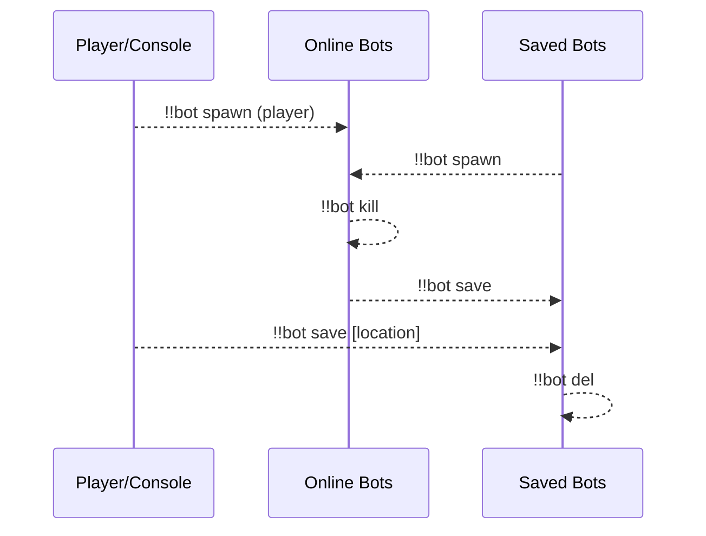
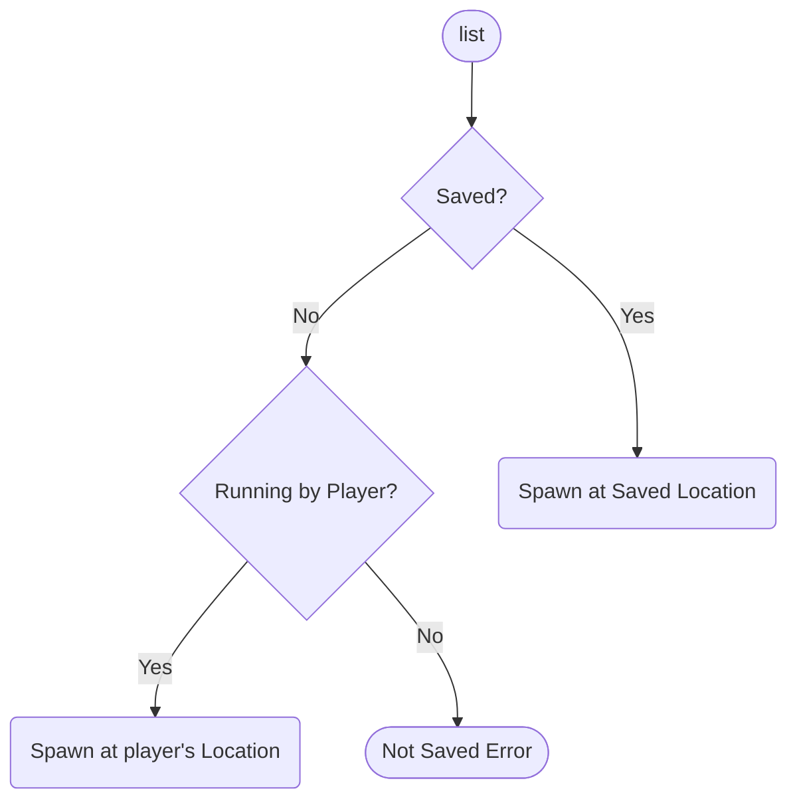
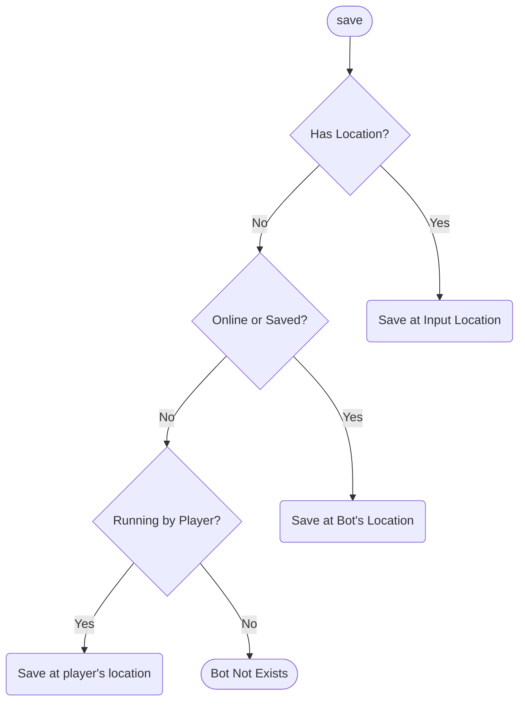
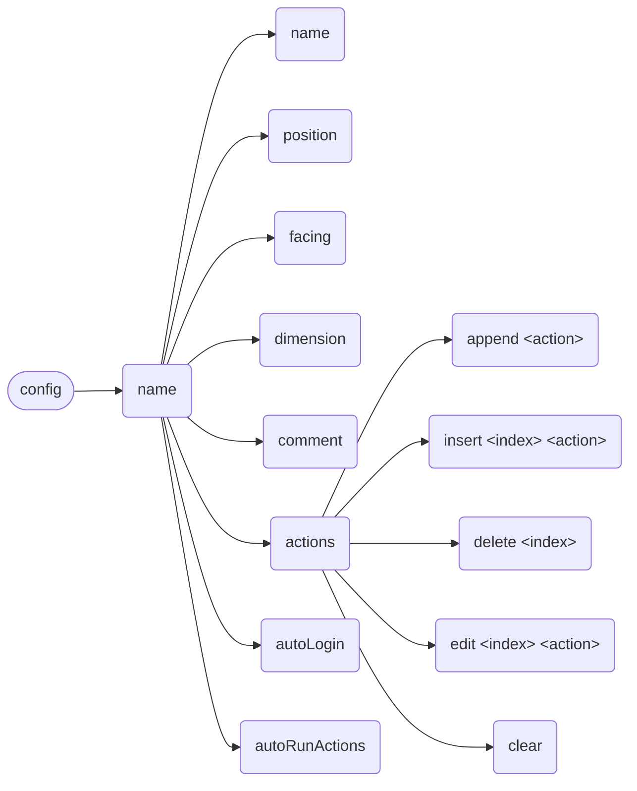
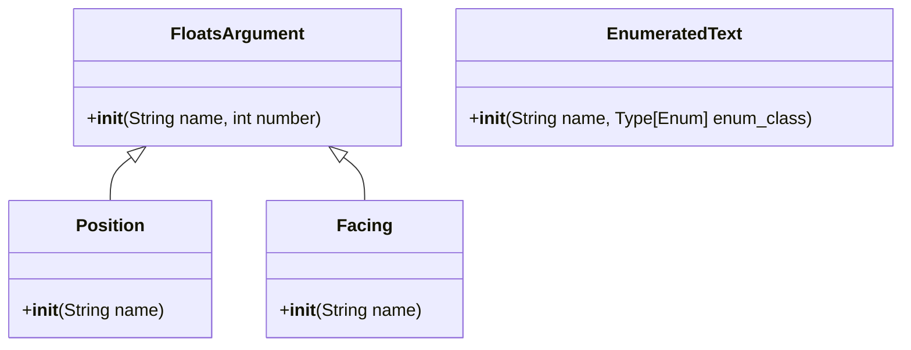

**English** | [中文](full-zh_cn.md)

\>\>\> [Back to index](/readme.md)

# Full Plugin Information Collection

Use `ctrl-f` to performance an in-page search, for what you are interested in

## advanced_calculator

### Basic Information

- Plugin ID: `advanced_calculator`
- Plugin Name: AdvancedCalculator
- Version: 0.3.1
  - Metadata version: 0.3.1
  - Release version: 0.3.1
- Total downloads: 593
- Authors: [Andy Zhang](https://github.com/AnzhiZhang)
- Repository: https://github.com/AnzhiZhang/MCDReforgedPlugins
- Repository plugin page: https://github.com/AnzhiZhang/MCDReforgedPlugins/tree/master/advanced_calculator
- Labels: [`Tool`](/labels/tool/readme.md)
- Description: Provides multiple convenient in-game calculations

### Dependencies

| Plugin ID | Requirement |
| --- | --- |

### Requirements

| Python package | Requirement |
| --- | --- |

### Introduction

# AdvancedCalculator

> 提供游戏内多种便捷计算

## 使用

您可以使用 `=<expression>` 直接计算表达式，或使用 `==<count/expression>` 将物品数转换堆叠数。

| 指令 | 用途 | 示例 | 结果 |
| - | - | - | - |
| !!calc \<expression> | 计算表达式 | !!calc 1+1 | 1+1=2 |
| !!calc item \<count/expression> | 物品数转换堆叠数 | !!calc item 1794 | 1794个物品为1盒2组3个 |
| !!calc item \<box> \<stack> \<single> | 堆叠数转换物品数 | !!calc item 1 10 32 | 1盒10组32个为2400个物品 |
| !!calc color \<red> \<green> \<blue> | 10进制RGB转16进制 | !!calc color 255 0 255 | (255, 0, 255) -> #FF00FF |
| !!calc color \<#HEX> | 16十进制RGB转10进制 | !!calc color #00FF00 | #00FF00 -> (0, 255, 0) |

### Download

> :warning: Warning: Read the README file in plugin repository before using it.

| File | Version | Upload Time | Size | Downloads | Operations |
| --- | --- | --- | --- | --- | --- |
| [AdvancedCalculator-v0.3.1.mcdr](https://github.com/AnzhiZhang/MCDReforgedPlugins/releases/tag/advanced_calculator-v0.3.1) | 0.3.1 | 2023/01/19 17:01:07 | 2.46KB | 197 | [Download](https://github.com/AnzhiZhang/MCDReforgedPlugins/releases/download/advanced_calculator-v0.3.1/AdvancedCalculator-v0.3.1.mcdr) |
| [AdvancedCalculator-v0.3.0.mcdr](https://github.com/AnzhiZhang/MCDReforgedPlugins/releases/tag/advanced_calculator-v0.3.0) | 0.3.0 | 2022/10/21 20:03:33 | 2.42KB | 210 | [Download](https://github.com/AnzhiZhang/MCDReforgedPlugins/releases/download/advanced_calculator-v0.3.0/AdvancedCalculator-v0.3.0.mcdr) |
| [AdvancedCalculator-v0.2.1.mcdr](https://github.com/AnzhiZhang/MCDReforgedPlugins/releases/tag/advanced_calculator-v0.2.1) | 0.2.1 | 2022/07/21 13:20:06 | 2.38KB | 154 | [Download](https://github.com/AnzhiZhang/MCDReforgedPlugins/releases/download/advanced_calculator-v0.2.1/AdvancedCalculator-v0.2.1.mcdr) |

## advanced_whitelist_r

### Basic Information

- Plugin ID: `advanced_whitelist_r`
- Plugin Name: AdvancedWhitelistR
- Version: 1.0.3
  - Metadata version: 1.0.3
  - Release version: 1.0.3
- Total downloads: 308
- Authors: [noionion](https://github.com/2X-ercha), [GamerNoTitle](https://github.com/GamerNoTitle)
- Repository: https://github.com/EMUnion/AdvancedWhitelistR
- Repository plugin page: https://github.com/EMUnion/AdvancedWhitelistR/tree/master
- Labels: [`Management`](/labels/management/readme.md)
- Description: For outline-model Whitelist

### Dependencies

| Plugin ID | Requirement |
| --- | --- |
| [mcdreforged](https://github.com/Fallen-Breath/MCDReforged) | \>=2.1.0 |

### Requirements

| Python package | Requirement |
| --- | --- |

### Introduction

Offline server whitelist management

### Download

> :warning: Warning: Read the README file in plugin repository before using it.

| File | Version | Upload Time | Size | Downloads | Operations |
| --- | --- | --- | --- | --- | --- |
| [AdvancedWhitelistR-v1.0.3.mcdr](https://github.com/EMUnion/AdvancedWhitelistR/releases/tag/1.0.3) | 1.0.3 | 2023/01/04 02:59:30 | 3.73KB | 77 | [Download](https://github.com/EMUnion/AdvancedWhitelistR/releases/download/1.0.3/AdvancedWhitelistR-v1.0.3.mcdr) |
| [AdvancedWhitelistR-v1.0.2.mcdr](https://github.com/EMUnion/AdvancedWhitelistR/releases/tag/1.0.2) | 1.0.2 | 2022/01/24 15:38:16 | 3.5KB | 221 | [Download](https://github.com/EMUnion/AdvancedWhitelistR/releases/download/1.0.2/AdvancedWhitelistR-v1.0.2.mcdr) |
| [AdvancedWhitelistR-v1.0.1.mcdr](https://github.com/EMUnion/AdvancedWhitelistR/releases/tag/1.0.1) | 1.0.1 | 2022/01/24 11:46:47 | 3.5KB | 10 | [Download](https://github.com/EMUnion/AdvancedWhitelistR/releases/download/1.0.1/AdvancedWhitelistR-v1.0.1.mcdr) |

## allow_suicide

### Basic Information

- Plugin ID: `allow_suicide`
- Plugin Name: allow_suicide
- Version: 1.0.0
  - Metadata version: 1.0.0
  - Release version: 1.0.0
- Total downloads: 118
- Authors: [JAs0n](https://github.com/JAs0n319)
- Repository: https://github.com/JAs0n319/allow_suicide
- Repository plugin page: https://github.com/JAs0n319/allow_suicide/tree/master
- Labels: [`Tool`](/labels/tool/readme.md)
- Description: allow player suicide with no op

### Dependencies

| Plugin ID | Requirement |
| --- | --- |
| [mcdreforged](https://github.com/Fallen-Breath/MCDReforged) | \>=2.1.0 |

### Requirements

| Python package | Requirement |
| --- | --- |

### Introduction

Allow player suicide without op
### Download

> :warning: Warning: Read the README file in plugin repository before using it.

| File | Version | Upload Time | Size | Downloads | Operations |
| --- | --- | --- | --- | --- | --- |
| [allow_suicide-v1.0.0.mcdr](https://github.com/JAs0n319/allow_suicide/releases/tag/allow_suicide-v1.0.0) | 1.0.0 | 2023/02/03 18:58:31 | 880B | 118 | [Download](https://github.com/JAs0n319/allow_suicide/releases/download/allow_suicide-v1.0.0/allow_suicide-v1.0.0.mcdr) |

## aluminum

### Basic Information

- Plugin ID: `aluminum`
- Plugin Name: Aluminum
- Version: 0.2.0
  - Metadata version: 0.2.0
  - Release version: N/A
- Total downloads: 0
- Authors: [Alex3236](https://github.com/alex3236)
- Repository: https://github.com/MCDReforged/Aluminum
- Repository plugin page: https://github.com/MCDReforged/Aluminum/tree/master/src
- Labels: [`Management`](/labels/management/readme.md)
- Description: A MCDReforged plugin manager.

### Dependencies

| Plugin ID | Requirement |
| --- | --- |
| [mcdreforged](https://github.com/Fallen-Breath/MCDReforged) | \>=2.2.0 |

### Requirements

| Python package | Requirement |
| --- | --- |
| [mcdreforged](https://pypi.org/project/mcdreforged) | \>=2.0.1 |
| [requests](https://pypi.org/project/requests) |  |

### Introduction

A MCDR plugin manager.

:warning: **Read README in repository before use!**

### Download

> :warning: Warning: Read the README file in plugin repository before using it.

| File | Version | Upload Time | Size | Downloads | Operations |
| --- | --- | --- | --- | --- | --- |

## auto_plugin_reloader

### Basic Information

- Plugin ID: `auto_plugin_reloader`
- Plugin Name: Auto Plugin Reloader
- Version: 1.1.3
  - Metadata version: 1.1.3
  - Release version: 1.1.3
- Total downloads: 4810
- Authors: [Fallen_Breath](https://github.com/Fallen-Breath)
- Repository: https://github.com/TISUnion/AutoPluginReloader
- Repository plugin page: https://github.com/TISUnion/AutoPluginReloader/tree/master
- Labels: [`Management`](/labels/management/readme.md)
- Description: Automatically reload plugins when file changes

### Dependencies

| Plugin ID | Requirement |
| --- | --- |
| [mcdreforged](https://github.com/Fallen-Breath/MCDReforged) | \>=2.1.0-beta |

### Requirements

| Python package | Requirement |
| --- | --- |

### Introduction

It's a plugin that automatically detects changes made in the MCDR plugin folders and triggers plugin reload

It's a savior for lazy people who are tired of having to manually perform plugin reloads after plugin file updates!

### Download

> :warning: Warning: Read the README file in plugin repository before using it.

| File | Version | Upload Time | Size | Downloads | Operations |
| --- | --- | --- | --- | --- | --- |
| [AutoPluginReloader-v1.1.3.mcdr](https://github.com/TISUnion/AutoPluginReloader/releases/tag/v1.1.3) | 1.1.3 | 2021/10/01 18:23:47 | 17.58KB | 1142 | [Download](https://github.com/TISUnion/AutoPluginReloader/releases/download/v1.1.3/AutoPluginReloader-v1.1.3.mcdr) |
| [AutoPluginReloader-v1.1.2.mcdr](https://github.com/TISUnion/AutoPluginReloader/releases/tag/v1.1.2) | 1.1.2 | 2021/09/30 10:02:54 | 17.59KB | 103 | [Download](https://github.com/TISUnion/AutoPluginReloader/releases/download/v1.1.2/AutoPluginReloader-v1.1.2.mcdr) |
| [AutoPluginReloader-v1.1.1.mcdr](https://github.com/TISUnion/AutoPluginReloader/releases/tag/v1.1.1) | 1.1.1 | 2021/09/12 10:20:17 | 17.47KB | 887 | [Download](https://github.com/TISUnion/AutoPluginReloader/releases/download/v1.1.1/AutoPluginReloader-v1.1.1.mcdr) |

## beep

### Basic Information

- Plugin ID: `beep`
- Plugin Name: Beep
- Version: 1.1.0
  - Metadata version: 1.1.0
  - Release version: 1.1.0
- Total downloads: 4339
- Authors: [Fallen_Breath](https://github.com/Fallen-Breath), [LucunJi](https://github.com/LucunJi)
- Repository: https://github.com/TISUnion/Beep
- Repository plugin page: https://github.com/TISUnion/Beep/tree/master
- Labels: [`Tool`](/labels/tool/readme.md)
- Description: Use @ \<someone\> to ping someone, @ all for everyone. Use @@ for a pogger ping

### Dependencies

| Plugin ID | Requirement |
| --- | --- |
| [mcdreforged](https://github.com/Fallen-Breath/MCDReforged) | \>=2.1.0 |

### Requirements

| Python package | Requirement |
| --- | --- |

### Introduction

*None*

### Download

> :warning: Warning: Read the README file in plugin repository before using it.

| File | Version | Upload Time | Size | Downloads | Operations |
| --- | --- | --- | --- | --- | --- |
| [Beep-v1.1.0.mcdr](https://github.com/TISUnion/Beep/releases/tag/v1.1.0) | 1.1.0 | 2021/08/26 14:01:49 | 1.74KB | 3007 | [Download](https://github.com/TISUnion/Beep/releases/download/v1.1.0/Beep-v1.1.0.mcdr) |
| [Beep-v1.0.0.mcdr](https://github.com/TISUnion/Beep/releases/tag/v1.0.0) | 1.0.0 | 2021/08/21 15:35:36 | 1.67KB | 1332 | [Download](https://github.com/TISUnion/Beep/releases/download/v1.0.0/Beep-v1.0.0.mcdr) |

## bingo

### Basic Information

- Plugin ID: `bingo`
- Plugin Name: Bingo
- Version: 0.0.3
  - Metadata version: 0.0.3
  - Release version: 0.0.3
- Total downloads: 10
- Authors: [Andy Zhang](https://github.com/AnzhiZhang)
- Repository: https://github.com/AnzhiZhang/MCDReforgedPlugins
- Repository plugin page: https://github.com/AnzhiZhang/MCDReforgedPlugins/tree/master/bingo
- Labels: [`Tool`](/labels/tool/readme.md)
- Description: Useful tool for Bingo game

### Dependencies

| Plugin ID | Requirement |
| --- | --- |

### Requirements

| Python package | Requirement |
| --- | --- |

### Introduction

# Bingo

> [Bingo](https://www.flytre.net/bingo) 游戏实用工具

## 使用

| 指令 | 用途 |
| - | - |
| !!bingo team \<num> | 随机分组 |
| !!bingo end | 结束游戏 |

### Download

> :warning: Warning: Read the README file in plugin repository before using it.

| File | Version | Upload Time | Size | Downloads | Operations |
| --- | --- | --- | --- | --- | --- |
| [Bingo-v0.0.3.mcdr](https://github.com/AnzhiZhang/MCDReforgedPlugins/releases/tag/bingo-v0.0.3) | 0.0.3 | 2023/02/26 00:14:39 | 1.3KB | 10 | [Download](https://github.com/AnzhiZhang/MCDReforgedPlugins/releases/download/bingo-v0.0.3/Bingo-v0.0.3.mcdr) |

## bot

### Basic Information

- Plugin ID: `bot`
- Plugin Name: Bot
- Version: 1.0.6
  - Metadata version: 1.0.6
  - Release version: 1.0.6
- Total downloads: 831
- Authors: [Andy Zhang](https://github.com/AnzhiZhang)
- Repository: https://github.com/AnzhiZhang/MCDReforgedPlugins
- Repository plugin page: https://github.com/AnzhiZhang/MCDReforgedPlugins/tree/master/bot
- Labels: [`Tool`](/labels/tool/readme.md), [`Management`](/labels/management/readme.md)
- Description: The best carpet bot manager!

### Dependencies

| Plugin ID | Requirement |
| --- | --- |
| [mcdreforged](https://github.com/Fallen-Breath/MCDReforged) | ^2.6.0 |
| [dict_command_registration](/plugins/dict_command_registration/readme.md) | ^1.0.0 |
| [minecraft_data_api](/plugins/minecraft_data_api/readme.md) | ^1.4 |
| [more_command_nodes](/plugins/more_command_nodes/readme.md) | ^1.1.0 |

### Requirements

| Python package | Requirement |
| --- | --- |

### Introduction

# Bot

> 最好用的地毯模组假人管理器！

## 依赖

- [MinecraftDataAPI](https://github.com/MCDReforged/MinecraftDataAPI)
- [MoreCommandNodes](https://github.com/AnzhiZhang/MCDReforgedPlugins/tree/master/more_command_nodes)

## 使用方法

`!!bot` 查看帮助

`!!bot list [index] [filter]` 显示假人列表

`!!bot spawn <name>` 上线假人

`!!bot kill <name>` 下线假人

`!!bot action <name> [index]` 执行假人动作

`!!bot info <name>` 查看假人信息

`!!bot save <name> [position] [facing] [dimension]` 保存假人

`!!bot del <name>` 删除保存的假人

`!!bot config <name> <option> <value>` 配置假人



### list

**index**：列表的页码

**filter**：可用选项为：`--all`、`--online` 或 `--saved`，过滤假人

### spawn

上线假人



### kill

下线假人

### action

执行假人动作

当指定 `index` 时，执行特定动作而不是全部动作

### info

查看假人信息

### save

保存假人



### del

删除保存的假人

### config

配置假人



## 配置

### gamemode

默认值: `survival`

生成假人的游戏模式

### name_prefix

默认值：无

假人名称前缀

### name_suffix

默认值：无

假人名称前缀

### permissions

使用对应指令的最低权限

### Download

> :warning: Warning: Read the README file in plugin repository before using it.

| File | Version | Upload Time | Size | Downloads | Operations |
| --- | --- | --- | --- | --- | --- |
| [Bot-v1.0.6.mcdr](https://github.com/AnzhiZhang/MCDReforgedPlugins/releases/tag/bot-v1.0.6) | 1.0.6 | 2023/01/19 16:58:58 | 13.6KB | 291 | [Download](https://github.com/AnzhiZhang/MCDReforgedPlugins/releases/download/bot-v1.0.6/Bot-v1.0.6.mcdr) |
| [Bot-v1.0.5.mcdr](https://github.com/AnzhiZhang/MCDReforgedPlugins/releases/tag/bot-v1.0.5) | 1.0.5 | 2022/12/29 15:19:31 | 13.55KB | 130 | [Download](https://github.com/AnzhiZhang/MCDReforgedPlugins/releases/download/bot-v1.0.5/Bot-v1.0.5.mcdr) |
| [Bot-v1.0.4.mcdr](https://github.com/AnzhiZhang/MCDReforgedPlugins/releases/tag/bot-v1.0.4) | 1.0.4 | 2022/12/29 14:53:06 | 13.55KB | 8 | [Download](https://github.com/AnzhiZhang/MCDReforgedPlugins/releases/download/bot-v1.0.4/Bot-v1.0.4.mcdr) |

## bot_plugin

### Basic Information

- Plugin ID: `bot_plugin`
- Plugin Name: Bot Plugin
- Version: 1.0.0
  - Metadata version: 1.0.0
  - Release version: 1.0.0
- Total downloads: 419
- Authors: [DancingSnow0517](https://github.com/DancingSnow0517)
- Repository: https://github.com/DancingSnow0517/Bot_Manager
- Repository plugin page: https://github.com/DancingSnow0517/Bot_Manager/tree/master
- Labels: [`Management`](/labels/management/readme.md), [`Tool`](/labels/tool/readme.md)
- Description: 管理 carpet 机器人

### Dependencies

| Plugin ID | Requirement |
| --- | --- |
| [mcdreforged](https://github.com/Fallen-Breath/MCDReforged) | \>=2.3.0 |
| [minecraft_data_api](/plugins/minecraft_data_api/readme.md) | \>=1.4.0 |

### Requirements

| Python package | Requirement |
| --- | --- |

### Introduction

# A MCDR bot manager。

:warning: **Read README in repository before use!**
### Download

> :warning: Warning: Read the README file in plugin repository before using it.

| File | Version | Upload Time | Size | Downloads | Operations |
| --- | --- | --- | --- | --- | --- |
| [BotPlugin-v1.0.0.mcdr](https://github.com/DancingSnow0517/Bot_Manager/releases/tag/1.0.0) | 1.0.0 | 2022/01/09 04:38:06 | 17.24KB | 419 | [Download](https://github.com/DancingSnow0517/Bot_Manager/releases/download/1.0.0/BotPlugin-v1.0.0.mcdr) |

## carpet_bot_manager

### Basic Information

- Plugin ID: `carpet_bot_manager`
- Plugin Name: Carpet Bot Manager
- Version: 0.3.0
  - Metadata version: 0.3.0
  - Release version: 0.3.0
- Total downloads: 1716
- Authors: [YehowahLiu](https://github.com/YehowahLiu)
- Repository: https://github.com/FAS-Server/CarpetBotManager
- Repository plugin page: https://github.com/FAS-Server/CarpetBotManager/tree/main
- Labels: [`Tool`](/labels/tool/readme.md)
- Description: A carpet bot manage plugin, able to spawn bot and make it execute actions

### Dependencies

| Plugin ID | Requirement |
| --- | --- |
| [mcdreforged](https://github.com/Fallen-Breath/MCDReforged) | \>=2.1.2 |
| [minecraft_data_api](/plugins/minecraft_data_api/readme.md) | \>=1.4.0 |

### Requirements

| Python package | Requirement |
| --- | --- |
| [mcdreforged](https://pypi.org/project/mcdreforged) | \>=2.1.2 |

### Introduction

A carpet bot manage plugin, able to spawn bot and make it execute actions

### Download

> :warning: Warning: Read the README file in plugin repository before using it.

| File | Version | Upload Time | Size | Downloads | Operations |
| --- | --- | --- | --- | --- | --- |
| [CarpetBotManager-v0.3.0.mcdr](https://github.com/FAS-Server/CarpetBotManager/releases/tag/v0.3.0) | 0.3.0 | 2021/09/07 17:13:43 | 9.93KB | 1716 | [Download](https://github.com/FAS-Server/CarpetBotManager/releases/download/v0.3.0/CarpetBotManager-v0.3.0.mcdr) |

## carpet_tick

### Basic Information

- Plugin ID: `carpet_tick`
- Plugin Name: Carpet Tick
- Version: 1.1.1
  - Metadata version: 1.1.1
  - Release version: 1.1.1
- Total downloads: 234
- Authors: [Ivan1F](https://github.com/Ivan-1F)
- Repository: https://github.com/Ivan-1F/CarpetTick
- Repository plugin page: https://github.com/Ivan-1F/CarpetTick/tree/master
- Labels: [`Information`](/labels/information/readme.md)
- Description: Get server status using carpet /tick command

### Dependencies

| Plugin ID | Requirement |
| --- | --- |
| [mcdreforged](https://github.com/Fallen-Breath/MCDReforged) | \>=2.1.0-beta |

### Requirements

| Python package | Requirement |
| --- | --- |

### Introduction

*None*

### Download

> :warning: Warning: Read the README file in plugin repository before using it.

| File | Version | Upload Time | Size | Downloads | Operations |
| --- | --- | --- | --- | --- | --- |
| [CarpetTick-v1.1.1.mcdr](https://github.com/Ivan-1F/CarpetTick/releases/tag/v1.1.1) | 1.1.1 | 2022/08/27 16:04:57 | 3.46KB | 134 | [Download](https://github.com/Ivan-1F/CarpetTick/releases/download/v1.1.1/CarpetTick-v1.1.1.mcdr) |
| [CarpetTick-v1.1.0.mcdr](https://github.com/Ivan-1F/CarpetTick/releases/tag/v1.1.0) | 1.1.0 | 2022/04/07 09:28:18 | 3.48KB | 87 | [Download](https://github.com/Ivan-1F/CarpetTick/releases/download/v1.1.0/CarpetTick-v1.1.0.mcdr) |
| [CarpetTick-v1.0.0.mcdr](https://github.com/Ivan-1F/CarpetTick/releases/tag/v1.0.0) | 1.0.0 | 2022/03/11 14:50:05 | 3.35KB | 13 | [Download](https://github.com/Ivan-1F/CarpetTick/releases/download/v1.0.0/CarpetTick-v1.0.0.mcdr) |

## carpetbotlist

### Basic Information

- Plugin ID: `carpetbotlist`
- Plugin Name: CarpetBotList
- Version: 2.1.1
  - Metadata version: 2.1.1
  - Release version: 2.1.1
- Total downloads: 4412
- Authors: [ZeroKelvin](https://github.com/BelowZeroKelvin)
- Repository: https://github.com/BelowZeroKelvin/MCDR-CarpetBotList
- Repository plugin page: https://github.com/BelowZeroKelvin/MCDR-CarpetBotList/tree/MCDR-2.x
- Labels: [`Tool`](/labels/tool/readme.md)
- Description: Help you manage your carpet fake player

### Dependencies

| Plugin ID | Requirement |
| --- | --- |
| [mcdreforged](https://github.com/Fallen-Breath/MCDReforged) | ^2.0.0-beta.1 |
| [minecraft_data_api](/plugins/minecraft_data_api/readme.md) | * |

### Requirements

| Python package | Requirement |
| --- | --- |

### Introduction

Help you manage your carpet fake player

### Download

> :warning: Warning: Read the README file in plugin repository before using it.

| File | Version | Upload Time | Size | Downloads | Operations |
| --- | --- | --- | --- | --- | --- |
| [CarpetBotList-v2.1.1.mcdr](https://github.com/BelowZeroKelvin/MCDR-CarpetBotList/releases/tag/v2.1.1) | 2.1.1 | 2021/08/23 06:17:05 | 1.89KB | 1759 | [Download](https://github.com/BelowZeroKelvin/MCDR-CarpetBotList/releases/download/v2.1.1/CarpetBotList-v2.1.1.mcdr) |
| [CarpetBotList-v2.1.0.mcdr](https://github.com/BelowZeroKelvin/MCDR-CarpetBotList/releases/tag/v2.1.0) | 2.1.0 | 2021/08/16 11:33:40 | 4.08KB | 1323 | [Download](https://github.com/BelowZeroKelvin/MCDR-CarpetBotList/releases/download/v2.1.0/CarpetBotList-v2.1.0.mcdr) |
| [CarpetBotList-v2.0.0.mcdr](https://github.com/BelowZeroKelvin/MCDR-CarpetBotList/releases/tag/v2.0.0) | 2.0.0 | 2021/08/12 07:45:32 | 3.6KB | 1330 | [Download](https://github.com/BelowZeroKelvin/MCDR-CarpetBotList/releases/download/v2.0.0/CarpetBotList-v2.0.0.mcdr) |

## cato

### Basic Information

- Plugin ID: `cato`
- Plugin Name: Cato Plugin
- Version: 1.1.0
  - Metadata version: 1.1.0
  - Release version: 1.1.0
- Total downloads: 470
- Authors: [Harry-zklcdc](https://github.com/Harry-zklcdc)
- Repository: https://github.com/Harry-zklcdc/MCDR-Cato
- Repository plugin page: https://github.com/Harry-zklcdc/MCDR-Cato/tree/main
- Labels: [`Tool`](/labels/tool/readme.md)
- Description: Plugin Cato

### Dependencies

| Plugin ID | Requirement |
| --- | --- |
| [mcdreforged](https://github.com/Fallen-Breath/MCDReforged) | \>=2.0.0-alpha.1 |

### Requirements

| Python package | Requirement |
| --- | --- |

### Introduction

When the server starts, it automatically uses Cato (P2P connection tool) for port mapping, and supports the generation of HMCL Multiplayer code

# Features:

- Cato official support
- Non inductive P2P connection
- HMCL Multiplayer Support
- Cato crash / temporary ID expires restart automatically
- API interface to obtain Cato connection ID and HMCL Multiplayer code
- Cato token hot replacement
- Get Cato connection ID and HMCL Multiplayer code in the game

### Download

> :warning: Warning: Read the README file in plugin repository before using it.

| File | Version | Upload Time | Size | Downloads | Operations |
| --- | --- | --- | --- | --- | --- |
| [Cato-v1.1.0.mcdr](https://github.com/Harry-zklcdc/MCDR-Cato/releases/tag/cato-v1.1.0) | 1.1.0 | 2021/10/31 08:31:03 | 2.9KB | 435 | [Download](https://github.com/Harry-zklcdc/MCDR-Cato/releases/download/cato-v1.1.0/Cato-v1.1.0.mcdr) |
| [Cato-v1.0.0.mcdr](https://github.com/Harry-zklcdc/MCDR-Cato/releases/tag/cato-v1.0.0) | 1.0.0 | 2021/10/14 12:15:08 | 2.93KB | 35 | [Download](https://github.com/Harry-zklcdc/MCDR-Cato/releases/download/cato-v1.0.0/Cato-v1.0.0.mcdr) |

## chatbridge

### Basic Information

- Plugin ID: `chatbridge`
- Plugin Name: ChatBridge v2 for MCDR
- Version: 2.5.1
  - Metadata version: 2.5.1
  - Release version: 2.5.1
- Total downloads: 1614
- Authors: [Fallen_Breath](https://github.com/Fallen-Breath)
- Repository: https://github.com/TISUnion/ChatBridge
- Repository plugin page: https://github.com/TISUnion/ChatBridge/tree/master
- Labels: [`Tool`](/labels/tool/readme.md)
- Description: Broadcast chats between Minecraft servers and more

### Dependencies

| Plugin ID | Requirement |
| --- | --- |
| [mcdreforged](https://github.com/Fallen-Breath/MCDReforged) | \>=2.2.0- |

### Requirements

| Python package | Requirement |
| --- | --- |
| [mcdreforged](https://pypi.org/project/mcdreforged) | \>=2.2.0 |
| [pycryptodome](https://pypi.org/project/pycryptodome) |  |
| [colorlog](https://pypi.org/project/colorlog) |  |

### Introduction

Chatbridge v2

### Download

> :warning: Warning: Read the README file in plugin repository before using it.

| File | Version | Upload Time | Size | Downloads | Operations |
| --- | --- | --- | --- | --- | --- |
| [ChatBridge.pyz](https://github.com/TISUnion/ChatBridge/releases/tag/v2.5.1) | 2.5.1 | 2023/04/04 15:28:53 | 40.63KB | 27 | [Download](https://github.com/TISUnion/ChatBridge/releases/download/v2.5.1/ChatBridge.pyz) |
| [ChatBridge.pyz](https://github.com/TISUnion/ChatBridge/releases/tag/v2.5.0) | 2.5.0 | 2023/03/13 19:01:44 | 41.09KB | 74 | [Download](https://github.com/TISUnion/ChatBridge/releases/download/v2.5.0/ChatBridge.pyz) |
| [ChatBridge.pyz](https://github.com/TISUnion/ChatBridge/releases/tag/v2.4.1) | 2.4.1 | 2023/02/27 18:19:47 | 40.68KB | 50 | [Download](https://github.com/TISUnion/ChatBridge/releases/download/v2.4.1/ChatBridge.pyz) |

## chatbridgereforged_mc

### Basic Information

- Plugin ID: `chatbridgereforged_mc`
- Plugin Name: ChatBridgeReforged_MC
- Version: 0.2.7
  - Metadata version: 0.2.7-dev032
  - Release version: 0.2.7
- Total downloads: 173
- Authors: [Ricky](https://github.com/R1ckyH)
- Repository: https://github.com/R1ckyH/ChatBridgeReforged
- Repository plugin page: https://github.com/R1ckyH/ChatBridgeReforged/tree/master/./ChatBridgeReforged_MC
- Labels: [`Tool`](/labels/tool/readme.md)
- Description: Reforged of ChatBridge, interaction with other clients(such as minecraft server, discord bots or other custom clients).

### Dependencies

| Plugin ID | Requirement |
| --- | --- |
| [mcdreforged](https://github.com/Fallen-Breath/MCDReforged) | \>=2.0.0 |

### Requirements

| Python package | Requirement |
| --- | --- |
| [mcdreforged](https://pypi.org/project/mcdreforged) |  |
| [pycryptodomex](https://pypi.org/project/pycryptodomex) |  |

### Introduction

Reforged of ChatBridge, interaction with other clients(such as minecraft server, discord bot or other things).

### Download

> :warning: Warning: Read the README file in plugin repository before using it.

| File | Version | Upload Time | Size | Downloads | Operations |
| --- | --- | --- | --- | --- | --- |
| [ChatBridgeReforged_MC.pyz](https://github.com/R1ckyH/ChatBridgeReforged/releases/tag/0.2.7) | 0.2.7 | 2022/12/20 09:53:31 | 49.35KB | 138 | [Download](https://github.com/R1ckyH/ChatBridgeReforged/releases/download/0.2.7/ChatBridgeReforged_MC.pyz) |
| [ChatBridgeReforged_MC.pyz](https://github.com/R1ckyH/ChatBridgeReforged/releases/tag/0.1.1) | 0.1.1 | 2022/03/04 06:12:36 | 46.96KB | 23 | [Download](https://github.com/R1ckyH/ChatBridgeReforged/releases/download/0.1.1/ChatBridgeReforged_MC.pyz) |
| [ChatBridgeReforged_MC.pyz](https://github.com/R1ckyH/ChatBridgeReforged/releases/tag/0.0.2) | 0.0.2 | 2022/01/15 16:33:44 | 44.9KB | 12 | [Download](https://github.com/R1ckyH/ChatBridgeReforged/releases/download/0.0.2/ChatBridgeReforged_MC.pyz) |

## colored_chat

### Basic Information

- Plugin ID: `colored_chat`
- Plugin Name: ColoredChat
- Version: 0.0.3
  - Metadata version: 0.0.3
  - Release version: 0.0.3
- Total downloads: 41
- Authors: [Andy Zhang](https://github.com/AnzhiZhang)
- Repository: https://github.com/AnzhiZhang/MCDReforgedPlugins
- Repository plugin page: https://github.com/AnzhiZhang/MCDReforgedPlugins/tree/master/.archived/ColoredChat
- Labels: [`Tool`](/labels/tool/readme.md)
- Description: Support formatting codes for vanilla

### Dependencies

| Plugin ID | Requirement |
| --- | --- |

### Requirements

| Python package | Requirement |
| --- | --- |

### Introduction

# ColoredChat

> 支持原版显示 [格式化代码](https://minecraft.fandom.com/zh/wiki/%E6%A0%BC%E5%BC%8F%E5%8C%96%E4%BB%A3%E7%A0%81)

## 使用

与正常聊天没有区别, 需要格式化时使用 `&` 符号

## 配置

`force_refresh`

是否刷新聊天栏的所有内容, 某些无法被记录的信息可能会被覆盖

默认值: `True`

## API

可以使用 `append_msg(msg)` 方法来插件的广播消息

### Download

> :warning: Warning: Read the README file in plugin repository before using it.

| File | Version | Upload Time | Size | Downloads | Operations |
| --- | --- | --- | --- | --- | --- |
| [ColoredChat-v0.0.3.mcdr](https://github.com/AnzhiZhang/MCDReforgedPlugins/releases/tag/colored_chat-v0.0.3) | 0.0.3 | 2023/02/26 00:06:36 | 1.54KB | 41 | [Download](https://github.com/AnzhiZhang/MCDReforgedPlugins/releases/download/colored_chat-v0.0.3/ColoredChat-v0.0.3.mcdr) |

## command_exporter

### Basic Information

- Plugin ID: `command_exporter`
- Plugin Name: MCDR Command Exporter
- Version: 1.2.0
  - Metadata version: 1.2.0
  - Release version: 1.2.0
- Total downloads: 69
- Authors: [DancingSnow](https://github.com/DancingSnow0517)
- Repository: https://github.com/DancingSnow0517/MCDR-Command-Exporter
- Repository plugin page: https://github.com/DancingSnow0517/MCDR-Command-Exporter/tree/master/command_exporter
- Labels: [`Tool`](/labels/tool/readme.md)
- Description: A plugin is used to export the MCDR command tree

### Dependencies

| Plugin ID | Requirement |
| --- | --- |
| [mcdreforged](https://github.com/Fallen-Breath/MCDReforged) | \>=2.7.0 |

### Requirements

| Python package | Requirement |
| --- | --- |

### Introduction

English | [中文](README-CN.MD)

# MCDR Command Exporter

A plugin is used to export the MCDR command tree.

Get client completion with mod [MCDR-Completion](https://github.com/DancingSnow0517/MCDR-Completion).

## Usage
1. Go to [release page](https://github.com/DancingSnow0517/MCDR-Command-Exporter/releases) download `MCDRCommandExporter-vX.X.X.mcdr` plugin

   Put it in the plugins folder and reload MCDR plugins.

2. Download fabric mod [MCDR-Completion](https://github.com/DancingSnow0517/MCDR-Completion/releases) and install it to `Server` and `Client`

   This mod requires [fabric-api](https://modrinth.com/mod/fabric-api)

3. Join the server and enjoy it! 


### Download

> :warning: Warning: Read the README file in plugin repository before using it.

| File | Version | Upload Time | Size | Downloads | Operations |
| --- | --- | --- | --- | --- | --- |
| [MCDRCommandExporter-v1.2.0.mcdr](https://github.com/DancingSnow0517/MCDR-Command-Exporter/releases/tag/1.2.0) | 1.2.0 | 2023/02/04 17:28:11 | 1.85KB | 34 | [Download](https://github.com/DancingSnow0517/MCDR-Command-Exporter/releases/download/1.2.0/MCDRCommandExporter-v1.2.0.mcdr) |
| [MCDRCommandExporter-v1.1.0.mcdr](https://github.com/DancingSnow0517/MCDR-Command-Exporter/releases/tag/1.1.0) | 1.1.0 | 2023/01/22 02:25:45 | 1.85KB | 16 | [Download](https://github.com/DancingSnow0517/MCDR-Command-Exporter/releases/download/1.1.0/MCDRCommandExporter-v1.1.0.mcdr) |
| [MCDRCommandExporter-v1.0.0.mcdr](https://github.com/DancingSnow0517/MCDR-Command-Exporter/releases/tag/1.0.0) | 1.0.0 | 2023/01/18 13:25:58 | 1.83KB | 19 | [Download](https://github.com/DancingSnow0517/MCDR-Command-Exporter/releases/download/1.0.0/MCDRCommandExporter-v1.0.0.mcdr) |

## cpu_temp

### Basic Information

- Plugin ID: `cpu_temp`
- Plugin Name: cpu_temp
- Version: 3.0.2
  - Metadata version: 3.0.2
  - Release version: 3.0.2
- Total downloads: 300
- Authors: [Ricky](https://github.com/R1ckyH)
- Repository: https://github.com/R1ckyH/cpu_temp
- Repository plugin page: https://github.com/R1ckyH/cpu_temp/tree/master
- Labels: [`Information`](/labels/information/readme.md)
- Description: A plugin to check cpu temp regularly.

### Dependencies

| Plugin ID | Requirement |
| --- | --- |
| [mcdreforged](https://github.com/Fallen-Breath/MCDReforged) | \>=2.0.0 |

### Requirements

| Python package | Requirement |
| --- | --- |
| [psutil](https://pypi.org/project/psutil) |  |
| [mcdreforged](https://pypi.org/project/mcdreforged) |  |
| [APScheduler](https://pypi.org/project/APScheduler) |  |

### Introduction

A plugin to check cpu temp regularly.

### Download

> :warning: Warning: Read the README file in plugin repository before using it.

| File | Version | Upload Time | Size | Downloads | Operations |
| --- | --- | --- | --- | --- | --- |
| [cpu_temp-3.0.2.mcdr](https://github.com/R1ckyH/cpu_temp/releases/tag/v3.0.2) | 3.0.2 | 2021/10/26 07:30:51 | 8.42KB | 300 | [Download](https://github.com/R1ckyH/cpu_temp/releases/download/v3.0.2/cpu_temp-3.0.2.mcdr) |

## crash_restart

### Basic Information

- Plugin ID: `crash_restart`
- Plugin Name: Crash Restart
- Version: 1.0.0
  - Metadata version: 1.0.0
  - Release version: 1.0.0
- Total downloads: 3077
- Authors: [Fallen_Breath](https://github.com/Fallen-Breath)
- Repository: https://github.com/MCDReforged/CrashRestart
- Repository plugin page: https://github.com/MCDReforged/CrashRestart/tree/master
- Labels: [`Tool`](/labels/tool/readme.md)
- Description: Automatically restart the server after the server crashed

### Dependencies

| Plugin ID | Requirement |
| --- | --- |

### Requirements

| Python package | Requirement |
| --- | --- |

### Introduction

*None*

### Download

> :warning: Warning: Read the README file in plugin repository before using it.

| File | Version | Upload Time | Size | Downloads | Operations |
| --- | --- | --- | --- | --- | --- |
| [CrashRestart-v1.0.0.mcdr](https://github.com/MCDReforged/CrashRestart/releases/tag/v1.0.0) | 1.0.0 | 2021/08/22 04:31:25 | 13.33KB | 3077 | [Download](https://github.com/MCDReforged/CrashRestart/releases/download/v1.0.0/CrashRestart-v1.0.0.mcdr) |

## database_api

### Basic Information

- Plugin ID: `database_api`
- Plugin Name: DatabaseAPI
- Version: 0.1.1
  - Metadata version: 0.1.1
  - Release version: 0.1.1
- Total downloads: 92
- Authors: [Andy Zhang](https://github.com/AnzhiZhang)
- Repository: https://github.com/AnzhiZhang/MCDReforgedPlugins
- Repository plugin page: https://github.com/AnzhiZhang/MCDReforgedPlugins/tree/master/database_api
- Labels: [`API`](/labels/api/readme.md)
- Description: Database API to access database

### Dependencies

| Plugin ID | Requirement |
| --- | --- |

### Requirements

| Python package | Requirement |
| --- | --- |
| [sqlalchemy](https://pypi.org/project/sqlalchemy) |  |

### Introduction

# DatabaseAPI

> 数据库API
>
> 提供了数据库操作的便捷API

## 环境要求

### Python包

- sqlalchemy

## 开发文档

查看 [Valut](https://github.com/AnzhiZhang/MCDReforgedPlugins/tree/master/.archived/vault/vault.py) 参考使用方法

提供了以下两个类:

- TableBase
- DataManager

### TableBase

一个数据库表的基类, 写一个你的数据库表并继承这个类来创建一张表

### DataManager

使用本API需要自行实例化这个类

实例化: `__init__(self, file_path: str)`

#### get_session

获取一个数据库会话的上下文管理器, 更多信息请自行查找资料

### Download

> :warning: Warning: Read the README file in plugin repository before using it.

| File | Version | Upload Time | Size | Downloads | Operations |
| --- | --- | --- | --- | --- | --- |
| [DatabaseAPI-v0.1.1.mcdr](https://github.com/AnzhiZhang/MCDReforgedPlugins/releases/tag/database_api-v0.1.1) | 0.1.1 | 2022/06/30 06:31:33 | 1.25KB | 82 | [Download](https://github.com/AnzhiZhang/MCDReforgedPlugins/releases/download/database_api-v0.1.1/DatabaseAPI-v0.1.1.mcdr) |
| [DatabaseAPI-v0.1.0.mcdr](https://github.com/AnzhiZhang/MCDReforgedPlugins/releases/tag/database_api-v0.1.0) | 0.1.0 | 2022/06/30 04:17:28 | 1.13KB | 10 | [Download](https://github.com/AnzhiZhang/MCDReforgedPlugins/releases/download/database_api-v0.1.0/DatabaseAPI-v0.1.0.mcdr) |

## daycount_nbt

### Basic Information

- Plugin ID: `daycount_nbt`
- Plugin Name: DayCount NBT
- Version: 2.2.1
  - Metadata version: 2.2.1
  - Release version: 2.2.1
- Total downloads: 4535
- Authors: [Alex3236](https://github.com/alex3236)
- Repository: https://github.com/alex3236/daycount-NBT
- Repository plugin page: https://github.com/alex3236/daycount-NBT/tree/main/src
- Labels: [`Information`](/labels/information/readme.md), [`API`](/labels/api/readme.md)
- Description: :calendar: Get and export server opening times.

### Dependencies

| Plugin ID | Requirement |
| --- | --- |
| [mcdreforged](https://github.com/Fallen-Breath/MCDReforged) | \>=2.2.0 |

### Requirements

| Python package | Requirement |
| --- | --- |

### Introduction

Get and export server opening times.

Feature:
- NBT Mode

:warning: **Read README in repository before use!**
### Download

> :warning: Warning: Read the README file in plugin repository before using it.

| File | Version | Upload Time | Size | Downloads | Operations |
| --- | --- | --- | --- | --- | --- |
| [DayCountNBT-v2.2.1.mcdr](https://github.com/alex3236/daycount-NBT/releases/tag/v2.2.1) | 2.2.1 | 2022/10/01 02:10:09 | 1.48KB | 574 | [Download](https://github.com/alex3236/daycount-NBT/releases/download/v2.2.1/DayCountNBT-v2.2.1.mcdr) |
| [DayCountNBT-v2.1.1.mcdr](https://github.com/alex3236/daycount-NBT/releases/tag/v2.1.1) | 2.1.1 | 2021/11/08 14:26:50 | 1.33KB | 153 | [Download](https://github.com/alex3236/daycount-NBT/releases/download/v2.1.1/DayCountNBT-v2.1.1.mcdr) |
| [DayCountNBT-v2.1.0.mcdr](https://github.com/alex3236/daycount-NBT/releases/tag/v2.1) | 2.1 | 2021/10/01 06:12:46 | 1.31KB | 147 | [Download](https://github.com/alex3236/daycount-NBT/releases/download/v2.1/DayCountNBT-v2.1.0.mcdr) |

## daytime

### Basic Information

- Plugin ID: `daytime`
- Plugin Name: Daytime
- Version: 1.1.0
  - Metadata version: 1.1.0
  - Release version: 1.1.0
- Total downloads: 1851
- Authors: [ZeroKelvin](https://github.com/BelowZeroKelvin)
- Repository: https://github.com/BelowZeroKelvin/MCDR-Daytime
- Repository plugin page: https://github.com/BelowZeroKelvin/MCDR-Daytime/tree/MCDR-2.x
- Labels: [`Tool`](/labels/tool/readme.md)
- Description: show time in minecraft

### Dependencies

| Plugin ID | Requirement |
| --- | --- |
| [mcdreforged](https://github.com/Fallen-Breath/MCDReforged) | ^2.0.0-beta.1 |

### Requirements

| Python package | Requirement |
| --- | --- |

### Introduction

Show time in Minecraft

### Download

> :warning: Warning: Read the README file in plugin repository before using it.

| File | Version | Upload Time | Size | Downloads | Operations |
| --- | --- | --- | --- | --- | --- |
| [Daytime-v1.1.0.mcdr](https://github.com/BelowZeroKelvin/MCDR-Daytime/releases/tag/v1.1.0) | 1.1.0 | 2021/08/18 04:36:17 | 1.07KB | 1851 | [Download](https://github.com/BelowZeroKelvin/MCDR-Daytime/releases/download/v1.1.0/Daytime-v1.1.0.mcdr) |

## delayexe

### Basic Information

- Plugin ID: `delayexe`
- Plugin Name: Delay Exe
- Version: 1.3.0
  - Metadata version: 1.3.0
  - Release version: 1.3.0
- Total downloads: 290
- Authors: [zyxkad](https://github.com/zyxkad)
- Repository: https://github.com/kmcsr/delayexe_mcdr
- Repository plugin page: https://github.com/kmcsr/delayexe_mcdr/tree/master
- Labels: [`Tool`](/labels/tool/readme.md), [`API`](/labels/api/readme.md)
- Description: Delay execute command until all player have left

### Dependencies

| Plugin ID | Requirement |
| --- | --- |
| [mcdreforged](https://github.com/Fallen-Breath/MCDReforged) | \>=2.0.0 |
| [kpi](/plugins/kpi/readme.md) | \>=1.3.0 |

### Requirements

| Python package | Requirement |
| --- | --- |

### Introduction

*None*

### Download

> :warning: Warning: Read the README file in plugin repository before using it.

| File | Version | Upload Time | Size | Downloads | Operations |
| --- | --- | --- | --- | --- | --- |
| [DelayExe-v1.3.0.mcdr](https://github.com/kmcsr/delayexe_mcdr/releases/tag/v1.3.0) | 1.3.0 | 2022/11/25 07:59:57 | 4.77KB | 103 | [Download](https://github.com/kmcsr/delayexe_mcdr/releases/download/v1.3.0/DelayExe-v1.3.0.mcdr) |
| [DelayExe-v1.2.2.mcdr](https://github.com/kmcsr/delayexe_mcdr/releases/tag/v1.2.2) | 1.2.2 | 2022/10/23 06:19:23 | 4.78KB | 24 | [Download](https://github.com/kmcsr/delayexe_mcdr/releases/download/v1.2.2/DelayExe-v1.2.2.mcdr) |
| [DelayExe-v1.2.1.mcdr](https://github.com/kmcsr/delayexe_mcdr/releases/tag/v1.2.1) | 1.2.1 | 2022/09/18 02:03:14 | 4.77KB | 19 | [Download](https://github.com/kmcsr/delayexe_mcdr/releases/download/v1.2.1/DelayExe-v1.2.1.mcdr) |

## diamond_calc

### Basic Information

- Plugin ID: `diamond_calc`
- Plugin Name: Diamond Calculator
- Version: 1.0.0
  - Metadata version: 1.0.0
  - Release version: N/A
- Total downloads: 0
- Authors: [Huaji_MUR233](https://github.com/HuajiMUR233)
- Repository: https://github.com/HuajiMUR233/DiamondCalc
- Repository plugin page: https://github.com/HuajiMUR233/DiamondCalc/tree/master
- Labels: [`Tool`](/labels/tool/readme.md)
- Description: *None*

### Dependencies

| Plugin ID | Requirement |
| --- | --- |

### Requirements

| Python package | Requirement |
| --- | --- |

### Introduction

*None*

### Download

> :warning: Warning: Read the README file in plugin repository before using it.

| File | Version | Upload Time | Size | Downloads | Operations |
| --- | --- | --- | --- | --- | --- |

## dict_command_registration

### Basic Information

- Plugin ID: `dict_command_registration`
- Plugin Name: Dict Command Registration
- Version: 1.1.0
  - Metadata version: 1.1.0
  - Release version: 1.1.0
- Total downloads: 409
- Authors: [Andy Zhang](https://github.com/AnzhiZhang)
- Repository: https://github.com/AnzhiZhang/MCDReforgedPlugins
- Repository plugin page: https://github.com/AnzhiZhang/MCDReforgedPlugins/tree/master/dict_command_registration
- Labels: [`API`](/labels/api/readme.md)
- Description: Register your command by a python dict

### Dependencies

| Plugin ID | Requirement |
| --- | --- |
| [mcdreforged](https://github.com/Fallen-Breath/MCDReforged) | ^2.7.0 |

### Requirements

| Python package | Requirement |
| --- | --- |

### Introduction

# Dict Command Registration

> Register your command with a python dict.

MCDReforged implements a command system like [brigadier](https://github.com/Mojang/brigadier), but it is too difficult to use and not intuitive enough. When the tree becomes large, maintainability and readability become extremely poor. Then you have to split it into multiple child nodes, but when the child nodes become large you need to keep splitting them and end up in an infinite loop.

This plugin provides an API that allows you to register MCDR command trees with python dict, which is also a tree structure - a more intuitive structure, isn't it? It takes the python dict you provide, generates the MCDR Command Node, then register it. You do not have to bother with the huge code tree, just maintain your dict tree.

Incidentally, it can register the [help message](https://mcdreforged.readthedocs.io/en/latest/code_references/PluginServerInterface.html#mcdreforged.plugin.server_interface.PluginServerInterface.register_help_message) for you.

## Quick Start

Let's register this example command in MCDR doc:

```text
Literal('!!email'). \
then(Literal('list')). \
then(Literal('remove'). \
    then(Integer('email_id'))
). \
then(Literal('send'). \
    then(Text('player'). \
        then(GreedyText('message'))
    )
)
```

Write the command dict and call register method.

```python
from dict_command_registration import NodeType, register

command = {
    "name": "!!email",
    "children": [
        {
            "name": "list"
        },
        {
            "name": "remove",
            "children": [
                {
                    "name": "email_id",
                    "type": NodeType.INTEGER
                }
            ]
        },
        {
            "name": "send",
            "children": [
                {
                    "name": "player",
                    "type": NodeType.TEXT,
                    "children": [
                        {
                            "name": "email_id",
                            "type": NodeType.GREEDY_TEXT
                        }
                    ]
                }
            ]
        }
    ]
}

def on_load(server, prev_module):
    register(server, command)
```

All done!

If you want register help message together:

```python
register(server, command, "Email command")
```

## Concepts

### Node

In this plugin, `Node` means a dict which contains data of a MCDR
command node.

See also: [Node](#node-dict)

## API Reference

### Exceptions

#### MissingRequiredAttribute

Raise when missing required attribute in [Node](#node-dict).

### NodeType

MCDR Origin Command Nodes.

| Key | Class |
| - | - |
| LITERAL | [Literal](https://mcdreforged.readthedocs.io/en/latest/code_references/command.html#mcdreforged.command.builder.nodes.basic.Literal) |
| NUMBER | [Number](https://mcdreforged.readthedocs.io/en/latest/code_references/command.html#mcdreforged.command.builder.nodes.arguments.Number) |
| INTEGER | [Integer](https://mcdreforged.readthedocs.io/en/latest/code_references/command.html#mcdreforged.command.builder.nodes.arguments.Integer) |
| FLOAT | [Float](https://mcdreforged.readthedocs.io/en/latest/code_references/command.html#mcdreforged.command.builder.nodes.arguments.Float) |
| TEXT | [Text](https://mcdreforged.readthedocs.io/en/latest/code_references/command.html#mcdreforged.command.builder.nodes.arguments.Text) |
| QUOTABLE_TEXT | [QuotableText](https://mcdreforged.readthedocs.io/en/latest/code_references/command.html#mcdreforged.command.builder.nodes.arguments.QuotableText) |
| GREEDY_TEXT | [GreedyText](https://mcdreforged.readthedocs.io/en/latest/code_references/command.html#mcdreforged.command.builder.nodes.arguments.GreedyText) |
| BOOLEAN | [Boolean](https://mcdreforged.readthedocs.io/en/latest/code_references/command.html#mcdreforged.command.builder.nodes.arguments.Boolean) |
| ENUMERATION | [Enumeration](https://mcdreforged.readthedocs.io/en/latest/code_references/command.html#mcdreforged.command.builder.nodes.arguments.Enumeration) |

### Node (class)

Parse a [Node (dict)](#node-dict), and can cast to MCDR node.

#### __init__(data: Dict[str, Any])

Accept a dict.

#### literal: Union[str, Iterable[str]]

Get literal string or Iterable.

#### to_mcdr_node() -> Union[Literal, ArgumentNode]

To MCDR Node.

### Node (dict)

#### name

> Name of the node.

- Type: `str`

This value is required.

#### node

> MCDR node if you want use exist node.

- Type: [Literal](https://mcdreforged.readthedocs.io/en/latest/code_references/command.html#mcdreforged.command.builder.nodes.basic.Literal) or [ArgumentNode](https://mcdreforged.readthedocs.io/en/latest/code_references/command.html#mcdreforged.command.builder.nodes.basic.ArgumentNode)

#### literal

> Text of a literal node.

- Type: `str` or `Iterable[str]`
- Default: [name](#name) value

You have to set this value if you want use multiple literals (Iterable).

#### type

> Type of this node.

- Type: [NodeType](#nodetype) or [ArgumentNode](https://mcdreforged.readthedocs.io/en/latest/code_references/command.html#mcdreforged.command.builder.nodes.basic.ArgumentNode)
- Default: [NodeType.LITERAL](#literal)

#### enumeration

> Value of [Enumeration](https://mcdreforged.readthedocs.io/en/latest/code_references/command.html#mcdreforged.command.builder.nodes.arguments.Enumeration) node.

- Type: `Dict[str, Any]`
- Default: `[]`

#### args

> Args to create Node if using customize node.

- Type: `List[Any]`
- Default: `[]`

#### kwargs

> Kwargs to create Node if using customize node.

- Type: `Dict[str, Any]`
- Default: `{}`

#### runs

> Set the callback function of this node.

- Type: `Callable`

See also: [AbstractNode.runs()](https://mcdreforged.readthedocs.io/en/latest/code_references/command.html#mcdreforged.command.builder.nodes.basic.AbstractNode.runs).

#### requires

> Set the requirement tester callback of the node.

- Type: `Union[Callable, List[Callable]]`

See also: [AbstractNode.requires()](https://mcdreforged.readthedocs.io/en/latest/code_references/command.html#mcdreforged.command.builder.nodes.basic.AbstractNode.requires).

#### redirects

> Redirect all further child nodes command parsing to another given node.

- Type: [AbstractNode](https://mcdreforged.readthedocs.io/en/latest/code_references/command.html#mcdreforged.command.builder.nodes.basic.AbstractNode)

See also: [AbstractNode.redirects()](https://mcdreforged.readthedocs.io/en/latest/code_references/command.html#mcdreforged.command.builder.nodes.basic.AbstractNode.redirects).

#### suggests

> Set the provider for command suggestions of this node.

- Type: `Callable`

See also: [AbstractNode.suggests()](https://mcdreforged.readthedocs.io/en/latest/code_references/command.html#mcdreforged.command.builder.nodes.basic.AbstractNode.suggests).

#### on_error

> When a command error occurs, the given will invoke the given handler to handle with the error.

- Type: `Dict[str, Any]`

See also: [AbstractNode.on_error()](https://mcdreforged.readthedocs.io/en/latest/code_references/command.html#mcdreforged.command.builder.nodes.basic.AbstractNode.on_error).

Accept three keys in the dict, which are three arguments listed in the doc.

#### on_child_error

> Similar to `on_error()`, but it gets triggered only when the node receives a command error from one of the node’s direct or indirect child.

- Type: `Dict[str, Any]`

See also: [AbstractNode.on_child_error()](https://mcdreforged.readthedocs.io/en/latest/code_references/command.html#mcdreforged.command.builder.nodes.basic.AbstractNode.on_child_error).

Accept three keys in the dict, which are three arguments listed in the doc.

#### children

> Children of this node.

- Type: `List[Dict[str, Any]]`
- Default: `[]`

You can put node in the array to add a child node.

### register

Method to register command.

Params:

- PluginServerInterface server: the PluginServerInterface instance of your plugin, to ensure that this command is registered by your plugin.
- dict command: Command, please find more information in the document.
- str help_message: Provide a string value if you want register
- int help_message_permission: The minimum permission level to see this help message. See also in MCDReforged document.

### Download

> :warning: Warning: Read the README file in plugin repository before using it.

| File | Version | Upload Time | Size | Downloads | Operations |
| --- | --- | --- | --- | --- | --- |
| [DictCommandRegistration-v1.1.0.mcdr](https://github.com/AnzhiZhang/MCDReforgedPlugins/releases/tag/dict_command_registration-v1.1.0) | 1.1.0 | 2023/01/15 11:00:37 | 3.11KB | 275 | [Download](https://github.com/AnzhiZhang/MCDReforgedPlugins/releases/download/dict_command_registration-v1.1.0/DictCommandRegistration-v1.1.0.mcdr) |
| [DictCommandRegistration-v1.0.2.mcdr](https://github.com/AnzhiZhang/MCDReforgedPlugins/releases/tag/dict_command_registration-v1.0.2) | 1.0.2 | 2022/12/29 14:27:40 | 3.03KB | 115 | [Download](https://github.com/AnzhiZhang/MCDReforgedPlugins/releases/download/dict_command_registration-v1.0.2/DictCommandRegistration-v1.0.2.mcdr) |
| [DictCommandRegistration-v1.0.1.mcdr](https://github.com/AnzhiZhang/MCDReforgedPlugins/releases/tag/dict_command_registration-v1.0.1) | 1.0.1 | 2022/12/29 11:10:08 | 3.01KB | 10 | [Download](https://github.com/AnzhiZhang/MCDReforgedPlugins/releases/download/dict_command_registration-v1.0.1/DictCommandRegistration-v1.0.1.mcdr) |

## easy_bot_manager

### Basic Information

- Plugin ID: `easy_bot_manager`
- Plugin Name: Easy Bot Manager
- Version: 0.2
  - Metadata version: 0.2
  - Release version: 0.2
- Total downloads: 66
- Authors: [LiuTed](https://github.com/LiuTed)
- Repository: https://github.com/LiuTed/EasyBotManager
- Repository plugin page: https://github.com/LiuTed/EasyBotManager/tree/main
- Labels: [`Tool`](/labels/tool/readme.md)
- Description: Easy-to-use Carpet Bot Manager Plugin

### Dependencies

| Plugin ID | Requirement |
| --- | --- |
| [mcdreforged](https://github.com/Fallen-Breath/MCDReforged) | \>=2.0.0 |
| [minecraft_data_api](/plugins/minecraft_data_api/readme.md) | \>=1.4.0 |

### Requirements

| Python package | Requirement |
| --- | --- |
| [mcdreforged ](https://pypi.org/project/mcdreforged ) | \>= 2.0.0 |

### Introduction

*None*

### Download

> :warning: Warning: Read the README file in plugin repository before using it.

| File | Version | Upload Time | Size | Downloads | Operations |
| --- | --- | --- | --- | --- | --- |
| [EasyBotManager-v0.2.mcdr](https://github.com/LiuTed/EasyBotManager/releases/tag/v0.2) | 0.2 | 2022/06/23 07:16:44 | 9.15KB | 63 | [Download](https://github.com/LiuTed/EasyBotManager/releases/download/v0.2/EasyBotManager-v0.2.mcdr) |
| [EasyBotManager-v0.1.mcdr](https://github.com/LiuTed/EasyBotManager/releases/tag/v0.1) | 0.1 | 2022/06/23 07:15:45 | 7.37KB | 3 | [Download](https://github.com/LiuTed/EasyBotManager/releases/download/v0.1/EasyBotManager-v0.1.mcdr) |

## eulagree

### Basic Information

- Plugin ID: `eulagree`
- Plugin Name: EULAgree
- Version: 1.0.0
  - Metadata version: 1.0.0
  - Release version: 1.0.0
- Total downloads: 77
- Authors: [Huaji_MUR233](https://github.com/HuajiMUR233)
- Repository: https://github.com/HuajiMURsMC/EULAgree
- Repository plugin page: https://github.com/HuajiMURsMC/EULAgree/tree/main
- Labels: [`Tool`](/labels/tool/readme.md)
- Description: I always agree with EULA, don't ask me

### Dependencies

| Plugin ID | Requirement |
| --- | --- |

### Requirements

| Python package | Requirement |
| --- | --- |
| [ruamel.yaml](https://pypi.org/project/ruamel.yaml) | ~=0.17 |

### Introduction

I always agree with EULA, don't ask me
### Download

> :warning: Warning: Read the README file in plugin repository before using it.

| File | Version | Upload Time | Size | Downloads | Operations |
| --- | --- | --- | --- | --- | --- |
| [EULAgree-v1.0.0.mcdr](https://github.com/HuajiMURsMC/EULAgree/releases/tag/1.0.0) | 1.0.0 | 2022/12/09 01:21:21 | 899B | 77 | [Download](https://github.com/HuajiMURsMC/EULAgree/releases/download/1.0.0/EULAgree-v1.0.0.mcdr) |

## faster_transfer

### Basic Information

- Plugin ID: `faster_transfer`
- Plugin Name: Faster Transfer
- Version: 0.1
  - Metadata version: 0.1.0
  - Release version: 0.1
- Total downloads: 286
- Authors: [Alex3236](https://github.com/alex3236)
- Repository: https://github.com/alex3236/FasterTransfer
- Repository plugin page: https://github.com/alex3236/FasterTransfer/tree/master/src
- Labels: [`Tool`](/labels/tool/readme.md), [`API`](/labels/api/readme.md)
- Description: :rocket: Make web? file transfers faster!

### Dependencies

| Plugin ID | Requirement |
| --- | --- |
| [mcdreforged](https://github.com/Fallen-Breath/MCDReforged) | \>=2.2.0 |

### Requirements

| Python package | Requirement |
| --- | --- |
| [speedcopy](https://pypi.org/project/speedcopy) |  |

### Introduction

Make file transfers faster!

:warning: **Read README in repository before use!**
### Download

> :warning: Warning: Read the README file in plugin repository before using it.

| File | Version | Upload Time | Size | Downloads | Operations |
| --- | --- | --- | --- | --- | --- |
| [FasterTransfer-v0.1.0.mcdr](https://github.com/alex3236/FasterTransfer/releases/tag/v0.1) | 0.1 | 2021/10/04 07:59:17 | 935B | 286 | [Download](https://github.com/alex3236/FasterTransfer/releases/download/v0.1/FasterTransfer-v0.1.0.mcdr) |

## gamemode

### Basic Information

- Plugin ID: `gamemode`
- Plugin Name: Gamemode
- Version: 1.0.1
  - Metadata version: 1.0.1
  - Release version: 1.0.1
- Total downloads: 673
- Authors: [Andy Zhang](https://github.com/AnzhiZhang)
- Repository: https://github.com/AnzhiZhang/MCDReforgedPlugins
- Repository plugin page: https://github.com/AnzhiZhang/MCDReforgedPlugins/tree/master/gamemode
- Labels: [`Tool`](/labels/tool/readme.md)
- Description: Change to spectator mode for observe, teleport to origin position when change back to survival mode

### Dependencies

| Plugin ID | Requirement |
| --- | --- |
| [minecraft_data_api](/plugins/minecraft_data_api/readme.md) | \>=1.4 |

### Requirements

| Python package | Requirement |
| --- | --- |

### Introduction

# Gamemode

> 高级版灵魂出窍(切旁观, 切回生存传送回原位置)

感谢 [方块君](https://github.com/Squaregentleman) 的 [gamemode](https://github.com/Squaregentleman/MCDR-plugins) 插件

## 前置插件

- [MinecraftDataAPI](https://github.com/MCDReforged/MinecraftDataAPI)

## 使用

`!!spec` 旁观/生存切换

`!!tp <dimension> [position]` 传送至指定地点

`!!back` 返回上个地点

## 配置

### permissions

`spec`

默认值: 1

使用 `!!spec` 的最低权限

`spec_other`

默认值: 2

使用 `!!spec <player` 的最低权限

`tp`

默认值: 1

使用 `!!tp <dimension> [position]` 的最低权限

`back`

默认值: 1

使用 `!!back` 的最低权限

### Download

> :warning: Warning: Read the README file in plugin repository before using it.

| File | Version | Upload Time | Size | Downloads | Operations |
| --- | --- | --- | --- | --- | --- |
| [Gamemode-v1.0.1.mcdr](https://github.com/AnzhiZhang/MCDReforgedPlugins/releases/tag/gamemode-v1.0.1) | 1.0.1 | 2023/03/18 15:38:32 | 3.1KB | 55 | [Download](https://github.com/AnzhiZhang/MCDReforgedPlugins/releases/download/gamemode-v1.0.1/Gamemode-v1.0.1.mcdr) |
| [Gamemode-v1.0.0.mcdr](https://github.com/AnzhiZhang/MCDReforgedPlugins/releases/tag/gamemode-v1.0.0) | 1.0.0 | 2022/12/02 14:11:43 | 3.06KB | 338 | [Download](https://github.com/AnzhiZhang/MCDReforgedPlugins/releases/download/gamemode-v1.0.0/Gamemode-v1.0.0.mcdr) |
| [Gamemode-v0.1.0.mcdr](https://github.com/AnzhiZhang/MCDReforgedPlugins/releases/tag/gamemode-v0.1.0) | 0.1.0 | 2022/06/30 09:29:07 | 3.02KB | 280 | [Download](https://github.com/AnzhiZhang/MCDReforgedPlugins/releases/download/gamemode-v0.1.0/Gamemode-v0.1.0.mcdr) |

## here

### Basic Information

- Plugin ID: `here`
- Plugin Name: Here
- Version: 1.2.2
  - Metadata version: 1.2.2
  - Release version: 1.2.2
- Total downloads: 7886
- Authors: [Fallen_Breath](https://github.com/Fallen-Breath), [nathan21hz](https://github.com/nathan21hz), [Ra1ny_Yuki](https://github.com/ra1ny-yuki)
- Repository: https://github.com/TISUnion/Here
- Repository plugin page: https://github.com/TISUnion/Here/tree/master
- Labels: [`Information`](/labels/information/readme.md)
- Description: Broadcast your position and high light yourself

### Dependencies

| Plugin ID | Requirement |
| --- | --- |

### Requirements

| Python package | Requirement |
| --- | --- |

### Introduction

*None*

### Download

> :warning: Warning: Read the README file in plugin repository before using it.

| File | Version | Upload Time | Size | Downloads | Operations |
| --- | --- | --- | --- | --- | --- |
| [Here-v1.2.2.mcdr](https://github.com/TISUnion/Here/releases/tag/v1.2.2) | 1.2.2 | 2021/11/05 10:52:58 | 15.71KB | 2347 | [Download](https://github.com/TISUnion/Here/releases/download/v1.2.2/Here-v1.2.2.mcdr) |
| [Here-v1.2.1.mcdr](https://github.com/TISUnion/Here/releases/tag/v1.2.1) | 1.2.1 | 2021/09/01 15:21:46 | 15.69KB | 1509 | [Download](https://github.com/TISUnion/Here/releases/download/v1.2.1/Here-v1.2.1.mcdr) |
| [Here-v1.2.0.mcdr](https://github.com/TISUnion/Here/releases/tag/v1.2.0) | 1.2.0 | 2021/08/27 05:30:36 | 15.38KB | 1328 | [Download](https://github.com/TISUnion/Here/releases/download/v1.2.0/Here-v1.2.0.mcdr) |

## hibernate_r

### Basic Information

- Plugin ID: `hibernate_r`
- Plugin Name: HibernateR
- Version: 1.0.3
  - Metadata version: 1.0.0
  - Release version: 1.0.3
- Total downloads: 50
- Authors: [HIM049](https://github.com/HIM049), [sout_Nantang](https://github.com/sout233)
- Repository: https://github.com/HIM049/MCDR_HibernateR
- Repository plugin page: https://github.com/HIM049/MCDR_HibernateR/tree/master
- Labels: [`Management`](/labels/management/readme.md)
- Description: 一个MCDReforged插件，可以根据服务器内玩家情况自动开启或关闭服务器

### Dependencies

| Plugin ID | Requirement |
| --- | --- |
| [online_player_api](/plugins/online_player_api/readme.md) | * |
| [mcdreforged](https://github.com/Fallen-Breath/MCDReforged) | \>=2.0.0-beta.3 |

### Requirements

| Python package | Requirement |
| --- | --- |
| [mcdreforged](https://pypi.org/project/mcdreforged) | \>=2.0.0b3 |

### Introduction

*None*

### Download

> :warning: Warning: Read the README file in plugin repository before using it.

| File | Version | Upload Time | Size | Downloads | Operations |
| --- | --- | --- | --- | --- | --- |
| [HibernateR.v1.0.3.mcdr](https://github.com/HIM049/MCDR_HibernateR/releases/tag/1.0.3) | 1.0.3 | 2023/02/16 08:08:36 | 4.64KB | 40 | [Download](https://github.com/HIM049/MCDR_HibernateR/releases/download/1.0.3/HibernateR.v1.0.3.mcdr) |
| [HibernateR.mcdr](https://github.com/HIM049/MCDR_HibernateR/releases/tag/1.0.1) | 1.0.1 | 2023/02/14 06:01:55 | 4.63KB | 5 | [Download](https://github.com/HIM049/MCDR_HibernateR/releases/download/1.0.1/HibernateR.mcdr) |
| [HibernateR.mcdr](https://github.com/HIM049/MCDR_HibernateR/releases/tag/0.1.0) | 0.1.0 | 2023/02/13 17:53:02 | 11.76KB | 5 | [Download](https://github.com/HIM049/MCDR_HibernateR/releases/download/0.1.0/HibernateR.mcdr) |

## info

### Basic Information

- Plugin ID: `info`
- Plugin Name: Info
- Version: 0.2.0
  - Metadata version: 0.2.0
  - Release version: 0.2.0
- Total downloads: 564
- Authors: [Andy Zhang](https://github.com/AnzhiZhang)
- Repository: https://github.com/AnzhiZhang/MCDReforgedPlugins
- Repository plugin page: https://github.com/AnzhiZhang/MCDReforgedPlugins/tree/master/info
- Labels: [`Information`](/labels/information/readme.md)
- Description: Get server info

### Dependencies

| Plugin ID | Requirement |
| --- | --- |

### Requirements

| Python package | Requirement |
| --- | --- |
| [psutil](https://pypi.org/project/psutil) |  |
| [py-cpuinfo](https://pypi.org/project/py-cpuinfo) |  |

### Introduction

# Info

获取服务器信息

## 支持功能

- 系统版本
- Python版本
- CPU利用率
- 内存使用量
- 存档大小

需要显示更多内容发 Issue

## 使用

使用 `!!info` 获取

## 配置

### world_names

参与存档大小计算的文件夹名

默认值:

```json
[
    "world"
]
```

### Download

> :warning: Warning: Read the README file in plugin repository before using it.

| File | Version | Upload Time | Size | Downloads | Operations |
| --- | --- | --- | --- | --- | --- |
| [Info-v0.2.0.mcdr](https://github.com/AnzhiZhang/MCDReforgedPlugins/releases/tag/info-v0.2.0) | 0.2.0 | 2023/02/22 23:35:16 | 2.17KB | 93 | [Download](https://github.com/AnzhiZhang/MCDReforgedPlugins/releases/download/info-v0.2.0/Info-v0.2.0.mcdr) |
| [Info-v0.1.0.mcdr](https://github.com/AnzhiZhang/MCDReforgedPlugins/releases/tag/info-v0.1.0) | 0.1.0 | 2022/06/30 05:59:40 | 2.1KB | 471 | [Download](https://github.com/AnzhiZhang/MCDReforgedPlugins/releases/download/info-v0.1.0/Info-v0.1.0.mcdr) |

## join_motd

### Basic Information

- Plugin ID: `join_motd`
- Plugin Name: Join MOTD
- Version: 1.3.0
  - Metadata version: 1.3.0
  - Release version: 1.3.0
- Total downloads: 3066
- Authors: [Fallen_Breath](https://github.com/Fallen-Breath)
- Repository: https://github.com/TISUnion/joinMOTD
- Repository plugin page: https://github.com/TISUnion/joinMOTD/tree/master
- Labels: [`Information`](/labels/information/readme.md)
- Description: Send player a MOTD when he joins

### Dependencies

| Plugin ID | Requirement |
| --- | --- |

### Requirements

| Python package | Requirement |
| --- | --- |

### Introduction

*None*

### Download

> :warning: Warning: Read the README file in plugin repository before using it.

| File | Version | Upload Time | Size | Downloads | Operations |
| --- | --- | --- | --- | --- | --- |
| [JoinMOTD-v1.3.0.mcdr](https://github.com/TISUnion/joinMOTD/releases/tag/v1.3.0) | 1.3.0 | 2022/05/22 11:07:50 | 1.83KB | 1224 | [Download](https://github.com/TISUnion/joinMOTD/releases/download/v1.3.0/JoinMOTD-v1.3.0.mcdr) |
| [JoinMOTD-v1.2.0.mcdr](https://github.com/TISUnion/joinMOTD/releases/tag/v1.2.0) | 1.2.0 | 2021/08/22 04:18:37 | 1.53KB | 1842 | [Download](https://github.com/TISUnion/joinMOTD/releases/download/v1.2.0/JoinMOTD-v1.2.0.mcdr) |

## join_motd_plus

### Basic Information

- Plugin ID: `join_motd_plus`
- Plugin Name: joinMOTD++
- Version: 3.1.3
  - Metadata version: 3.1.3
  - Release version: N/A
- Total downloads: 0
- Authors: [Alex3236](https://github.com/alex3236)
- Repository: https://github.com/alex3236/joinMOTD_Plus
- Repository plugin page: https://github.com/alex3236/joinMOTD_Plus/tree/main/src
- Labels: [`Information`](/labels/information/readme.md)
- Description: Display content when players join the server. (with many useful features)

### Dependencies

| Plugin ID | Requirement |
| --- | --- |
| [mcdreforged](https://github.com/Fallen-Breath/MCDReforged) | \>=2.2.0 |

### Requirements

| Python package | Requirement |
| --- | --- |
| [mcdreforged](https://pypi.org/project/mcdreforged) | \>=2.0.1 |
| [requests](https://pypi.org/project/requests) |  |

### Introduction

Display content when players join the server.

Features:
- Customize the display of almost any information
- Support Json grabbing from the web
- Compatible with most days fetching plugins
- ...

:warning: **Read README in repository before use!**
### Download

> :warning: Warning: Read the README file in plugin repository before using it.

| File | Version | Upload Time | Size | Downloads | Operations |
| --- | --- | --- | --- | --- | --- |

## jrrp

### Basic Information

- Plugin ID: `jrrp`
- Plugin Name: Jrrp
- Version: 3.0.0
  - Metadata version: 3.0.0
  - Release version: 3.0.0
- Total downloads: 241
- Authors: [Huaji_MUR233](https://github.com/HuajiMUR233)
- Repository: https://github.com/HuajiMURsMC/jrrp
- Repository plugin page: https://github.com/HuajiMURsMC/jrrp/tree/master
- Labels: [`Tool`](/labels/tool/readme.md)
- Description: 《今日人品》

### Dependencies

| Plugin ID | Requirement |
| --- | --- |
| [mcdreforged](https://github.com/Fallen-Breath/MCDReforged) | \>=2.1.4 |
| [mc_uuid](/plugins/mc_uuid/readme.md) | \>=1.0.0 |

### Requirements

| Python package | Requirement |
| --- | --- |
| [mcdreforged](https://pypi.org/project/mcdreforged) | \>=2.1.4 |

### Introduction

*None*

### Download

> :warning: Warning: Read the README file in plugin repository before using it.

| File | Version | Upload Time | Size | Downloads | Operations |
| --- | --- | --- | --- | --- | --- |
| [Jrrp-v3.0.0.mcdr](https://github.com/HuajiMURsMC/jrrp/releases/tag/3.0.0) | 3.0.0 | 2022/08/28 11:29:45 | 13.98KB | 241 | [Download](https://github.com/HuajiMURsMC/jrrp/releases/download/3.0.0/Jrrp-v3.0.0.mcdr) |

## jrrps

### Basic Information

- Plugin ID: `jrrps`
- Plugin Name: Jrrps Plg
- Version: 2.3.2
  - Metadata version: 2.3.2
  - Release version: 2.3.2
- Total downloads: 124
- Authors: [SkyDynamic](https://github.com/SkyDynamic)
- Repository: https://github.com/SkyDynamic/jrrps
- Repository plugin page: https://github.com/SkyDynamic/jrrps/tree/master
- Labels: [`Tool`](/labels/tool/readme.md)
- Description: Test today's luck

### Dependencies

| Plugin ID | Requirement |
| --- | --- |
| [mcdreforged](https://github.com/Fallen-Breath/MCDReforged) | \>=2.0.0 |
| [apscheduler](/plugins/apscheduler/readme.md) | \>=3.9.1 |

### Requirements

| Python package | Requirement |
| --- | --- |

### Introduction

Today's horoscope based on `random.randint(0, 100)`

### Download

> :warning: Warning: Read the README file in plugin repository before using it.

| File | Version | Upload Time | Size | Downloads | Operations |
| --- | --- | --- | --- | --- | --- |
| [jrrp2.3.2.mcdr](https://github.com/SkyDynamic/jrrps/releases/tag/2.3.2) | 2.3.2 | 2022/03/20 01:21:46 | 2.71KB | 112 | [Download](https://github.com/SkyDynamic/jrrps/releases/download/2.3.2/jrrp2.3.2.mcdr) |
| [jrrp2.0.0.mcdr](https://github.com/SkyDynamic/jrrps/releases/tag/2.0.0) | 2.0.0 | 2022/03/12 06:40:17 | 4.65KB | 4 | [Download](https://github.com/SkyDynamic/jrrps/releases/download/2.0.0/jrrp2.0.0.mcdr) |
| [jrrp.mcdr](https://github.com/SkyDynamic/jrrps/releases/tag/1.1.0) | 1.1.0 | 2022/03/12 02:28:12 | 3.65KB | 5 | [Download](https://github.com/SkyDynamic/jrrps/releases/download/1.1.0/jrrp.mcdr) |

## kpi

### Basic Information

- Plugin ID: `kpi`
- Plugin Name: KPI
- Version: 1.4.5
  - Metadata version: 1.4.5
  - Release version: 1.4.5
- Total downloads: 318
- Authors: [zyxkad](https://github.com/zyxkad)
- Repository: https://github.com/kmcsr/kpi_mcdr
- Repository plugin page: https://github.com/kmcsr/kpi_mcdr/tree/master
- Labels: [`API`](/labels/api/readme.md)
- Description: A MCDR plugins codes share library

### Dependencies

| Plugin ID | Requirement |
| --- | --- |
| [mcdreforged](https://github.com/Fallen-Breath/MCDReforged) | ^2.3.0 |

### Requirements

| Python package | Requirement |
| --- | --- |

### Introduction

*None*

### Download

> :warning: Warning: Read the README file in plugin repository before using it.

| File | Version | Upload Time | Size | Downloads | Operations |
| --- | --- | --- | --- | --- | --- |
| [KPI-v1.4.5.mcdr](https://github.com/kmcsr/kpi_mcdr/releases/tag/v1.4.5) | 1.4.5 | 2023/03/03 23:35:37 | 25.48KB | 51 | [Download](https://github.com/kmcsr/kpi_mcdr/releases/download/v1.4.5/KPI-v1.4.5.mcdr) |
| [KPI-v1.4.4.mcdr](https://github.com/kmcsr/kpi_mcdr/releases/tag/v1.4.4) | 1.4.4 | 2023/03/01 19:10:06 | 24.82KB | 6 | [Download](https://github.com/kmcsr/kpi_mcdr/releases/download/v1.4.4/KPI-v1.4.4.mcdr) |
| [KPI-v1.4.3.mcdr](https://github.com/kmcsr/kpi_mcdr/releases/tag/v1.4.3) | 1.4.3 | 2023/03/01 04:36:46 | 24.79KB | 3 | [Download](https://github.com/kmcsr/kpi_mcdr/releases/download/v1.4.3/KPI-v1.4.3.mcdr) |

## lazytp

### Basic Information

- Plugin ID: `lazytp`
- Plugin Name: Lazy Teleport
- Version: 2.0.1
  - Metadata version: 2.0.1
  - Release version: 2.0.1
- Total downloads: 2753
- Authors: [Ra1ny_Yuki](https://github.com/ra1ny-yuki)
- Repository: https://github.com/Lazy-Bing-Server/lazytp
- Repository plugin page: https://github.com/Lazy-Bing-Server/lazytp/tree/master
- Labels: [`Tool`](/labels/tool/readme.md)
- Description: A express gateway between each dimensions

### Dependencies

| Plugin ID | Requirement |
| --- | --- |
| [mcdreforged](https://github.com/Fallen-Breath/MCDReforged) | \>=2.1.0 |
| [minecraft_data_api](/plugins/minecraft_data_api/readme.md) | \>=1.4.0 |
| [location_marker](/plugins/location_marker/readme.md) | \>=1.3.0 |

### Requirements

| Python package | Requirement |
| --- | --- |
| [mcdreforged](https://pypi.org/project/mcdreforged) | \>=2.1.0 |

### Introduction

*None*

### Download

> :warning: Warning: Read the README file in plugin repository before using it.

| File | Version | Upload Time | Size | Downloads | Operations |
| --- | --- | --- | --- | --- | --- |
| [LazyTeleport-v2.0.1.mcdr](https://github.com/Lazy-Bing-Server/LazyTP-MCDR/releases/tag/2.0.1) | 2.0.1 | 2021/08/27 16:14:43 | 19.55KB | 1436 | [Download](https://github.com/Lazy-Bing-Server/LazyTP-MCDR/releases/download/2.0.1/LazyTeleport-v2.0.1.mcdr) |
| [LazyTeleport-v2.0.0.mcdr](https://github.com/Lazy-Bing-Server/LazyTP-MCDR/releases/tag/2.0.0) | 2.0.0 | 2021/08/27 16:04:24 | 7.38KB | 1317 | [Download](https://github.com/Lazy-Bing-Server/LazyTP-MCDR/releases/download/2.0.0/LazyTeleport-v2.0.0.mcdr) |

## leader_reforged

### Basic Information

- Plugin ID: `leader_reforged`
- Plugin Name: Leader Reforged
- Version: 1.1.2
  - Metadata version: 1.1.2
  - Release version: 1.1.2
- Total downloads: 179
- Authors: [XavierWah](https://github.com/XavierWah)
- Repository: https://github.com/Minecraft-AMS/Leader-Reforged
- Repository plugin page: https://github.com/Minecraft-AMS/Leader-Reforged/tree/master
- Labels: [`Tool`](/labels/tool/readme.md)
- Description: This is a simplified and reforged version for Leader, allowing to mark a leader.

### Dependencies

| Plugin ID | Requirement |
| --- | --- |
| [mcdreforged](https://github.com/Fallen-Breath/MCDReforged) | \>=2.0.0 |

### Requirements

| Python package | Requirement |
| --- | --- |

### Introduction

A simplified and reforged version for Leader, allowing to mark a leader.

### Download

> :warning: Warning: Read the README file in plugin repository before using it.

| File | Version | Upload Time | Size | Downloads | Operations |
| --- | --- | --- | --- | --- | --- |
| [leader_reforged-v1.1.2.mcdr](https://github.com/Minecraft-AMS/Leader-Reforged/releases/tag/v1.1.2) | 1.1.2 | 2022/04/09 08:33:45 | 10.28KB | 141 | [Download](https://github.com/Minecraft-AMS/Leader-Reforged/releases/download/v1.1.2/leader_reforged-v1.1.2.mcdr) |
| [leader_reforged-v1.1.1.mcdr](https://github.com/Minecraft-AMS/Leader-Reforged/releases/tag/v1.1.1) | 1.1.1 | 2022/03/31 06:34:39 | 10.13KB | 8 | [Download](https://github.com/Minecraft-AMS/Leader-Reforged/releases/download/v1.1.1/leader_reforged-v1.1.1.mcdr) |
| [leader_reforged-v1.1.0-patched.mcdr](https://github.com/Minecraft-AMS/Leader-Reforged/releases/tag/v1.1.0-patched) | 1.1.0-patched | 2022/03/22 06:09:16 | 9.69KB | 6 | [Download](https://github.com/Minecraft-AMS/Leader-Reforged/releases/download/v1.1.0-patched/leader_reforged-v1.1.0-patched.mcdr) |

## let_me_click_and_send

### Basic Information

- Plugin ID: `let_me_click_and_send`
- Plugin Name: Let Me Click and Send
- Version: 1.0.0
  - Metadata version: 1.0.0
  - Release version: 1.0.0
- Total downloads: 51
- Authors: [Andy Zhang](https://github.com/AnzhiZhang)
- Repository: https://github.com/AnzhiZhang/MCDReforgedPlugins
- Repository plugin page: https://github.com/AnzhiZhang/MCDReforgedPlugins/tree/master/let_me_click_and_send
- Labels: [`Information`](/labels/information/readme.md)
- Description: Allowed click to send anything in 1.19

### Dependencies

| Plugin ID | Requirement |
| --- | --- |

### Requirements

| Python package | Requirement |
| --- | --- |

### Introduction

# Let Me Click and Send

允许在 1.19 点击发送任意信息

Allowed click to send anything in 1.19

See also: [LetMeClickAndSend](https://github.com/Fallen-Breath/LetMeClickAndSend)

### Download

> :warning: Warning: Read the README file in plugin repository before using it.

| File | Version | Upload Time | Size | Downloads | Operations |
| --- | --- | --- | --- | --- | --- |
| [LetMeClickandSend-v1.0.0.mcdr](https://github.com/AnzhiZhang/MCDReforgedPlugins/releases/tag/let_me_click_and_send-v1.0.0) | 1.0.0 | 2023/02/25 19:08:54 | 2.31KB | 51 | [Download](https://github.com/AnzhiZhang/MCDReforgedPlugins/releases/download/let_me_click_and_send-v1.0.0/LetMeClickandSend-v1.0.0.mcdr) |

## lite_file_manager

### Basic Information

- Plugin ID: `lite_file_manager`
- Plugin Name: Lite File Manager
- Version: 1.3.0
  - Metadata version: 1.3.0
  - Release version: 1.3.0
- Total downloads: 4146
- Authors: [Fallen_Breath](https://github.com/Fallen-Breath)
- Repository: https://github.com/MCDReforged/LiteFileManager
- Repository plugin page: https://github.com/MCDReforged/LiteFileManager/tree/master
- Labels: [`Management`](/labels/management/readme.md)
- Description: A lite-weight in-game file manager

### Dependencies

| Plugin ID | Requirement |
| --- | --- |
| [mcdreforged](https://github.com/Fallen-Breath/MCDReforged) | \>=2.1.0-beta |

### Requirements

| Python package | Requirement |
| --- | --- |
| [mcdreforged](https://pypi.org/project/mcdreforged) | \>=2.0.0b7 |
| [requests](https://pypi.org/project/requests) |  |

### Introduction

Browse / Import / Export files in the server in Minecraft!

### Download

> :warning: Warning: Read the README file in plugin repository before using it.

| File | Version | Upload Time | Size | Downloads | Operations |
| --- | --- | --- | --- | --- | --- |
| [LiteFileManager-v1.3.0.mcdr](https://github.com/MCDReforged/LiteFileManager/releases/tag/v1.3.0) | 1.3.0 | 2021/08/26 13:57:51 | 24.63KB | 1523 | [Download](https://github.com/MCDReforged/LiteFileManager/releases/download/v1.3.0/LiteFileManager-v1.3.0.mcdr) |
| [LiteFileManager-v1.2.1.mcdr](https://github.com/MCDReforged/LiteFileManager/releases/tag/v1.2.1) | 1.2.1 | 2021/08/16 17:09:01 | 24.56KB | 1317 | [Download](https://github.com/MCDReforged/LiteFileManager/releases/download/v1.2.1/LiteFileManager-v1.2.1.mcdr) |
| [LiteFileManager-v1.2.0.mcdr](https://github.com/MCDReforged/LiteFileManager/releases/tag/v1.2.0) | 1.2.0 | 2021/08/16 17:07:34 | 12.46KB | 1306 | [Download](https://github.com/MCDReforged/LiteFileManager/releases/download/v1.2.0/LiteFileManager-v1.2.0.mcdr) |

## location_marker

### Basic Information

- Plugin ID: `location_marker`
- Plugin Name: Location Marker
- Version: 1.3.1
  - Metadata version: 1.3.1
  - Release version: 1.3.1
- Total downloads: 2539
- Authors: [Fallen_Breath](https://github.com/Fallen-Breath), [Van_Involution](https://github.com/Van-Nya)
- Repository: https://github.com/TISUnion/LocationMarker
- Repository plugin page: https://github.com/TISUnion/LocationMarker/tree/master
- Labels: [`Information`](/labels/information/readme.md)
- Description: A server side waypoint manager

### Dependencies

| Plugin ID | Requirement |
| --- | --- |
| [minecraft_data_api](/plugins/minecraft_data_api/readme.md) | * |
| [mcdreforged](https://github.com/Fallen-Breath/MCDReforged) | \>=2.0.0-beta.12 |

### Requirements

| Python package | Requirement |
| --- | --- |

### Introduction

*None*

### Download

> :warning: Warning: Read the README file in plugin repository before using it.

| File | Version | Upload Time | Size | Downloads | Operations |
| --- | --- | --- | --- | --- | --- |
| [LocationMarker-v1.3.1.mcdr](https://github.com/TISUnion/LocationMarker/releases/tag/v1.3.1) | 1.3.1 | 2021/08/16 17:09:34 | 17.38KB | 2539 | [Download](https://github.com/TISUnion/LocationMarker/releases/download/v1.3.1/LocationMarker-v1.3.1.mcdr) |

## loginproxy

### Basic Information

- Plugin ID: `loginproxy`
- Plugin Name: LoginProxy
- Version: 0.5.3
  - Metadata version: 0.5.3
  - Release version: 0.5.3
- Total downloads: 198
- Authors: [zyxkad](https://github.com/zyxkad)
- Repository: https://github.com/kmcsr/login_proxy_mcdr
- Repository plugin page: https://github.com/kmcsr/login_proxy_mcdr/tree/master
- Labels: [`Management`](/labels/management/readme.md), [`Information`](/labels/information/readme.md), [`API`](/labels/api/readme.md)
- Description: A Minecraft login proxy Plugin

### Dependencies

| Plugin ID | Requirement |
| --- | --- |
| [mcdreforged](https://github.com/Fallen-Breath/MCDReforged) | ^2.3.0 |
| [kpi](/plugins/kpi/readme.md) | ~1.4.5 |

### Requirements

| Python package | Requirement |
| --- | --- |

### Introduction

*None*

### Download

> :warning: Warning: Read the README file in plugin repository before using it.

| File | Version | Upload Time | Size | Downloads | Operations |
| --- | --- | --- | --- | --- | --- |
| [LoginProxy-v0.5.3.mcdr](https://github.com/kmcsr/login_proxy_mcdr/releases/tag/v0.5.3) | 0.5.3 | 2023/03/04 00:14:20 | 25.14KB | 26 | [Download](https://github.com/kmcsr/login_proxy_mcdr/releases/download/v0.5.3/LoginProxy-v0.5.3.mcdr) |
| [LoginProxy-v0.5.2.mcdr](https://github.com/kmcsr/login_proxy_mcdr/releases/tag/v0.5.2) | 0.5.2 | 2023/03/01 19:18:15 | 24.15KB | 4 | [Download](https://github.com/kmcsr/login_proxy_mcdr/releases/download/v0.5.2/LoginProxy-v0.5.2.mcdr) |
| [LoginProxy-v0.5.1.mcdr](https://github.com/kmcsr/login_proxy_mcdr/releases/tag/v0.5.1) | 0.5.1 | 2022/12/28 01:52:08 | 23.06KB | 73 | [Download](https://github.com/kmcsr/login_proxy_mcdr/releases/download/v0.5.1/LoginProxy-v0.5.1.mcdr) |

## lowercase_mcdr_command

### Basic Information

- Plugin ID: `lowercase_mcdr_command`
- Plugin Name: Lowercase MCDR Command
- Version: 1.2.2
  - Metadata version: 1.2.2
  - Release version: 1.2.2
- Total downloads: 314
- Authors: [Andy Zhang](https://github.com/AnzhiZhang)
- Repository: https://github.com/AnzhiZhang/MCDReforgedPlugins
- Repository plugin page: https://github.com/AnzhiZhang/MCDReforgedPlugins/tree/master/lowercase_mcdr_command
- Labels: [`Management`](/labels/management/readme.md)
- Description: Lowercase `!!MCDR` command

### Dependencies

| Plugin ID | Requirement |
| --- | --- |

### Requirements

| Python package | Requirement |
| --- | --- |

### Introduction

# Lowercase MCDR Command

> 小写的 MCDR 指令

您现在可以使用 `!!mcdr` 等效 `!!MCDR`。

### Download

> :warning: Warning: Read the README file in plugin repository before using it.

| File | Version | Upload Time | Size | Downloads | Operations |
| --- | --- | --- | --- | --- | --- |
| [LowercaseMCDRCommand-v1.2.2.mcdr](https://github.com/AnzhiZhang/MCDReforgedPlugins/releases/tag/lowercase_mcdr_command-v1.2.2) | 1.2.2 | 2023/01/30 21:16:53 | 857B | 144 | [Download](https://github.com/AnzhiZhang/MCDReforgedPlugins/releases/download/lowercase_mcdr_command-v1.2.2/LowercaseMCDRCommand-v1.2.2.mcdr) |
| [LowercaseMCDRcommand-v1.2.1.mcdr](https://github.com/AnzhiZhang/MCDReforgedPlugins/releases/tag/lowercase_mcdr_command-v1.2.1) | 1.2.1 | 2023/01/26 21:20:50 | 856B | 37 | [Download](https://github.com/AnzhiZhang/MCDReforgedPlugins/releases/download/lowercase_mcdr_command-v1.2.1/LowercaseMCDRcommand-v1.2.1.mcdr) |
| [LowercaseMCDRcommand-v1.2.0.mcdr](https://github.com/AnzhiZhang/MCDReforgedPlugins/releases/tag/lowercase_mcdr_command-v1.2.0) | 1.2.0 | 2023/01/26 17:40:59 | 910B | 8 | [Download](https://github.com/AnzhiZhang/MCDReforgedPlugins/releases/download/lowercase_mcdr_command-v1.2.0/LowercaseMCDRcommand-v1.2.0.mcdr) |

## mc_uuid

### Basic Information

- Plugin ID: `mc_uuid`
- Plugin Name: Minecraft UUID API
- Version: 1.0.0
  - Metadata version: 1.0.0
  - Release version: 1.0.0
- Total downloads: 1791
- Authors: [Huaji_MUR233](https://github.com/HuajiMUR233)
- Repository: https://github.com/HuajiMUR233/MCUUID
- Repository plugin page: https://github.com/HuajiMUR233/MCUUID/tree/master
- Labels: [`API`](/labels/api/readme.md)
- Description: Minecraft UUID API

### Dependencies

| Plugin ID | Requirement |
| --- | --- |

### Requirements

| Python package | Requirement |
| --- | --- |
| [requests](https://pypi.org/project/requests) | \>=2.25.1 |

### Introduction

*None*

### Download

> :warning: Warning: Read the README file in plugin repository before using it.

| File | Version | Upload Time | Size | Downloads | Operations |
| --- | --- | --- | --- | --- | --- |
| [MinecraftUUIDAPI-v1.0.0.mcdr](https://github.com/HuajiMURsMC/MCUUID/releases/tag/1.0.0) | 1.0.0 | 2021/08/16 15:53:02 | 1.85KB | 1791 | [Download](https://github.com/HuajiMURsMC/MCUUID/releases/download/1.0.0/MinecraftUUIDAPI-v1.0.0.mcdr) |

## mcd_seen

### Basic Information

- Plugin ID: `mcd_seen`
- Plugin Name: Seen
- Version: 1.2.1
  - Metadata version: 1.2.1
  - Release version: 1.2.1
- Total downloads: 1673
- Authors: [Pandaria](https://github.com/Pandaria98), [Fallen_Breath](https://github.com/Fallen-Breath), [Ra1ny_Yuki](https://github.com/ra1ny-yuki)
- Repository: https://github.com/TISUnion/Seen
- Repository plugin page: https://github.com/TISUnion/Seen/tree/MCDR
- Labels: [`Tool`](/labels/tool/readme.md)
- Description: Show laziness rank easily

### Dependencies

| Plugin ID | Requirement |
| --- | --- |
| [mcdreforged](https://github.com/Fallen-Breath/MCDReforged) | \>=2.1.0 |

### Requirements

| Python package | Requirement |
| --- | --- |
| [mcdreforged](https://pypi.org/project/mcdreforged) | \>=2.0.0b12 |
| [parse](https://pypi.org/project/parse) |  |

### Introduction

Shows tasks of project in progress

### Download

> :warning: Warning: Read the README file in plugin repository before using it.

| File | Version | Upload Time | Size | Downloads | Operations |
| --- | --- | --- | --- | --- | --- |
| [Seen-v1.2.1.mcdr](https://github.com/TISUnion/Seen/releases/tag/1.2.1) | 1.2.1 | 2023/01/19 02:49:00 | 10.94KB | 71 | [Download](https://github.com/TISUnion/Seen/releases/download/1.2.1/Seen-v1.2.1.mcdr) |
| [Seen-v1.2.0.mcdr](https://github.com/TISUnion/Seen/releases/tag/1.2.0) | 1.2.0 | 2022/11/23 15:34:38 | 10.95KB | 66 | [Download](https://github.com/TISUnion/Seen/releases/download/1.2.0/Seen-v1.2.0.mcdr) |
| [Seen-v1.1.0.mcdr](https://github.com/TISUnion/Seen/releases/tag/1.1.0) | 1.1.0 | 2021/08/22 13:01:56 | 9.77KB | 1536 | [Download](https://github.com/TISUnion/Seen/releases/download/1.1.0/Seen-v1.1.0.mcdr) |

## mcd_task

### Basic Information

- Plugin ID: `mcd_task`
- Plugin Name: Task
- Version: 2.3.5
  - Metadata version: 2.3.5+build.67
  - Release version: 2.3.5
- Total downloads: 3472
- Authors: [Pandaria](https://github.com/Pandaria98), [Fallen_Breath](https://github.com/Fallen-Breath), [Ra1ny_Yuki](https://github.com/ra1ny-yuki)
- Repository: https://github.com/TISUnion/Task
- Repository plugin page: https://github.com/TISUnion/Task/tree/master
- Labels: [`Tool`](/labels/tool/readme.md)
- Description: A plugin to show tasks of project in progress

### Dependencies

| Plugin ID | Requirement |
| --- | --- |
| [mcdreforged](https://github.com/Fallen-Breath/MCDReforged) | \>=2.1.3 |

### Requirements

| Python package | Requirement |
| --- | --- |

### Introduction

Shows tasks of project in progress

### Download

> :warning: Warning: Read the README file in plugin repository before using it.

| File | Version | Upload Time | Size | Downloads | Operations |
| --- | --- | --- | --- | --- | --- |
| [Task-v2.3.5+build.67.mcdr](https://github.com/TISUnion/Task/releases/tag/2.3.5) | 2.3.5 | 2022/12/15 01:59:58 | 18.48KB | 249 | [Download](https://github.com/TISUnion/Task/releases/download/2.3.5/Task-v2.3.5%2Bbuild.67.mcdr) |
| [Task-v2.3.4+build.66.mcdr](https://github.com/TISUnion/Task/releases/tag/2.3.4) | 2.3.4 | 2022/11/10 16:35:38 | 18.45KB | 63 | [Download](https://github.com/TISUnion/Task/releases/download/2.3.4/Task-v2.3.4%2Bbuild.66.mcdr) |
| [Task-v2.3.3+build.65.mcdr](https://github.com/TISUnion/Task/releases/tag/2.3.3) | 2.3.3 | 2022/11/10 15:56:35 | 18.46KB | 4 | [Download](https://github.com/TISUnion/Task/releases/download/2.3.3/Task-v2.3.3%2Bbuild.65.mcdr) |

## mcdr_pycraft_bot

### Basic Information

- Plugin ID: `mcdr_pycraft_bot`
- Plugin Name: MCDR Bot
- Version: 1.2.0
  - Metadata version: 1.2.0
  - Release version: 1.2.0
- Total downloads: 3058
- Authors: [Fallen_Breath](https://github.com/Fallen-Breath)
- Repository: https://github.com/MCDReforged/MCDR-bot
- Repository plugin page: https://github.com/MCDReforged/MCDR-bot/tree/master
- Labels: [`Tool`](/labels/tool/readme.md)
- Description: MCDR Bot powered by pyCraft

### Dependencies

| Plugin ID | Requirement |
| --- | --- |

### Requirements

| Python package | Requirement |
| --- | --- |
| [cryptography](https://pypi.org/project/cryptography) | \>=1.5 |
| [requests](https://pypi.org/project/requests) |  |
| [PyNBT](https://pypi.org/project/PyNBT) |  |

### Introduction

MCDR Bot powered by [pyCraft](https://github.com/ammaraskar/pyCraft), works for offline servers

### Download

> :warning: Warning: Read the README file in plugin repository before using it.

| File | Version | Upload Time | Size | Downloads | Operations |
| --- | --- | --- | --- | --- | --- |
| [MCDRBot-v1.2.0.mcdr](https://github.com/MCDReforged/MCDR-bot/releases/tag/v1.2.0) | 1.2.0 | 2021/08/19 01:18:23 | 75.07KB | 1747 | [Download](https://github.com/MCDReforged/MCDR-bot/releases/download/v1.2.0/MCDRBot-v1.2.0.mcdr) |
| [MCDRBot-v1.1.0.mcdr](https://github.com/MCDReforged/MCDR-bot/releases/tag/v1.1.0) | 1.1.0 | 2021/08/17 01:19:33 | 74.62KB | 1311 | [Download](https://github.com/MCDReforged/MCDR-bot/releases/download/v1.1.0/MCDRBot-v1.1.0.mcdr) |

## mcdreforged_plugin_manager

### Basic Information

- Plugin ID: `mcdreforged_plugin_manager`
- Plugin Name: MCDReforged Plugin Manager
- Version: 2.0.0
  - Metadata version: 2.0.0
  - Release version: 2.0.0
- Total downloads: 596
- Authors: [Ivan1F](https://github.com/Ivan-1F)
- Repository: https://github.com/Ivan-1F/MCDReforgedPluginManager
- Repository plugin page: https://github.com/Ivan-1F/MCDReforgedPluginManager/tree/master
- Labels: [`Management`](/labels/management/readme.md)
- Description: Manage your mcdreforged plugins with ease

### Dependencies

| Plugin ID | Requirement |
| --- | --- |
| [mcdreforged](https://github.com/Fallen-Breath/MCDReforged) | \>=2.0.0 |

### Requirements

| Python package | Requirement |
| --- | --- |
| [mcdreforged](https://pypi.org/project/mcdreforged) | \>=2.0.0 |
| [requests](https://pypi.org/project/requests) |  |

### Introduction

*None*

### Download

> :warning: Warning: Read the README file in plugin repository before using it.

| File | Version | Upload Time | Size | Downloads | Operations |
| --- | --- | --- | --- | --- | --- |
| [MCDReforgedPluginManager-v2.0.0.mcdr](https://github.com/Ivan-1F/MCDReforgedPluginManager/releases/tag/v2.0.0) | 2.0.0 | 2023/04/14 16:46:28 | 22.64KB | 8 | [Download](https://github.com/Ivan-1F/MCDReforgedPluginManager/releases/download/v2.0.0/MCDReforgedPluginManager-v2.0.0.mcdr) |
| [MCDReforgedPluginManager-v1.3.3.mcdr](https://github.com/Ivan-1F/MCDReforgedPluginManager/releases/tag/v1.3.3) | 1.3.3 | 2023/04/02 14:32:45 | 21.79KB | 40 | [Download](https://github.com/Ivan-1F/MCDReforgedPluginManager/releases/download/v1.3.3/MCDReforgedPluginManager-v1.3.3.mcdr) |
| [MCDReforgedPluginManager-v1.3.2.mcdr](https://github.com/Ivan-1F/MCDReforgedPluginManager/releases/tag/v1.3.2) | 1.3.2 | 2023/02/20 13:52:39 | 21.6KB | 73 | [Download](https://github.com/Ivan-1F/MCDReforgedPluginManager/releases/download/v1.3.2/MCDReforgedPluginManager-v1.3.2.mcdr) |

## mcdrpost

### Basic Information

- Plugin ID: `mcdrpost`
- Plugin Name: MCDRpost
- Version: 2.1.0
  - Metadata version: 2.1.0
  - Release version: 2.1.0
- Total downloads: 217
- Authors: [Flyky](https://github.com/Flyky)
- Repository: https://github.com/Flyky/MCDRpost
- Repository plugin page: https://github.com/Flyky/MCDRpost/tree/master
- Labels: [`Tool`](/labels/tool/readme.md)
- Description: A MCDR plugin for post/teleport items

### Dependencies

| Plugin ID | Requirement |
| --- | --- |
| [mcdreforged](https://github.com/Fallen-Breath/MCDReforged) | \>=2.0.1 |
| [minecraft_data_api](/plugins/minecraft_data_api/readme.md) | * |

### Requirements

| Python package | Requirement |
| --- | --- |
| [mcdreforged](https://pypi.org/project/mcdreforged) | \>=2.0.1 |

### Introduction

A MCDR plugin for post/teleport items

### Download

> :warning: Warning: Read the README file in plugin repository before using it.

| File | Version | Upload Time | Size | Downloads | Operations |
| --- | --- | --- | --- | --- | --- |
| [MCDRpost-v2.1.0.mcdr](https://github.com/Flyky/MCDRpost/releases/tag/2.1.0) | 2.1.0 | 2022/06/16 16:32:20 | 8.73KB | 217 | [Download](https://github.com/Flyky/MCDRpost/releases/download/2.1.0/MCDRpost-v2.1.0.mcdr) |

## minecraft_command_register

### Basic Information

- Plugin ID: `minecraft_command_register`
- Plugin Name: Minecraft Command Register
- Version: 1.3.2
  - Metadata version: 1.3.2
  - Release version: 1.3.2
- Total downloads: 320
- Authors: [Andy Zhang](https://github.com/AnzhiZhang), [ZhuRuoLing](https://github.com/ZhuRuoLing)
- Repository: https://github.com/AnzhiZhang/MCDReforgedPlugins
- Repository plugin page: https://github.com/AnzhiZhang/MCDReforgedPlugins/tree/master/minecraft_command_register
- Labels: [`API`](/labels/api/readme.md)
- Description: Register MCDReforged commands in Minecraft

### Dependencies

| Plugin ID | Requirement |
| --- | --- |
| [mcdreforged](https://github.com/Fallen-Breath/MCDReforged) | 2.8.3 |

### Requirements

| Python package | Requirement |
| --- | --- |

### Introduction

# Minecraft Command Register

> 在 Minecraft 中注册 MCDReforged 指令

例：`!!MCDR` 将被注册为 `/!!MCDR`、`!!qb` 将被注册为 `/!!qb`

<https://user-images.githubusercontent.com/37402126/206166484-891245f2-d148-487d-b7be-1b79766144bd.mp4>

## MCDR 版本对照表

对于特定的 MCDR 版本，您应当使用对应的本插件版本

| MCDR 版本 | 插件版本 |
| - | - |
| 2.6.0 | 1.2.0 |
| 2.6.1 | 1.2.1 |
| 2.7.0 | 1.2.2 |
| 2.7.1 | 1.2.3 |
| 2.7.2 | 1.2.4 |
| 2.8.0 | None  |
| 2.8.1 | 1.3.0 |
| 2.8.2 | 1.3.1 |
| 2.8.3 | 1.3.2 |

## 安装指南

### Fabric

安装 [MCDR Command Fabric](https://www.curseforge.com/minecraft/mc-mods/mcdr-command-fabric) 模组。

### Download

> :warning: Warning: Read the README file in plugin repository before using it.

| File | Version | Upload Time | Size | Downloads | Operations |
| --- | --- | --- | --- | --- | --- |
| [MinecraftCommandRegister-v1.3.2.mcdr](https://github.com/AnzhiZhang/MCDReforgedPlugins/releases/tag/minecraft_command_register-v1.3.2) | 1.3.2 | 2023/04/04 11:16:47 | 1.57KB | 28 | [Download](https://github.com/AnzhiZhang/MCDReforgedPlugins/releases/download/minecraft_command_register-v1.3.2/MinecraftCommandRegister-v1.3.2.mcdr) |
| [MinecraftCommandRegister-v1.3.1.mcdr](https://github.com/AnzhiZhang/MCDReforgedPlugins/releases/tag/minecraft_command_register-v1.3.1) | 1.3.1 | 2023/04/03 08:47:57 | 1.57KB | 2 | [Download](https://github.com/AnzhiZhang/MCDReforgedPlugins/releases/download/minecraft_command_register-v1.3.1/MinecraftCommandRegister-v1.3.1.mcdr) |
| [MinecraftCommandRegister-v1.3.0.mcdr](https://github.com/AnzhiZhang/MCDReforgedPlugins/releases/tag/minecraft_command_register-v1.3.0) | 1.3.0 | 2023/03/26 19:17:13 | 1.57KB | 15 | [Download](https://github.com/AnzhiZhang/MCDReforgedPlugins/releases/download/minecraft_command_register-v1.3.0/MinecraftCommandRegister-v1.3.0.mcdr) |

## minecraft_data_api

### Basic Information

- Plugin ID: `minecraft_data_api`
- Plugin Name: Minecraft Data API
- Version: 1.4.1
  - Metadata version: 1.4.1
  - Release version: 1.4.1
- Total downloads: 4980
- Authors: [Fallen_Breath](https://github.com/Fallen-Breath)
- Repository: https://github.com/MCDReforged/MinecraftDataAPI
- Repository plugin page: https://github.com/MCDReforged/MinecraftDataAPI/tree/next
- Labels: [`API`](/labels/api/readme.md)
- Description: A MCDReforged api plugin to get player data information and more

### Dependencies

| Plugin ID | Requirement |
| --- | --- |
| [mcdreforged](https://github.com/Fallen-Breath/MCDReforged) | \>=2.0.0-beta.3 |

### Requirements

| Python package | Requirement |
| --- | --- |
| [mcdreforged](https://pypi.org/project/mcdreforged) | \>=2.0.0b3 |
| [hjson](https://pypi.org/project/hjson) |  |
| [parse](https://pypi.org/project/parse) |  |

### Introduction

A MCDReforged api plugin to get player data information and more

### Download

> :warning: Warning: Read the README file in plugin repository before using it.

| File | Version | Upload Time | Size | Downloads | Operations |
| --- | --- | --- | --- | --- | --- |
| [MinecraftDataAPI-v1.4.1.mcdr](https://github.com/MCDReforged/MinecraftDataAPI/releases/tag/v1.4.1) | 1.4.1 | 2021/08/16 17:14:55 | 17.41KB | 4980 | [Download](https://github.com/MCDReforged/MinecraftDataAPI/releases/download/v1.4.1/MinecraftDataAPI-v1.4.1.mcdr) |

## minecraft_version_api

### Basic Information

- Plugin ID: `minecraft_version_api`
- Plugin Name: Minecraft Version API
- Version: 1.1.1
  - Metadata version: 1.1.1
  - Release version: 1.1.1
- Total downloads: 99
- Authors: [Ivan1F](https://github.com/Ivan-1F)
- Repository: https://github.com/Ivan-1F/MinecraftVersionAPI
- Repository plugin page: https://github.com/Ivan-1F/MinecraftVersionAPI/tree/master
- Labels: [`API`](/labels/api/readme.md)
- Description: A api plugin to get the Minecraft server version

### Dependencies

| Plugin ID | Requirement |
| --- | --- |
| [mcdreforged](https://github.com/Fallen-Breath/MCDReforged) | \>=2.0.0 |

### Requirements

| Python package | Requirement |
| --- | --- |
| [parse](https://pypi.org/project/parse) |  |

### Introduction

*None*

### Download

> :warning: Warning: Read the README file in plugin repository before using it.

| File | Version | Upload Time | Size | Downloads | Operations |
| --- | --- | --- | --- | --- | --- |
| [MinecraftVersionAPI-v1.1.1.mcdr](https://github.com/Ivan-1F/MinecraftVersionAPI/releases/tag/v1.1.1) | 1.1.1 | 2022/08/27 15:59:41 | 3.05KB | 46 | [Download](https://github.com/Ivan-1F/MinecraftVersionAPI/releases/download/v1.1.1/MinecraftVersionAPI-v1.1.1.mcdr) |
| [MinecraftVersionAPI-v1.1.0.mcdr](https://github.com/Ivan-1F/MinecraftVersionAPI/releases/tag/v1.1.0) | 1.1.0 | 2022/04/05 05:25:12 | 3.08KB | 51 | [Download](https://github.com/Ivan-1F/MinecraftVersionAPI/releases/download/v1.1.0/MinecraftVersionAPI-v1.1.0.mcdr) |
| [MinecraftVersionAPI-v1.0.0.mcdr](https://github.com/Ivan-1F/MinecraftVersionAPI/releases/tag/v1.0.0) | 1.0.0 | 2022/04/02 16:19:02 | 2.97KB | 2 | [Download](https://github.com/Ivan-1F/MinecraftVersionAPI/releases/download/v1.0.0/MinecraftVersionAPI-v1.0.0.mcdr) |

## mirror_control

### Basic Information

- Plugin ID: `mirror_control`
- Plugin Name: Mirror Control
- Version: 1.0.3
  - Metadata version: 1.0.3
  - Release version: 1.0.3
- Total downloads: 78
- Authors: [Chara_SS](https://github.com/charassss/)
- Repository: https://github.com/charassss/Mirror-Control
- Repository plugin page: https://github.com/charassss/Mirror-Control/tree/master
- Labels: [`Management`](/labels/management/readme.md)
- Description: A plugin to control mirror server

### Dependencies

| Plugin ID | Requirement |
| --- | --- |

### Requirements

| Python package | Requirement |
| --- | --- |
| [mcdreforged](https://pypi.org/project/mcdreforged) | ~=2.6.0 |

### Introduction

## Mirror Control

## [中文版本](./README_CN.md)

#### Usage

- `!!mirror` Displays help message and portable management
- `!!mirror start <server_name>` Start the mirror server (including sync operation)
- `!!mirror restart <server_name>` Restart the mirror server (including sync operation)
- `!!mirror stop <server_name>` Stop the mirror server
- `!!mirror sync <server_name>` Sync the mirror server

`server_name` should be similar to *default* in the configuration file

#### Configuration file structure

Please modify the configuration file before using this plugin *but after you first start

\* means items you need to modify

```

config.json
	|- permission (int 1->4)
	|		|- start
	|		|- sync
	|		|- stop
	|		|- restart
	|
    |- this_server (str dir)
    |    	|- work_directory *
    |
    |- server
    		|- default * (Change to whatever you want, just don't leave it as 'default'. It's ugly.) |       |
    		|		|- name * (Any server nickname you want)
    		|		|- location * (An absolute address)
    		|		|- target_server_location * (Its server directory location)
    		-		|- command * (Start command. Can simply be filled in with 'start.bat' or 'sh start.sh')   |
    		-		|- rcon
    		|			|- enable * (boolean true)
    		|			|- port * 
    		|			|- passwd *
    		|
    		|- ...
```

### Download

> :warning: Warning: Read the README file in plugin repository before using it.

| File | Version | Upload Time | Size | Downloads | Operations |
| --- | --- | --- | --- | --- | --- |
| [MirrorControl-v1.0.3.mcdr](https://github.com/charassss/Mirror-Control/releases/tag/v1.0.3) | 1.0.3 | 2022/12/13 11:07:37 | 4.15KB | 72 | [Download](https://github.com/charassss/Mirror-Control/releases/download/v1.0.3/MirrorControl-v1.0.3.mcdr) |
| [MirrorControl-v1.0.2.mcdr](https://github.com/charassss/Mirror-Control/releases/tag/v1.0.2) | 1.0.2 | 2022/12/07 09:26:32 | 4.16KB | 3 | [Download](https://github.com/charassss/Mirror-Control/releases/download/v1.0.2/MirrorControl-v1.0.2.mcdr) |
| [MirrorControl-v1.0.1.mcdr](https://github.com/charassss/Mirror-Control/releases/tag/v1.0.1) | 1.0.1 | 2022/12/06 13:58:40 | 4.14KB | 2 | [Download](https://github.com/charassss/Mirror-Control/releases/download/v1.0.1/MirrorControl-v1.0.1.mcdr) |

## mirror_server_reforged

### Basic Information

- Plugin ID: `mirror_server_reforged`
- Plugin Name: MirrorServerReforged
- Version: 1.0.7
  - Metadata version: 1.0.7
  - Release version: 1.0.7
- Total downloads: 653
- Authors: [GamerNoTitle](https://github.com/GamerNoTitle)
- Repository: https://github.com/EMUnion/MirrorServerReforged
- Repository plugin page: https://github.com/EMUnion/MirrorServerReforged/tree/master
- Labels: [`Management`](/labels/management/readme.md)
- Description: A reforged version of [MCDR-Mirror-Server](https://github.com/GamerNoTitle/MCDR-Mirror-Server), which is a plugin for MCDR-Reforged 2.0+.

### Dependencies

| Plugin ID | Requirement |
| --- | --- |
| [mcdreforged](https://github.com/Fallen-Breath/MCDReforged) | \>=2.6.0 |

### Requirements

| Python package | Requirement |
| --- | --- |

### Introduction

# MirrorServerReforged


A reforged version of [MCDR-Mirror-Server](https://github.com/GamerNoTitle/MCDR-Mirror-Server), which is a plugin for MCDR-Reforged 2.0+.

I'll simply introduce it.

## Getting Started

This plugin will initalize when the first run, it will do the following opeartions (the path can be changed in the config)
- Create `MirrorServerReforged.json` in your `config` folder and fill the default config in it
- Create`Mirror` folder to store your files of mirror server
- Create `./server/world/`/`./world` in `Mirror` folder (This depends on whether you use MCDR or not, use as default)

But these operations are not enough, what you need to do are as following (the path can be changed in the config)
- Put your server core and dependencies into `./Mirror/server` folder
- Edit start command and rcon information in file `config.yml` in the folder`./Mirror/`
- Edit the content in `./Mirror/server/server.properties`. What you need to pay attention to is the ports of the mirror server and rcon related information in order to avoid encountering to the main server

It's not essential for a mirror server to be a MCDR server, you can use the vanilla or something else.

## Config

If you want to change the config of this plugin, you can change the content of `MirrorServerReforged.json` in `config` folder

```json
{
  "world":[
    "world"
  ],
  "command":"python3 -m mcdreforged",
  "rcon":{
    "enable":false,
    "host":"localhost",
    "port":25565,
    "password":"password"
  },
  "source": "./server",
  "target': './Mirror/server"
}
```

Now, I'll introduce the content of the config file:
- `world` is a list include all your world's folders. For `Vanilla` type server, this can leave it as default. But for `Bukkit`/`Waterfall`/`Catserver` or other server cores like them that have more than one world folder, you need to input them in the list follow after `world`. E.G.: The `Bukkit` server has folders `world`, `world_nether`, `world_the_end`, then it should be filled with `['world','world_nether','world_the_end']`.
- `command` Start command. Here we use this command as you use MCDR in your mirror server as default. For `Vanilla` or `Bukkit-Like` server, you need to change it to the suitable one. E.G.: `java -Xmx16G -Xms1G -jar server.jar nogui`
- `rcon` will contain all the rcon-related config and this feature will only be used to turn off the mirror server remotely.
    - `enable` is the switch of rcon feature, it should be `true` or `false`. Rcon will not be able to use if this is set to `false`, especially the command `!!msr stop`
    - `host` is the address of your mirror server, change it as your need.
    - `port` is the port of your mirror server, change it as your need.
    - `password` is the password of the rcon feature on your mirror server, change it as your need.
- `source` is the save folder of you main server save.
- `target` is the save folder of your mirror server save.

## Command List

```
!!msr help - Display help message
!!msr sync - Sync the world to the mirror server
!!msr reload - Reload config
!!msr start - Start mirror server
!!msr stop - Stop mirror server (Rcon feature enable is needed)
!!msr init - Initalize mirror server (Use it only when you use MCDR in your mirror server)
!!msr status - Checkout the status of your mirror server
```

### Download

> :warning: Warning: Read the README file in plugin repository before using it.

| File | Version | Upload Time | Size | Downloads | Operations |
| --- | --- | --- | --- | --- | --- |
| [MirrorServerReforged-v1.0.7.mcdr](https://github.com/EMUnion/MirrorServerReforged/releases/tag/1.0.7) | 1.0.7 | 2023/02/24 03:17:23 | 15.6KB | 91 | [Download](https://github.com/EMUnion/MirrorServerReforged/releases/download/1.0.7/MirrorServerReforged-v1.0.7.mcdr) |
| [MirrorServerReforged-v1.0.6.mcdr](https://github.com/EMUnion/MirrorServerReforged/releases/tag/1.0.6) | 1.0.6 | 2023/02/23 07:25:33 | 15.48KB | 9 | [Download](https://github.com/EMUnion/MirrorServerReforged/releases/download/1.0.6/MirrorServerReforged-v1.0.6.mcdr) |
| [MirrorServerReforged-v1.0.5.mcdr](https://github.com/EMUnion/MirrorServerReforged/releases/tag/1.0.5) | 1.0.5 | 2023/02/05 14:09:32 | 8.61KB | 23 | [Download](https://github.com/EMUnion/MirrorServerReforged/releases/download/1.0.5/MirrorServerReforged-v1.0.5.mcdr) |

## mirror_server_sync

### Basic Information

- Plugin ID: `mirror_server_sync`
- Plugin Name: Mirror Server Sync
- Version: 1.0.1
  - Metadata version: 1.0.1
  - Release version: 1.0.1
- Total downloads: 43
- Authors: [MRNOBODY-ZST](https://github.com/MRNOBODY-ZST), [Power-tile](https://github.com/Power-tile)
- Repository: https://github.com/VisualSpliter/MirrorServerSync
- Repository plugin page: https://github.com/VisualSpliter/MirrorServerSync/tree/master
- Labels: [`Management`](/labels/management/readme.md)
- Description: A Simple MCDR Plugin To Sync Map FIles Of Minecraft On Different Servers

### Dependencies

| Plugin ID | Requirement |
| --- | --- |

### Requirements

| Python package | Requirement |
| --- | --- |

### Introduction

*None*

### Download

> :warning: Warning: Read the README file in plugin repository before using it.

| File | Version | Upload Time | Size | Downloads | Operations |
| --- | --- | --- | --- | --- | --- |
| [MirrorServerSync-v1.0.1.mcdr](https://github.com/VisualSpliter/MirrorServerSync/releases/tag/v1.0.1) | 1.0.1 | 2022/05/18 06:23:05 | 3.28KB | 43 | [Download](https://github.com/VisualSpliter/MirrorServerSync/releases/download/v1.0.1/MirrorServerSync-v1.0.1.mcdr) |
| [MirrorServerSync-v1.0.0.mcdr](https://github.com/VisualSpliter/MirrorServerSync/releases/tag/v1.0.0) | 1.0.0 | 2022/05/17 08:58:02 | 3.24KB | 0 | [Download](https://github.com/VisualSpliter/MirrorServerSync/releases/download/v1.0.0/MirrorServerSync-v1.0.0.mcdr) |

## mirror_sync_reforged

### Basic Information

- Plugin ID: `mirror_sync_reforged`
- Plugin Name: Mirror Sync Reforged
- Version: 1.3.0
  - Metadata version: 1.3.0
  - Release version: 1.3.0
- Total downloads: 278
- Authors: [Ivan1F](https://github.com/Ivan-1F)
- Repository: https://github.com/Ivan-1F/MirrorSyncReforged
- Repository plugin page: https://github.com/Ivan-1F/MirrorSyncReforged/tree/master
- Labels: [`Management`](/labels/management/readme.md)
- Description: A plugin to sync survival server world to the mirror server

### Dependencies

| Plugin ID | Requirement |
| --- | --- |
| [mcdreforged](https://github.com/Fallen-Breath/MCDReforged) | \>=2.0.0 |

### Requirements

| Python package | Requirement |
| --- | --- |

### Introduction

*None*

### Download

> :warning: Warning: Read the README file in plugin repository before using it.

| File | Version | Upload Time | Size | Downloads | Operations |
| --- | --- | --- | --- | --- | --- |
| [MirrorSyncReforged-v1.3.0.mcdr](https://github.com/Ivan-1F/MirrorSyncReforged/releases/tag/v1.3.0) | 1.3.0 | 2022/07/23 18:25:53 | 5.1KB | 176 | [Download](https://github.com/Ivan-1F/MirrorSyncReforged/releases/download/v1.3.0/MirrorSyncReforged-v1.3.0.mcdr) |
| [MirrorSyncReforged-v1.2.2.mcdr](https://github.com/Ivan-1F/MirrorSyncReforged/releases/tag/v1.2.2) | 1.2.2 | 2022/06/26 10:33:41 | 5.01KB | 28 | [Download](https://github.com/Ivan-1F/MirrorSyncReforged/releases/download/v1.2.2/MirrorSyncReforged-v1.2.2.mcdr) |
| [MirrorSyncReforged-v1.2.1.mcdr](https://github.com/Ivan-1F/MirrorSyncReforged/releases/tag/v1.2.1) | 1.2.1 | 2022/04/07 09:33:53 | 5.03KB | 55 | [Download](https://github.com/Ivan-1F/MirrorSyncReforged/releases/download/v1.2.1/MirrorSyncReforged-v1.2.1.mcdr) |

## more_command_nodes

### Basic Information

- Plugin ID: `more_command_nodes`
- Plugin Name: MoreCommandNodes
- Version: 1.1.0
  - Metadata version: 1.1.0
  - Release version: 1.1.0
- Total downloads: 757
- Authors: [Andy Zhang](https://github.com/AnzhiZhang)
- Repository: https://github.com/AnzhiZhang/MCDReforgedPlugins
- Repository plugin page: https://github.com/AnzhiZhang/MCDReforgedPlugins/tree/master/more_command_nodes
- Labels: [`API`](/labels/api/readme.md)
- Description: More command nodes

### Dependencies

| Plugin ID | Requirement |
| --- | --- |
| [mcdreforged](https://github.com/Fallen-Breath/MCDReforged) | ^2.5 |

### Requirements

| Python package | Requirement |
| --- | --- |

### Introduction

# MoreCommandNodes

> 更多指令节点

如果您想要添加更多自定义节点，欢迎提交 PR！

## 节点列表



### FloatsArgument

连续的多个浮点数节点。

### Position

坐标节点，连续的三个浮点数。

### Facing

朝向节点，连续的两个浮点数。

### EnumeratedText

与 MCDR 的 Enumeration 类似，但是使用 Enum 的值而不是名称作为节点文本。

### Download

> :warning: Warning: Read the README file in plugin repository before using it.

| File | Version | Upload Time | Size | Downloads | Operations |
| --- | --- | --- | --- | --- | --- |
| [MoreCommandNodes-v1.1.0.mcdr](https://github.com/AnzhiZhang/MCDReforgedPlugins/releases/tag/more_command_nodes-v1.1.0) | 1.1.0 | 2022/07/18 15:27:09 | 1.39KB | 690 | [Download](https://github.com/AnzhiZhang/MCDReforgedPlugins/releases/download/more_command_nodes-v1.1.0/MoreCommandNodes-v1.1.0.mcdr) |
| [MoreCommandNodes-v1.0.3.mcdr](https://github.com/AnzhiZhang/MCDReforgedPlugins/releases/tag/more_command_nodes-v1.0.3) | 1.0.3 | 2022/07/18 14:35:28 | 1.4KB | 11 | [Download](https://github.com/AnzhiZhang/MCDReforgedPlugins/releases/download/more_command_nodes-v1.0.3/MoreCommandNodes-v1.0.3.mcdr) |
| [MoreCommandNodes-v1.0.2.mcdr](https://github.com/AnzhiZhang/MCDReforgedPlugins/releases/tag/more_command_nodes-v1.0.2) | 1.0.2 | 2022/07/08 14:04:27 | 1.34KB | 46 | [Download](https://github.com/AnzhiZhang/MCDReforgedPlugins/releases/download/more_command_nodes-v1.0.2/MoreCommandNodes-v1.0.2.mcdr) |

## mount

### Basic Information

- Plugin ID: `mount`
- Plugin Name: Mount
- Version: 0.2.0
  - Metadata version: 0.2.0
  - Release version: 0.2.0
- Total downloads: 83
- Authors: [YehowahLiu](https://github.com/YehowahLiu)
- Repository: https://github.com/FAS-Server/Mount
- Repository plugin page: https://github.com/FAS-Server/Mount/tree/main
- Labels: [`Management`](/labels/management/readme.md)
- Description: Mount different minecraft server into a mcdr server, with overwritten properties!

### Dependencies

| Plugin ID | Requirement |
| --- | --- |
| [mcdreforged](https://github.com/Fallen-Breath/MCDReforged) | \>=2.0.0 |

### Requirements

| Python package | Requirement |
| --- | --- |
| [pyyaml](https://pypi.org/project/pyyaml) |  |
| [jproperties](https://pypi.org/project/jproperties) |  |
| [mcdreforged](https://pypi.org/project/mcdreforged) |  |

### Introduction

A plugin that makes it able to mount multi minecraft server to one MCDR instance.

## Feature

- Mount different MC server to one MCDR instance

- Set different start_command, reset_path, handler, mcdr plugin for different MC Server

- Overwrite server.properties when mount, so it's possible that the mounted MC server will use same server port, etc

- For more detials, refer to (README)[https://github.com/FAS-Server/Mount/blob/main/README_en.md]

### Download

> :warning: Warning: Read the README file in plugin repository before using it.

| File | Version | Upload Time | Size | Downloads | Operations |
| --- | --- | --- | --- | --- | --- |
| [Mount-v0.2.0.pyz](https://github.com/FAS-Server/Mount/releases/tag/v0.2.0) | 0.2.0 | 2023/02/20 09:14:32 | 27.21KB | 10 | [Download](https://github.com/FAS-Server/Mount/releases/download/v0.2.0/Mount-v0.2.0.pyz) |
| [Mount-v0.1.0-beta1.pyz](https://github.com/FAS-Server/Mount/releases/tag/v0.1.0-beta1) | 0.1.0-beta1 | 2022/01/20 18:05:17 | 26.4KB | 73 | [Download](https://github.com/FAS-Server/Mount/releases/download/v0.1.0-beta1/Mount-v0.1.0-beta1.pyz) |

## multi_rcon_api

### Basic Information

- Plugin ID: `multi_rcon_api`
- Plugin Name: MultiRconAPI
- Version: 2.0.1
  - Metadata version: 2.0.1
  - Release version: 2.0.1
- Total downloads: 1595
- Authors: [YehowahLiu](https://github.com/YehowahLiu)
- Repository: https://github.com/FAS-Server/MultiRconAPI
- Repository plugin page: https://github.com/FAS-Server/MultiRconAPI/tree/main
- Labels: [`Tool`](/labels/tool/readme.md), [`API`](/labels/api/readme.md)
- Description: An api to make it easier to control group server by rcon.

### Dependencies

| Plugin ID | Requirement |
| --- | --- |
| [mcdreforged](https://github.com/Fallen-Breath/MCDReforged) | \>=2.1.2 |

### Requirements

| Python package | Requirement |
| --- | --- |
| [mcdreforged](https://pypi.org/project/mcdreforged) | \>=2.1.2 |

### Introduction

*None*

### Download

> :warning: Warning: Read the README file in plugin repository before using it.

| File | Version | Upload Time | Size | Downloads | Operations |
| --- | --- | --- | --- | --- | --- |
| [MultiRconAPI-V2.0.1.pyz](https://github.com/FAS-Server/MultiRconAPI/releases/tag/v2.0.1) | 2.0.1 | 2022/02/02 13:08:08 | 4.32KB | 351 | [Download](https://github.com/FAS-Server/MultiRconAPI/releases/download/v2.0.1/MultiRconAPI-V2.0.1.pyz) |
| [MultiRconAPI-V2.0.0.pyz](https://github.com/FAS-Server/MultiRconAPI/releases/tag/v2.0.0) | 2.0.0 | 2022/01/20 17:52:27 | 4.17KB | 18 | [Download](https://github.com/FAS-Server/MultiRconAPI/releases/download/v2.0.0/MultiRconAPI-V2.0.0.pyz) |
| [MultiRconAPI-v1.0.0.mcdr](https://github.com/FAS-Server/MultiRconAPI/releases/tag/v1.0.0) | 1.0.0 | 2021/09/05 16:39:11 | 3.82KB | 1226 | [Download](https://github.com/FAS-Server/MultiRconAPI/releases/download/v1.0.0/MultiRconAPI-v1.0.0.mcdr) |

## multi_whitelist

### Basic Information

- Plugin ID: `multi_whitelist`
- Plugin Name: multi_whitelist
- Version: 3.0.0
  - Metadata version: 3.0.0
  - Release version: 3.0.0
- Total downloads: 222
- Authors: [Ricky](https://github.com/R1ckyH)
- Repository: https://github.com/R1ckyH/multi_whitelist
- Repository plugin page: https://github.com/R1ckyH/multi_whitelist/tree/master
- Labels: [`Management`](/labels/management/readme.md)
- Description: A plugin can control whitelist with multi servers.

### Dependencies

| Plugin ID | Requirement |
| --- | --- |
| [mcdreforged](https://github.com/Fallen-Breath/MCDReforged) | \>=2.0.0 |

### Requirements

| Python package | Requirement |
| --- | --- |
| [mcdreforged](https://pypi.org/project/mcdreforged) |  |

### Introduction

A whitelist plugin with multiple server

### Download

> :warning: Warning: Read the README file in plugin repository before using it.

| File | Version | Upload Time | Size | Downloads | Operations |
| --- | --- | --- | --- | --- | --- |
| [multi_whitelist-3.0.0.mcdr](https://github.com/R1ckyH/multi_whitelist/releases/tag/v3.0.0) | 3.0.0 | 2021/10/26 16:12:21 | 16.99KB | 222 | [Download](https://github.com/R1ckyH/multi_whitelist/releases/download/v3.0.0/multi_whitelist-3.0.0.mcdr) |

## offline_whitelist

### Basic Information

- Plugin ID: `offline_whitelist`
- Plugin Name: OfflineWhitelist
- Version: 0.1.4
  - Metadata version: 0.1.4
  - Release version: 0.1.4
- Total downloads: 63
- Authors: [skuzow](https://github.com/skuzow)
- Repository: https://github.com/skuzow/offline-whitelist
- Repository plugin page: https://github.com/skuzow/offline-whitelist/tree/master
- Labels: [`Management`](/labels/management/readme.md)
- Description: Offline whitelist helper

### Dependencies

| Plugin ID | Requirement |
| --- | --- |
| [mcdreforged](https://github.com/Fallen-Breath/MCDReforged) | \>=2.0.0 |

### Requirements

| Python package | Requirement |
| --- | --- |
| [mcdreforged](https://pypi.org/project/mcdreforged) | \>=2.0.0 |

### Introduction

*None*

### Download

> :warning: Warning: Read the README file in plugin repository before using it.

| File | Version | Upload Time | Size | Downloads | Operations |
| --- | --- | --- | --- | --- | --- |
| [OfflineWhitelist-v0.1.4.mcdr](https://github.com/skuzow/offline-whitelist/releases/tag/v0.1.4) | 0.1.4 | 2022/07/11 13:07:56 | 16.03KB | 63 | [Download](https://github.com/skuzow/offline-whitelist/releases/download/v0.1.4/OfflineWhitelist-v0.1.4.mcdr) |

## onebot_api

### Basic Information

- Plugin ID: `onebot_api`
- Plugin Name: OneBot API
- Version: 1.1.1
  - Metadata version: 1.1.1
  - Release version: 1.1.1
- Total downloads: 1196
- Authors: [Huaji_MUR233](https://github.com/HuajiMUR233)
- Repository: https://github.com/HuajiMUR233/OneBotAPI
- Repository plugin page: https://github.com/HuajiMUR233/OneBotAPI/tree/master
- Labels: [`API`](/labels/api/readme.md)
- Description: OneBot in MCDReforged

### Dependencies

| Plugin ID | Requirement |
| --- | --- |
| [mcdreforged](https://github.com/Fallen-Breath/MCDReforged) | \>=2.0.4 |

### Requirements

| Python package | Requirement |
| --- | --- |
| [websocket-client](https://pypi.org/project/websocket-client) | \>=1.2.0 |
| [mcdreforged](https://pypi.org/project/mcdreforged) | \>=2.0.4 |

### Introduction

*None*

### Download

> :warning: Warning: Read the README file in plugin repository before using it.

| File | Version | Upload Time | Size | Downloads | Operations |
| --- | --- | --- | --- | --- | --- |
| [OneBotAPI-v1.1.1.mcdr](https://github.com/HuajiMURsMC/OneBotAPI/releases/tag/1.1.1) | 1.1.1 | 2022/11/16 13:02:15 | 3.71KB | 17 | [Download](https://github.com/HuajiMURsMC/OneBotAPI/releases/download/1.1.1/OneBotAPI-v1.1.1.mcdr) |
| [OneBotAPI-v1.0.1.mcdr](https://github.com/HuajiMURsMC/OneBotAPI/releases/tag/1.0.1) | 1.0.1 | 2021/09/06 13:06:15 | 14.8KB | 1179 | [Download](https://github.com/HuajiMURsMC/OneBotAPI/releases/download/1.0.1/OneBotAPI-v1.0.1.mcdr) |

## online

### Basic Information

- Plugin ID: `online`
- Plugin Name: Online
- Version: 1.4.0
  - Metadata version: 1.4.1-alpha1
  - Release version: 1.4.0
- Total downloads: 3889
- Authors: [A-JiuA](https://github.com/A-JiuA), [Nineking](https://github.com/NineKing32649163), [YehowahLiu](https://github.com/YehowahLiu)
- Repository: https://github.com/FAS-Server/Online
- Repository plugin page: https://github.com/FAS-Server/Online/tree/master
- Labels: [`Information`](/labels/information/readme.md)
- Description: Display the online players for Group server, with click event to quickly join every sub-server.

### Dependencies

| Plugin ID | Requirement |
| --- | --- |
| [mcdreforged](https://github.com/Fallen-Breath/MCDReforged) | \>=2.1.3 |
| [multi_rcon_api](/plugins/multi_rcon_api/readme.md) | \>=1.0.0 |

### Requirements

| Python package | Requirement |
| --- | --- |
| [mcdreforged](https://pypi.org/project/mcdreforged) | \>=2.1.3 |
| [parse](https://pypi.org/project/parse) | \>=1.19.0 |

### Introduction

Display the online players for Group server, with click event to quickly join every sub-server.

### Download

> :warning: Warning: Read the README file in plugin repository before using it.

| File | Version | Upload Time | Size | Downloads | Operations |
| --- | --- | --- | --- | --- | --- |
| [Online-v1.4.0.mcdr](https://github.com/FAS-Server/Online/releases/tag/v1.4.0) | 1.4.0 | 2021/09/07 18:29:49 | 2.55KB | 1471 | [Download](https://github.com/FAS-Server/Online/releases/download/v1.4.0/Online-v1.4.0.mcdr) |
| [Online-v1.3.0.mcdr](https://github.com/FAS-Server/Online/releases/tag/v1.3.0) | 1.3.0 | 2021/09/07 03:11:37 | 1.96KB | 1105 | [Download](https://github.com/FAS-Server/Online/releases/download/v1.3.0/Online-v1.3.0.mcdr) |
| [online-v1.2.0.mcdr](https://github.com/FAS-Server/Online/releases/tag/v1.2.0) | 1.2.0 | 2021/08/21 11:06:24 | 2.78KB | 1313 | [Download](https://github.com/FAS-Server/Online/releases/download/v1.2.0/online-v1.2.0.mcdr) |

## online_player_api

### Basic Information

- Plugin ID: `online_player_api`
- Plugin Name: OnlinePlayerAPI
- Version: 1.0.0
  - Metadata version: 1.0.0
  - Release version: 1.0.0
- Total downloads: 162
- Authors: [Andy Zhang](https://github.com/AnzhiZhang)
- Repository: https://github.com/AnzhiZhang/MCDReforgedPlugins
- Repository plugin page: https://github.com/AnzhiZhang/MCDReforgedPlugins/tree/master/online_player_api
- Labels: [`API`](/labels/api/readme.md)
- Description: Online Player API

### Dependencies

| Plugin ID | Requirement |
| --- | --- |

### Requirements

| Python package | Requirement |
| --- | --- |

### Introduction

# OnlinePlayerAPI

> 在线玩家API
>
> 获取在线玩家列表

## 使用

使用 `!!list` 获取在线玩家列表

## API

`check_online(player)`

如果玩家在线, 返回 `True`

如果玩家不在线, 返回 `False`

`get_player_list()`

返回一个在线玩家的list

### Download

> :warning: Warning: Read the README file in plugin repository before using it.

| File | Version | Upload Time | Size | Downloads | Operations |
| --- | --- | --- | --- | --- | --- |
| [OnlinePlayerAPI-v1.0.0.mcdr](https://github.com/AnzhiZhang/MCDReforgedPlugins/releases/tag/online_player_api-v1.0.0) | 1.0.0 | 2023/02/03 20:33:11 | 877B | 162 | [Download](https://github.com/AnzhiZhang/MCDReforgedPlugins/releases/download/online_player_api-v1.0.0/OnlinePlayerAPI-v1.0.0.mcdr) |

## pcrc

### Basic Information

- Plugin ID: `pcrc`
- Plugin Name: PCRC
- Version: 1.4.0
  - Metadata version: 1.4.0
  - Release version: 1.4.0
- Total downloads: 691
- Authors: [Fallen_Breath](https://github.com/Fallen-Breath)
- Repository: https://github.com/Fallen-Breath/PCRC
- Repository plugin page: https://github.com/Fallen-Breath/PCRC/tree/master
- Labels: [`Tool`](/labels/tool/readme.md)
- Description: PyCraft based Replay Client

### Dependencies

| Plugin ID | Requirement |
| --- | --- |

### Requirements

| Python package | Requirement |
| --- | --- |
| [cryptography](https://pypi.org/project/cryptography) |  |
| [requests](https://pypi.org/project/requests) |  |
| [pynbt](https://pypi.org/project/pynbt) |  |
| [redbaron](https://pypi.org/project/redbaron) |  |
| [colorlog](https://pypi.org/project/colorlog) |  |
| [ruamel.yaml](https://pypi.org/project/ruamel.yaml) |  |

### Introduction

*None*

### Download

> :warning: Warning: Read the README file in plugin repository before using it.

| File | Version | Upload Time | Size | Downloads | Operations |
| --- | --- | --- | --- | --- | --- |
| [PCRC.pyz](https://github.com/Fallen-Breath/PCRC/releases/tag/v1.4.0) | 1.4.0 | 2022/09/30 15:07:46 | 103.03KB | 262 | [Download](https://github.com/Fallen-Breath/PCRC/releases/download/v1.4.0/PCRC.pyz) |
| [PCRC.pyz](https://github.com/Fallen-Breath/PCRC/releases/tag/v1.3.0) | 1.3.0 | 2022/06/19 10:33:00 | 102.35KB | 245 | [Download](https://github.com/Fallen-Breath/PCRC/releases/download/v1.3.0/PCRC.pyz) |
| [PCRC.pyz](https://github.com/Fallen-Breath/PCRC/releases/tag/v1.2.3) | 1.2.3 | 2022/03/28 07:00:16 | 101.56KB | 115 | [Download](https://github.com/Fallen-Breath/PCRC/releases/download/v1.2.3/PCRC.pyz) |

## permanent_backup

### Basic Information

- Plugin ID: `permanent_backup`
- Plugin Name: Permanent Backup
- Version: 1.0.3
  - Metadata version: 1.0.3
  - Release version: 1.0.3
- Total downloads: 4551
- Authors: [Fallen_Breath](https://github.com/Fallen-Breath)
- Repository: https://github.com/MCDReforged/PermanentBackup
- Repository plugin page: https://github.com/MCDReforged/PermanentBackup/tree/master
- Labels: [`Management`](/labels/management/readme.md)
- Description: A plugin for creating permanent zip world backups

### Dependencies

| Plugin ID | Requirement |
| --- | --- |
| [mcdreforged](https://github.com/Fallen-Breath/MCDReforged) | \>=2.0.0- |

### Requirements

| Python package | Requirement |
| --- | --- |

### Introduction

*None*

### Download

> :warning: Warning: Read the README file in plugin repository before using it.

| File | Version | Upload Time | Size | Downloads | Operations |
| --- | --- | --- | --- | --- | --- |
| [PermanentBackup-v1.0.3.mcdr](https://github.com/MCDReforged/PermanentBackup/releases/tag/v1.0.3) | 1.0.3 | 2021/08/17 05:50:35 | 15.44KB | 1938 | [Download](https://github.com/MCDReforged/PermanentBackup/releases/download/v1.0.3/PermanentBackup-v1.0.3.mcdr) |
| [PermanentBackup-v1.0.2.mcdr](https://github.com/MCDReforged/PermanentBackup/releases/tag/v1.0.2) | 1.0.2 | 2021/08/17 05:34:54 | 15.54KB | 1307 | [Download](https://github.com/MCDReforged/PermanentBackup/releases/download/v1.0.2/PermanentBackup-v1.0.2.mcdr) |
| [PermanentBackup-v1.0.1.mcdr](https://github.com/MCDReforged/PermanentBackup/releases/tag/v1.0.1) | 1.0.1 | 2021/08/16 17:05:01 | 15.5KB | 1306 | [Download](https://github.com/MCDReforged/PermanentBackup/releases/download/v1.0.1/PermanentBackup-v1.0.1.mcdr) |

## player_manager

### Basic Information

- Plugin ID: `player_manager`
- Plugin Name: Player Manager
- Version: 1.2.1
  - Metadata version: 1.2.1
  - Release version: 1.2.1
- Total downloads: 44
- Authors: [hail122](https://github.com/linstar-fxt)
- Repository: https://github.com/PRcT-Server/MCDRPlugins
- Repository plugin page: https://github.com/PRcT-Server/MCDRPlugins/tree/master/PlayerManager
- Labels: [`Tool`](/labels/tool/readme.md), [`Management`](/labels/management/readme.md)
- Description: A MCDReforged plugin to help with managing fake players

### Dependencies

| Plugin ID | Requirement |
| --- | --- |
| [mcdreforged](https://github.com/Fallen-Breath/MCDReforged) | \>=2.0.0-beta.3 |
| [minecraft_data_api](/plugins/minecraft_data_api/readme.md) | * |

### Requirements

| Python package | Requirement |
| --- | --- |
| [mcdreforged](https://pypi.org/project/mcdreforged) | \>=2.0.0b3 |
| [sqlalchemy](https://pypi.org/project/sqlalchemy) |  |
| [parse](https://pypi.org/project/parse) |  |
| [hjson](https://pypi.org/project/hjson) |  |
| [nbt](https://pypi.org/project/nbt) |  |

### Introduction

Database-based Carpet fake player management
### Download

> :warning: Warning: Read the README file in plugin repository before using it.

| File | Version | Upload Time | Size | Downloads | Operations |
| --- | --- | --- | --- | --- | --- |
| [PlayerManager.mcdr](https://github.com/PRcT-Server/MCDRPlugins/releases/tag/player_manager-v1.2.1) | 1.2.1 | 2022/07/08 07:01:25 | 5.51KB | 44 | [Download](https://github.com/PRcT-Server/MCDRPlugins/releases/download/player_manager-v1.2.1/PlayerManager.mcdr) |
| [PlayerManager.mcdr](https://github.com/PRcT-Server/MCDRPlugins/releases/tag/player_manager-v1.2.0) | 1.2.0 | 2022/07/08 00:56:25 | 5.38KB | 0 | [Download](https://github.com/PRcT-Server/MCDRPlugins/releases/download/player_manager-v1.2.0/PlayerManager.mcdr) |

## qq_api

### Basic Information

- Plugin ID: `qq_api`
- Plugin Name: QQAPI
- Version: 1.2.0
  - Metadata version: 1.2.0
  - Release version: 1.2.0
- Total downloads: 214
- Authors: [Andy Zhang](https://github.com/AnzhiZhang)
- Repository: https://github.com/AnzhiZhang/MCDReforgedPlugins
- Repository plugin page: https://github.com/AnzhiZhang/MCDReforgedPlugins/tree/master/qq_api
- Labels: [`API`](/labels/api/readme.md)
- Description: Connect Minecraft and QQ

### Dependencies

| Plugin ID | Requirement |
| --- | --- |

### Requirements

| Python package | Requirement |
| --- | --- |
| [aiocqhttp](https://pypi.org/project/aiocqhttp) |  |
| [uvicorn](https://pypi.org/project/uvicorn) | ==0.20.0 |

### Introduction

# QQAPI

> QQ bot development API.

## Usage

### QQ Bot Configuration

It is recommended to use [go-cqhttp](https://github.com/Mrs4s/go-cqhttp).

Set qq account and password in `account` field:

```yaml
account:
  uin: 1233456
  password: ''
```

Add http server in `servers` field:

```yaml
servers:
  - http:
      address: 0.0.0.0:5700
      post:
      - url: http://127.0.0.1:5701/
```

## 配置文件

`post_host`

默认值: `127.0.0.1`

接收转发消息的ip地址

`post_port`

默认值: `5701`

接收转发消息的端口

`api_host`

默认值: `127.0.0.1`

api的ip地址

`api_port`

默认值: `5700`

api的端口

### 关于多服使用

`QQBridge` 是一个可以将机器人上报消息分发给多个服务器进行处理的应用。

直接运行 `QQBridge.py` 即可。

#### 指令

| 指令 | 功能 |
| - | - |
| stop | 关闭QQBridge |
| help | 获取帮助 |
| reload config | 重载配置文件 |
| debug thread | 查看线程列表 |

#### 配置

`post_host`

接收上报信息的地址

默认值: `127.0.0.1`

`post_port`

接收上报信息的端口

默认值: `5701`

`post_utl`

接收上报信息的url

默认值: `/post`

以上接收上报消息的配置与 [readme.md](../readme.md) 对应

`server_list`

需要转发的服务器列表, 参照以下格式填写

```yaml
example:
  host: 127.0.0.1
  port: 5702
  url: ''
```

默认值: 上文的例子

`debug_mode`

调试模式

默认值: `flase`

> 你还需要修改 QQAPI 配置文件的 `post_host`, `post_port` 使其与 `server_list` 的内容对应
>
> 建议从 `5702` 向上增加，如第一个服为 `5702` 第二个服为 `5703`

## 开发

[示例模范插件 QQChat](https://github.com/AnzhiZhang/MCDReforgedPlugins/tree/master/qq_chat)

### 事件

当从QQ接收到消息, 会触发以下各类事件

每个事件监听器需要使用 `register_event_listener` API 注册, 事件ID为 `qq_api.事件名`

- `server`：[PluginServerInterface](https://mcdreforged.readthedocs.io/zh_CN/latest/code_references/PluginServerInterface.html)
- `bot`：[CQHttp](https://aiocqhttp.nonebot.dev/module/aiocqhttp/index.html#aiocqhttp.CQHttp)
- `event`：[Event](https://aiocqhttp.nonebot.dev/module/aiocqhttp/index.html#aiocqhttp.Event)，其中 `on_message` 的参数为 `MessageEvent`，增加了 `content` 属性，为处理后的消息。

| 事件 | 参考 |
| - | - |
| on_message(server, bot, event) | [on_message](https://aiocqhttp.nonebot.dev/module/aiocqhttp/index.html#aiocqhttp.CQHttp.on_message) |
| on_notice(server, bot, event) | [on_notice](https://aiocqhttp.nonebot.dev/module/aiocqhttp/index.html#aiocqhttp.CQHttp.on_notice) |
| on_request(server, bot, event) | [on_request](https://aiocqhttp.nonebot.dev/module/aiocqhttp/index.html#aiocqhttp.CQHttp.on_request) |
| on_meta_event(server, bot, event) | [on_meta_event](https://aiocqhttp.nonebot.dev/module/aiocqhttp/index.html#aiocqhttp.CQHttp.on_meta_event) |

### API

#### get_event_loop()

用于获取 `asyncio` 的 `event_loop`。

#### get_bot()

用于获取 `CQHttp` 的实例。

### Download

> :warning: Warning: Read the README file in plugin repository before using it.

| File | Version | Upload Time | Size | Downloads | Operations |
| --- | --- | --- | --- | --- | --- |
| [QQAPI-v1.2.0.mcdr](https://github.com/AnzhiZhang/MCDReforgedPlugins/releases/tag/qq_api-v1.2.0) | 1.2.0 | 2023/02/26 23:51:01 | 1.77KB | 97 | [Download](https://github.com/AnzhiZhang/MCDReforgedPlugins/releases/download/qq_api-v1.2.0/QQAPI-v1.2.0.mcdr) |
| [QQAPI-v1.1.1.mcdr](https://github.com/AnzhiZhang/MCDReforgedPlugins/releases/tag/qq_api-v1.1.1) | 1.1.1 | 2023/02/03 22:10:47 | 1.58KB | 90 | [Download](https://github.com/AnzhiZhang/MCDReforgedPlugins/releases/download/qq_api-v1.1.1/QQAPI-v1.1.1.mcdr) |
| [QQAPI-v1.1.0.mcdr](https://github.com/AnzhiZhang/MCDReforgedPlugins/releases/tag/qq_api-v1.1.0) | 1.1.0 | 2023/02/03 22:07:45 | 1.6KB | 11 | [Download](https://github.com/AnzhiZhang/MCDReforgedPlugins/releases/download/qq_api-v1.1.0/QQAPI-v1.1.0.mcdr) |

## qq_chat

### Basic Information

- Plugin ID: `qq_chat`
- Plugin Name: QQChat
- Version: 1.0.1
  - Metadata version: 1.0.1
  - Release version: 1.0.1
- Total downloads: 179
- Authors: [Andy Zhang](https://github.com/AnzhiZhang)
- Repository: https://github.com/AnzhiZhang/MCDReforgedPlugins
- Repository plugin page: https://github.com/AnzhiZhang/MCDReforgedPlugins/tree/master/qq_chat
- Labels: [`Information`](/labels/information/readme.md), [`Management`](/labels/management/readme.md)
- Description: Useful Functions with QQ

### Dependencies

| Plugin ID | Requirement |
| --- | --- |
| [qq_api](/plugins/qq_api/readme.md) | ^1.2.0 |
| [online_player_api](/plugins/online_player_api/readme.md) | ^1.0.0 |

### Requirements

| Python package | Requirement |
| --- | --- |
| [aiocqhttp](https://pypi.org/project/aiocqhttp) |  |

### Introduction

# QQChat

> 用于连接 `Minecraft` 和 `QQ` 的插件

## 配置

`groups`

默认值: `[1234561, 1234562]`

交互的群组列表

`admins`

默认值: `[1234563, 1234564]`

可以私聊执行管理员指令的qq号

`whitelist_add_with_bound`

默认值: `False`

玩家绑定游戏ID时添加白名单

`whitelist_remove_with_leave`

默认值: `True`

玩家退群时移除白名单

`forwards`

默认值: `{'mc_to_qq': False, 'qq_to_mc': False}`

设置是否自动在 Minecraft 和 QQ 之间转发消息

`commands`

默认值: `{'list': True, 'mc': True, 'qq': True,}`

设置是否启用命令

## 功能

### 普通玩家命令

`/help` 查看帮助

`/list` 获取在线玩家列表

`/bound <ID>` 绑定你的游戏ID

`/mc <msg>` 向游戏内发送消息

`!!qq <msg>` 向qq群发送消息

需要注意普通玩家只能在群里执行指令，而管理可以私聊执行 `/list` 和 `/mc`

### 管理员命令

管理员命令只能私聊机器人执行, 管理员QQ号需要添加到配置文件中

#### 基础帮助

`/help` 查看帮助

`/bound` 查看绑定相关帮助

`/whitelist` 查看白名单相关帮助

`/command <command>` 执行任意指令

#### 绑定相关

`/bound list` 查看绑定列表

`/bound check <qq number>` 查询绑定ID

`/bound unbound <qq number>` 解除绑定

`/bound <qq number> <ID>` 绑定新ID

#### 白名单相关

`/whitelist add <target>` 添加白名单成员

`/whitelist list` 列出白名单成员

`/whitelist off` 关闭白名单

`/whitelist on` 开启白名单

`/whitelist reload` 重载白名单

`/whitelist remove <target>` 删除白名单成员

`<target>` 可以是玩家名/目标选择器/UUID

### Download

> :warning: Warning: Read the README file in plugin repository before using it.

| File | Version | Upload Time | Size | Downloads | Operations |
| --- | --- | --- | --- | --- | --- |
| [QQChat-v1.0.1.mcdr](https://github.com/AnzhiZhang/MCDReforgedPlugins/releases/tag/qq_chat-v1.0.1) | 1.0.1 | 2023/02/26 23:53:03 | 3.35KB | 96 | [Download](https://github.com/AnzhiZhang/MCDReforgedPlugins/releases/download/qq_chat-v1.0.1/QQChat-v1.0.1.mcdr) |
| [QQChat-v1.0.0.mcdr](https://github.com/AnzhiZhang/MCDReforgedPlugins/releases/tag/qq_chat-v1.0.0) | 1.0.0 | 2023/02/03 22:36:22 | 3.36KB | 83 | [Download](https://github.com/AnzhiZhang/MCDReforgedPlugins/releases/download/qq_chat-v1.0.0/QQChat-v1.0.0.mcdr) |

## quick_backup_multi

### Basic Information

- Plugin ID: `quick_backup_multi`
- Plugin Name: Quick Backup Multi
- Version: 1.8.0
  - Metadata version: 1.8.0
  - Release version: 1.8.0
- Total downloads: 10002
- Authors: [Fallen_Breath](https://github.com/Fallen-Breath)
- Repository: https://github.com/TISUnion/QuickBackupM
- Repository plugin page: https://github.com/TISUnion/QuickBackupM/tree/master
- Labels: [`Management`](/labels/management/readme.md)
- Description: A backup / restore plugin, with multiple backup slot

### Dependencies

| Plugin ID | Requirement |
| --- | --- |
| [mcdreforged](https://github.com/Fallen-Breath/MCDReforged) | \>=2.1.2 |

### Requirements

| Python package | Requirement |
| --- | --- |
| [mcdreforged](https://pypi.org/project/mcdreforged) | \>=2.0.1 |

### Introduction

A backup / restore plugin, with multiple backup slot

Features:

- Comment for backup
- Extra backup for removed world
- Time protection for slot
- Backup size display

### Download

> :warning: Warning: Read the README file in plugin repository before using it.

| File | Version | Upload Time | Size | Downloads | Operations |
| --- | --- | --- | --- | --- | --- |
| [QuickBackupM-v1.8.0.mcdr](https://github.com/TISUnion/QuickBackupM/releases/tag/v1.8.0) | 1.8.0 | 2023/03/13 18:58:51 | 22.45KB | 290 | [Download](https://github.com/TISUnion/QuickBackupM/releases/download/v1.8.0/QuickBackupM-v1.8.0.mcdr) |
| [QuickBackupM-v1.7.0.mcdr](https://github.com/TISUnion/QuickBackupM/releases/tag/v1.7.0) | 1.7.0 | 2022/10/03 04:13:26 | 21.89KB | 1594 | [Download](https://github.com/TISUnion/QuickBackupM/releases/download/v1.7.0/QuickBackupM-v1.7.0.mcdr) |
| [QuickBackupM-v1.6.0.mcdr](https://github.com/TISUnion/QuickBackupM/releases/tag/v1.6.0) | 1.6.0 | 2022/03/11 07:56:09 | 21.55KB | 1598 | [Download](https://github.com/TISUnion/QuickBackupM/releases/download/v1.6.0/QuickBackupM-v1.6.0.mcdr) |

## quick_run_cmd

### Basic Information

- Plugin ID: `quick_run_cmd`
- Plugin Name: quick_run_cmd
- Version: 2.0.0
  - Metadata version: 2.0.0
  - Release version: 2.0.0
- Total downloads: 84
- Authors: [Ricky](https://github.com/R1ckyH)
- Repository: https://github.com/R1ckyH/quick_run_cmd
- Repository plugin page: https://github.com/R1ckyH/quick_run_cmd/tree/master
- Labels: [`Tool`](/labels/tool/readme.md)
- Description: A plugin for run command quickly.

### Dependencies

| Plugin ID | Requirement |
| --- | --- |
| [mcdreforged](https://github.com/Fallen-Breath/MCDReforged) | \>=2.0.0 |

### Requirements

| Python package | Requirement |
| --- | --- |
| [mcdreforged](https://pypi.org/project/mcdreforged) |  |

### Introduction

A plugin for run command quickly

### Download

> :warning: Warning: Read the README file in plugin repository before using it.

| File | Version | Upload Time | Size | Downloads | Operations |
| --- | --- | --- | --- | --- | --- |
| [quick_run_cmd-2.0.0.mcdr](https://github.com/R1ckyH/quick_run_cmd/releases/tag/2.0.0) | 2.0.0 | 2021/12/24 12:37:07 | 9.28KB | 84 | [Download](https://github.com/R1ckyH/quick_run_cmd/releases/download/2.0.0/quick_run_cmd-2.0.0.mcdr) |

## region_file_updater

### Basic Information

- Plugin ID: `region_file_updater`
- Plugin Name: Region file Updater
- Version: 1.5.2
  - Metadata version: 1.5.2
  - Release version: 1.5.2
- Total downloads: 1729
- Authors: [Fallen_Breath](https://github.com/Fallen-Breath)
- Repository: https://github.com/TISUnion/RegionFileUpdater
- Repository plugin page: https://github.com/TISUnion/RegionFileUpdater/tree/master
- Labels: [`Management`](/labels/management/readme.md)
- Description: A MCDR plugin to help you update region files in game

### Dependencies

| Plugin ID | Requirement |
| --- | --- |
| [minecraft_data_api](/plugins/minecraft_data_api/readme.md) | * |

### Requirements

| Python package | Requirement |
| --- | --- |

### Introduction

*None*

### Download

> :warning: Warning: Read the README file in plugin repository before using it.

| File | Version | Upload Time | Size | Downloads | Operations |
| --- | --- | --- | --- | --- | --- |
| [RegionfileUpdater-v1.5.2.mcdr](https://github.com/TISUnion/RegionFileUpdater/releases/tag/v1.5.2) | 1.5.2 | 2022/03/08 15:17:36 | 15.67KB | 109 | [Download](https://github.com/TISUnion/RegionFileUpdater/releases/download/v1.5.2/RegionfileUpdater-v1.5.2.mcdr) |
| [RegionfileUpdater-v1.5.1.mcdr](https://github.com/TISUnion/RegionFileUpdater/releases/tag/v1.5.1) | 1.5.1 | 2021/11/02 15:03:27 | 15.59KB | 74 | [Download](https://github.com/TISUnion/RegionFileUpdater/releases/download/v1.5.1/RegionfileUpdater-v1.5.1.mcdr) |
| [RegionfileUpdater-v1.5.0.mcdr](https://github.com/TISUnion/RegionFileUpdater/releases/tag/v1.5.0) | 1.5.0 | 2021/09/26 17:59:10 | 15.6KB | 224 | [Download](https://github.com/TISUnion/RegionFileUpdater/releases/download/v1.5.0/RegionfileUpdater-v1.5.0.mcdr) |

## renewability

### Basic Information

- Plugin ID: `renewability`
- Plugin Name: Renewability
- Version: 1.1.0
  - Metadata version: 1.1.0
  - Release version: 1.1.0
- Total downloads: 1186
- Authors: [Fidel Yin](https://github.com/Fidelxyz)
- Repository: https://github.com/Fidelxyz/MCDR-Renewability
- Repository plugin page: https://github.com/Fidelxyz/MCDR-Renewability/tree/main
- Labels: [`Tool`](/labels/tool/readme.md)
- Description: A plugin that allows players to clone non-renewable items

### Dependencies

| Plugin ID | Requirement |
| --- | --- |
| [mcdreforged](https://github.com/Fallen-Breath/MCDReforged) | \>=2.0.0-alpha.1 |
| [minecraft_data_api](/plugins/minecraft_data_api/readme.md) | * |

### Requirements

| Python package | Requirement |
| --- | --- |

### Introduction

Allow players to clone non-renewable items.
### Download

> :warning: Warning: Read the README file in plugin repository before using it.

| File | Version | Upload Time | Size | Downloads | Operations |
| --- | --- | --- | --- | --- | --- |
| [Renewability.mcdr](https://github.com/Fidelxyz/MCDR-Renewability/releases/tag/v1.1.0) | 1.1.0 | 2021/09/08 03:43:00 | 6.04KB | 1186 | [Download](https://github.com/Fidelxyz/MCDR-Renewability/releases/download/v1.1.0/Renewability.mcdr) |

## run_some_commands

### Basic Information

- Plugin ID: `run_some_commands`
- Plugin Name: Run Some Commands
- Version: 1.0.0
  - Metadata version: 1.0.0
  - Release version: 1.0.0
- Total downloads: 1576
- Authors: [FlyingShuriken](https://github.com/FlyingShuriken)
- Repository: https://github.com/FlyingShuriken/MCDR-plugins
- Repository plugin page: https://github.com/FlyingShuriken/MCDR-plugins/tree/main
- Labels: [`Tool`](/labels/tool/readme.md)
- Description: Let player run whitelisted vanilla command

### Dependencies

| Plugin ID | Requirement |
| --- | --- |

### Requirements

| Python package | Requirement |
| --- | --- |

### Introduction

Let player run whitelisted vanilla command
### Download

> :warning: Warning: Read the README file in plugin repository before using it.

| File | Version | Upload Time | Size | Downloads | Operations |
| --- | --- | --- | --- | --- | --- |
| [run_some_commands_v1.0.0.mcdr](https://github.com/FlyingShuriken/MCDR-plugins/releases/tag/v1.0.0) | 1.0.0 | 2021/08/20 14:56:00 | 2.7KB | 1576 | [Download](https://github.com/FlyingShuriken/MCDR-plugins/releases/download/v1.0.0/run_some_commands_v1.0.0.mcdr) |

## seed

### Basic Information

- Plugin ID: `seed`
- Plugin Name: Seed
- Version: 1.2.0
  - Metadata version: 1.2.0
  - Release version: 1.2.0
- Total downloads: 73
- Authors: [OptiJava](https://github.com/OptiJava)
- Repository: https://github.com/OptiJava/Seed
- Repository plugin page: https://github.com/OptiJava/Seed/tree/master
- Labels: [`Information`](/labels/information/readme.md)
- Description: Get world seed without op permission.

### Dependencies

| Plugin ID | Requirement |
| --- | --- |
| [mcdreforged](https://github.com/Fallen-Breath/MCDReforged) | \>=2.5.0 |

### Requirements

| Python package | Requirement |
| --- | --- |

### Introduction

!!seed to get world seed.
\
You don't need to manually specify the seed in the configuration file, the plugin can obtain it automatically.


### Download

> :warning: Warning: Read the README file in plugin repository before using it.

| File | Version | Upload Time | Size | Downloads | Operations |
| --- | --- | --- | --- | --- | --- |
| [seed-v1.2.0.mcdr](https://github.com/OptiJava/Seed/releases/tag/v1.2.0) | 1.2.0 | 2023/03/23 13:14:02 | 2.96KB | 43 | [Download](https://github.com/OptiJava/Seed/releases/download/v1.2.0/seed-v1.2.0.mcdr) |
| [seed-v1.1.0.mcdr](https://github.com/OptiJava/Seed/releases/tag/v1.1.0) | 1.1.0 | 2023/02/26 11:08:24 | 2.89KB | 26 | [Download](https://github.com/OptiJava/Seed/releases/download/v1.1.0/seed-v1.1.0.mcdr) |
| [seed-v1.0.1.mcdr](https://github.com/OptiJava/Seed/releases/tag/v1.0.1) | 1.0.1 | 2023/02/26 01:41:02 | 2.48KB | 2 | [Download](https://github.com/OptiJava/Seed/releases/download/v1.0.1/seed-v1.0.1.mcdr) |

## simple_calculator

### Basic Information

- Plugin ID: `simple_calculator`
- Plugin Name: Simple in-game calculator
- Version: 1.2.0
  - Metadata version: 1.2.0
  - Release version: 1.2.0
- Total downloads: 3337
- Authors: [Fallen_Breath](https://github.com/Fallen-Breath)
- Repository: https://github.com/TISUnion/Calculator
- Repository plugin page: https://github.com/TISUnion/Calculator/tree/master
- Labels: [`Tool`](/labels/tool/readme.md)
- Description: A Simple in-game calculator

### Dependencies

| Plugin ID | Requirement |
| --- | --- |
| [mcdreforged](https://github.com/Fallen-Breath/MCDReforged) | \>=2.1.0-beta |

### Requirements

| Python package | Requirement |
| --- | --- |
| [simpleeval](https://pypi.org/project/simpleeval) |  |

### Introduction

*None*

### Download

> :warning: Warning: Read the README file in plugin repository before using it.

| File | Version | Upload Time | Size | Downloads | Operations |
| --- | --- | --- | --- | --- | --- |
| [SimpleCalculator-v1.2.0.mcdr](https://github.com/TISUnion/Calculator/releases/tag/v1.2.0) | 1.2.0 | 2021/08/26 13:59:56 | 15.54KB | 2006 | [Download](https://github.com/TISUnion/Calculator/releases/download/v1.2.0/SimpleCalculator-v1.2.0.mcdr) |
| [SimpleCalculator-v1.1.0.mcdr](https://github.com/TISUnion/Calculator/releases/tag/v1.1.0) | 1.1.0 | 2021/08/21 16:39:21 | 15.5KB | 1331 | [Download](https://github.com/TISUnion/Calculator/releases/download/v1.1.0/SimpleCalculator-v1.1.0.mcdr) |

## simple_op

### Basic Information

- Plugin ID: `simple_op`
- Plugin Name: Simple OP
- Version: 1.2.0
  - Metadata version: 1.2.0
  - Release version: 1.2.0
- Total downloads: 3668
- Authors: [Fallen_Breath](https://github.com/Fallen-Breath)
- Repository: https://github.com/MCDReforged/SimpleOP
- Repository plugin page: https://github.com/MCDReforged/SimpleOP/tree/master
- Labels: [`Tool`](/labels/tool/readme.md)
- Description: !!op to get op, !!restart to restart the server

### Dependencies

| Plugin ID | Requirement |
| --- | --- |
| [mcdreforged](https://github.com/Fallen-Breath/MCDReforged) | \>=2.1.0-beta |

### Requirements

| Python package | Requirement |
| --- | --- |

### Introduction

*None*

### Download

> :warning: Warning: Read the README file in plugin repository before using it.

| File | Version | Upload Time | Size | Downloads | Operations |
| --- | --- | --- | --- | --- | --- |
| [SimpleOP-v1.2.0.mcdr](https://github.com/MCDReforged/SimpleOP/releases/tag/v1.2.0) | 1.2.0 | 2021/08/26 13:44:28 | 1.93KB | 2347 | [Download](https://github.com/MCDReforged/SimpleOP/releases/download/v1.2.0/SimpleOP-v1.2.0.mcdr) |
| [SimpleOP-v1.1.0.mcdr](https://github.com/MCDReforged/SimpleOP/releases/tag/v1.1.0) | 1.1.0 | 2021/08/22 03:50:39 | 1.89KB | 1321 | [Download](https://github.com/MCDReforged/SimpleOP/releases/download/v1.1.0/SimpleOP-v1.1.0.mcdr) |

## simple_test

### Basic Information

- Plugin ID: `simple_test`
- Plugin Name: simple_test
- Version: 3.0.0
  - Metadata version: 3.0.0
  - Release version: 3.0.0
- Total downloads: 271
- Authors: [Ricky](https://github.com/R1ckyH)
- Repository: https://github.com/R1ckyH/simple_test
- Repository plugin page: https://github.com/R1ckyH/simple_test/tree/master
- Labels: [`Information`](/labels/information/readme.md)
- Description: testing basic server problem.

### Dependencies

| Plugin ID | Requirement |
| --- | --- |
| [mcdreforged](https://github.com/Fallen-Breath/MCDReforged) | \>=2.0.0 |

### Requirements

| Python package | Requirement |
| --- | --- |
| [javaproperties](https://pypi.org/project/javaproperties) |  |
| [mcdreforged](https://pypi.org/project/mcdreforged) |  |

### Introduction

testing basic server problem.

### Download

> :warning: Warning: Read the README file in plugin repository before using it.

| File | Version | Upload Time | Size | Downloads | Operations |
| --- | --- | --- | --- | --- | --- |
| [simple_test-3.0.0.mcdr](https://github.com/R1ckyH/simple_test/releases/tag/v3.0.0) | 3.0.0 | 2021/10/25 09:03:07 | 6.45KB | 271 | [Download](https://github.com/R1ckyH/simple_test/releases/download/v3.0.0/simple_test-3.0.0.mcdr) |

## simple_translator

### Basic Information

- Plugin ID: `simple_translator`
- Plugin Name: SimpleTranslator
- Version: 1.3.1
  - Metadata version: 1.3.1
  - Release version: 1.3.1
- Total downloads: 64
- Authors: [skuzow](https://github.com/skuzow)
- Repository: https://github.com/skuzow/simple-translator
- Repository plugin page: https://github.com/skuzow/simple-translator/tree/master
- Labels: [`Tool`](/labels/tool/readme.md)
- Description: In-game translator

### Dependencies

| Plugin ID | Requirement |
| --- | --- |
| [mcdreforged](https://github.com/Fallen-Breath/MCDReforged) | \>=2.0.0 |

### Requirements

| Python package | Requirement |
| --- | --- |
| [mcdreforged ](https://pypi.org/project/mcdreforged ) | \>= 2.0.0 |
| [googletrans ](https://pypi.org/project/googletrans ) | == 4.0.0rc1 |

### Introduction

*None*

### Download

> :warning: Warning: Read the README file in plugin repository before using it.

| File | Version | Upload Time | Size | Downloads | Operations |
| --- | --- | --- | --- | --- | --- |
| [SimpleTranslator-v1.3.1.mcdr](https://github.com/skuzow/simple-translator/releases/tag/v1.3.1) | 1.3.1 | 2022/07/12 11:30:33 | 13.5KB | 59 | [Download](https://github.com/skuzow/simple-translator/releases/download/v1.3.1/SimpleTranslator-v1.3.1.mcdr) |
| [SimpleTranslator-v1.3.0.mcdr](https://github.com/skuzow/simple-translator/releases/tag/v1.3.0) | 1.3.0 | 2022/07/02 21:09:53 | 13.5KB | 5 | [Download](https://github.com/skuzow/simple-translator/releases/download/v1.3.0/SimpleTranslator-v1.3.0.mcdr) |

## smart_backup

### Basic Information

- Plugin ID: `smart_backup`
- Plugin Name: SmartBackup
- Version: 1.4.2
  - Metadata version: 1.4.2
  - Release version: 1.4.2
- Total downloads: 275
- Authors: [zyxkad](https://github.com/zyxkad)
- Repository: https://github.com/kmcsr/smart_backup_mcdr
- Repository plugin page: https://github.com/kmcsr/smart_backup_mcdr/tree/master
- Labels: [`Management`](/labels/management/readme.md)
- Description: A Minecraft Backup Plugin

### Dependencies

| Plugin ID | Requirement |
| --- | --- |
| [mcdreforged](https://github.com/Fallen-Breath/MCDReforged) | \>=2.0.0 |

### Requirements

| Python package | Requirement |
| --- | --- |

### Introduction

*None*

### Download

> :warning: Warning: Read the README file in plugin repository before using it.

| File | Version | Upload Time | Size | Downloads | Operations |
| --- | --- | --- | --- | --- | --- |
| [SmartBackup-v1.4.2.mcdr](https://github.com/kmcsr/smart_backup_mcdr/releases/tag/v1.4.2) | 1.4.2 | 2022/05/11 17:33:33 | 26.41KB | 212 | [Download](https://github.com/kmcsr/smart_backup_mcdr/releases/download/v1.4.2/SmartBackup-v1.4.2.mcdr) |
| [SmartBackup-v1.4.1.mcdr](https://github.com/kmcsr/smart_backup_mcdr/releases/tag/v1.4.1) | 1.4.1 | 2022/05/09 01:49:49 | 12.93KB | 7 | [Download](https://github.com/kmcsr/smart_backup_mcdr/releases/download/v1.4.1/SmartBackup-v1.4.1.mcdr) |
| [SmartBackup-v1.4.0.mcdr](https://github.com/kmcsr/smart_backup_mcdr/releases/tag/v1.4.0) | 1.4.0 | 2022/05/07 19:37:53 | 12.93KB | 4 | [Download](https://github.com/kmcsr/smart_backup_mcdr/releases/download/v1.4.0/SmartBackup-v1.4.0.mcdr) |

## smart_servertime

### Basic Information

- Plugin ID: `smart_servertime`
- Plugin Name: SmartServerTime
- Version: 1.3.0
  - Metadata version: 1.3.0
  - Release version: 1.3.0
- Total downloads: 231
- Authors: [zyxkad](https://github.com/zyxkad)
- Repository: https://github.com/kmcsr/smart_servertime_mcdr
- Repository plugin page: https://github.com/kmcsr/smart_servertime_mcdr/tree/master
- Labels: [`Management`](/labels/management/readme.md)
- Description: A Minecraft Auto Start/Stop Plugin

### Dependencies

| Plugin ID | Requirement |
| --- | --- |
| [mcdreforged](https://github.com/Fallen-Breath/MCDReforged) | \>=2.0.0 |
| [kpi](/plugins/kpi/readme.md) | \>=1.3.0 |
| [delayexe](/plugins/delayexe/readme.md) | \>=1.3.0 |
| [loginproxy](/plugins/loginproxy/readme.md) | \>=0.4.0 |

### Requirements

| Python package | Requirement |
| --- | --- |

### Introduction

*None*

### Download

> :warning: Warning: Read the README file in plugin repository before using it.

| File | Version | Upload Time | Size | Downloads | Operations |
| --- | --- | --- | --- | --- | --- |
| [SmartServerTime-v1.3.0.mcdr](https://github.com/kmcsr/smart_servertime_mcdr/releases/tag/v1.3.0) | 1.3.0 | 2022/11/25 08:01:07 | 17.53KB | 84 | [Download](https://github.com/kmcsr/smart_servertime_mcdr/releases/download/v1.3.0/SmartServerTime-v1.3.0.mcdr) |
| [SmartServerTime-v1.2.4.mcdr](https://github.com/kmcsr/smart_servertime_mcdr/releases/tag/v1.2.4) | 1.2.4 | 2022/11/22 00:58:06 | 17.54KB | 5 | [Download](https://github.com/kmcsr/smart_servertime_mcdr/releases/download/v1.2.4/SmartServerTime-v1.2.4.mcdr) |
| [SmartServerTime-v1.2.3.mcdr](https://github.com/kmcsr/smart_servertime_mcdr/releases/tag/v1.2.3) | 1.2.3 | 2022/11/20 20:44:57 | 17.49KB | 4 | [Download](https://github.com/kmcsr/smart_servertime_mcdr/releases/download/v1.2.3/SmartServerTime-v1.2.3.mcdr) |

## start_stop_helper_r

### Basic Information

- Plugin ID: `start_stop_helper_r`
- Plugin Name: StartStopHelperR
- Version: 0.1.0
  - Metadata version: 0.1.0
  - Release version: 0.1.0
- Total downloads: 459
- Authors: [Fallen_Breath](https://github.com/Fallen-Breath), [Andy Zhang](https://github.com/AnzhiZhang)
- Repository: https://github.com/AnzhiZhang/MCDReforgedPlugins
- Repository plugin page: https://github.com/AnzhiZhang/MCDReforgedPlugins/tree/master/start_stop_helper_r
- Labels: [`Management`](/labels/management/readme.md)
- Description: Start and stop server helper

### Dependencies

| Plugin ID | Requirement |
| --- | --- |

### Requirements

| Python package | Requirement |
| --- | --- |

### Introduction

# StartStopHelperR

> 开关服助手

## 使用

| 指令 | 用途 |
| - | - |
| !!server | 显示帮助信息 |
| !!server start | 启动服务器 |
| !!server stop | 关闭服务器 |
| !!server stop_exit | 关闭服务器并退出 MCDR |
| !!server restart | 重启服务器 |
| !!server exit | 退出 MCDR |

## 配置

### permissions

各指令所需的最低权限等级

默认值:

```json
{
    "help": 3,
    "start": 3,
    "stop": 3,
    "stop_exit": 4,
    "restart": 3,
    "exit": 4
}
```

### Download

> :warning: Warning: Read the README file in plugin repository before using it.

| File | Version | Upload Time | Size | Downloads | Operations |
| --- | --- | --- | --- | --- | --- |
| [StartStopHelperR-v0.1.0.mcdr](https://github.com/AnzhiZhang/MCDReforgedPlugins/releases/tag/start_stop_helper_r-v0.1.0) | 0.1.0 | 2022/06/30 10:01:17 | 1.71KB | 459 | [Download](https://github.com/AnzhiZhang/MCDReforgedPlugins/releases/download/start_stop_helper_r-v0.1.0/StartStopHelperR-v0.1.0.mcdr) |

## stats_helper

### Basic Information

- Plugin ID: `stats_helper`
- Plugin Name: Stats Helper
- Version: 7.5.1
  - Metadata version: 7.5.1
  - Release version: 7.5.1
- Total downloads: 7110
- Authors: [Fallen_Breath](https://github.com/Fallen-Breath)
- Repository: https://github.com/TISUnion/StatsHelper
- Repository plugin page: https://github.com/TISUnion/StatsHelper/tree/master
- Labels: [`Tool`](/labels/tool/readme.md), [`Information`](/labels/information/readme.md)
- Description: A Minecraft statistic helper

### Dependencies

| Plugin ID | Requirement |
| --- | --- |
| [mcdreforged](https://github.com/Fallen-Breath/MCDReforged) | \>=2.1.0-beta.1 |

### Requirements

| Python package | Requirement |
| --- | --- |
| [mcdreforged](https://pypi.org/project/mcdreforged) | \>=2.0.0b7 |

### Introduction

Use `!!stats` to see the value / rank, or build a scoreboard from given statistic type and name

### Download

> :warning: Warning: Read the README file in plugin repository before using it.

| File | Version | Upload Time | Size | Downloads | Operations |
| --- | --- | --- | --- | --- | --- |
| [StatsHelper-v7.5.1.mcdr](https://github.com/TISUnion/StatsHelper/releases/tag/v7.5.1) | 7.5.1 | 2022/05/18 15:22:34 | 23.14KB | 1135 | [Download](https://github.com/TISUnion/StatsHelper/releases/download/v7.5.1/StatsHelper-v7.5.1.mcdr) |
| [StatsHelper-v7.5.0.mcdr](https://github.com/TISUnion/StatsHelper/releases/tag/v7.5.0) | 7.5.0 | 2022/04/01 14:29:58 | 23.08KB | 133 | [Download](https://github.com/TISUnion/StatsHelper/releases/download/v7.5.0/StatsHelper-v7.5.0.mcdr) |
| [StatsHelper-v7.4.0.mcdr](https://github.com/TISUnion/StatsHelper/releases/tag/v7.4.0) | 7.4.0 | 2022/03/08 15:06:34 | 22.95KB | 76 | [Download](https://github.com/TISUnion/StatsHelper/releases/download/v7.4.0/StatsHelper-v7.4.0.mcdr) |

## the_offline_ops

### Basic Information

- Plugin ID: `the_offline_ops`
- Plugin Name: The Offline ops
- Version: 1.1
  - Metadata version: 1.1
  - Release version: 1.1
- Total downloads: 44
- Authors: [ltBerryshdo](https://github.com/ltBerryshdo)
- Repository: https://github.com/ltBerryshdo/the_offline_ops
- Repository plugin page: https://github.com/ltBerryshdo/the_offline_ops/tree/main
- Labels: [`Management`](/labels/management/readme.md)
- Description: Check the player's IP to prevent impersonation of logging into the offline server

### Dependencies

| Plugin ID | Requirement |
| --- | --- |
| [mcdreforged](https://github.com/Fallen-Breath/MCDReforged) | \>=2.6.0 |

### Requirements

| Python package | Requirement |
| --- | --- |

### Introduction

## :page_facing_up: Description
Check the player's IP to prevent impersonation of logging into the <strong><em>offline</em></strong> server<br>
检测玩家IP以防止冒名登陆<strong><em>离线</em></strong>服务器<br>
## :telescope: How the plugin work
This plugin will check player's IP when a player join the server. If the IP is NOT match the record, then kick the player and broadcast in server.<br>
这个插件会在玩家进入服务器时检查玩家的IP地址，如果与记录不符，则将玩家踢出并全服广播<br>
## :balloon: Lightweight, plug and play
Simpler, lightweight, plug and play<br>
更简单、轻量化，即插即用<br>
## :exclamation: Warning
Only matches the IP address received by the server and player name, and the player original IP cannot be obtained for similar proxy connections. More details in README file<br>
插件只匹配服务器接收到的的IP地址和玩家名，对类似代理的方式连接则没法获取玩家源IP，详见README文件<br>
## :snake: Commands
**All the commands need MCDR permissions at least level 2**<br>
**所有命令都需要MCDR 2级权限**<br>

|command|description|
|---------|-------|
|`!!offlineops`|view the commands list  查看命令列表|
|`!!offlineops` `notOpsPlayerProtect`/ `nopp`|nomal player protect options  非管理员玩家保护开关|
|`!!offlineops` `protectPlayer`/ `pp`|add protected player  添加受保护的玩家|
|`!!offlineops` `allPlayerProtect`/ `app`|all players protect options  全体玩家保护开关|
|`!!offlineops` `multi-ip`|get a chance to append new IP 获得追加新IP的机会|
|`!!offlineops` `delIP`|delete player's or all the IP record  清除对应或全部玩家的IP记录|

### Download

> :warning: Warning: Read the README file in plugin repository before using it.

| File | Version | Upload Time | Size | Downloads | Operations |
| --- | --- | --- | --- | --- | --- |
| [TheOfflineops-v1.1.mcdr](https://github.com/ltBerryshdo/the_offline_ops/releases/tag/v1.1) | 1.1 | 2023/02/04 11:32:36 | 5.57KB | 31 | [Download](https://github.com/ltBerryshdo/the_offline_ops/releases/download/v1.1/TheOfflineops-v1.1.mcdr) |
| [TheOfflineops-v1.0.mcdr](https://github.com/ltBerryshdo/the_offline_ops/releases/tag/v1.0) | 1.0 | 2023/01/20 12:45:15 | 5.33KB | 13 | [Download](https://github.com/ltBerryshdo/the_offline_ops/releases/download/v1.0/TheOfflineops-v1.0.mcdr) |

## timed_quick_backup_multi

### Basic Information

- Plugin ID: `timed_quick_backup_multi`
- Plugin Name: Timed QBM
- Version: 1.3.0
  - Metadata version: 1.3.0
  - Release version: 1.3.0
- Total downloads: 3347
- Authors: [Fallen_Breath](https://github.com/Fallen-Breath)
- Repository: https://github.com/TISUnion/TimedQBM
- Repository plugin page: https://github.com/TISUnion/TimedQBM/tree/master
- Labels: [`Management`](/labels/management/readme.md)
- Description: A Quick-Backup-Multi extension for automatically trigger QBM at given interval

### Dependencies

| Plugin ID | Requirement |
| --- | --- |
| [quick_backup_multi](/plugins/quick_backup_multi/readme.md) | \>=1.1.0 |

### Requirements

| Python package | Requirement |
| --- | --- |

### Introduction

Worried about infrequent backups leading to serious progress losses due to the world being restored? Try this timed backup plugin now!

### Download

> :warning: Warning: Read the README file in plugin repository before using it.

| File | Version | Upload Time | Size | Downloads | Operations |
| --- | --- | --- | --- | --- | --- |
| [TimedQBM-v1.3.0.mcdr](https://github.com/TISUnion/TimedQBM/releases/tag/v1.3.0) | 1.3.0 | 2023/03/26 04:25:52 | 17.84KB | 84 | [Download](https://github.com/TISUnion/TimedQBM/releases/download/v1.3.0/TimedQBM-v1.3.0.mcdr) |
| [TimedQBM-v1.2.0.mcdr](https://github.com/TISUnion/TimedQBM/releases/tag/v1.2.0) | 1.2.0 | 2023/01/24 16:36:46 | 17.61KB | 265 | [Download](https://github.com/TISUnion/TimedQBM/releases/download/v1.2.0/TimedQBM-v1.2.0.mcdr) |
| [TimedQBM-v1.1.0.mcdr](https://github.com/TISUnion/TimedQBM/releases/tag/v1.1.0) | 1.1.0 | 2022/03/05 06:45:06 | 16.95KB | 1229 | [Download](https://github.com/TISUnion/TimedQBM/releases/download/v1.1.0/TimedQBM-v1.1.0.mcdr) |

## todolist

### Basic Information

- Plugin ID: `todolist`
- Plugin Name: ToDoList
- Version: 1.1.1
  - Metadata version: 1.1.1
  - Release version: 1.1.1
- Total downloads: 84
- Authors: [Flash-Z](https://github.com/Flash-Z)
- Repository: https://github.com/Flash-Z/MCDReforgedPlugins
- Repository plugin page: https://github.com/Flash-Z/MCDReforgedPlugins/tree/master/ToDoList
- Labels: [`Tool`](/labels/tool/readme.md), [`Information`](/labels/information/readme.md)
- Description: ToDoList

### Dependencies

| Plugin ID | Requirement |
| --- | --- |

### Requirements

| Python package | Requirement |
| --- | --- |

### Introduction

# MCDR-ToDoList
适用于[MCDR](https://github.com/Fallen-Breath/MCDReforged)的ToDoList插件，可查看项目名称、描述、进度及创建者等
## 展示:


## 操作:
| 指令 | 用途 |
| - | - |
| !!td | 展示帮助界面 |
| !!td list | 展示ToDo列表 |
| !!td add \<name> (\<detail> \<progress>) | 添加项目,后两项为可选参数 |
| !!td del \<name> | 删除名为\<name>的项目 |
| !!td reload | 重载配置文件 |
| !!td tag | 列出所有tag |
| !!td tag \<tag> | 列出\<tag>下的项目 |
| !!td tag add \<name> \<tag> | 为\<name>项目添加\<tag> |
| !!td tag del \<name> \<tag> | 为\<name>项目删除\<tag> |
注：指令第二项也可只输入首字母，如 !!td list->!!td l

## ToDo:
1. 分页功能
2. 更加便捷的tag操作（思路不多）
### Download

> :warning: Warning: Read the README file in plugin repository before using it.

| File | Version | Upload Time | Size | Downloads | Operations |
| --- | --- | --- | --- | --- | --- |
| [ToDoList-v1.1.1.mcdr](https://github.com/Flash-Z/MCDReforgedPlugins/releases/tag/todolist-v1.1.1) | 1.1.1 | 2023/03/19 05:37:52 | 4.02KB | 28 | [Download](https://github.com/Flash-Z/MCDReforgedPlugins/releases/download/todolist-v1.1.1/ToDoList-v1.1.1.mcdr) |
| [ToDoList-v1.0.3.mcdr](https://github.com/Flash-Z/MCDReforgedPlugins/releases/tag/todolist-v1.0.3) | 1.0.3 | 2023/02/15 09:50:19 | 3.32KB | 27 | [Download](https://github.com/Flash-Z/MCDReforgedPlugins/releases/download/todolist-v1.0.3/ToDoList-v1.0.3.mcdr) |
| [ToDoList-v1.0.2.mcdr](https://github.com/Flash-Z/MCDReforgedPlugins/releases/tag/todolist-v1.0.2) | 1.0.2 | 2023/02/05 06:01:13 | 3.27KB | 14 | [Download](https://github.com/Flash-Z/MCDReforgedPlugins/releases/download/todolist-v1.0.2/ToDoList-v1.0.2.mcdr) |

## tpm

### Basic Information

- Plugin ID: `tpm`
- Plugin Name: TpManager
- Version: 0.3.3
  - Metadata version: 0.3.3
  - Release version: 0.3.3
- Total downloads: 119
- Authors: [zyxkad](https://github.com/zyxkad)
- Repository: https://github.com/kmcsr/tpmanager_mcdr
- Repository plugin page: https://github.com/kmcsr/tpmanager_mcdr/tree/master
- Labels: [`Tool`](/labels/tool/readme.md)
- Description: A Minecraft teleport manager

### Dependencies

| Plugin ID | Requirement |
| --- | --- |
| [mcdreforged](https://github.com/Fallen-Breath/MCDReforged) | ~2.3.0 |
| [kpi](/plugins/kpi/readme.md) | ~1.4.2 |

### Requirements

| Python package | Requirement |
| --- | --- |

### Introduction

*None*

### Download

> :warning: Warning: Read the README file in plugin repository before using it.

| File | Version | Upload Time | Size | Downloads | Operations |
| --- | --- | --- | --- | --- | --- |
| [TpManager-v0.3.3.mcdr](https://github.com/kmcsr/tpmanager_mcdr/releases/tag/v0.3.3) | 0.3.3 | 2023/02/26 17:42:05 | 16.63KB | 25 | [Download](https://github.com/kmcsr/tpmanager_mcdr/releases/download/v0.3.3/TpManager-v0.3.3.mcdr) |
| [TpManager-v0.3.2.mcdr](https://github.com/kmcsr/tpmanager_mcdr/releases/tag/v0.3.2) | 0.3.2 | 2023/02/26 16:53:28 | 16.64KB | 4 | [Download](https://github.com/kmcsr/tpmanager_mcdr/releases/download/v0.3.2/TpManager-v0.3.2.mcdr) |
| [TpManager-v0.3.1.mcdr](https://github.com/kmcsr/tpmanager_mcdr/releases/tag/v0.3.1) | 0.3.1 | 2023/02/26 16:52:51 | 16.65KB | 2 | [Download](https://github.com/kmcsr/tpmanager_mcdr/releases/download/v0.3.1/TpManager-v0.3.1.mcdr) |

## uuid_api

### Basic Information

- Plugin ID: `uuid_api`
- Plugin Name: UUIDAPI
- Version: 0.1.1
  - Metadata version: 0.1.1
  - Release version: 0.1.1
- Total downloads: 91
- Authors: [Andy Zhang](https://github.com/AnzhiZhang)
- Repository: https://github.com/AnzhiZhang/MCDReforgedPlugins
- Repository plugin page: https://github.com/AnzhiZhang/MCDReforgedPlugins/tree/master/uuid_api
- Labels: [`API`](/labels/api/readme.md)
- Description: UUID API

### Dependencies

| Plugin ID | Requirement |
| --- | --- |

### Requirements

| Python package | Requirement |
| --- | --- |

### Introduction

# UUIDAPI

> 玩家UUIDAPI

## 依赖的Python模块

- requests

## 使用方法

使用 `get_uuid(name: str)` 获取玩家UUID, 未查到返回 `None`

你不需要考虑服务器正盗版问题, 会自己判断

如果使用了 `BungeeCord` 并开启了正版验证, 或实际的UUID与 `server.properties` 中的 `online-mode` 并不匹配

将插件的 `manual_mode` 手动模式设置为一个布尔值即可覆盖 `server.properties` 的在线模式

### Download

> :warning: Warning: Read the README file in plugin repository before using it.

| File | Version | Upload Time | Size | Downloads | Operations |
| --- | --- | --- | --- | --- | --- |
| [UUIDAPI-v0.1.1.mcdr](https://github.com/AnzhiZhang/MCDReforgedPlugins/releases/tag/uuid_api-v0.1.1) | 0.1.1 | 2022/06/30 12:08:40 | 1.41KB | 72 | [Download](https://github.com/AnzhiZhang/MCDReforgedPlugins/releases/download/uuid_api-v0.1.1/UUIDAPI-v0.1.1.mcdr) |
| [UUIDAPI-v0.1.0.mcdr](https://github.com/AnzhiZhang/MCDReforgedPlugins/releases/tag/uuid_api-v0.1.0) | 0.1.0 | 2022/06/30 10:03:54 | 1.42KB | 19 | [Download](https://github.com/AnzhiZhang/MCDReforgedPlugins/releases/download/uuid_api-v0.1.0/UUIDAPI-v0.1.0.mcdr) |

## welcome_msg

### Basic Information

- Plugin ID: `welcome_msg`
- Plugin Name: welcome_msg
- Version: 1.1.0
  - Metadata version: 1.1.0
  - Release version: 1.1.0
- Total downloads: 86
- Authors: [JAs0n](https://github.com/JAs0n319)
- Repository: https://github.com/JAs0n319/Welcome_MSG
- Repository plugin page: https://github.com/JAs0n319/Welcome_MSG/tree/master
- Labels: [`Information`](/labels/information/readme.md)
- Description: Send welcome Msg to all player

### Dependencies

| Plugin ID | Requirement |
| --- | --- |
| [mcdreforged](https://github.com/Fallen-Breath/MCDReforged) | \>=2.1.0 |

### Requirements

| Python package | Requirement |
| --- | --- |

### Introduction

Send welcome message
### Download

> :warning: Warning: Read the README file in plugin repository before using it.

| File | Version | Upload Time | Size | Downloads | Operations |
| --- | --- | --- | --- | --- | --- |
| [welcome_msg-v1.1.0.mcdr](https://github.com/JAs0n319/Welcome_MSG/releases/tag/welcome_msg-v1.1.0) | 1.1.0 | 2023/02/03 09:05:01 | 1.36KB | 84 | [Download](https://github.com/JAs0n319/Welcome_MSG/releases/download/welcome_msg-v1.1.0/welcome_msg-v1.1.0.mcdr) |
| [welcome_msg-v1.0.0.mcdr](https://github.com/JAs0n319/Welcome_MSG/releases/tag/welcome_msg-v1.0.0) | 1.0.0 | 2023/02/02 03:52:13 | 1.29KB | 2 | [Download](https://github.com/JAs0n319/Welcome_MSG/releases/download/welcome_msg-v1.0.0/welcome_msg-v1.0.0.mcdr) |

## where_is

### Basic Information

- Plugin ID: `where_is`
- Plugin Name: Where Is
- Version: 2.0.2
  - Metadata version: 2.0.2+build.6
  - Release version: 2.0.2
- Total downloads: 1072
- Authors: [Ra1ny_Yuki](https://github.com/ra1ny-yuki)
- Repository: https://github.com/Lazy-Bing-Server/WhereIs-MCDR
- Repository plugin page: https://github.com/Lazy-Bing-Server/WhereIs-MCDR/tree/master
- Labels: [`Information`](/labels/information/readme.md)
- Description: Query players' coordinates

### Dependencies

| Plugin ID | Requirement |
| --- | --- |
| [minecraft_data_api](/plugins/minecraft_data_api/readme.md) | * |
| [mcdreforged](https://github.com/Fallen-Breath/MCDReforged) | \>=2.1.3 |

### Requirements

| Python package | Requirement |
| --- | --- |
| [mcdreforged](https://pypi.org/project/mcdreforged) | \>=2.1.3 |

### Introduction

*None*

### Download

> :warning: Warning: Read the README file in plugin repository before using it.

| File | Version | Upload Time | Size | Downloads | Operations |
| --- | --- | --- | --- | --- | --- |
| [WhereIs-v2.0.2+build.6.mcdr](https://github.com/Lazy-Bing-Server/WhereIs-MCDR/releases/tag/2.0.2) | 2.0.2 | 2022/07/20 15:56:45 | 19.47KB | 640 | [Download](https://github.com/Lazy-Bing-Server/WhereIs-MCDR/releases/download/2.0.2/WhereIs-v2.0.2%2Bbuild.6.mcdr) |
| [WhereIs-v2.0.1+build.4.mcdr](https://github.com/Lazy-Bing-Server/WhereIs-MCDR/releases/tag/2.0.1) | 2.0.1 | 2022/07/04 11:22:55 | 19.47KB | 65 | [Download](https://github.com/Lazy-Bing-Server/WhereIs-MCDR/releases/download/2.0.1/WhereIs-v2.0.1%2Bbuild.4.mcdr) |
| [WhereIs-v2.0.0+build.3.mcdr](https://github.com/Lazy-Bing-Server/WhereIs-MCDR/releases/tag/2.0.0) | 2.0.0 | 2022/07/03 09:33:15 | 19.47KB | 6 | [Download](https://github.com/Lazy-Bing-Server/WhereIs-MCDR/releases/download/2.0.0/WhereIs-v2.0.0%2Bbuild.3.mcdr) |

## whisper

### Basic Information

- Plugin ID: `whisper`
- Plugin Name: Whisper
- Version: 1.0
  - Metadata version: 1.0
  - Release version: 1.0
- Total downloads: 8
- Authors: [ltBerryshdo](https://github.com/ltBerryshdo)
- Repository: https://github.com/ltBerryshdo/Whisper
- Repository plugin page: https://github.com/ltBerryshdo/Whisper/tree/main
- Labels: [`Tool`](/labels/tool/readme.md)
- Description: Send some private message to others in a faster way.(Vanilla feature supplements)

### Dependencies

| Plugin ID | Requirement |
| --- | --- |
| [mcdreforged](https://github.com/Fallen-Breath/MCDReforged) | \>=2.6.0 |
| [minecraft_data_api](/plugins/minecraft_data_api/readme.md) | * |

### Requirements

| Python package | Requirement |
| --- | --- |

### Introduction

# Whisper
[中文](./README.md)<br>
A **[MCDReforged](https://github.com/Fallen-Breath/MCDReforged) plugin**<br>
More plugins click *[here](https://github.com/MCDReforged/PluginCatalogue)*

[](https://github.com/ltBerryshdo/Whisper/issues)
[]()
## Description
Send some private message to others at same time in easier way.<br>
Use triggers (default<strong>'**'</strong>) to send private messages to everyone the player specifies.
## How to use
1. Use `!!whisper <player>` command add player(s) can receive private message
2. Prepare a writable_book and rename it to "MCDRwhisper" and place it in the hotbar
3. Write your whispered words in writable_book~, be careful not to break lines
4. Then enter the default trigger ** in the chat bar
5. They should be able to hear from you~
6. Before whispering the next time, remember to empty the contents of the writable_book ~~（I originally wanted to clear it automatically, but I won't use /data command）~~
7. Just that, you can avoid using commands such as /tell to send messages to different people one by one
## Attention
- The message to be sent needs to be written in a writable_book called <strong>"MCDRwhisper"</strong> in the hotbar
- Make sure there is no <strong>LINE BREAKS</strong> in the message to be sent
- Before whispering the next time, remember to <strong>EMPTY</strong> the contents of the writable_book
## Dependencies
|Plugin ID|Requirement|
|-------|-------|
|[minecraft_data_api](https://github.com/MCDReforged/PluginCatalogue/blob/catalogue/plugins/minecraft_data_api/readme.md)|*|
## Command
|command|description|
|---------|-------|
|`!!whisper`|Display this message|
|`!!whisper` `<player>`|Add target players to receive private message(Multiple parameters are acceptable)|
|`!!whisper` `list`|Display all the player in the list|
|`!!whisper` `clear`|Delete the list|
|`!!whisper` `delmum` `<player>`|Delete player(Multiple parameters are acceptable)|
|`!!whisper` `cp` `<name>`|Copy someone's contacts|
### Download

> :warning: Warning: Read the README file in plugin repository before using it.

| File | Version | Upload Time | Size | Downloads | Operations |
| --- | --- | --- | --- | --- | --- |
| [Whisper-v1.0.mcdr](https://github.com/ltBerryshdo/Whisper/releases/tag/v1.0) | 1.0 | 2023/02/20 13:29:03 | 3.46KB | 8 | [Download](https://github.com/ltBerryshdo/Whisper/releases/download/v1.0/Whisper-v1.0.mcdr) |

## wiki_request

### Basic Information

- Plugin ID: `wiki_request`
- Plugin Name: Wiki Request
- Version: 3.0
  - Metadata version: 3.0
  - Release version: 3.0
- Total downloads: 358
- Authors: [DrLee_lihr](https://github.com/DrLee-lihr)
- Repository: https://github.com/DrLee-lihr/WikiRequest
- Repository plugin page: https://github.com/DrLee-lihr/WikiRequest/tree/master
- Labels: [`Information`](/labels/information/readme.md)
- Description: A plugin to look up any MediaWiki

### Dependencies

| Plugin ID | Requirement |
| --- | --- |
| [mcdreforged](https://github.com/Fallen-Breath/MCDReforged) | \>=2.0.0-alpha.1 |

### Requirements

| Python package | Requirement |
| --- | --- |
| [requests](https://pypi.org/project/requests) | ==2.26.0 |

### Introduction

It's a plugin to look up any MediaWiki (such as Minecraft Wiki,and so on) and return the links and extracts.

### Download

> :warning: Warning: Read the README file in plugin repository before using it.

| File | Version | Upload Time | Size | Downloads | Operations |
| --- | --- | --- | --- | --- | --- |
| [WikiRequest-v3.0.mcdr](https://github.com/DrLee-lihr/WikiRequest/releases/tag/v3.0) | 3.0 | 2021/10/17 10:56:07 | 2.8KB | 358 | [Download](https://github.com/DrLee-lihr/WikiRequest/releases/download/v3.0/WikiRequest-v3.0.mcdr) |

## world_copier

### Basic Information

- Plugin ID: `world_copier`
- Plugin Name: World Copier
- Version: 0.1.0
  - Metadata version: 0.1.0
  - Release version: 0.1.0
- Total downloads: 146
- Authors: [Alex3236](https://github.com/alex3236)
- Repository: https://github.com/MCDReforged/WorldCopier
- Repository plugin page: https://github.com/MCDReforged/WorldCopier/tree/main/src
- Labels: [`Management`](/labels/management/readme.md)
- Description: Sync your mirror server with main server.

### Dependencies

| Plugin ID | Requirement |
| --- | --- |
| [mcdreforged](https://github.com/Fallen-Breath/MCDReforged) | \>=2.2.0 |

### Requirements

| Python package | Requirement |
| --- | --- |

### Introduction

🔄 Sync mirror server with main server.
### Download

> :warning: Warning: Read the README file in plugin repository before using it.

| File | Version | Upload Time | Size | Downloads | Operations |
| --- | --- | --- | --- | --- | --- |
| [WorldCopier-v0.1.0.mcdr](https://github.com/MCDReforged/WorldCopier/releases/tag/v0.1.0) | 0.1.0 | 2022/04/03 07:41:35 | 3.07KB | 146 | [Download](https://github.com/MCDReforged/WorldCopier/releases/download/v0.1.0/WorldCopier-v0.1.0.mcdr) |

