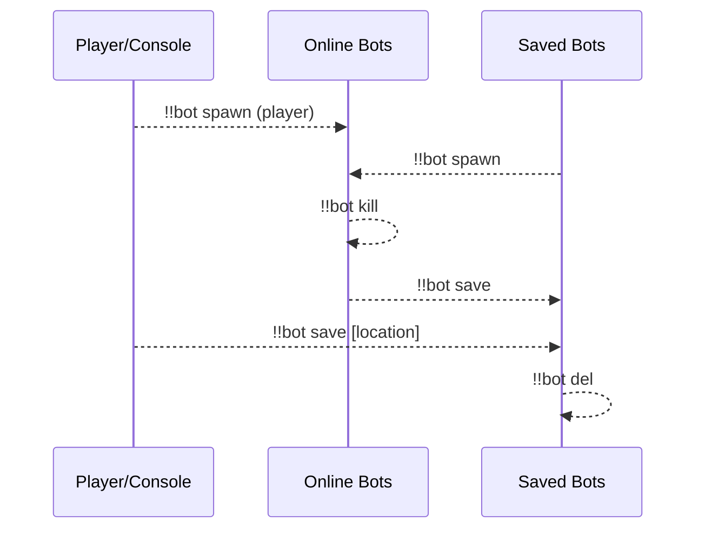
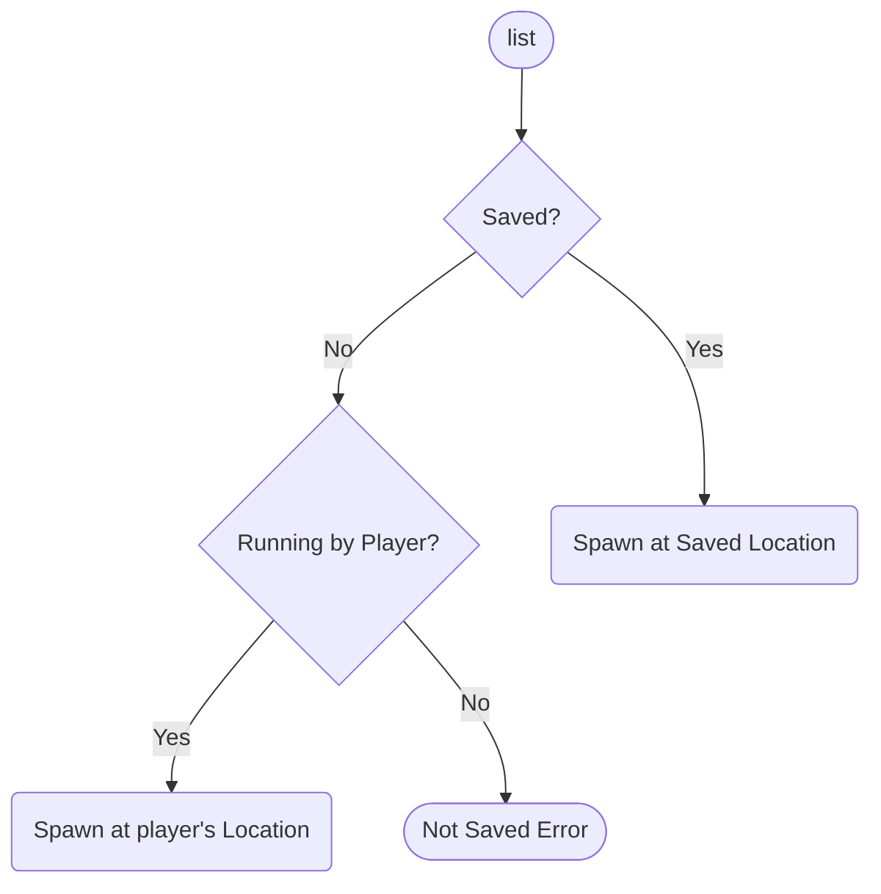
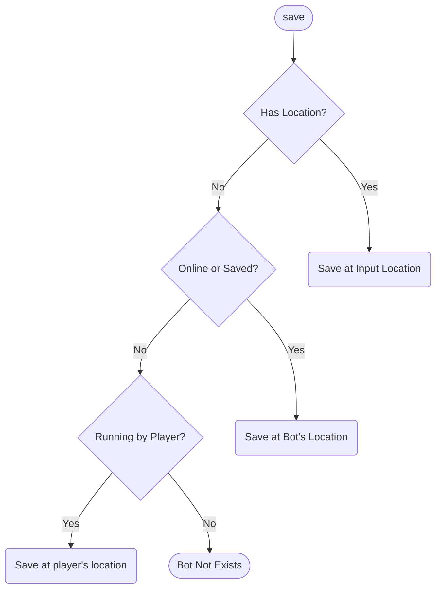
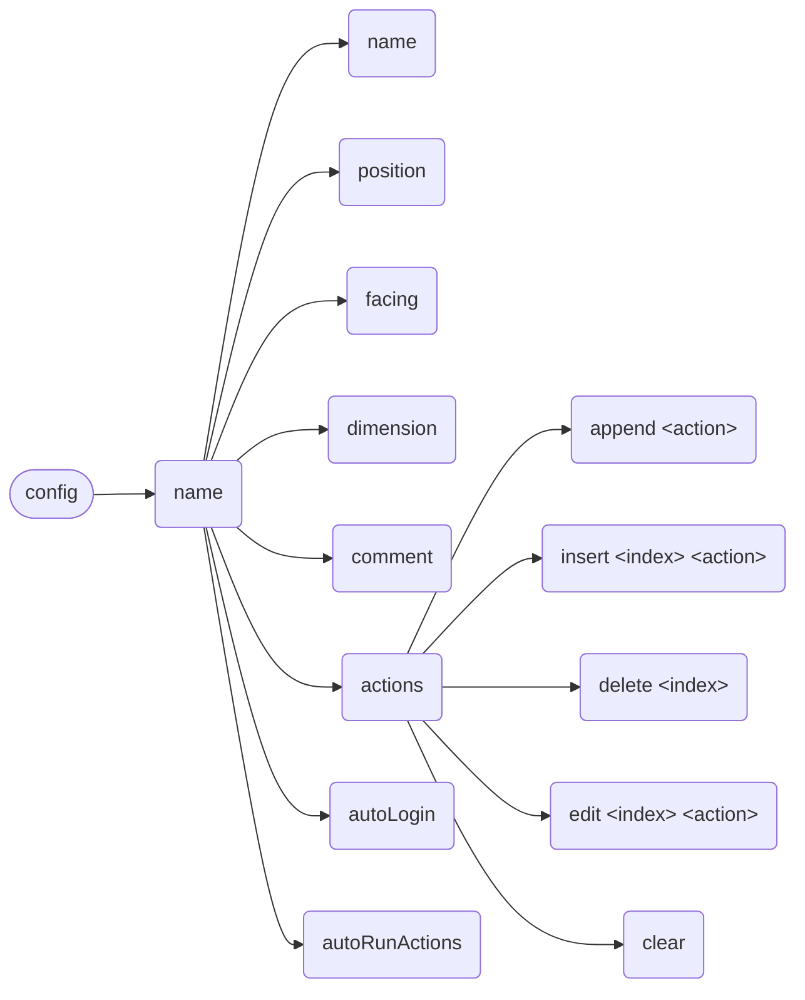

**English** | [中文](readme-zh_cn.md)

\>\>\> [Back to index](/readme.md)

## bot

### Basic Information

- Plugin ID: `bot`
- Plugin Name: Bot
- Version: 1.0.6
  - Metadata version: 1.0.6
  - Release version: 1.0.6
- Total downloads: 832
- Authors: [Andy Zhang](https://github.com/AnzhiZhang)
- Repository: https://github.com/AnzhiZhang/MCDReforgedPlugins
- Repository plugin page: https://github.com/AnzhiZhang/MCDReforgedPlugins/tree/master/bot
- Labels: [`Tool`](/labels/tool/readme.md), [`Management`](/labels/management/readme.md)
- Description: The best carpet bot manager!

### Dependencies

| Plugin ID | Requirement |
| --- | --- |
| [mcdreforged](https://github.com/Fallen-Breath/MCDReforged) | ^2.6.0 |
| [dict_command_registration](/plugins/dict_command_registration/readme.md) | ^1.0.0 |
| [minecraft_data_api](/plugins/minecraft_data_api/readme.md) | ^1.4 |
| [more_command_nodes](/plugins/more_command_nodes/readme.md) | ^1.1.0 |

### Requirements

| Python package | Requirement |
| --- | --- |

### Introduction

# Bot

> 最好用的地毯模组假人管理器！

## 依赖

- [MinecraftDataAPI](https://github.com/MCDReforged/MinecraftDataAPI)
- [MoreCommandNodes](https://github.com/AnzhiZhang/MCDReforgedPlugins/tree/master/more_command_nodes)

## 使用方法

`!!bot` 查看帮助

`!!bot list [index] [filter]` 显示假人列表

`!!bot spawn <name>` 上线假人

`!!bot kill <name>` 下线假人

`!!bot action <name> [index]` 执行假人动作

`!!bot info <name>` 查看假人信息

`!!bot save <name> [position] [facing] [dimension]` 保存假人

`!!bot del <name>` 删除保存的假人

`!!bot config <name> <option> <value>` 配置假人

### list

**index**：列表的页码

**filter**：可用选项为：`--all`、`--online` 或 `--saved`，过滤假人

### spawn

上线假人

### kill

下线假人

### action

执行假人动作

当指定 `index` 时，执行特定动作而不是全部动作

### info

查看假人信息

### save

保存假人

### del

删除保存的假人

### config

配置假人

## 配置

### gamemode

默认值: `survival`

生成假人的游戏模式

### name_prefix

默认值：无

假人名称前缀

### name_suffix

默认值：无

假人名称前缀

### permissions

使用对应指令的最低权限

### Download

> :warning: Warning: Read the README file in plugin repository before using it.

| File | Version | Upload Time | Size | Downloads | Operations |
| --- | --- | --- | --- | --- | --- |
| [Bot-v1.0.6.mcdr](https://github.com/AnzhiZhang/MCDReforgedPlugins/releases/tag/bot-v1.0.6) | 1.0.6 | 2023/01/19 16:58:58 | 13.6KB | 291 | [Download](https://github.com/AnzhiZhang/MCDReforgedPlugins/releases/download/bot-v1.0.6/Bot-v1.0.6.mcdr) |
| [Bot-v1.0.5.mcdr](https://github.com/AnzhiZhang/MCDReforgedPlugins/releases/tag/bot-v1.0.5) | 1.0.5 | 2022/12/29 15:19:31 | 13.55KB | 130 | [Download](https://github.com/AnzhiZhang/MCDReforgedPlugins/releases/download/bot-v1.0.5/Bot-v1.0.5.mcdr) |
| [Bot-v1.0.4.mcdr](https://github.com/AnzhiZhang/MCDReforgedPlugins/releases/tag/bot-v1.0.4) | 1.0.4 | 2022/12/29 14:53:06 | 13.55KB | 8 | [Download](https://github.com/AnzhiZhang/MCDReforgedPlugins/releases/download/bot-v1.0.4/Bot-v1.0.4.mcdr) |
| [Bot-v1.0.3.mcdr](https://github.com/AnzhiZhang/MCDReforgedPlugins/releases/tag/bot-v1.0.3) | 1.0.3 | 2022/12/29 15:14:20 | 13.11KB | 12 | [Download](https://github.com/AnzhiZhang/MCDReforgedPlugins/releases/download/bot-v1.0.3/Bot-v1.0.3.mcdr) |
| [Bot-v1.0.2.mcdr](https://github.com/AnzhiZhang/MCDReforgedPlugins/releases/tag/bot-v1.0.2) | 1.0.2 | 2022/07/22 02:16:19 | 13.06KB | 270 | [Download](https://github.com/AnzhiZhang/MCDReforgedPlugins/releases/download/bot-v1.0.2/Bot-v1.0.2.mcdr) |
| [Bot-v1.0.1.mcdr](https://github.com/AnzhiZhang/MCDReforgedPlugins/releases/tag/bot-v1.0.1) | 1.0.1 | 2022/07/21 05:06:17 | 13.06KB | 26 | [Download](https://github.com/AnzhiZhang/MCDReforgedPlugins/releases/download/bot-v1.0.1/Bot-v1.0.1.mcdr) |
| [Bot-v1.0.0.mcdr](https://github.com/AnzhiZhang/MCDReforgedPlugins/releases/tag/bot-v1.0.0) | 1.0.0 | 2022/07/21 03:53:18 | 13.05KB | 19 | [Download](https://github.com/AnzhiZhang/MCDReforgedPlugins/releases/download/bot-v1.0.0/Bot-v1.0.0.mcdr) |
| [Bot-v0.1.0.mcdr](https://github.com/AnzhiZhang/MCDReforgedPlugins/releases/tag/bot-v0.1.0) | 0.1.0 | 2022/06/30 12:10:23 | 1.97KB | 76 | [Download](https://github.com/AnzhiZhang/MCDReforgedPlugins/releases/download/bot-v0.1.0/Bot-v0.1.0.mcdr) |

